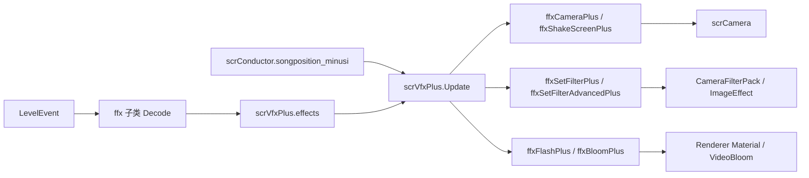

# 相机与 VFX 运行时

## 模块边界

本模块覆盖运行时相机和视觉效果执行链路：

| 类族 | 说明 |
| --- | --- |
| `scrCamera` | 相机跟随、菜单位置状态、自由相机、缩放、旋转、背景色、RenderTexture 输出、自定义帧率和闪屏 renderer。 |
| `scrVfxPlus` | 运行时效果列表、按歌曲时间触发、滤镜字典、视频背景、scrub 和 paused tween 管理。 |
| `ffxPlusBase` | 所有事件效果组件的共同基类，保存 startTime、duration、ease、视觉质量开关和运行时引用。 |
| 相机效果 | `ffxCameraPlus`、`ffxShakeScreenPlus`、`ffxFlashPlus`、`ffxBloomPlus`。 |
| 滤镜效果 | `ffxSetFilterPlus`、`ffxSetFilterAdvancedPlus`、`Filter`、`FilterPlane`、`FilterTargetType`。 |

## 核心职责

`scrCamera` 不直接读取 `.adofai` 事件。关卡加载阶段会把事件转换为 `ffxPlusBase` 子类，加入 `scrVfxPlus.effects`。进入运行时后，`scrVfxPlus.Update()` 根据 `scrConductor.songposition_minusi` 触发这些效果；具体子类再修改 `scrCamera` 或相机上的后处理组件。

## 相机状态模型

`scrCamera` 有两套位置逻辑：跟随模式和自由模式。跟随模式由 `followMode` 控制，`UpdateFollowCam()` 会把目标点设为当前玩家或合作模式中推进最远玩家的行星位置。自由模式由 `SetToFreeMode()` 进入，清空目标位置并允许相机事件直接控制相机父物体。

| 状态来源 | 控制字段 | 行为 |
| --- | --- | --- |
| 玩家跟随 | `followMode = true` | `topos` 跟随 `furthestPlanet.transform.position`。 |
| 相机事件 | `ffxCameraPlus.movementType` | 根据 Player、Tile、Global、LastPosition 或 LastPositionNoRotation 计算相机父物体目标位置。 |
| 菜单位置 | `positionState` | `Update()` 把状态枚举转换为固定坐标，例如 DLC、CLS、NeoCosmosCredits、TaroMenu 等。 |
| 震屏 | `scrCamera.shake` | `ffxShakeScreenPlus` 写入，`Update()` 叠加到主相机 localPosition。 |
| 3D 或 hold 偏移 | `offset`、`holdOffset` | 相机插值目标会加上这两个偏移。 |

相机尺寸由 `fromsize`、`tosize`、`sizeTweenTime` 和 `pulsetimer` 插值计算，最终乘上 `userSizeMultiplier` 与 `zoomSize`。落地脉冲使用 `Pulse()`，事件缩放使用 `ffxCameraPlus` 写 `cam.zoomSize`。

## VFX 调度规则

`scrVfxPlus.Update()` 只在未暂停且歌曲已开始时工作。每帧从 `currentVfxIndex` 开始顺序扫描效果列表，遇到尚未到时间的效果就停止，保持列表按触发时间推进。

| 检查项 | 结果 |
| --- | --- |
| 当前歌曲时间小于 `startTime - startEffectOffset` | 停止本帧扫描。 |
| 官方关卡视觉质量不是 High 且效果为 `hifiEffect` | 不调用 StartEffect。 |
| 视觉效果 Minimum 且效果 `disableIfMinFx` 为真 | 不调用 StartEffect。 |
| 视觉效果 Full 且效果 `disableIfMaxFx` 为真 | 不调用 StartEffect。 |
| 练习模式中控制器已经到失败之后 | 不调用 StartEffect。 |
| 以上检查通过 | 调用 `StartEffect()` 并标记 `triggered`。 |

非官方关卡在这里按 High 和 Full 处理，因此自定义关卡运行时效果不会因为官方关卡的低视觉质量选项而被同一逻辑降级。

## Scrub、checkpoint 与 tween

`ffxPlusBase.ScrubToTime(float t)` 是 checkpoint 和跳转时间时处理视觉状态的核心。它会在目标时间已经超过 `startTime` 时启动效果；若目标时间超过效果结束时间，则 kill tween 并完成；若目标时间在效果中间，则将 tween `Goto` 到对应位置，并加入 `scrVfxPlus.pausedTweens`。

`scrController.PlayerControl_Enter` 会恢复 `scrVfxPlus.pausedTweens` 中的 tween。这样 checkpoint 跳转时，持续中的相机、滤镜、闪屏、震屏或 Bloom tween 可以从正确时间点继续。

## 相机事件细节

`ffxCameraPlus` 负责把事件属性映射成四类 tween：

| tween | 修改目标 |
| --- | --- |
| `moveXTween` | 相机父物体 X 坐标。 |
| `moveYTween` | 相机父物体 Y 坐标。 |
| `rotationTween` | `scrVfxPlus.camAngle`，setter 会同步相机 transform rotation。 |
| `zoomTween` | `scrCamera.zoomSize`。 |

坐标参照由 `CamMovementType` 决定。`Tile` 和 `Global` 会把相机从跟随模式切到自由模式；`Player` 会在必要时恢复跟随模式；`LastPosition` 使用当前相机父物体位置，且会把当前相机角度加入目标旋转。

## 滤镜执行

预定义滤镜由 `ffxSetFilterPlus` 管理。它从 `scrVfxPlus.filterToComp` 取出 `Filter` 对应的 MonoBehaviour，按 `enableFilter` 开关组件，并根据不同滤镜写入不同字段。`disableOthers` 会关闭其他预定义滤镜并停止它们的 tween。

高级滤镜由 `ffxSetFilterAdvancedPlus` 管理。它按类名从 `Assembly-CSharp-firstpass` 查找滤镜类型，目标可以是前景相机、背景相机或带 tag 的装饰对象。它只 tween int、float、Color、Vector2 类型的公开实例字段，并在销毁时清理动态添加的组件和字段 tween。

## 关键页面

| 页面 | 内容 |
| --- | --- |
| [相机与 VFX 运行链路](/api/runtime/camera-vfx-chain.md) | `scrCamera`、`scrVfxPlus`、`ffxPlusBase`、相机事件、滤镜、闪屏、震屏和 Bloom 的字段与方法。 |
| [控制器状态、暂停与练习流程](/api/runtime/controller-pause-flow.md) | checkpoint、scrub、暂停和恢复 tween 的控制器侧流程。 |
| [运行时输入与判定](/api/runtime/input-judgement.md) | 玩家输入、命中判定和地板反馈链路。 |

## 下一步

阶段 4 还需要继续补运行时结算、官方关卡脚本入口、音频/VFX 交叉事件、场景流程辅助类和更多 `ffx*` 效果族。阶段 5 会再按 `LevelEventType` 与效果组件建立事件到运行时行为的完整对照。
