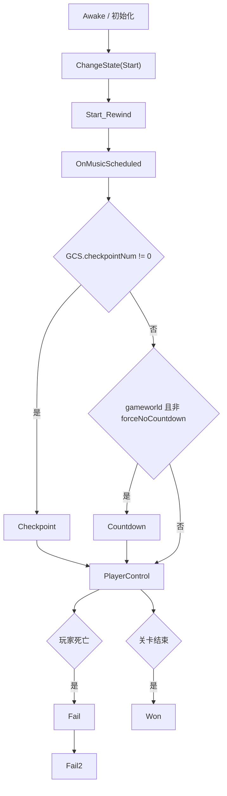
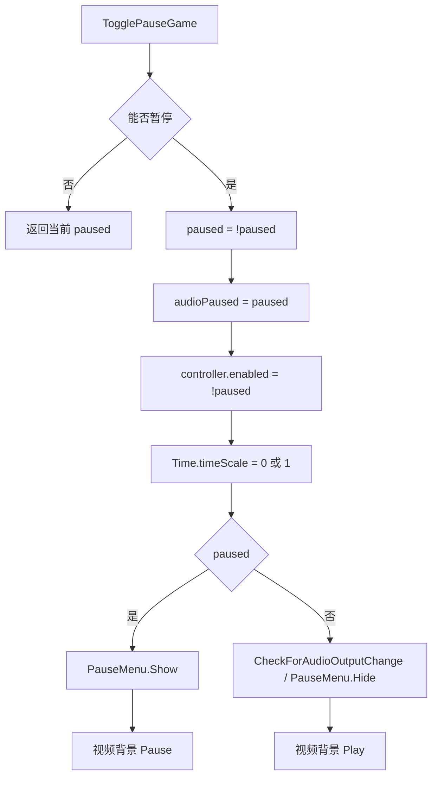
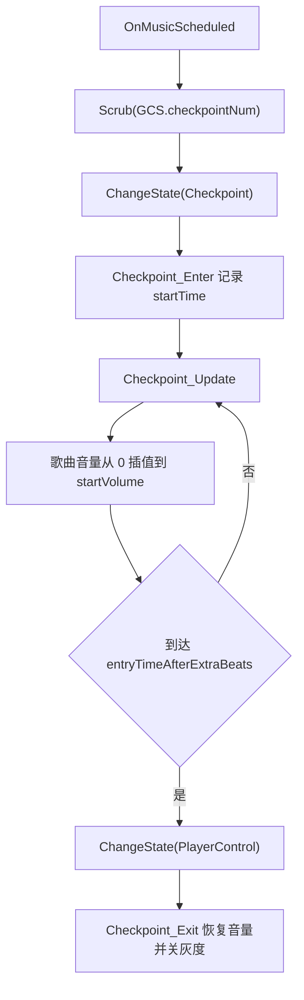
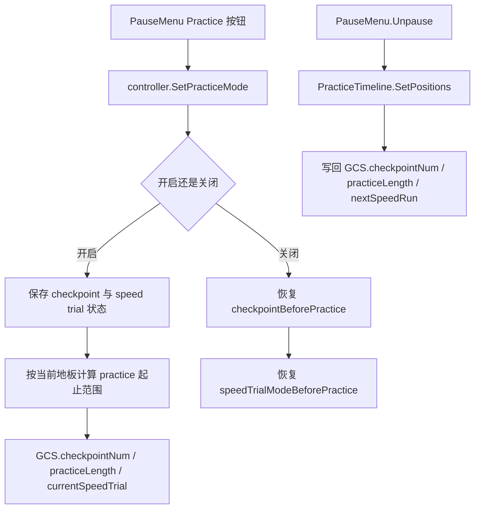
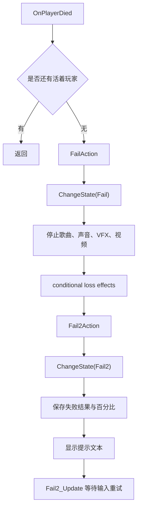

# 控制器、暂停与练习流程

## 模块边界

本模块覆盖 `scrController` 的运行时状态流、暂停菜单入口、checkpoint 淡入、PlayerControl 更新、练习模式和失败/胜利流程。输入判定细节见 [运行时输入与判定链路](/modules/runtime-input-judgement.md)。

| 子系统 | 关键类型 |
| --- | --- |
| 状态机 | `scrController`、`States`、`MonsterLove.StateMachine` |
| 启动与 checkpoint | `Start_Rewind`、`OnMusicScheduled`、`scrMistakesManager` |
| 暂停 | `TogglePauseGame`、`PauseMenu`、`AudioListener.pause`、`Time.timeScale` |
| 练习 | `SetPracticeMode`、`PracticeTimeline`、`GCS.practiceMode` |
| 失败与胜利 | `FailAction`、`Fail2Action`、`Won_Enter`、`Won_Update` |

## 状态流

`Start` 没有单独的 `Start_Update` 段，实际开始逻辑分布在等待有效输入的协程和 `Start_Rewind`。`Countdown` 和 `Checkpoint` 都是进入 `PlayerControl` 前的过渡状态。

## 暂停不是状态

暂停不会调用 `ChangeState`。因此暂停前后仍保留原本的 `States`，恢复时继续从原状态更新。`paused` 属性负责切换输入映射和 hit error meter 显隐。

## Checkpoint 淡入

从 checkpoint 开始时，`Start_Rewind` 会先把歌曲音量设为 0。`Checkpoint_Update` 用歌曲时间推进音量淡入，到目标 floor 的 `entryTimeAfterExtraBeats` 后交给玩家控制。

## PlayerControl 更新

| 条件 | 行为 |
| --- | --- |
| 异步输入关闭 | `PlayerControl_Update` 直接遍历 `playerManager`，让每个玩家执行 `Simulated_PlayerControl_Update()`。 |
| 异步输入开启 | 玩家更新由 `scrController.UpdateInput` 按 SkyHook tick 调用。 |
| 相机 follow mode | follow moving platforms 时把 `camy.topos` 设置到 chosen planet 位置。 |
| 输入锁定 | 每帧调用 `UpdateLockInput()`，按歌曲 pitch 递减锁定时间。 |
| Free roam | 每帧调用 `UpdateFreeroam()`，处理 free roam 段结束前的锁输入、移动、相机和星体角度刷新。 |

## 练习模式写回

`PracticeTimeline` 是暂停菜单中的可视化编辑器。它改变练习起止地板和速度后，直到 `PauseMenu.Unpause` 调用 `SetPositions()` 才把最终结果写入 `GCS`。

## 失败两阶段

`Fail2_Update` 在自定义关卡中调用 `ResetCustomLevel()`，在官方关卡中调用 `Restart()`。因此失败状态不仅显示结果，也决定下一次输入如何回到关卡。

## 当前覆盖结论

本页和 [控制器状态、暂停与练习流程](/api/runtime/controller-pause-flow.md) 已覆盖阶段 4 的第二块：状态机、暂停、checkpoint、PlayerControl、练习、失败和胜利。下一步应补相机与 VFX 运行链路，随后再补结算、音频细节和运行时辅助类。

## 相关页面

- [控制器状态、暂停与练习流程](/api/runtime/controller-pause-flow.md)
- [运行时输入与判定链路](/modules/runtime-input-judgement.md)
- [运行时控制器状态机](/modules/runtime-controller.md)
- [scrController](/api/core/scrController.md)
