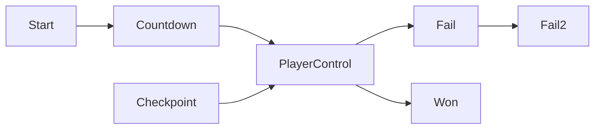

# 运行时控制器状态机

本模块记录 `scrController` 与 `States` 构成的运行时控制骨架。它是阶段 1 的第二个核心模块，后续会继续接入 `scrConductor`、`scnGame`、`scrLevelMaker` 和 `scrFloor`。

## 模块边界

| 类型 | 源码路径 | 角色 |
| --- | --- | --- |
| `scrController` | `7thRhythmSource/ADOFAi/scrController.cs` | 游戏主控制器，负责状态机、暂停、输入、关卡跳转、死亡和胜利。 |
| `States` | `7thRhythmSource/ADOFAi/States.cs` | `scrController` 使用的状态枚举。 |

## 状态流

源码中 `Countdown_Update()` 和 `Checkpoint_Update()` 都会在条件满足时切到 `States.PlayerControl`。失败路径由 `FailAction()` 和 `Fail2Action()` 切换状态，胜利路径在传送门或结算流程中切到 `States.Won`。

## 暂停控制

`scrController.paused` 不只是一个布尔值。setter 会写入 `_paused` 并切换输入 mapping：

| 条件 | Mapping |
| --- | --- |
| 暂停中 | `Pause` |
| 选关场景 | `LevelSelect` |
| CLS 场景 | `CLS` |
| 其他情况 | `Gameplay` |

暂停切换流程还会同步 `AudioListener.pause`、`Time.timeScale` 和控制器启用状态。输入处理方法 `ProcessKeyInputs(ulong eventTick)` 在 `paused` 为真时直接返回。

## 关卡入口

| 方法 | 用途 |
| --- | --- |
| `EnterWorld(...)` | 进入世界或世界内关卡。 |
| `EnterLevel(...)` | 进入指定官方关卡。 |
| `LoadCustomWorld(...)` | 加载自定义世界。 |
| `LoadCustomLevel(...)` | 加载自定义关卡。 |
| `GoToNextLevel()` | 进入下一关。 |
| `GoToPrevLevel()` | 进入上一关。 |
| `QuitToMainMenu()` | 返回主菜单。 |

这些入口共同构成官方关卡、CLS、自定义关卡和菜单之间的场景跳转层。实际加载细节会在 `scnGame` 和关卡选择系统页面继续展开。

## 控制器协作对象

| 对象 | 来源 | 用途 |
| --- | --- | --- |
| `playerManager` | `scrPlayerManager.instance` | 玩家集合和 mistake manager。 |
| `playerOne` | `playerManager.players[0]` | 默认玩家。 |
| `planetarySystem` | `playerOne.planetarySystem` | 蓝红绿星体、当前选中星体和旋转系统。 |
| `mistakesManager` | `playerManager.mistakesManager` | checkpoint、失败和结算数据。 |
| `camy` | 场景引用 | 相机控制。 |
| `decorationManager` | 场景引用 | 装饰对象管理。 |

## 后续扩展点

阶段 4 会把 `scrController` 的细节继续拆分到运行时专题：输入处理、free roam、失败结算、传送门、相机移动、Steam 统计和 checkpoint 恢复。当前阶段只把它作为核心骨架记录。
