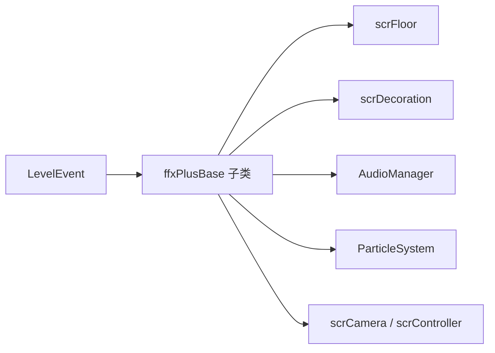

# 运行时效果族模块

## 模块边界

本模块补充相机和滤镜之外的 `ffxPlusBase` 效果族：

| 效果族 | 类型 |
| --- | --- |
| 地板 | `ffxMoveFloorPlus`、`ffxRecolorFloorPlus` |
| 装饰 | `ffxMoveDecorationsPlus`、`ffxSetObjectPlus`、`ffxSetTextPlus` |
| 声音 | `ffxPlaySound` |
| 运行时控制 | `ffxSetFrameRatePlus`、`ffxSetInputEventPlus` |
| 粒子 | `ADOFAI.FloorFX.ffxSetParticlePlus`、`ADOFAI.FloorFX.ffxEmitParticlePlus` |

## 执行模型

所有效果仍然遵守 `scrVfxPlus` 的时间调度：关卡事件在加载阶段解码为 `ffxPlusBase` 子类，运行时到达 `startTime - startEffectOffset` 后触发 `StartEffect()`。能被 scrub 的效果会通过 `eventTweens` 暴露 DOTween 列表。

## 地板效果

地板移动效果按 tile 范围和 gap length 遍历 `scrLevelMaker.listFloors`。它使用 `scrFloor.moveTweens` 保存位置、旋转、缩放和透明度 tween。地板改色效果调用 `scrFloor.ColorFloor()`，并额外 tween `glowMultiplier`。

## 装饰效果

装饰效果通过 tag 查询 `scrDecorationManager`。`ffxMoveDecorationsPlus` 面向通用装饰，能修改位置、pivot、旋转、缩放、颜色、透明度、视差、深度、图片和遮罩。`ffxSetObjectPlus` 面向 `scrObjectDecoration`，区分 Planet 与 Floor 对象。`ffxSetTextPlus` 只修改 `scrTextDecoration` 文本。

## 声音、帧率和输入事件

`ffxPlaySound` 使用 conductor 的 DSP 时间和 hitsound offset 排程声音，scrub 时会避免重复触发。`ffxSetFrameRatePlus` 直接调用 `scrCamera.SetCustomFrameRate()`。`ffxSetInputEventPlus` 在 `PrepVfx()` 中把带指定 event tag 的其他效果登记为手动运行，并把自身写到 controller 的 `inputEventFfx` 表。

## 粒子效果

粒子效果位于 `ADOFAI.FloorFX` 命名空间。`ffxSetParticlePlus` 修改 `scrParticleDecoration.particleSystem` 的 main、velocity over lifetime、rotation over lifetime、shape、emission、size over lifetime、color over lifetime 等模块。`ffxEmitParticlePlus` 只调用 `Emit(count)`。

## 关键页面

| 页面 | 内容 |
| --- | --- |
| [运行时效果族补充](/api/runtime/effect-families.md) | 地板、装饰、对象、文本、声音、帧率、输入事件和粒子效果的字段与执行方式。 |
| [相机与 VFX 运行链路](/api/runtime/camera-vfx-chain.md) | 相机、滤镜、闪屏、震屏和 Bloom。 |
| [场景流转与加载跳转](/api/runtime/scene-loading-flow.md) | 运行时效果在 reset 和关卡跳转时如何被清理。 |

## 下一步

阶段 4 还需要补官方关卡脚本运行入口。阶段 5 会把 `LevelEventType` 与这些 `ffx*` 组件建立更细的事件对照。
