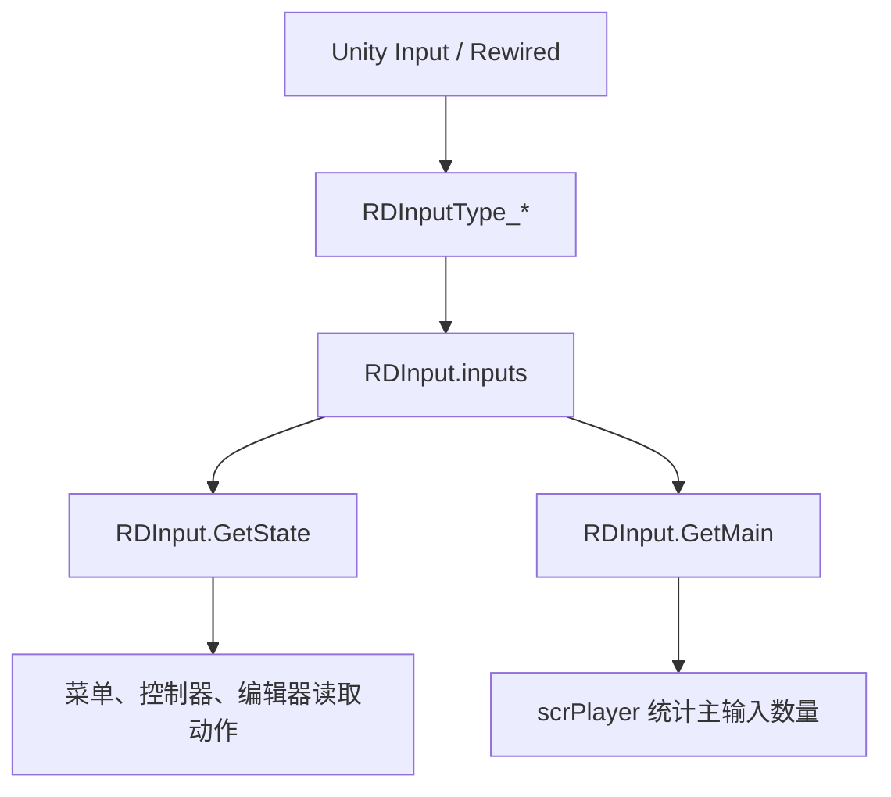
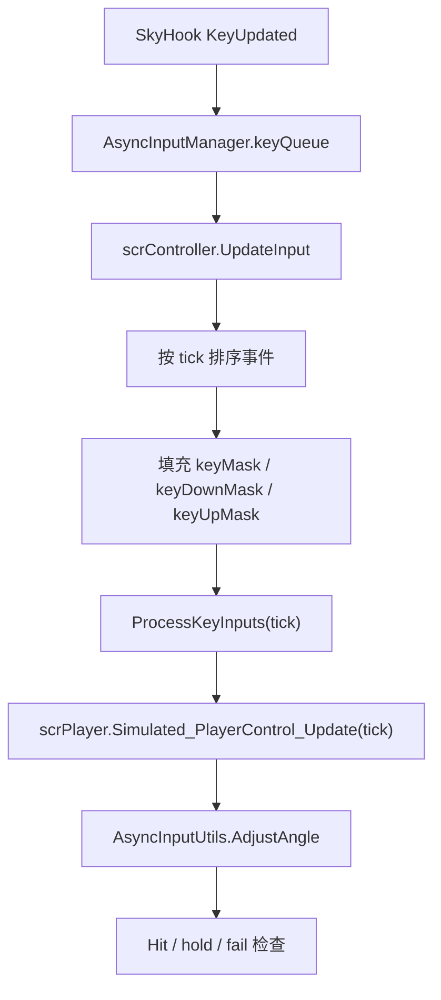
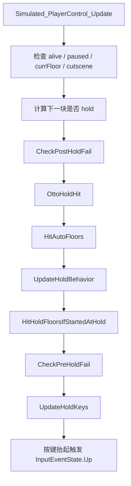
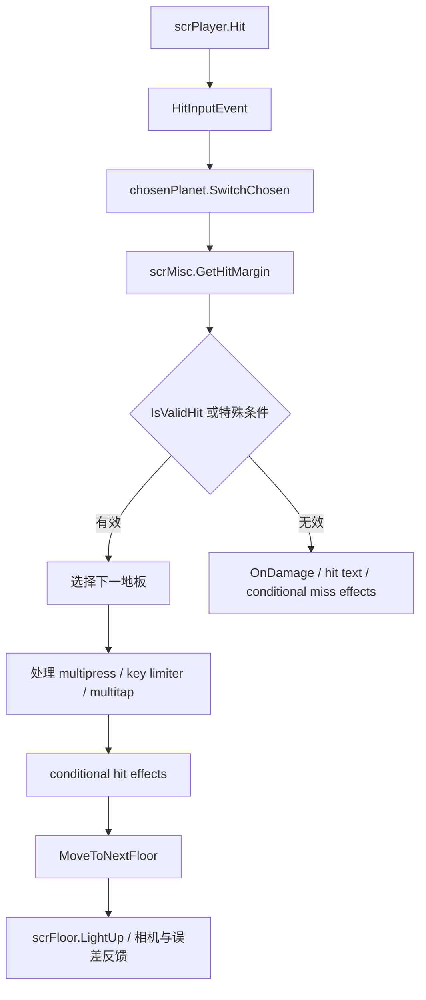

# 运行时输入与判定链路

## 模块边界

本模块解释运行时从按键到命中的第一条主线：输入设备聚合、异步输入接管、玩家更新、星体判定、命中反馈。事件效果、相机、暂停、结算和平台输入图标会在后续阶段 4 页面继续拆分。

| 子系统 | 关键类型 |
| --- | --- |
| 输入聚合 | `RDInput`、`RDInputType`、`RDInputType_Keyboard`、`RDInputType_Joystick`、`RDInputType_Mouse` |
| 异步输入 | `AsyncInputManager`、`AsyncInput`、`RDInputType_AsyncKeyboard`、`AsyncInputUtils` |
| 控制器入口 | `scrController.UpdateInput`、`scrController.ProcessKeyInputs`、`scrController.LockInput` |
| 玩家更新 | `scrPlayer.Simulated_PlayerControl_Update`、`scrPlayer.Hit`、`scrPlayer.HitInputEvent` |
| 判定与移动 | `scrPlanet.SwitchChosen`、`scrPlanet.MoveToNextFloor`、`scrMisc.GetHitMargin` |
| 反馈 | `scrFloor.LightUp`、`scrHitTextManager`、`scrHitErrorMeter` |

## 普通输入路径

`RDInput.Setup` 创建鼠标、键盘、异步键盘和摇杆输入，并把它们加入 `inputs`。普通输入以帧为单位读取，所有活动输入类型都会参与 `GetState` 和 `GetMain`。

## 异步输入路径

`AsyncInputManager.Update` 只在玩家控制状态、异步输入设置开启且 hook active 时让 `RDInputType_AsyncKeyboard` 激活，并停用普通键盘输入。这样运行时判定可以按硬件事件时间推进，而不是完全依赖 Unity 当前帧。

## 玩家更新顺序

多个步骤被 `AsyncInputUtils.WhileFloorNotChange` 包住。只要当前地板改变，相关检查会围绕新的 `currFloor` 继续执行，防止一次输入事件跨地板推进时漏掉后续状态。

## 判定与移动

`scrMisc.GetHitMargin` 使用角度差计算命中等级。`scrMisc.IsValidHit` 再根据 `GCS.hitMarginLimit` 决定当前等级是否有效。有效命中进入下一地板，失败分支会处理伤害、失败文本和条件事件。

## 输入限制

| 机制 | 行为 |
| --- | --- |
| `scrController.LockInput` | 设置输入锁定秒数并让控制器不 responsive。 |
| `scrController.UpdateLockInput` | 按歌曲 pitch 递减锁定时间，归零后恢复 responsive。 |
| `RDInput.useKeyLimiter` | 只在 gameworld 且暂停菜单关闭时启用。 |
| `Persistence.keyLimiterKeys` | 普通键盘和异步键盘都会按各自缓存过滤允许的主命中键。 |
| `HitInputEvent.ignoreInput` | 输入事件效果可以让本次主输入被忽略，`scrPlayer.Hit` 会因此返回 false。 |

## 判定等级边界

| 层级 | 来源 |
| --- | --- |
| Counted | `scrMisc.GetAdjustedAngleBoundaryInDeg(HitMarginGeneral.Counted, ...)` |
| Perfect | `scrMisc.GetAdjustedAngleBoundaryInDeg(HitMarginGeneral.Perfect, ...)` |
| Pure | `scrMisc.GetAdjustedAngleBoundaryInDeg(HitMarginGeneral.Pure, ...)` |

难度会影响基础时间窗口：Lenient、Normal、Strict 分别设置不同基础值。非移动端还会除以 `GCS.currentSpeedTrial`，然后转换为角度边界，并和固定角度下限比较。`marginScale` 会继续影响最终边界。

## 当前覆盖结论

本页和 [运行时输入与判定](/api/runtime/input-judgement.md) 已覆盖阶段 4 的第一块：输入聚合、异步输入、玩家更新、命中判定、命中反馈和输入限制。下一步应继续补控制器状态机细节、暂停/练习流程和相机/VFX 运行链路。

## 相关页面

- [运行时输入与判定](/api/runtime/input-judgement.md)
- [scrController](/api/core/scrController.md)
- [scrFloor](/api/core/scrFloor.md)
- [运行时控制器状态机](/modules/runtime-controller.md)
- [路径生成与地板运行时](/modules/path-floor-runtime.md)
