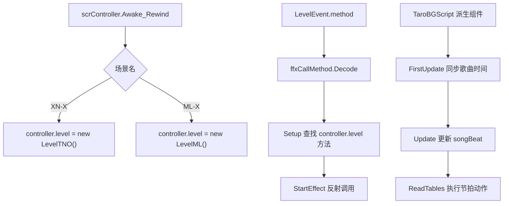

# 官方关卡脚本运行模块

本模块解释 ADOFAI 官方关卡脚本怎样进入运行时。源码中存在两条并行路径：`Level` 派生对象由 `scrController` 保存并供事件效果调用；`TaroBGScript` 派生组件挂在场景对象上，自己用节拍表驱动大型官方演出。

## 模块边界

| 类族 | 覆盖类型 |
| --- | --- |
| `Level`、`LevelML`、`LevelTNO` | 官方关卡脚本对象、装饰组件查找、关卡专用方法。 |
| `ffxCallMethod` | 从 `LevelEvent.method` 到 `Level` 方法的反射调用链。 |
| `TaroBGScript` | 大型官方关卡背景脚本基类、节拍动作表和时间同步。 |
| `Mawaru`、`NewLife`、`SingSing`、`ThirdSun`、`DivineIntervention` | 继承 `TaroBGScript` 的官方演出脚本。 |

## 核心流程

## `Level` 体系

`Level` 是普通类，不是 Unity 组件。它继承 `ADOClass`，可以读取控制器、导体和装饰管理器。`scrController` 当前只为 `XN-X` 和 `ML-X` 创建具体 `Level` 派生实例。

`ffxCallMethod` 是这条体系的事件入口。它读取事件属性 `method`，解析方法名与参数，然后只在当前 `ADOBase.controller.level` 的实际类型和 `Level` 基类上查找方法。找到后，`StartEffect` 调用 `MethodInfo.Invoke`。

## `TaroBGScript` 体系

`TaroBGScript` 是 Unity 组件基类。它维护当前歌曲时间、当前拍、上一帧拍、BPM 变化表和三类节拍动作表：

| 表 | 注册方法 | 执行方式 |
| --- | --- | --- |
| `beatActions` | `mb` | 到达拍点时执行无参动作。 |
| `beatActionArgs` | `mba` | 到达拍点时执行带对象参数的动作。 |
| `beatUpdates` | `mu`、`mpf` | 在持续区间内每帧执行。 |

`FirstUpdate()` 根据导体、当前地板和倒计时初始化时间；`Update()` 在正常游戏状态下推进 `songTime` 与 `songBeat`；`ReadTables()` 负责把拍点转成具体演出调用。

## 源码研究关注点

| 关注点 | 说明 |
| --- | --- |
| 方法调用范围 | `ffxCallMethod` 不扫描任意场景组件，只调用 `controller.level` 和 `Level` 基类方法。 |
| 参数类型 | `ffxCallMethod` 只把参数转换成字符串、布尔、浮点和整数。 |
| 装饰依赖 | `LevelML` 和 `LevelTNO` 多数方法通过装饰 tag 找组件，tag 与场景对象配置直接相关。 |
| 时间来源 | `TaroBGScript` 用 `scrConductor.songposition_minusi`、BPM 表和倒计时计算歌曲时间与拍数。 |
| 大型脚本规模 | `Mawaru`、`NewLife`、`SingSing`、`ThirdSun`、`DivineIntervention` 是大型场景演出脚本，后续文件级覆盖阶段需要按脚本继续拆页。 |

## 相关页面

| 页面 | 内容 |
| --- | --- |
| [官方关卡脚本运行入口](/api/runtime/official-level-scripts.md) | `Level`、`LevelML`、`LevelTNO`、`ffxCallMethod` 和 `TaroBGScript` 的 API 级说明。 |
| [运行时效果族补充](/api/runtime/effect-families.md) | `ffxPlusBase`、`ffx*Plus`、`ffx*` 和 FloorFX 效果族总览。 |
| [控制器状态、暂停与练习流程](/api/runtime/controller-pause-flow.md) | `scrController` 状态机与运行时状态入口。 |
