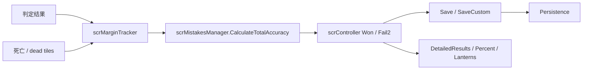

# 结算与成绩保存模块

## 模块边界

本模块覆盖 ADOFAI 运行时从玩家命中到结算 UI 的链路：

| 分层 | 类型 |
| --- | --- |
| 单玩家统计 | `scrMarginTracker` |
| 多玩家汇总与保存 | `scrMistakesManager`、`EndLevelInfo`、`EndLevelType`、`NewBestType` |
| 控制器触发点 | `scrController` 胜利流程、`Fail2Action()`、`PortalTravelAction()` |
| 结果展示 | `DetailedResults`、`scrPercentageComplete`、`EndscreenLanterns`、`scrUIController.ShowEndscreenLanterns()` |
| 失败条 | `scrFailBar` |

## 数据流

`scrMarginTracker` 是统计源头。它记录每个玩家的 `HitMargin`、死亡数、dead tiles、完成度、普通准确率和 X 准确率。`scrMistakesManager` 把单人统计直接复制为总结果，合作模式则按 64、16、12、8 权重合并准确率。

## 保存分支

| 分支 | 保存入口 | 写入内容 |
| --- | --- | --- |
| 官方关卡胜利 | `scrMistakesManager.Save(world, true, multiplier)` | 完成度 1、首次通关、speed trial、普通准确率、X 准确率、highest possible acc、成就。 |
| 官方关卡失败 | `scrMistakesManager.Save(world, false, multiplier)` | 完成度新纪录和 new best 提示类型。 |
| 自定义关卡胜利 | `scrMistakesManager.SaveCustom(hash, true, multiplier)` | 自定义世界完成度、准确率、X 准确率、speed trial、min deaths、highest possible acc。 |
| 自定义关卡失败 | `scrMistakesManager.SaveCustom(hash, false, multiplier)` | 自定义世界完成度新纪录。 |
| checkpoint 进度 | `SaveCheckpointProgress()` | hit margins、checkpoint、level、难度和 checkpoint 使用数。 |

noFail 有死亡、unlock key limiter 生效或自定义关卡合作模式等情况会阻止部分保存逻辑。倍率小于 1 的自定义关卡成绩不会写入。

## 胜利流程

胜利时，`scrController` 会先处理未到终点玩家和死亡玩家的 dead tile，再让每个玩家重新计算准确率。之后根据关卡类型分支：

| 类型 | 行为 |
| --- | --- |
| 练习模式 | 清空祝贺文本，不写正式通关。 |
| 非官方关卡 | 设置自定义或本地化祝贺文本；CLS 关卡保存自定义成绩并显示灯笼。 |
| 官方 boss 关卡 | 保存官方成绩，显示灯笼，更新 speed trial 下一倍率。 |
| 非 boss 内部关卡 | 更新 tutorial progress，不显示详细结果。 |

详细结果由 `DetailedResults.Show()` 生成；pure perfect 时播放 PurePerfect 音效；全 Strict Clear 条件满足时显示对应文本。

## 失败流程

`Fail2Action()` 进入 `States.Fail2` 后计算总准确率。官方 boss 关卡失败会保存完成度新纪录；CLS 最后一个关卡失败且非练习模式时保存自定义完成度新纪录。若 `NewBestType.Applause`，会播放安静掌声音效。完成度文本由 `scrPercentageComplete.UpdatePercent()` 生成。

`scrFailBar` 是 overload 和 multipress 失败的计数来源。它以拍长为基准衰减计数，计数超过 1 时调用 `player.Die()`。官方关卡非 gameworld 或完成度接近末尾时有失败保护。

## 结果 UI

| UI | 数据来源 | 显示内容 |
| --- | --- | --- |
| `DetailedResults` | 每个玩家的 `scrMarginTracker` | ePerfect、Perfect、late/early、失败数、准确率或 X 准确率、checkpoint 或练习次数。 |
| `scrPercentageComplete` | controller 总完成度与 `endLevelInfo` | 完成百分比和 new best 文本。 |
| `EndscreenLanterns` | 当前玩家统计和历史存档 | 世界完成、great accuracy 或 pure perfect、speed trial 三类灯笼。 |
| `ShowEndscreenLanterns()` | 所有玩家 | 合作模式下为每个玩家显示一组灯笼，并给最高 X 准确率玩家 crown。 |

## 关键页面

| 页面 | 内容 |
| --- | --- |
| [结算、成绩与进度保存](/api/runtime/results-save-flow.md) | `scrMarginTracker`、`scrMistakesManager`、保存分支、详细结果、灯笼、失败条和控制器结算入口。 |
| [控制器状态、暂停与练习流程](/api/runtime/controller-pause-flow.md) | `Won`、`Fail`、`Fail2` 状态和暂停、checkpoint 流程。 |
| [运行时输入与判定](/api/runtime/input-judgement.md) | 命中判定怎样把结果送入玩家和地板反馈。 |

## 下一步

阶段 4 后续继续补场景流程辅助、加载跳转、运行时 UI 控制器和更多效果族。阶段 5 会把事件枚举与 `ffx*` 组件逐项建立对照。
