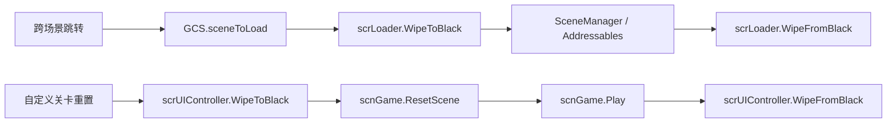

# 场景流转与加载模块

## 模块边界

本模块解释运行时关卡切换、传送门跳转、自定义关卡重置和黑场加载：

| 分层 | 类型 |
| --- | --- |
| 全局加载 | `scrLoader`、`GCS.sceneToLoad`、`WipeDirection` |
| 传送门分发 | `scrController.PortalTravelAction()`、`Portal` |
| 官方关卡进入 | `EnterLevel()`、`EnterWorld()`、`LevelSource`、`ADOBase.GetNextLevelName()` |
| 自定义关卡进入 | `LoadCustomLevel()`、`LoadCustomWorld()`、`scnGame.GetWorldPaths()` |
| 场景内重置 | `ResetCustomLevel()`、`scnGame.ResetScene()` |
| UI 黑场 | `scrUIController.WipeToBlack()`、`WipeFromBlack()`、`FadeToBlack()`、`FadeFromBlack()` |

## 两种加载路径

跨场景跳转依赖 `scrLoader`。自定义关卡在 `scnGame` 内重试、练习或进入下一首时，通常不重新加载 Unity 场景，而是用 `ResetCustomLevel()` 调用 `scnGame.ResetScene()` 和 `Play()`。

## Portal 分发

`PortalTravelAction()` 是传送门和结算后跳转的核心入口。它先防止重复跳转，再根据 `Portal` 修改全局状态：

| 目标类型 | 主要结果 |
| --- | --- |
| 关卡结束 | 进入下一关、重置自定义关卡、返回主菜单或重载 speed trial。 |
| 指定关卡 | 调用 `EnterLevel()` 或 `EnterWorld()`。 |
| 菜单与工具 | 加载校准、编辑器、CLS、DLC 菜单、puzzle 场景或关卡选择。 |
| speed trial 调速 | 修改 `GCS.nextSpeedRun` 并重载当前关卡。 |
| Fool Joker | 翻转 `GCS.FOOL_JOKER` 并返回关卡选择。 |

## 官方关卡解析

`EnterLevel()` 的关键输出是 `GCS.sceneToLoad` 和 `GCS.internalLevelName`。如果世界 `LevelSource` 是 `Files`，或 `Mixed` 世界中进入的是文件关卡，Unity 场景加载 `scnGame`，实际关卡名存在 `GCS.internalLevelName`。如果来源是 `Scenes`，或 Mixed 世界的 boss / 0 号场景，则直接加载对应场景名。

`EnterWorld()` 不直接加载世界地图，而是根据世界尝试次数和 tutorial progress 选择要进入的 `world-level`，再交给 `EnterLevel()`。

## 自定义关卡路径

`LoadCustomLevel()` 建立单元素 `GCS.customLevelPaths`。`LoadCustomWorld()` 调用 `scnGame.GetWorldPaths()` 建立整个世界的路径数组，`skipToMain` 为真时会把索引放到最后一个主关卡。两者都把 `GCS.sceneToLoad` 设为 `scnGame`。

## 黑场和加载动画

`scrLoader` 的加载动画在 `timeSpentLoading > 1f` 后显示。场景加载完成后，`OnSceneLoaded()` 不立即淡出黑场，而是设置 `wipeCued`，让 `Update()` 等 1 帧或自定义关卡场景中的 4 帧，再隐藏加载视觉并执行 `WipeFromBlack()`。

UI 内部黑场由 `scrUIController` 管理，主要用于当前场景内的 reset 或淡入淡出；它不会调用 `SceneManager.LoadScene()`。

## 关键页面

| 页面 | 内容 |
| --- | --- |
| [场景流转与加载跳转](/api/runtime/scene-loading-flow.md) | `scrLoader`、`PortalTravelAction`、`EnterLevel`、自定义关卡加载、重置和 UI 黑场。 |
| [结算、成绩与进度保存](/api/runtime/results-save-flow.md) | 胜利或失败后为什么会进入不同跳转分支。 |
| [控制器状态、暂停与练习流程](/api/runtime/controller-pause-flow.md) | `Won`、`Fail2`、暂停和重开触发点。 |

## 下一步

阶段 4 还需要继续补更多运行时效果族和关卡脚本运行入口，然后进入阶段 5 的事件到效果组件对照表。
