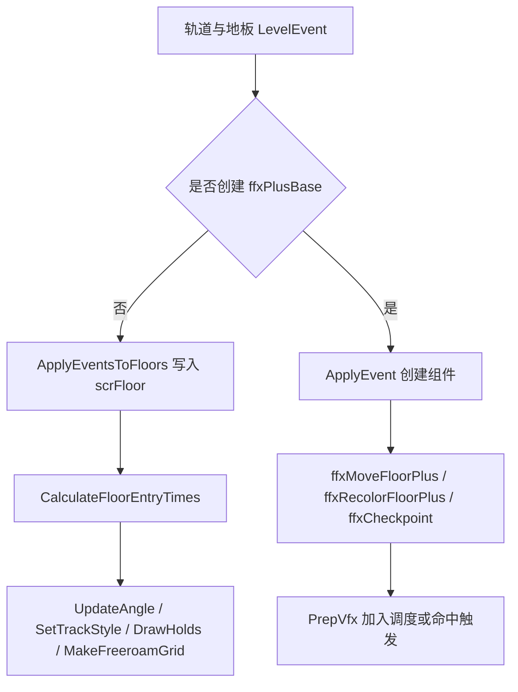

# 轨道与地板事件模块

本模块说明阶段 5 中轨道与地板事件的边界。它们既包含直接修改 `scrFloor` 的核心事件，也包含通过 `ffxPlusBase` 调度的地板 tween 和 checkpoint 效果。

## 模块边界

| 类别 | 事件或类型 |
| --- | --- |
| 核心地板状态 | `SetSpeed`、`Twirl`、`PositionTrack`、`Hold`、`MultiPlanet`、`Pause`、`AutoPlayTiles`、`Hide`、`ScaleMargin`、`ScaleRadius`、`Multitap`、`TileDimensions`、`SetFloorIcon`。 |
| 轨道颜色与样式 | `ColorTrack`、`ChangeTrack`、`AnimateTrack`、`RecolorTrack`。 |
| 地板移动 | `MoveTrack`、`ffxMoveFloorPlus`。 |
| Checkpoint | `Checkpoint`、`ffxCheckpoint`。 |
| Free roam | `FreeRoam`、`FreeRoamTwirl`、`FreeRoamRemove`、`FreeRoamWarning`。 |
| 动画组件 | `ffxChangeTrack`、`ffxFloorAppearPlus`、`ffxFloorDisappearPlus`。 |

## 流程图

## 分流规则

| 分流 | 说明 |
| --- | --- |
| 立即写状态 | 速度、旋转、hold、pause、free roam、multitap、tile dimensions 等会影响地板时间、判定或结构的事件直接写 `scrFloor`。 |
| 运行时 tween | `MoveTrack` 和 `RecolorTrack` 创建组件，运行时到达触发时间后执行 DOTween。 |
| 预处理动画 | `ChangeTrack` 和 `AnimateTrack` 生成 `ffxChangeTrack`，再在 `PrepVfx()` 中创建出现/消失动画组件。 |
| 命中触发 | `ffxCheckpoint.runOnHit` 为 true，checkpoint 通过地板命中流程触发。 |

## 源码研究关注点

| 关注点 | 说明 |
| --- | --- |
| 时间重算 | 速度、pause、free roam、hold 会影响 entry time 或额外拍数，必须先于 VFX 调度完成。 |
| 图标优先级 | checkpoint、速度、twirl、hold、multi planet 的图标优先于普通 VFX 图标。 |
| Free roam 子地板 | `MoveTrack` 会处理 free roam 区域中可落地的子地板；free roam remove 会把子地板移到远处。 |
| checkpoint 限制 | speed trial、练习模式和纯 Perfect 限制下 checkpoint 不生效。 |
| Track 动画 | `AnimateTrack` 不直接进入 `ApplyEvent()`，而是通过 `ffxChangeTrack.PrepFloor()` 间接创建出现和消失动画。 |

## 页面

| 页面 | 内容 |
| --- | --- |
| [轨道与地板事件](/api/events/track-floor-events.md) | 轨道地板事件族、字段写入、`MoveTrack`、`RecolorTrack`、`AnimateTrack`、checkpoint、图标和 free roam。 |
| [事件执行总览](/api/events/event-execution-overview.md) | 事件到效果的总调度链。 |
| [路径生成与地板运行时](/modules/path-floor-runtime.md) | `scrLevelMaker` 与 `scrFloor` 基础模型。 |
