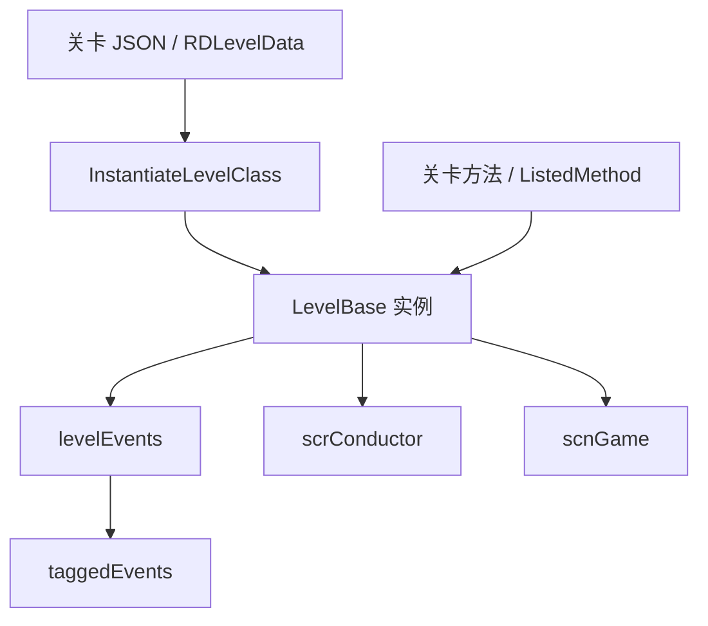

# LevelBase

## 基本信息

| 项目 | 内容 |
| --- | --- |
| 源码路径 | `RDFucked/Assets/Scripts/Assembly-CSharp/LevelBase.cs` |
| 命名空间 | 全局命名空间 |
| 声明 | `public class LevelBase : RDClass` |
| 文件规模 | 约 3700 行 |
| 主要职责 | 承载关卡数据、运行时事件、关卡兼容开关、判定统计、音乐与视觉控制方法 |
| 覆盖内容 | 构造加载流程、核心字段分组、重要属性、方法分组和公开调用入口 |

## 用途概览

`LevelBase` 是 RD 关卡逻辑的中心类。它既是官方 `Level_*` 关卡脚本的父类，也是外部关卡数据加载后的默认运行载体。源码显示它负责：

- 保存 `RDLevelData` 和 `LevelEvent_Base` 列表。
- 预处理 BPM、小节拍数、标签事件和动态事件。
- 持有大量关卡行为开关，例如是否 Boss、是否 Cutscene、是否隐藏手、是否使用旧 VFX 缓动等。
- 暴露大量输入、判定、时间、房间、行、角色、音频和视觉效果属性。
- 提供大量方法，其中 45 个带 `[ListedMethod(true)]`。`MethodAutocompleteUI` 会读取该属性，把签名受支持的 void 方法列入公开自定义方法候选。

## 构造与加载流程

| 成员 | 行为 |
| --- | --- |
| `LevelBase()` | 初始化默认 Rank、关卡类型、跳过 RankScreen、失误权重、心碎阈值、默认双脉冲、冲击波倍率等，然后调用 `baseInit()` 和 `Init()` |
| `LevelBase(RDLevelData data)` | 调用默认构造后绑定关卡数据，读取事件列表、过滤常量条件不成立的事件、建立标签事件字典、读取外部关卡设置和 Mods |
| `InstantiateLevelClass(Level level)` | 根据 `LevelSelector.GetLevelTypeFromEnum(level)` 反射创建官方关卡类 |
| `InstantiateLevelClass(Level level, RDLevelData data)` | 根据官方关卡枚举和关卡数据反射创建关卡实例 |
| `InstantiateLevelClass(string jsonText)` | 解码 JSON 为 `RDLevelData`，失败时处理编辑器或返回选关；如果设置了 `customClass` 则尝试实例化对应官方类，否则创建普通 `LevelBase` |

## 核心字段分组

### 关卡数据与事件

| 名称 | 类型 | 作用 |
| --- | --- | --- |
| `data` | `RDLevelData` | 当前关卡数据对象 |
| `loadingSuccessful` | `bool` | 标记加载是否成功；JSON 失败且处于编辑器时会设为 `false` |
| `levelEvents` | `List<LevelEvent_Base>` | 当前关卡事件列表 |
| `levelEventsPerBar` | `List<LevelEvent_Base>[]` | 按小节分组后的事件列表 |
| `dynamicallyAddedEvents` | `List<LevelEvent_Base>` | 运行时动态添加的事件 |
| `taggedEvents` | `Dictionary<string, List<LevelEvent_Base>>` | 按 tag 建立的事件索引，用于 `RunTag*` 系列方法 |
| `bpmChanges` | `List<BPMChange>` | BPM 变化列表 |
| `cpbEvents` | `List<LevelEvent_SetCrotchetsPerBar>` | 每小节拍数变化事件列表，构造时默认加入第 1 小节 8 crotchets |
| `crotchetsInEachBar` | `int[]` | 每个小节的 crotchets 数量缓存 |

### 自定义资源

| 名称 | 类型 | 作用 |
| --- | --- | --- |
| `preparedAudioClips` | `Dictionary<string, AudioClip>` | 已准备好的音频剪辑缓存 |
| `customCharacterData` | `Dictionary<string, CustomAnimationData>` | 自定义角色动画数据，标记为 `[NonSerialized]` |
| `sprites` | `Dictionary<string, CustomSprite>` | 自定义精灵实例索引，标记为 `[NonSerialized]` |
| `metronomeAudioSources` | `List<AudioSource>` | 节拍器音源列表 |

### 关卡行为开关

`LevelBase` 有大量布尔字段控制关卡规则和兼容模式。以下是第一批已分组字段：

| 分组 | 字段 | 说明 |
| --- | --- | --- |
| 关卡类型 | `levelType`、`bossActNum`、`cutsceneLevel`、`multiroom` | 控制 Boss、Cutscene、多房间等关卡基本形态 |
| 判定与失误 | `mistakeWeight`、`hitMarginMultiplier`、`noSmartJudgment`、`subdivisionMissWeight`、`missesToCrackHeart` | 调整判定、失误权重和心碎阈值 |
| 显示与特效 | `noHitFlashBorder`、`noHitStrips`、`showHitstripOnlyOnActiveBeats`、`noHitParticles`、`classicHitParticles` | 控制命中反馈、命中条和粒子 |
| 行与角色 | `invisibleChars`、`noHands`、`hideHandsOnStart`、`noRowAnimsOnStart`、`charsOnlyOnStart` | 控制角色、手和行初始表现 |
| 兼容模式 | `oldRoomBlending`、`oldBassDrop`、`oldSubdivFriendBehavior`、`oldVFXEasing`、`legacyTaggedEvents` | 为旧关卡或旧行为保留的兼容开关 |
| 跳过与失败 | `skippable`、`skippableRankScreen`、`failedLevel`、`noBossFail`、`alwaysSkippableCutscene` | 控制失败、跳过和 RankScreen 行为 |

### 临时变量与自定义方法变量

| 名称 | 类型 | 作用 |
| --- | --- | --- |
| `i0` 到 `i9` | `int` | 10 个整型临时变量，供表达式或关卡方法使用 |
| `f0` 到 `f9` | `float` | 10 个浮点临时变量，`TweenFloat` 会通过反射修改它们 |
| `b0` 到 `b9` | `bool` | 10 个布尔临时变量；`GetVariable` 和表达式求值流程会按变量名读取 `LevelBase` 字段 |
| `buttonPressCount` | `int` | 配合 `buttonPress` 属性检测新按键计数 |
| `lastHeldPress`、`lastHeldRelease` | `OffsetType` | 记录最近长按按下和释放偏移类型 |

## 重要属性分组

### 场景对象快捷入口

| 名称 | 类型 | 作用 |
| --- | --- | --- |
| `rankscreen` | `Rankscreen` | 返回 `base.game.rankscreen` |
| `rows` | `Row[]` | 返回 `base.game.rows` |
| `room0` 到 `room3` | `RDRoom` | 返回 `base.game.rooms[0..3]` |
| `rowEnt0` 到 `rowEnt3` | `RowEntity` | 返回前四行的实体对象 |
| `tkCam` | `Camera` | 返回 `room0.camera` |

### 输入状态

| 名称 | 来源 | 说明 |
| --- | --- | --- |
| `upPress/downPress/leftPress/rightPress` | `RDInput` | 方向键按下瞬间 |
| `upIsPressed/downIsPressed/leftIsPressed/rightIsPressed` | `RDInput` | 方向键保持按下 |
| `upRelease/downRelease/leftRelease/rightRelease` | `RDInput` | 方向键释放瞬间 |
| `p1Press/p2Press` | `RDInput` | 玩家 1/2 按下瞬间 |
| `p1Release/p2Release` | `RDInput` | 玩家 1/2 释放瞬间 |
| `anyPlayerPress/anyPlayerRelease` | `RDInput` | 任意玩家输入 |

### 判定与成绩统计

| 名称 | 作用 |
| --- | --- |
| `numPerfectHits` | 统计 `allHitOffsets` 中 Perfect 数量 |
| `numMisses` | 统计非 Perfect 命中数量 |
| `numEarlyHits` / `numLateHits` | 统计早按和晚按数量 |
| `numMistakes` / `numMistakesP1` / `numMistakesP2` | 读取 `mistakesManager` 中失误值 |
| `earlyOffset` / `lateOffset` / `totalOffset` | 读取偏移累计值 |
| `hitMarginP1` / `hitMarginP2` | 调用 `scnGame.GetHitMargin` 获取玩家判定边界 |
| `isZeroOffset` | 总偏移为 0 且无失误，并且不是 Auto 模式时为真 |

### 时间与编辑器状态

| 名称 | 作用 |
| --- | --- |
| `levelSpeed` | 返回 `RDTime.speed` |
| `bpm` | 返回 `base.conductor.bpm` |
| `crotchets` | 返回 `base.conductor.crotchetsPerBar` |
| `barNumber` | 返回 `barNumberUpdateOnBar` |
| `nextBarNumber` | 返回 `barNumberToGo` |
| `beatNumber` | 当前拍向下取整 |
| `beatNumberFloat` | 当前拍浮点值 |
| `editorVersion` | 固定返回 `67` |
| `inEditor` | 返回 `base.game.editorMode` |

## 方法分组索引

`LevelBase` 方法数量很大，下面按职责分组说明主要入口。

| 分组 | 方法示例 | 说明 |
| --- | --- | --- |
| 标签事件 | `DisableTag`、`EnableTag`、`RunTag`、`RunEventsWithTag`、`RunRandomTagWithType` | 通过 tag 查找并运行或禁用事件 |
| 初始化和生命周期 | `basePreactions`、`baseActions`、`baseInit`、`Init`、`preactions`、`actions`、`Update` | 关卡初始化、预动作、动作和每帧更新入口 |
| 命中回调 | `OnMistake`、`OnHit`、`OnHeldPress`、`OnHeartBeat`、`FailLevel` | 游戏判定和失败相关回调 |
| 音频 | `PrepareMusic`、`PlayMusic`、`FadeOutMusic`、`SongVol`、`StopSong`、`StartAmbiences` | 关卡音乐和环境音控制 |
| 主题与视觉 | `ShowThemeBackgrounds`、`PreloadTheme`、`AddThemeFX`、`DisableThemeFX` | 房间主题和主题特效控制 |
| 节拍生成 | `AddBeat`、`AddBeatOneshot`、`OnBeatClassic`、`OffBeat`、`OnBeat` | 创建或切换节拍相关对象 |
| 房间与行 | `SetShadowRow`、`UnsetShadowRow`、`SetClumsyRow`、`EnableRowReflections`、`ToggleRowReflection` | 行复制、笨拙度、反射等行为 |
| 手和角色 | `ToggleHands`、`ShowHandsInRoom`、`SetHandToP1`、`SetHandToP2`、`ChangeCharacter` | 控制手、玩家手和角色切换 |
| 表达式求值 | `GetVariable`、`EvaluateCurlyBracketsInString`、`EvalString`、`ReplaceVarsWithValues` | 解析关卡字符串变量或表达式 |
| 判定修改 | `Mistake`、`MistakeOrHeal`、`DamageHeart`、`HealHeart`、`ResetHitHistory` | 修改失误、治疗、命中历史和心状态 |
| 关卡跳转 | `GoToLevel`、`GoToLevelInstantly`、`SetNextBar`、`SetPlayStyle` | 切换关卡、小节和播放风格 |
| 对话和叙述 | `PlayDialogueBasedOnTries`、`PlayGameOverDialogue`、`StopDialogue`、`NarrateDescription` | Ink 对话和旁白控制 |

## ListedMethod 说明

源码中有 45 个 `[ListedMethod(true)]` 标注的方法。`ListedMethodAttribute` 保存 `showDescription` 标记；`MethodAutocompleteUI` 使用反射读取 `LevelBase`、`scrVfxControl`、`RDRoom` 的公开实例方法，只有返回 `void` 且参数类型属于 `int`、`float`、`string`、`bool` 的方法会进入候选列表。带 `ListedMethodAttribute` 的方法显示为公开候选；没有该属性的方法只在开发者模式下出现。

| 方法 | 初步用途 |
| --- | --- |
| `SetMistakeWeightInstant` | 立即设置行失误权重 |
| `SetRankMargin` | 设置 Rank 边界 |
| `CurrentSongVol`、`StopSong` | 控制当前歌曲音量或停止歌曲 |
| `SetShadowRow`、`UnsetShadowRow`、`SetClumsyRow` | 控制行关系和行行为 |
| `SetHandToP1`、`SetHandToP2`、`SetHandToPlayer` | 将手绑定到玩家或玩家控制逻辑 |
| `Mistake*`、`Hit*`、`ResetHitHistory*` | 修改命中与失误状态 |
| `ToggleRowReflection*`、`TweenRowPulseBend`、`TweenFloat` | 控制行反射、脉冲弯曲和临时浮点变量 |
| `StopEverything`、`StopAllBeats`、`IgnoreInput` | 强制停止或忽略输入 |
| `ShowSpotlight`、`ExpandSpotlight`、`HideSpotlight` | 控制聚光灯 VFX |
| `SetRowLength`、`SetRowLengthTimed` | 设置行长度 |
| `StopDialogue`、`StopDialogueInstant` | 停止 Ink 对话 |

## 核心流程图

## 源码研究注意事项

| 项目 | 说明 |
| --- | --- |
| 可读入口很多 | `bpm`、`barNumber`、`numMistakes`、`rows` 等属性很适合观察状态 |
| 写操作风险高 | `Mistake`、`StopEverything`、`SetNextBar`、`IgnoreInput` 等会直接改变游戏流程 |
| 场景依赖强 | 大量成员依赖 `base.game`、`base.conductor`、`scnEditor.instance` |
| 反射变量 | `TweenFloat` 通过 `typeof(LevelBase).GetField($"f{floatID}")` 修改 `f0` 到 `f9`，字段名不能随意改 |
| 标签事件 | `RunTag*` 系列依赖 `taggedEvents`，标签匹配还包含 `ExcludeSquareBracketed()` 等处理 |

## 待拆分页面

- `LevelBase` 字段全表。
- `LevelBase` 属性全表。
- `LevelBase` 标签事件方法。
- `LevelBase` 音频与主题方法。
- `LevelBase` 判定与心脏方法。
- `LevelBase` 公开调用方法索引。
