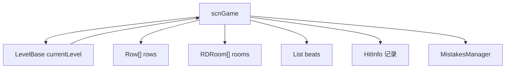

# scnGame

## 基本信息

| 项目 | 内容 |
| --- | --- |
| 源码路径 | `RDFucked/Assets/Scripts/Assembly-CSharp/scnGame.cs` |
| 命名空间 | 全局命名空间 |
| 声明 | `public class scnGame : scnBase, IRequiredControllerPrompt` |
| 主要职责 | 管理游戏场景运行状态：当前关卡、行、房间、Beat、判定、HP、暂停、输入、视觉 UI 和关卡流程 |
| 覆盖内容 | 字段、属性、公开方法、游戏场景状态、Beat、行、房间和判定入口 |

## 用途概览

`scnGame` 是实际游玩场景实例。`RDBase.game` 和 `RDClass.game` 都把 `scnBase.instance` 转成 `scnGame`，`LevelBase` 的大量属性和方法也通过 `base.game` 读取或修改它。

它连接三个核心层面：

- 关卡层：`currentLevel`、`levelToLoadSource`、`currentLevelPath`、`internalIdentifier`。
- 游戏对象层：`rows`、`rooms`、`beats`、`beatLoops`、`windowChoreographer`。
- 判定与流程层：`mistakesManager`、`allHitOffsets`、`rowsHitOffsets`、`gameState`、`paused`、`failedLevel`。

## 内部类型

| 类型 | 字段 | 作用 |
| --- | --- | --- |
| `HitInfo` | `bar`、`offsetType` | 记录一次命中所属小节和偏移类型 |
| `BorderFeedbackType` | `Correct`、`Incorrect`、`DrumHit` | 控制边框反馈类型 |

## 静态关卡加载状态

| 名称 | 类型 | 作用 |
| --- | --- | --- |
| `levelToLoadSource` | `LevelSource` | 当前要加载的关卡来源，默认 `InternalPath` |
| `attemptToLoadTutorial` | `bool` | 是否尝试加载教程 |
| `currentLevelPath` | `string` | 当前关卡路径 |
| `internalIdentifier` | `string` | 内部关卡标识 |
| `loadDogMode` | `bool` | 加载狗模式 |
| `levelSpeed` | `float` | 静态关卡速度，默认 `1f` |
| `forceNextTimeStartImmediately` | `bool` | 下一次强制立即开始 |
| `p1DefibMode` / `p2DefibMode` | `DefibMode` | 玩家除颤模式 |
| `p1HitTimes` / `p2HitTimes` | `List<float>` | 玩家命中时间记录 |
| `tapsOnly` / `drumMode` | `bool` | 输入模式开关 |

## 场景对象与 UI

| 分组 | 字段 | 作用 |
| --- | --- | --- |
| Prefab | `RowEntity`、`Room`、`customBackground` | 行实体、房间和自定义背景预制体 |
| 核心 UI | `rankscreen`、`hpController`、`hitStripManager`、`statusText`、`flashTextUI` | 结算、血条、命中条、状态文字和闪字 |
| 手控制器 | `handController0` 到 `handController3`、`handControllerOnTop` | 房间手部控制器 |
| 摄像机 | `topCamera`、`uiCamera`、`pauseMenuCamera`、`blitterCamera`、`windowCamera`、`uiCameras` | 游戏场景中的不同相机 |
| 暂停 | `pauseMenu`、`pauseMenuOverlay`、`pauseBlocked`、`paused` | 暂停菜单和暂停状态 |
| 移动端 UI | `MobileButtons`、`MobilePauseButton`、`MobileStatusText` | 移动端按钮和状态文本 |
| 窗口舞蹈 | `windowDanceMovement`、`windowChoreographer` | Window Dance 显示和编舞控制 |

## 运行时数据

| 名称 | 类型 | 作用 |
| --- | --- | --- |
| `currentLevel` | `LevelBase` | 当前运行关卡对象 |
| `rows` | `Row[]` | 当前关卡行数组 |
| `rooms` | `RDRoom[]` | 当前关卡房间数组 |
| `beats` | `List<Beat>` | 当前场景 Beat 实例列表 |
| `beatLoops` | `List<scrBeatLoop>` | Classic Beat 循环列表 |
| `beatLoopsOneshot` | `List<scrBeatLoopOneshot>` | Oneshot Beat 循环列表 |
| `conditionals` | `List<Conditional>` | 当前场景条件列表 |
| `timedActions` | `List<TimedAction>` | 定时动作列表 |
| `rowsHitOffsets` | `List<HitInfo>[]` | 每行命中偏移历史，数组长度 16 |
| `allHitOffsets` | `List<HitInfo>` | 全局命中偏移历史 |
| `playerCaughtHoldBeat` | `Beat[]` | 玩家当前抓住的 hold beat，数组长度 4 |
| `ignoreInput` | `bool` | 是否忽略输入 |

## 关键方法分组

| 分组 | 方法 | 作用 |
| --- | --- | --- |
| 暂停与退出 | `TogglePauseGame`、`Quit`、`Restart`、`EndLevel` | 控制暂停、退出、重开和结束关卡 |
| 开始流程 | `StartTheGame`、`SetGameState`、`ShowCutsceneBars` | 启动关卡、设置游戏状态和显示 Cutscene 黑边 |
| 输入 | `UpdateGameplayInput`、`SwitchPlayers`、`EnsureSwitchPlayersState` | 更新玩家输入和玩家切换状态 |
| Beat 创建 | `AddBeat`、`AddBeatFree`、`AddBeatOneshot`、`AddBeatHold` | 创建 Classic、Free、Oneshot、Hold Beat |
| Beat 循环 | `OnBeatClassic`、`OnBeatHold`、`OnBeatOneshotBar`、`OffBeat`、`StopBeats` | 开启、关闭和停止 Beat 循环 |
| 行与房间 | `MakeRow`、`DeleteRow`、`RepositionRowsAndStrips`、`ChangeRowPlayers` | 创建、删除、重排和修改行玩家 |
| 判定与失败 | `FailLevel`、`FailLevelLite`、`OnMistakeOrHeal`、`AddHitOffset`、`GetHitMargin`、`GetReleaseMargin` | 处理失败、失误治疗、命中偏移和判定边界 |
| 结算与数据 | `WinLevel`、`ResetAllData`、`GetPassedLevelWithoutCheckpoints` | 胜利、重置和通关检查 |
| 视觉反馈 | `FlashBorderFeedback`、`CloseBlades`、`OpenBlades`、`RefreshBeatSkipAesthetics` | 边框、刀片和节拍视觉反馈 |
| 干扰与控制器提示 | `SetupDistractions`、`ShowDistraction_OnePopup`、`ShowRequiredController`、`HideRequiredController` | 平台干扰模拟和必需控制器提示 |

## 与 LevelBase 的关系

## Mod 作者注意事项

| 项目 | 说明 |
| --- | --- |
| `currentLevel` 是关卡逻辑入口 | `LevelBase` 通过 `base.game.currentLevel` 与场景状态互相访问 |
| 判定历史集中在列表中 | `allHitOffsets` 和 `rowsHitOffsets` 被 `LevelBase` 的成绩统计属性读取 |
| Beat 创建方法会改场景对象 | `AddBeat*` 方法会创建 Beat 实例并进入场景运行列表 |
| 输入可被强制忽略 | `ignoreInput` 被 `LevelBase.IgnoreInput` 直接设置 |
