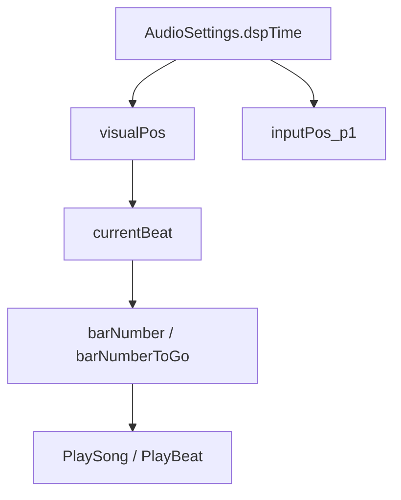

# scrConductor

## 基本信息

| 项目 | 内容 |
| --- | --- |
| 源码路径 | `RDFucked/Assets/Scripts/Assembly-CSharp/scrConductor.cs` |
| 命名空间 | 全局命名空间 |
| 声明 | `public class scrConductor : RDBase` |
| 主要职责 | 管理歌曲时间、BPM、小节节拍、音频播放、节拍音播放、Scrub、播放风格、音量和校准 |
| 覆盖内容 | 字段、属性、公开方法、播放流程、时间轴和校准入口 |

## 用途概览

`scrConductor` 是游戏时间轴和音频调度中心。`RDBase.conductor`、`RDClass.conductor`、`LevelBase.bpm`、`LevelBase.crotchets`、`LevelBase.barNumber` 等大量入口都最终读取 `scrConductor.instance` 的状态。

这个类同时处理视觉时间和输入时间。源码中存在 `visualPos`、`inputPos_p1`、`calibration_v`、`calibration_i`、`calibration_i_P2_internal` 等属性，说明视觉判定和玩家输入判定分别套用校准偏移。

## 单例与音量常量

| 名称 | 类型 | 作用 |
| --- | --- | --- |
| `_instance` | `scrConductor` | `instance` 属性的缓存字段 |
| `instance` | `scrConductor` | 静态访问入口；缓存为空时用 `FindObjectOfType<scrConductor>()` 查找 |
| `GlobalExternalSoundVolume` | `float` | 外部声音全局音量常量，值为 `0.4f` |
| `EARLY_MISTAKE_PITCH` / `EARLY_MISTAKE_VOLUME` | `float` | 早按错误反馈音的音高和音量常量 |
| `LATE_MISTAKE_PITCH` / `LATE_MISTAKE_VOLUME` | `float` | 晚按错误反馈音的音高和音量常量 |

## 时间与小节状态

| 名称 | 类型 | 作用 |
| --- | --- | --- |
| `barNumberUpdateOnBar` | `int` | 在小节更新点使用的小节编号 |
| `barNumber` | `int` | 当前小节编号 |
| `barNumberMonotonic` | `int` | 单调递增小节编号 |
| `barNumberToGo` | `int` | 下一次跳转或播放风格变化要去的小节 |
| `startOfNextBar` | `double` | 下一小节开始时间 |
| `startOfNextBarRefreshOnlyOnBar` | `double` | 只在小节刷新时更新的下一小节开始时间 |
| `startOfLastPrebar` | `double` | 上一次 prebar 开始时间，初始为正无穷 |
| `startOfSong` | `double` | 歌曲开始的 DSP 时间 |
| `startOfLastBeatVisual` | `double` | 上一次视觉节拍开始时间 |
| `startOfLastBeatInput` | `double` | 上一次输入节拍开始时间 |
| `actualPreBeatNumber` | `float` | prebeat 相关的实际节拍编号 |
| `currentBeat` | `float` | 当前拍，计算方式是 `TimeToBeatRefreshOnBar(visualPos - startOfNextBarRefreshOnlyOnBar)` |

## BPM 与节拍长度

| 名称 | 类型 | 作用 |
| --- | --- | --- |
| `bpm` | `float` | 当前 BPM，公开读取，类内部设置，默认 `100f` |
| `crotchet` | `float` | 单拍时长，计算式为 `60f / bpm` |
| `unscaledCrotchet` | `float` | `crotchet * RDTime.speed` |
| `visualCrotchet` | `float` | 视觉拍长，会乘上 `visualBeatLengthMultiplier` |
| `barLength` | `float` | 当前小节长度 |
| `barLengthRefreshOnBar` | `float` | 只在小节刷新时更新的小节长度 |
| `bpmChangesInBar` | `List<BPMChange>` | 当前小节内 BPM 变化 |
| `bpmChangesInBarRefreshOnBar` | `List<BPMChange>` | 小节刷新时使用的 BPM 变化缓存 |

## 音频播放状态

| 名称 | 类型 | 作用 |
| --- | --- | --- |
| `currentSong` | `AudioSource` | 当前歌曲音源 |
| `previousSong` | `AudioSource` | 上一首歌曲音源 |
| `currentSongString` | `string` | 当前歌曲名称 |
| `currentSongStartTime` | `double` | 当前歌曲开始时间 |
| `mainVolume` | `float` | 主音量 |
| `oneSongAtATime` | `bool` | 控制是否一次只播放一首歌 |
| `audiosourcesFromPlayBeat` | `List<AudioSource>` | `PlayBeat` 创建的音源列表 |
| `audioStartTimesFromPlayBeat` | `Dictionary<AudioSource, double>` | `PlayBeat` 音源开始时间 |
| `audioEndTimesFromPlayBeat` | `Dictionary<AudioSource, double>` | `PlayBeat` 音源结束时间 |
| `externalSoundData` | `Dictionary<string, SongOffset>` | 外部声音偏移数据 |

## 播放风格与 Scrub 状态

| 名称 | 类型 | 作用 |
| --- | --- | --- |
| `playStyle` | `PlayStyle` | 当前播放风格 |
| `playStyleCache` | `PlayStyle` | 播放风格缓存 |
| `unfreezeBehaviour` | `PlayStyleChange` | Freeze 解除后的播放风格变化 |
| `playStyleTempCounter` | `int` | 播放风格临时计数 |
| `runningScrubToNextBar` | `bool` | 正在执行跳到下一小节的 Scrub |
| `isScrubbingRefreshOnBar` | `bool` | 小节刷新逻辑中的 Scrub 状态 |
| `scrubDestination` | `int` | Scrub 目标 |
| `lastBarScrubbed` | `int` | 上一次 Scrub 到的小节，初始为 `-1` |

## 关键方法分组

| 分组 | 方法 | 作用 |
| --- | --- | --- |
| 音频设置 | `LoadSavedAudioSettings` | 读取保存的音频设置 |
| 暂停与静音 | `ToggleMuteCurrentSong`、`MuteCurrentSong`、`UnmuteCurrentSong`、`Pause` | 控制当前歌曲静音、恢复和暂停 |
| 播放风格 | `Freeze`、`FreezeLoopBetween`、`SetPlayStyle`、`PSChangeToPSMovement`、`PSChangeToPlayStyle` | 控制播放暂停、循环区间和播放风格转换 |
| 小节事件 | `OnPreBar`、`OnPreBarIfAdvancing`、`OnNewBar` | 小节前和新小节回调入口 |
| 歌曲播放 | `PlaySong`、`ReplaySong`、`PlayNoSong`、`StopSong`、`FadeSong`、`IsSongPlaying` | 控制歌曲播放、停止、淡出和状态判断 |
| 节拍音播放 | `PlayBeat`、`PlayBeatInCrotchets`、`PlayBeatFromSongStart`、`PlayFeedback` | 按时间、拍数或歌曲起点播放节拍音和反馈音 |
| 立即播放 | `PlayImmediately`、`PlayImmediatelyIgnoringTimeScale`、`PlayImmediatelyLevelEditor` | 不走普通歌曲时间轴的立即音频播放 |
| Scrub | `ScrubToNextBar`、`ScrubToBarNum`、`ScrubToBarNumNoCoroutine` | 跳到指定小节或下一小节 |
| BPM | `SetBPM`、`AddBPMChange`、`BeatToTime`、`TimeToBeatRefreshOnBar`、`DurationBeatsToTime` | 设置 BPM、记录 BPM 变化、在拍与时间之间转换 |

## 时间转换关系

## 源码研究注意事项

| 项目 | 说明 |
| --- | --- |
| 时间分视觉和输入 | `visualPos` 使用视觉校准，`inputPos_p1` 使用输入校准 |
| `PlayBeat` 会记录音源 | `audiosourcesFromPlayBeat` 和相关字典保存音源起止时间 |
| `SetPlayStyle` 改变流程 | 该方法会影响播放风格、跳转和 Scrub 行为 |
| 静态立即播放入口 | `RDBase.PlaySound` 最终调用 `scrConductor.PlayImmediately` |
