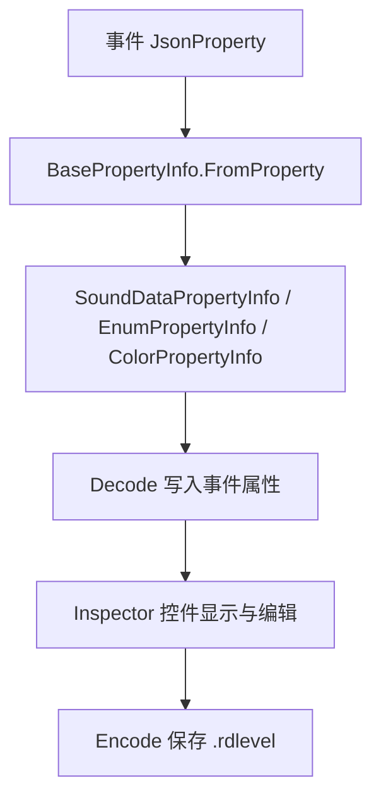
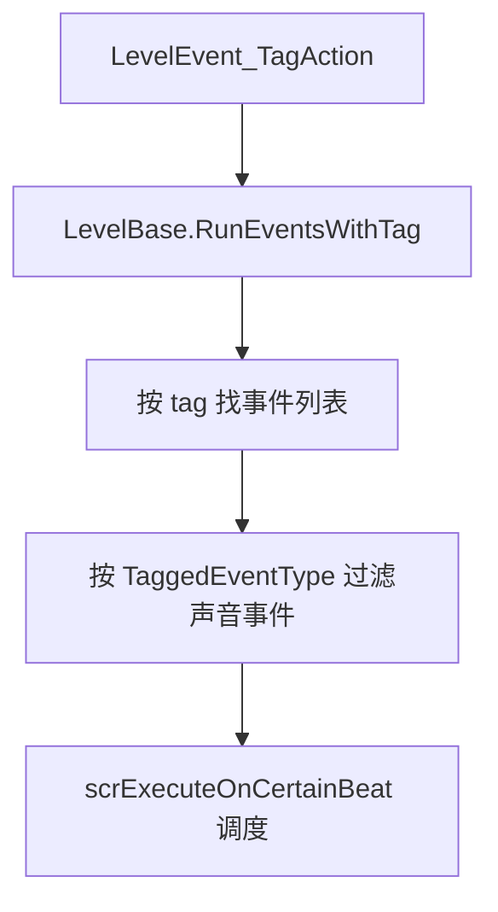

# 音频与辅助数据模型

本页整理阶段 4 中剩余的轻量数据结构：音频数据、游戏音效默认表、标签动作、书签、颜色调色板引用和枚举属性序列化。这些类型不都属于同一个运行系统，但都会被 `.rdlevel` 事件、编辑器控件或运行时调用路径反复使用。

## 源码范围

| 类型 | 源码路径 | 职责 |
| --- | --- | --- |
| `SoundData` | `RDFucked/Assets/Scripts/Assembly-CSharp/RDLevelEditor/SoundData.cs` | 可变音频数据，负责行声音、计数音、自定义声音的加载、验证、编码和即时播放。 |
| `SoundDataStruct` | `RDFucked/Assets/Scripts/Assembly-CSharp/RDLevelEditor/SoundDataStruct.cs` | 只读音频数据结构，用于事件属性序列化和 Inspector 控件读写。 |
| `SoundDataPropertyInfo` | `RDFucked/Assets/Scripts/Assembly-CSharp/RDLevelEditor/SoundDataPropertyInfo.cs` | `BasePropertyInfo` 的音频结构适配器。 |
| `SoundSettingsPopup` | `RDFucked/Assets/Scripts/Assembly-CSharp/RDLevelEditor/SoundSettingsPopup.cs` | 编辑器音频设置弹窗，显示音量、音高、声像和偏移。 |
| `CustomSoundType` | `RDFucked/Assets/Scripts/Assembly-CSharp/RDLevelEditor/CustomSoundType.cs` | 自定义声音分类枚举。 |
| `RDGameSoundData` | `RDFucked/Assets/Scripts/Assembly-CSharp/RDGameSoundData.cs` | 官方游戏音效条目数据。 |
| `RDGameSounds` | `RDFucked/Assets/Scripts/Assembly-CSharp/RDGameSounds.cs` | 从 `Resources/RDGameSounds` 加载、查询、覆盖和重置游戏音效表。 |
| `BookmarkData` | `RDFucked/Assets/Scripts/Assembly-CSharp/RDLevelEditor/BookmarkData.cs` | 编辑器书签数据。 |
| `ColorOrPalette` | `RDFucked/Assets/Scripts/Assembly-CSharp/ColorOrPalette.cs` | 直接颜色或调色板槽位引用。 |
| `TagAction` | `RDFucked/Assets/Scripts/Assembly-CSharp/TagAction.cs` | 标签动作枚举。 |
| `TaggedEventType` | `RDFucked/Assets/Scripts/Assembly-CSharp/TaggedEventType.cs` | 标签执行时的声音事件过滤枚举。 |
| `LevelSettingName` | `RDFucked/Assets/Scripts/Assembly-CSharp/LevelSettingName.cs` | 设置项名称枚举，用于条件和错误提示可视化。 |
| `EnumPropertyInfo` | `RDFucked/Assets/Scripts/Assembly-CSharp/RDLevelEditor/EnumPropertyInfo.cs` | 枚举属性的编码解码适配器。 |

## SoundData

`SoundData` 是可变音频数据类，继承 `RDClass`。行 pulse sound、counting sound、Beat 预备音和部分运行时播放路径使用它。构造函数允许传入不同 JSON 键名，因此同一套字段能适配 `filename`、`pulseSound`、`pulseSoundVolume` 这类旧字段。

### 字段

| 字段 | 类型 | 默认值 | 行为 |
| --- | --- | --- | --- |
| `filename` | `string` | 构造参数或空值 | 音频资源名或文件名。 |
| `volume` | `int` | `100` | 百分比音量，`Validate()` 限制到 `0..300`。 |
| `pitch` | `int` | `100` | 百分比音高，`Validate()` 限制到 `0..300`。 |
| `minPitch` | `int` | `100` | 最小音高，解码后等于 `pitch`。 |
| `maxPitch` | `int` | `100` | 最大音高，解码后等于 `pitch`。 |
| `pan` | `int` | `0` | 声像，`Validate()` 限制到 `-100..100`。 |
| `offset` | `int` | `0` | 毫秒偏移。 |
| `externalClip` | `bool` | `false` | `Prepare()` 或 `IsExternalClip()` 根据查找结果写入。 |
| `loadSuccessful` | `bool` | `false` | `Prepare()` 加载成功后设为 true。 |
| `groupSubtype` | `GameSoundType` | `ClapSoundP1Classic` | 分组内具体游戏音效类型。 |
| `used` | `bool` | `true` | false 时 `Prepare()` 不加载，编码可只输出 `used:false`。 |

### 百分比属性

| 属性 | 换算 |
| --- | --- |
| `volumePercentage` | `volume * 0.01f`，写入时 `value * 100`。 |
| `pitchPercentage` | `pitch * 0.01f`，写入时 `value * 100`。 |
| `panPercentage` | `pan * 0.01f`，写入时 `value * 100`。 |
| `offsetInSeconds` | `offset * 0.001f`，写入时 `value * 1000`。 |
| `minPitchPercentage` | `minPitch * 0.01f`，写入时 `value * 100`。 |
| `maxPitchPercentage` | `maxPitch * 0.01f`，写入时 `value * 100`。 |
| `conductorFilename` | 内部资源返回 `filename`；外部音频返回 `filename + "*external"`。 |

### 主要方法

| 方法 | 行为 |
| --- | --- |
| `Prepare()` | 检查当前关卡和 `preparedAudioClips`，跳过 unused 或空文件名；内部音频通过 `scrConductor.songOffsets` 建立 `externalSoundData`；外部音频加载后加入 `currentLevel.preparedAudioClips` 并写入 `externalSoundData`。 |
| `Validate()` | 限制 `volume`、`pitch`、`pan` 范围，并把 `minPitch`、`maxPitch` 同步为 `pitch`。 |
| `Decode(Dictionary<string, object>)` | 按构造函数中的键名读取 offset、volume、pitch、pan、filename、groupSubtype 和 used。 |
| `Encode(bool)` | 输出 filename，并只在字段偏离默认值时输出 volume、pitch、pan、offset；分组音效会额外输出 `groupSubtype` 和 `used`。 |
| `CopyFrom(SoundData)` | 复制音频文件名、偏移、音量、音高、声像、分组和 used 状态。 |
| `PlayImmediately(string)` | 调用 `scrConductor.PlayImmediately()` 试听，并把返回的 `AudioSource` 放进 `scnEditor.instance.soundSettingsPopup.audioSources`。 |
| `IsExternalClip()` | 调用 `RDEditorUtils.FindClip(filename)`，结果为 `SuccessExternalClipLoaded` 时设置 `externalClip = true`。 |

### 旧版本兼容

| 条件 | 处理 |
| --- | --- |
| `RDLevelData.current.settings.version <= 9` 且文件名带音频扩展名 | `volume = FloorToInt(volume / 0.4f)`。 |
| `version <= 42` 且 `filename == "Stick"` | 改为 `StickOld`。 |
| `version <= 42` 且 `filename == "ClosedHat"` | 改为 `ClosedHatOld`。 |

## SoundDataStruct

`SoundDataStruct` 是只读结构体，事件属性更常使用它。`BasePropertyInfo.FromProperty()` 遇到 `SoundDataStruct` 时创建 `SoundDataPropertyInfo`，因此带 `JsonProperty` 的声音属性会走统一的对象编码。

### 字段与属性

| 字段 | 类型 | 默认值 | 行为 |
| --- | --- | --- | --- |
| `filename` | `string` | 构造参数 | 音频资源名或文件名。 |
| `volume` | `int` | `100` | 百分比音量。 |
| `pitch` | `int` | `100` | 百分比音高。 |
| `pan` | `int` | `0` | 声像。 |
| `offset` | `int` | `0` | 毫秒偏移。 |
| `used` | `bool` | `true` | 是否启用该声音。 |
| `volumePercentage` | `float` | 只读 | `volume * 0.01f`。 |
| `pitchPercentage` | `float` | 只读 | `pitch * 0.01f`。 |
| `panPercentage` | `float` | 只读 | `pan * 0.01f`。 |
| `offsetInSeconds` | `float` | 只读 | `offset * 0.001f`。 |

### 方法

| 方法 | 行为 |
| --- | --- |
| `Decode(IReadOnlyDictionary<string, object>)` | 读取 `filename`、`offset`、`volume`、`pitch`、`pan`、`used`，并执行与 `SoundData.Decode()` 相同的旧版本兼容。 |
| `MigrateLegacySound(Dictionary<string, object>, string, string)` | 把旧字段组合成新的声音对象字段；支持默认键和带前缀的旧键。 |
| `Encode(string, bool)` | 以对象形式编码到指定 key，下列默认值不输出：`volume=100`、`pitch=100`、`pan=0`、`offset=0`、`used=true`。 |
| `ToSoundData()` | 转成可变 `SoundData`，同时把 `minPitch`、`maxPitch` 设为 `pitch`。 |
| `FromSoundData(SoundData)` | 从可变 `SoundData` 复制出只读结构。 |
| `Validated()` | 返回限制后的新结构：`volume`、`pitch` 为 `0..300`，`pan` 为 `-100..100`。 |
| `WithNewVolume(int)` | 返回替换音量后的新结构。 |
| `WithNewOffset(int)` | 返回替换偏移后的新结构。 |
| `WithNewFilename(string)` | 返回替换文件名后的新结构。 |
| `WithNewUsed(bool)` | 返回替换 used 后的新结构。 |
| `IsExternalClip()` | 使用 `RDEditorUtils.FindClip(filename)` 判断是否为外部音频。 |
| `LocalizedName()` | 文件名能解析为 `SoundEffect` 时返回枚举本地化文本，否则返回原文件名。 |
| `GetTooltip()` | 默认 pitch 和 pan 时只显示音量；非默认 pitch 或 pan 时显示多行音量、音高、声像。 |

## SoundDataPropertyInfo

| 方法 | 行为 |
| --- | --- |
| `Decode(object)` | 把传入对象转成 `Dictionary<string, object>`，调用 `SoundDataStruct.Decode()`，再调用 `Validated()`。 |
| `Encode(string, object, bool)` | 调用 `SoundDataStruct.Encode()`。 |

它是事件属性反射管线的一部分：`BasePropertyInfo.FromProperty()` 发现属性类型为 `SoundDataStruct` 时返回该类型，`BasePropertyInfo.GetDefaultAttribute()` 则给 `SoundDataStruct` 返回 `SoundAttribute`。

## SoundSettingsPopup

`SoundSettingsPopup` 是编辑器声音设置弹窗。它不保存 `.rdlevel` 数据，但负责把 Inspector 声音控件中的音量、音高、声像、偏移显示出来，并管理试听音源。

| 字段 | 类型 | 行为 |
| --- | --- | --- |
| `audioSources` | `List<AudioSource>` | 试听声音返回的音源列表，关闭弹窗时停止并清空。 |
| `volumeSlider`、`pitchSlider`、`panSlider` | `Slider` | 显示并修改百分比数值。 |
| `volumeInputField`、`pitchInputField`、`panInputField` | `InputField` | 与滑条同步的文本输入。 |
| `audioOffsetInputField` | `InputField` | 声音偏移输入。 |
| `soundInput` | `PropertyControl_SoundInput` | 当前关联的声音属性控件。 |
| `offsetContainer` | `GameObject` | 控制偏移输入区域是否显示。 |

| 方法 | 行为 |
| --- | --- |
| `Show(bool, RectTransform)` | 播放弹窗动画；显示时记录当前 Inspector 类型和选中事件 ID，关闭时停止试听音源。 |
| `Toggle(RectTransform)` | 在显示和隐藏之间切换。 |
| `UpdateData(SoundDataStruct)` | 把声音结构写入滑条和输入框。 |
| `UpdateInputFieldText()` | 把滑条值同步到文本输入框。 |
| `ToggleOffset(bool)` | 显示或隐藏偏移区域，并调整消息区域高度。 |
| `SetPanelHeight()` | 根据消息文本和偏移区域重新计算弹窗高度。 |

## 游戏音效表

`RDGameSoundData` 是 Unity 可序列化结构。`RDGameSounds` 是加载和修改默认游戏音效表的 MonoBehaviour。

| 类型 | 字段或方法 | 行为 |
| --- | --- | --- |
| `RDGameSoundData` | `type:GameSoundType` | 游戏音效类型。 |
| `RDGameSoundData` | `filename:string` | 实际播放的音频名。 |
| `RDGameSoundData` | `volume:float` | 音量，Inspector 上用 `[Range(0f, 3f)]`。 |
| `RDGameSoundData` | `minPitch`、`maxPitch` | 音高范围。 |
| `RDGameSoundData` | `pan:float` | 声像。 |
| `RDGameSounds` | `Get(GameSoundType)` | 查询 `data.sounds`，未找到时记录错误并返回空声音数据。 |
| `RDGameSounds` | `Set(...)` | 覆盖指定 `GameSoundType` 的文件名、音量、音高和声像。 |
| `RDGameSounds` | `SetVolume`、`SetMinPitch`、`SetMaxPitch`、`SetPan` | 分别修改指定音效的单一字段。 |
| `RDGameSounds` | `LoadDefaults()` | 从 `defaults` 复制回 `sounds`。 |
| `RDGameSounds` | `Init()` | 实例化 `Resources/RDGameSounds`，复制默认数组，并填充 `defaultSounds` 字典。 |

`Beat`、`BeatClassic`、`BeatOneshot` 和 `scrConductor` 会通过 `RDGameSounds.Get()` 读取音效数据，再把文件名、音量、音高、声像交给 conductor 播放。

## 自定义声音分类

| 枚举 | 数值 | 用途 |
| --- | --- | --- |
| `MusicSound` | `0` | 音乐类自定义声音。 |
| `BeatSound` | `1` | 节拍类自定义声音。 |
| `HitSound` | `2` | 击打类自定义声音。 |
| `CueSound` | `3` | 提示类自定义声音。 |
| `OtherSound` | `4` | 其他自定义声音。 |

`RDEditorConstants.CustomSoundTypes` 的展示顺序是 `CueSound`、`MusicSound`、`BeatSound`、`HitSound`、`OtherSound`。

## 书签数据

`BookmarkData` 保存编辑器时间线书签。`RDLevelData` 解码 `bookmarks` 节点时读取 `bar`、`beat`、`color`，保存时按相同字段写回。

| 字段 | 类型 | 行为 |
| --- | --- | --- |
| `barAndBeat` | `BarAndBeat` | 书签位置。 |
| `colorIndex` | `int` | 书签颜色索引。 |

`scnEditor` 保存关卡时会遍历时间线书签控件，用 `timeline.GetBarAndBeatWithPosX(bookmark.rt.anchoredPosition.x)` 生成 `BookmarkData`；读取关卡时会根据 `RDLevelData.bookmarks` 创建书签 UI。

## 颜色与调色板引用

`ColorOrPalette` 可以保存直接颜色，也可以保存调色板槽位引用。事件属性中 `ColorOrPalette` 会由 `BasePropertyInfo` 映射到 `ColorPropertyInfo`，编辑器控件映射到 `ColorAttribute`。

| 成员 | 行为 |
| --- | --- |
| `FromString(string)` | 字符串不以 `pal` 开头时按十六进制颜色解析；以 `pal` 开头时解析调色板索引。 |
| `ToColor(bool useEditorPalette)` | 直接颜色返回自身；调色板引用从 `scnEditor.instance.colorPalette` 或 `RDLevelData.current.colorPalette` 取颜色。 |
| `GetIndex()` | 直接颜色返回 `-1`，调色板引用返回槽位。 |
| `Encode(bool hasAlpha)` | 直接颜色输出 RGB 或 RGBA 十六进制；调色板引用输出 `pal{index}`。 |
| `WithAlpha(float)` | 直接颜色返回替换 alpha 后的新值；调色板引用保持原值。 |
| `alpha` | 直接颜色返回 alpha，调色板引用返回空值。 |
| `isPalette` | 保存调色板索引时为 true。 |

`FromString()` 对调色板索引使用 `0..21` 的边界检查。`ToColor()` 在缺少编辑器实例或当前关卡数据时会抛出异常。

## 标签动作

`TagAction` 与 `TaggedEventType` 被 `LevelEvent_TagAction` 和 `LevelBase` 的标签运行方法使用。

| `TagAction` | 数值 | `LevelEvent_TagAction` 行为 |
| --- | --- | --- |
| `Run` | `0` | 调用 `level.RunTagWithType(text, typeToRun)`。 |
| `RunAll` | `1` | 调用 `level.RunTagContaining(false, typeToRun, text)`。 |
| `Enable` | `2` | 调用 `level.EnableTag(text)`。 |
| `Disable` | `3` | 调用 `level.DisableTag(text)`。 |
| `EnableAll` | `4` | 调用 `level.EnableTagsContaining(text)`。 |
| `DisableAll` | `5` | 调用 `level.DisableTagsContaining(text)`。 |
| `RunRandom` | `6` | 调用 `level.RunRandomTagWithType(text, typeToRun)`。 |

| `TaggedEventType` | 数值 | 过滤行为 |
| --- | --- | --- |
| `All` | `0` | 运行所有匹配 tag 的事件。 |
| `OnlySound` | `1` | 在 `RunEventsWithTag()` 中只运行 `LevelEvent_PlaySound`，`LevelEvent_TagAction` 不受该过滤排除。 |
| `OnlyNonSound` | `2` | 在 `RunEventsWithTag()` 中跳过 `LevelEvent_PlaySound`，`LevelEvent_TagAction` 不受该过滤排除。 |

`LevelEvent_TagAction.Run()` 对 Run、RunAll、RunRandom 会分两条节拍路径执行：非声音事件路径和声音事件路径。声音路径调用 `RunOnBeat(... forceMinusLatency: true)`。当事件已经处于 tag 调用链中时，会沿用 `level.runningTagEventType`，避免嵌套 tag 动作破坏声音与非声音过滤。

## 设置项名称

`LevelSettingName` 枚举用于设置条件可视化和错误定位。`SettingErrorLocalization` 保存 `settingName`，`LevelConditionVisualizer` 与 `RequirementsVisualizerSpawner` 按设置名展示要求。

| 枚举 | 数值 |
| --- | --- |
| `None` | `-1` |
| `Artist` | `0` |
| `Song` | `1` |
| `Author` | `2` |
| `Description` | `3` |
| `PreviewImage` | `4` |
| `SyringeIcon` | `5` |
| `PreviewSong` | `6` |
| `PreviewSongStartTime` | `7` |
| `PreviewSongDuration` | `8` |
| `Tags` | `9` |
| `CanBePlayedOn` | `10` |
| `SongLabelHue` | `11` |
| `SongLabelGrayscale` | `12` |
| `MaxMistakes` | `13` |
| `Separate2PLevel` | `14` |
| `SeizureWarning` | `15` |
| `LevelEvent` | `16` |

## 枚举属性序列化

`EnumPropertyInfo` 是 `BasePropertyInfo` 对枚举属性的适配器。

| 成员 | 行为 |
| --- | --- |
| `enumType` | 保存属性的枚举类型。 |
| `asInt` | 从 `EnumInfoAttribute.asInt` 读取；没有 Attribute 时使用默认值。 |
| `Decode(object)` | `asInt` 为 false 时按字符串忽略大小写解析枚举，失败返回 null；`asInt` 为 true 时用 `RDEditorUtils.DecodeInt()` 转成枚举值。 |
| `Encode(string, object, bool)` | `asInt` 为 false 时输出字符串；`asInt` 为 true 时输出整数。 |

## 数据流关系

## 源码研究关注点

| 场景 | 注意事项 |
| --- | --- |
| 写声音属性 | `SoundDataStruct` 的对象键固定为 `filename`、`volume`、`pitch`、`pan`、`offset`、`used`。默认值不会编码进 `.rdlevel`。 |
| 试听声音 | `SoundData.PlayImmediately()` 会把试听音源登记到编辑器弹窗，关闭弹窗时统一停止。 |
| 外部音频 | 外部音频在 conductor 中使用 `filename + "*external"` 作为键名。 |
| 写颜色字段 | 调色板引用使用 `pal{index}`；直接颜色使用十六进制字符串。 |
| 写 tag 动作 | Run 类动作会区分声音事件和非声音事件；递归 tag 调用会沿用当前 `runningTagEventType`。 |

