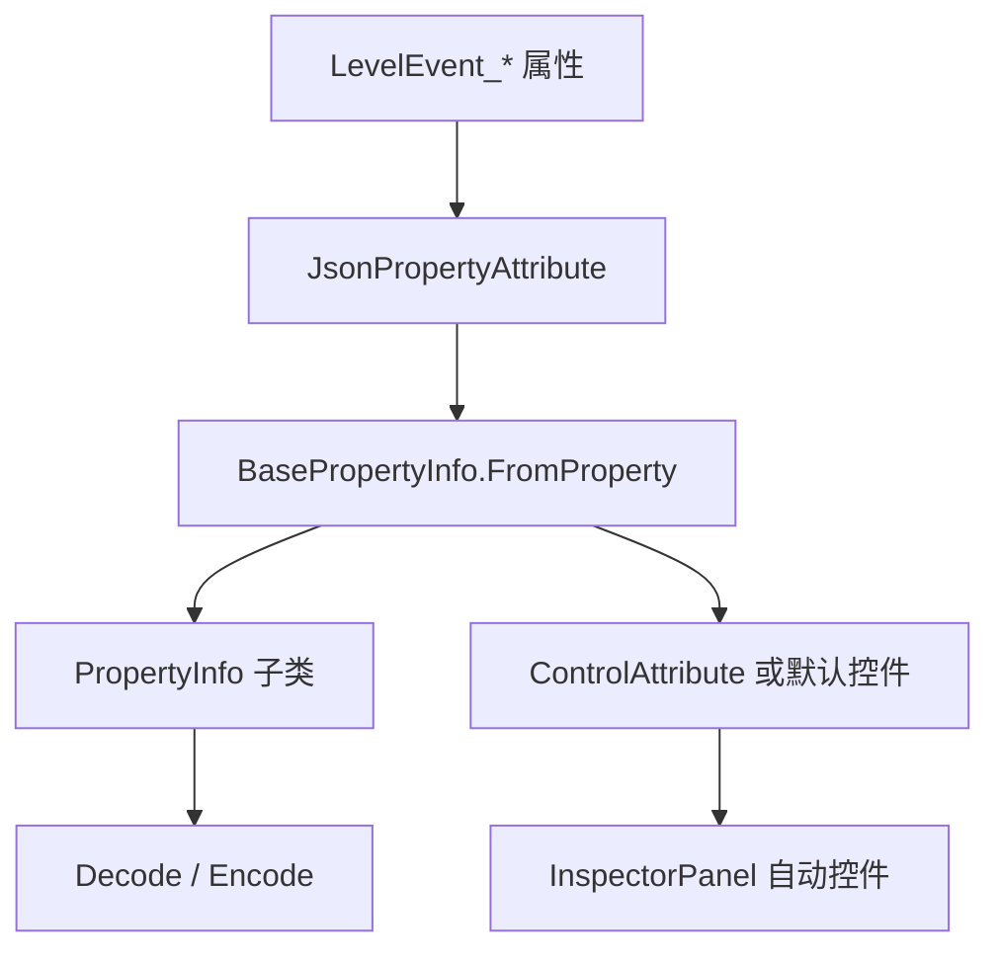

# 属性反射与小型模型

本页整理阶段 4 剩余的数据辅助类型。它们主要服务自动 Inspector、事件属性序列化、自定义动画数据、指针事件转发和少量项目设置。

## 源码范围

| 类型 | 源码路径 | 职责 |
| --- | --- | --- |
| `BasePropertyInfo` | `RDFucked/Assets/Scripts/Assembly-CSharp/RDLevelEditor/BasePropertyInfo.cs` | 根据事件属性类型和 Attribute 选择编码解码器与默认控件。 |
| `*PropertyInfo` | `RDFucked/Assets/Scripts/Assembly-CSharp/RDLevelEditor/*PropertyInfo.cs` | 各基础类型的属性编码解码适配器。 |
| `JsonPropertyAttribute` | `RDFucked/Assets/Scripts/Assembly-CSharp/JsonPropertyAttribute.cs` | 标记事件属性的 JSON 键名、必填、启用、保存条件和 UI 文案。 |
| `ControlAttribute` 与子类 | `RDFucked/Assets/Scripts/Assembly-CSharp/RDLevelEditor/*Attribute.cs` | 自动 Inspector 控件声明。 |
| `Float2` | `RDFucked/Assets/Scripts/Assembly-CSharp/Float2.cs` | 带单轴启用状态的二维浮点结构。 |
| `FloatExpression` | `RDFucked/Assets/Scripts/Assembly-CSharp/FloatExpression.cs` | 可保存数字字面量或变量表达式的浮点值。 |
| `FloatExpression2` | `RDFucked/Assets/Scripts/Assembly-CSharp/FloatExpression2.cs` | 两个 `FloatExpression` 组成的二维表达式。 |
| `CustomAnimation` | `RDFucked/Assets/Scripts/Assembly-CSharp/CustomAnimation.cs` | 自定义角色动画播放组件。 |
| `CustomAnimationData` | `RDFucked/Assets/Scripts/Assembly-CSharp/CustomAnimationData.cs` | 自定义动画 JSON 数据、纹理和 clip 字典。 |
| `CustomAnimationClip` | `RDFucked/Assets/Scripts/Assembly-CSharp/CustomAnimationClip.cs` | 单个动画片段的数据。 |
| `AnimationData` | `RDFucked/Assets/Scripts/Assembly-CSharp/AnimationData.cs` | 时长和 DOTween Ease 组成的小型动画配置。 |
| `RDEventTrigger` | `RDFucked/Assets/Scripts/Assembly-CSharp/RDLevelEditor/RDEventTrigger.cs` | Unity 指针事件到 RD 委托的转发器。 |
| `RDPointerEventData` | `RDFucked/Assets/Scripts/Assembly-CSharp/RDLevelEditor/RDPointerEventData.cs` | 指针事件委托类型。 |
| `ArtistUISettings` | `RDFucked/Assets/Scripts/Assembly-CSharp/ArtistUISettings.cs` | 关卡作者信息 UI 数据绑定。 |
| `DebugSettings` | `RDFucked/Assets/Scripts/Assembly-CSharp/DebugSettings.cs` | 调试配置单例。 |
| `GdkPlatformSettings` | `RDFucked/Assets/Scripts/Assembly-CSharp/GdkPlatformSettings.cs` | GDK 平台标题 ID 与 SCID。 |
| `TemplateMarker` | `RDFucked/Assets/Scripts/Assembly-CSharp/CustomInspectorGeneration/TemplateMarker.cs` | 自定义 Inspector 生成模板标记 ScriptableObject。 |

## BasePropertyInfo

`BasePropertyInfo` 是自动事件面板和事件序列化的反射入口。`LevelEventInfo` 收集事件属性时，只处理带 `JsonPropertyAttribute` 的公开属性，并调用 `BasePropertyInfo.FromProperty()` 生成对应适配器。

| 字段或属性 | 行为 |
| --- | --- |
| `name` | JSON 键名；`JsonPropertyAttribute.name` 为空时使用属性名。 |
| `unit` | 来自 `JsonPropertyAttribute.unit`。 |
| `customLocalizationKey` | 自定义本地化键。 |
| `placeholder` | 输入框占位文本。 |
| `required` | 属性是否必填。 |
| `enabled` | 属性默认是否启用。 |
| `onlyUI` | `DescriptionAttribute` 或 `ButtonAttribute` 时为 true，只用于 UI。 |
| `enableIf` | 由 `JsonPropertyAttribute.enableIfMethod` 反射成 `Func<LevelEvent_Base, bool>`。 |
| `saveIf` | 由 `JsonPropertyAttribute.saveIfMethod` 反射成 `Func<LevelEvent_Base, bool>`。 |
| `controlAttribute` | 属性上的控件 Attribute；没有显式控件时由 `GetDefaultControlAttribute()` 推导。 |
| `propertyInfo` | 原始 `PropertyInfo`。 |
| `NullableUnderlying` | nullable 属性返回内部适配器，普通属性返回自身。 |

| 方法 | 行为 |
| --- | --- |
| `Decode(object)` | 抽象方法，子类负责把 JSON 值转成属性值。 |
| `Encode(string, object, bool)` | 抽象方法，子类负责把属性值写成 JSON 片段。 |
| `EncodeWithoutKey(object)` | 调用 `Encode("", value, true)` 后去掉键名前缀，用于数组元素编码。 |
| `MakeCopy(object)` | 默认返回原值，数组和 nullable 会重写。 |
| `GetAction(string, Type, LevelEvent_Base)` | 查找无返回值方法，并绑定为 `Action`。 |
| `FromProperty(PropertyInfo, Type)` | 根据属性类型创建具体 `BasePropertyInfo` 子类。 |
| `GetDefaultControlAttribute(PropertyInfo)` | 根据属性类型创建默认控件 Attribute。 |

## 类型到 PropertyInfo 的映射

| C# 类型 | PropertyInfo 子类 | 解码编码方式 |
| --- | --- | --- |
| `bool` | `BoolPropertyInfo` | `RDEditorUtils.DecodeBool()` / `EncodeBool()`。 |
| `int` | `IntPropertyInfo` | `RDEditorUtils.DecodeInt()` / `EncodeInt()`；读取 `IntInfoAttribute` 的范围。 |
| `float` | `FloatPropertyInfo` | `RDEditorUtils.DecodeFloat()` 后 clamp / `EncodeFloat()`；读取 `FloatInfoAttribute`。 |
| `string` | `StringPropertyInfo` | `DecodeString()` / `EncodeUnicodeString()`。 |
| `Vector2` | `Vector2PropertyInfo` | 从 `List<object>` 读取两个 float，按 `Vector2InfoAttribute` 限制范围。 |
| `Float2` | `Float2PropertyInfo` | `DecodeFloat2()` / `EncodeFloat2()`；读取 `Float2InfoAttribute`。 |
| `FloatExpression` | `FloatExpressionPropertyInfo` | `DecodeFloatExpression()` / `EncodeFloatExpression()`；字面量会按 `FloatInfoAttribute` clamp。 |
| `FloatExpression2` | `FloatExpression2PropertyInfo` | `DecodeFloatExpression2()` / `EncodeFloatExpression2()`；两个轴分别 clamp。 |
| `ColorOrPalette` | `ColorPropertyInfo` | `ColorOrPalette.FromString()` / `ColorOrPalette.Encode()`；读取 `ColorInfoAttribute.hasAlpha`。 |
| `SoundDataStruct` | `SoundDataPropertyInfo` | `SoundDataStruct.Decode().Validated()` / `SoundDataStruct.Encode()`。 |
| enum | `EnumPropertyInfo` | 默认字符串编码；带 `EnumInfoAttribute(asInt:true)` 时整数编码。 |
| array | `ArrayPropertyInfo<T>` | 对每个元素使用元素类型适配器。 |
| `Nullable<T>` | `NullablePropertyInfo` | null 写成 JSON null；非 null 交给内部适配器。 |

## 默认控件映射

| C# 类型 | 默认控件 |
| --- | --- |
| `bool` | `ToggleGroupAttribute` |
| `int`、`float`、`string`、`Vector2`、`FloatExpression` | `InputFieldAttribute` |
| `Float2` | `PositionPickerAttribute` |
| `FloatExpression2` | `ExpPositionPickerAttribute` |
| `ColorOrPalette` | `ColorAttribute` |
| `SoundDataStruct` | `SoundAttribute` |
| enum、array | `DropdownAttribute` |

## JsonPropertyAttribute

| 参数 | 默认值 | 行为 |
| --- | --- | --- |
| `name` | `""` | JSON 键名，为空时用属性名。 |
| `unit` | `""` | 显示单位。 |
| `customLocalizationKey` | `null` | 自定义本地化键。 |
| `placeholder` | `""` | 输入框占位文本。 |
| `required` | `false` | 必填标记。 |
| `enabled` | `true` | 默认启用状态。 |
| `enableIfMethod` | `null` | 指向无参 bool 方法，控制 UI 启用。 |
| `saveIf` | `null` | 指向无参 bool 方法，控制保存。 |

`BasePropertyInfo.GetEnableIfMethod()` 要求方法存在、无参数、返回 bool；否则抛出异常。

## 信息 Attribute

| Attribute | 字段 | 作用 |
| --- | --- | --- |
| `IntInfoAttribute` | `min`、`max` | 为 `IntPropertyInfo` 记录整数范围。 |
| `FloatInfoAttribute` | `min`、`max` | 为 float 和 `FloatExpression` 记录范围。 |
| `Float2InfoAttribute` | `min`、`max` | 为 `Float2` 的 x、y 记录范围。 |
| `Vector2InfoAttribute` | `min`、`max` | 为 `Vector2` 和 `FloatExpression2` 记录范围。 |
| `ColorInfoAttribute` | `hasAlpha` | 控制颜色编码是否带 alpha。 |
| `EnumInfoAttribute` | `asInt` | 控制枚举按字符串还是整数保存。 |
| `OffAttribute` | 无字段 | 标记 nullable 属性默认关闭。 |
| `ListedMethodAttribute` | `showDescription` | 标记自定义方法自动补全项是否显示描述。 |
| `LevelEventInfoAttribute` | 多字段 | 标记事件执行时间、排序、字段使用情况、房间使用方式和常量条件限制。 |
| `ConditionalInfoAttribute` | `isConstant` | 标记条件类型是否为常量条件。 |

## ControlAttribute 子类

| Attribute | 关键字段 | 用途 |
| --- | --- | --- |
| `ControlAttribute` | `multiline`、`labelHeight` | 所有控件 Attribute 的基类。 |
| `InputFieldAttribute` | `unit`、`lineType`、`characterLimit`、`inputFieldHeight`、`autocomplete` | 文本或数字输入框。 |
| `DropdownAttribute` | `options` | 下拉列表；选项为空时由枚举或数组来源补充。 |
| `CheckboxAttribute` | 无额外字段 | 多行复选框。 |
| `SliderAttribute` | `unit`、`customIcon`、`expandInputBy`、`expandToLeft` | 带输入框的滑条。 |
| `SliderPercentAttribute` | 无额外字段 | 百分比滑条。 |
| `SliderAlphaAttribute` | 无额外字段 | alpha 滑条。 |
| `ToggleGroupAttribute` | `icons`、`customIcon`、`customLocalizationKey`、`options` | 开关组或枚举式切换。 |
| `ColorAttribute` | `alignToLeft` | 颜色选择器。 |
| `SoundAttribute` | `customFile`、`playSoundOnEdit`、`updateTimeline`、`calculateOffset`、`optionsMethod` | 声音选择和设置控件。 |
| `PositionPickerAttribute` | `crosshair`、`switchUnits`、`units` | 坐标选择器。 |
| `ExpPositionPickerAttribute` | `crosshair`、`percent` | 表达式坐标选择器。 |
| `PulsePickerAttribute` | 无额外字段 | pulse 图形控件。 |
| `RowAttribute` | `includeAll` | 行选择控件。 |
| `ImageAttribute` | 无额外字段 | 图片选择控件。 |
| `BeatModifiersAttribute` | `leftClick`、`middleClick`、`rightClick`、`syncoBeat` | Classic/Oneshot 节拍修饰控件。 |
| `SetGameSoundAttribute` | 继承 `SoundAttribute` | 游戏音效设置控件，构造时固定标签高度为 0。 |
| `ShowDialogueAttribute` | 无额外字段 | 对话事件专项控件。 |
| `ShowRoomsAttribute` | 无额外字段 | 房间列表专项控件。 |
| `SetRoomPerspectiveAttribute` | `min`、`max` | 房间透视专项控件。 |
| `ReorderRoomsAttribute` | `isWindow` | 房间或窗口排序控件。 |
| `ButtonAttribute` | `methodName`、`key` | Inspector 按钮，点击时调用方法。 |
| `BPMCalculatorAttribute` | 无额外字段 | BPM 计算器控件。 |
| `CharacterPickerAttribute` | `availableCharacters`、`portraitPicker`、`returnsExpression`、`includesCustomChars`、`includesNew`、`includesNone`、`emptyIsIgnore`、`showFilePicker` | 角色或头像选择控件。 |
| `FlipScreenAttribute` | 无额外字段 | 翻转屏幕专项控件。 |
| `HandAttribute` | 无额外字段 | 手部专项控件。 |
| `LetterMovementPickerAttribute` | `availableLetterMovementTypes` | 字母移动类型选择控件。 |
| `DontShowAttribute` | 无额外字段 | 不显示控件。 |
| `DescriptionAttribute` | `key`、`height`、`padding`、`alignment` | Inspector 说明文本。 |

## Float2

`Float2` 保存 x、y 两个 float，并通过 `xUsed`、`yUsed` 记录轴是否启用。

| 成员 | 行为 |
| --- | --- |
| `asArray` | 读取时返回 `[x, y]`；写入时更新 x、y。 |
| `one`、`zero`、`empty` | 分别返回 `(1,1)`、`(0,0)` 和两个轴都未启用的值。 |
| 构造函数 | 支持 float、`int[]`、`Vector2Int`、`Vector2`。 |
| `implicit operator Vector2` | 转成 Unity `Vector2`。 |
| `explicit operator Float2(Vector2)` | 从 `Vector2` 转回。 |
| `implicit operator bool` | 任一轴启用时为 true。 |
| `ToVector2()`、`ToVector2Int()` | 转成 Unity 向量。 |
| 运算符 | 支持与 `Float2`、`Vector2Int`、float 的加减乘除。 |

## FloatExpression

`FloatExpression` 可以保存数字字面量，也可以保存字符串表达式。

| 方法或属性 | 行为 |
| --- | --- |
| `isExpression` | true 表示保存字符串表达式。 |
| `isLiteral` | `!isExpression`。 |
| `FromString(string)` | 空输入返回空表达式；能解析为 float 时保存字面量；否则保存表达式字符串。 |
| `FromJsonObject(object)` | null 返回空表达式；能转 float 时保存字面量；格式异常时保存 `input.ToString()`。 |
| `ToJsonValue()` | 字面量输出数字；空表达式输出 `null`；字符串表达式输出转义后的 JSON 字符串。 |
| `Clamp(float, float)` | 只 clamp 字面量，表达式保持原值。 |
| `Unbox(LevelBase)` | 字面量直接返回；表达式先调用 `EvaluateCurlyBracketsInString()`，再解析 float。 |
| `operator *`、`operator /` | 对内部数字乘除，表达式字符串保持。 |

## FloatExpression2

| 成员 | 行为 |
| --- | --- |
| `x`、`y` | 两个 `FloatExpression`。 |
| `implicit operator bool` | 任一轴表达式有效时为 true。 |
| `Unbox(LevelBase)` | 返回 `(float? x, float? y)`。 |
| `UnboxToFloat2(LevelBase)` | 能解析的轴设为 used，并写入数值；不能解析的轴保持未启用。 |
| `operator *`、`operator /` | 两个轴同时乘除。 |

## 自定义动画数据

`CustomAnimationData` 从 JSON 文本和纹理资源构建自定义角色动画数据，`CustomAnimation` 负责在 MeshRenderer 或 RawImage 上播放。

| 类型 | 字段或方法 | 行为 |
| --- | --- | --- |
| `CustomAnimation.RenderMode` | `MeshRenderer`、`RawImage` | 控制渲染目标。 |
| `CustomAnimation` | `jsonData`、`renderMode`、`data`、`currentClip` | 当前动画资源和播放状态。 |
| `CustomAnimation` | `Play(string, float, float)` | 根据 clip 名称播放，fps 为 `-1` 时使用 clip 自身 fps。 |
| `CustomAnimation` | `PlayFromClip(...)` | 对 `LoopOnBeat` 或 fps 小于等于 0 的 clip 按 crotchet 换算播放速度。 |
| `CustomAnimation` | `AttemptLoopOnBeat()` | 当前帧到达末尾时按节拍重播。 |
| `CustomAnimation` | `Pause()`、`Resume()` | 切换暂停状态。 |
| `CustomAnimationData` | `Setup(...)` | 保存主纹理、outline、glow、freeze 纹理，缺失纹理使用内置黑白纹理，并调用 `LoadFromJson()`。 |
| `CustomAnimationData` | `LoadFromJson(string)` | 读取 `name`、`voice`、`size`、`clips`、preview、pivot、portrait 和 clip 字段。 |
| `CustomAnimationData` | `CheckSize(int, int)` | 检查 `spriteSize` 是否在纹理尺寸内。 |
| `CustomAnimationData` | `GetUVsForSheetFrame(int)` | 根据 `spriteSize` 和 sheet frame 计算四个 UV 点。 |
| `CustomAnimationData` | `GetSpriteSizeFromJson(string)` | 只读取 JSON 中的 `size`。 |
| `CustomAnimationClip` | `GetPortraitTransformSize()` | 返回 `portraitSize * portraitScale` 后四舍五入的尺寸。 |

### 自定义动画 JSON 错误

| `JsonError` | 数值 | 含义 |
| --- | --- | --- |
| `FailedDeserializing` | `0` | JSON 反序列化失败。 |
| `NoSizeKey` | `1` | 缺少 `size`。 |
| `WrongSizeLength` | `2` | `size` 或相关二维字段长度不是 2。 |
| `WrongClipsLength` | `3` | clips 长度错误。 |
| `NoHappyAnim` | `4` | 缺少 happy 动画。 |
| `NoMissedAnim` | `5` | 缺少 missed 动画。 |
| `NoBarelyAnim` | `6` | 缺少 barely 动画。 |
| `NoNeutralAnim` | `7` | 缺少 neutral 动画。 |
| `NoNameKey` | `8` | clip 缺少 `name`。 |
| `NoFramesKey` | `9` | clip 缺少 `frames`。 |
| `NoLoopKey` | `10` | clip 缺少 `loop`。 |
| `NoFpsKey` | `11` | clip 缺少 `fps`。 |
| `NoClipsKey` | `12` | 缺少 `clips`。 |
| `WrongSizeX` | `13` | sprite 宽度超出纹理边界。 |
| `WrongSizeY` | `14` | sprite 高度超出纹理边界。 |

`LoadFromJson()` 会要求存在 `neutral` clip；`GetJsonErrorsString()` 会把错误转换为编辑器本地化文本。

## 指针事件模型

`RDEventTrigger` 实现 Unity 的指针、拖拽、移动接口，并把事件转发给 `RDPointerEventData` 委托字段。

| 成员 | 行为 |
| --- | --- |
| `isDragging` | `OnBeginDrag()` 设 true，`OnEndDrag()` 设 false。 |
| `lastEventFrame` | 每次事件回调后写入 `Time.frameCount`。 |
| `onClick`、`onPointerEnter`、`onPointerDown`、`onPointerUp`、`onPointerExit`、`onBeginDrag`、`onEndDrag` | 非序列化委托，接收 `PointerEventData`。 |
| `rowsTab`、`spritesTab` | 快捷访问编辑器 tab。 |
| `timeline`、`cellWidthSnap`、`cellWidth`、`cellHeight` | 快捷访问时间线尺寸。 |

`OnMove()` 和 `OnDrag()` 在基类中为空，由子类覆盖。

## 其他小型模型

| 类型 | 成员 | 行为 |
| --- | --- | --- |
| `AnimationData` | `duration`、`ease` | 保存动画时长和 DOTween `Ease`。 |
| `ArtistUISettings` | `SetData(string, ApprovalLevel)` | 显示作者名，设置字体，禁用 badge 按钮，并更新审批等级徽章。 |
| `GdkPlatformSettings` | `gameConfigTitleId`、`gameConfigScid`、`gameConfigSandbox` | 保存 GDK 标题 ID、SCID 和废弃 sandbox 字段。 |
| `DebugSettings` | `instance` | 静态调试配置单例。 |
| `DebugSettings` | 多个属性 setter | 写入字段后调用空实现 `Save(saveAsText: true)`；`PauseOnFocusLost` 同步 `Application.runInBackground`，`UnlimitedFramerate` 同步 `Application.targetFrameRate`。 |
| `TemplateMarker` | 无额外成员 | 空 `ScriptableObject`，作为自定义 Inspector 生成模板标记。 |

## 数据流关系

## 源码研究关注点

| 场景 | 注意事项 |
| --- | --- |
| 新增事件属性 | 属性必须带 `JsonPropertyAttribute` 才会被 `LevelEventInfo` 收集。 |
| 自定义类型 | `BasePropertyInfo.FromProperty()` 只认识表中类型；其他类型会抛出异常。 |
| nullable 属性 | 默认打开值来自事件默认实例；如果默认值为 null，需要配合 `OffAttribute` 并给出打开后的值。 |
| 自定义控件 | 显式控件 Attribute 优先；没有显式控件时使用默认控件映射。 |
| enableIf/saveIf | 目标方法必须在事件类上，无参数且返回 bool。 |
| 自定义动画 JSON | `clips` 必须存在，clip 至少需要 `name`、`frames`、`loop`、`fps`；缺少 `neutral` 会记录错误。 |

