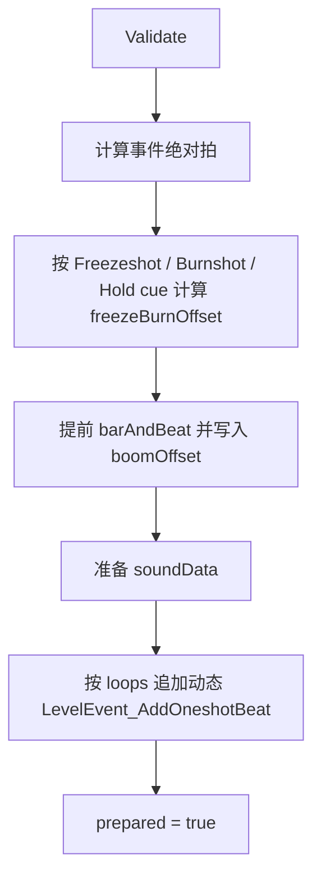

# AddOneshotBeat

`LevelEvent_AddOneshotBeat` 是 Oneshot 节拍事件。它支持普通 Oneshot、Square、Triangle、Heart、Freezeshot、Burnshot、Skipshot、Hold、循环和自定义击打声音，是行与节拍系统里字段最多的事件之一。

## 基本信息

| 项目 | 内容 |
| --- | --- |
| 事件类型 | `LevelEventType.AddOneshotBeat` |
| 事件类 | `LevelEvent_AddOneshotBeat` |
| 面板类 | `InspectorPanel_AddOneshotBeat` |
| 时间线控件 | `LevelEventControl_AddClassicBeat` |
| 源码 | `RDFucked/Assets/Scripts/Assembly-CSharp/RDLevelEditor/LevelEvent_AddOneshotBeat.cs` |
| 面板源码 | `RDFucked/Assets/Scripts/Assembly-CSharp/RDLevelEditor/InspectorPanel_AddOneshotBeat.cs` |
| 继承 | `LevelEvent_Base` |
| 执行时机 | `LevelEventExecutionTime.OnPrebar` |
| 房间使用 | `RoomsUsage.NotUsed` |

## 字段

| 字段 | 类型 | 作用 |
| --- | --- | --- |
| `soundData` | `SoundData` | 由 `sound` 转换得到的运行时声音数据 |
| `boomOffset` | `float` | Freezeshot、Burnshot、Hold cue 改写事件起点后留下的偏移 |
| `_absoluteClapPos` | `float` | `absoluteClapPos` 的缓存 |
| `prebarAudioSrcs` | `List<AudioSource>` | `RunPrebar` 中播放的预备音频源，条件失败时会被静音 |

## 属性

| 属性 | 类型 | 默认值 | 序列化 | 作用 |
| --- | --- | --- | --- | --- |
| `pulseType` | `OneshotPulseType` | 枚举默认值 | 是 | Oneshot 类型，决定 Wave、Square、Triangle、Heart 等表现 |
| `freezeBurnMode` | `FreezeBurnMode` | 枚举默认值 | 是 | Freezeshot 或 Burnshot 模式 |
| `interval` | `float` | `2f` | 是 | 循环、Hold、Skipshot、Freeze/Burn cue 使用的间隔 |
| `tick` | `float` | `1f` | 是 | 从事件开始到击打点的节拍长度 |
| `delay` | `float` | `0f` | 是 | Freezeshot 延迟，非 Freezeshot 时会被重置为 0 |
| `loops` | `int` | `0` | 是 | 除当前事件外额外生成的循环 Oneshot 数量 |
| `subdivisions` | `int` | `0` | 是 | Square/Triangle 的细分数 |
| `subdivSound` | `bool` | `true` | 是 | 细分节拍是否使用专用声音 |
| `skipshot` | `bool` | `false` | 是 | 是否启用 Skipshot |
| `hold` | `bool` | `false` | 是 | 是否启用 Hold |
| `holdCue` | `HoldCueType` | 枚举默认值 | 是 | Hold 提示音的早晚规则 |
| `subdivTickOverride` | `float` | `0f` | 是 | Burnshot Triangle 的细分 tick 覆盖值 |
| `sound` | `SoundDataStruct?` | `Shaker` | 是 | 自定义击打声音，带 `Sound` 控件属性 |
| `absoluteClapPos` | `float` | 缓存计算 | 否 | 通过 `bar`、`beat` 和 `clapPosition` 换算绝对拍 |
| `actualDelay` | `float` | 计算值 | 否 | Freezeshot 返回 `delay`，其他模式返回 0 |
| `clapPosition` | `float` | 计算值 | 否 | `interval * loops + boomOffset + tick + actualDelay` |

## 条件显示方法

这些方法被 `JsonProperty` 的条件参数使用，控制自动属性或面板字段是否显示。

| 方法 | 返回条件 |
| --- | --- |
| `EnableFreezeBurnModeIf()` | `freezeBurnMode != FreezeBurnMode.None` |
| `EnableIntervalIf()` | `interval > 0`，并按 loops、Freeze/Burn、Skipshot、Hold 决定是否显示 |
| `EnableDelayIf()` | `freezeBurnMode == FreezeBurnMode.Freezeshot` |
| `EnableLoopIf()` | `loops > 0` |
| `EnableSubdivisionsIf()` | `pulseType` 为 Square 或 Triangle |
| `EnableSubdivTickOverrideIf()` | `subdivTickOverride > 0` |
| `EnableSkipshotIf()` | `skipshot` |
| `EnableHoldIf()` | `hold` |

## Validate

`Validate()` 在编码、准备和面板保存时都会参与修正字段。

| 字段 | 修正规则 |
| --- | --- |
| `loops` | 小于 0 时修正为 0 |
| `delay` | Freezeshot 且 `delay <= 0` 时设为 `0.5f`；非 Freezeshot 时设为 0 |
| `tick` | 小于 0 时修正为 0 |
| `interval` | Freeze/Burn、循环、Skipshot、Hold 任一启用时限制为不小于 0；否则设为 `2f * tick` |
| `subdivisions` | Square 固定为 1；Triangle 限制在 1 到 10；其他类型设为 0 |
| `subdivTickOverride` | 只有 Burnshot 且 `subdivisions > 1` 时保留，否则设为 0 |

## Decode

`Decode(Dictionary<string, object> dict)` 处理旧字段和旧版本数据。

| 情况 | 行为 |
| --- | --- |
| 存在 `squareSound` | 改写为 `subdivSound` |
| Burnshot 且 `delay > 0` | 从 `tick` 中扣除 `delay`，再把 `delay` 设为 0 |
| 无 Freeze/Burn 且 `delay > 0` | 转成 Freezeshot，调整 `interval` 和 `beat` |
| 版本小于 59 且普通 Skipshot interval 为 2 | 把 `interval` 改成 `tick * 2f` |
| 解码末尾 | 调用 `Validate()` |

## Prepare

`Prepare()` 负责运行前修正事件时间、准备声音，并按循环数动态追加事件。

动态追加的循环事件会复制 `tick`、`pulseType`、`subdivisions`、`row`、`delay`、`freezeBurnMode`、`interval`、`subdivSound`、`boomOffset`、`hold` 等字段，并写入 `level.dynamicallyAddedEvents`。

## RunPrebar

`RunPrebar()` 执行预备音频和细分提示。

| 分支 | 行为 |
| --- | --- |
| 行 `muteBeats` | 直接返回 |
| `skipshot` | 对所有能接收该行节拍的行播放 Skipshot cue |
| Square/Triangle | 对所有能接收该行节拍且开启计数声音的行，调度细分聚光灯并播放计数声音 |
| Freezeshot | 计数偏移会扣除 `interval - tick` |
| Burnshot | 计数偏移会扣除 `interval` |

`PlayCountingSound` 使用目标行的 `countingSounds[subdivisions - 1]`，并按行声像设置 pan。`PlaySkipshotCue` 使用 `RDGameSounds.Get(GameSoundType.Skipshot)`。

## Run

`Run()` 通过 `RunOnBeat` 在目标节拍生成 Oneshot。

| 分支 | 行为 |
| --- | --- |
| 行过滤 | 遍历 `game.rows`，只处理 `RowGetsBeat(row, i, tag)` 且未 muted 的行 |
| 自定义声音 | 默认使用 `soundData.filename`；Square 且 `subdivSound` 时使用 `sndSquareshot` |
| Triangle | 为每个细分调用 `level.AddBeatOneshot`，建立 `subdivBuddies`，并调度 `AdvanceSubdiv` |
| 非 Triangle | 调用一次 `level.AddBeatOneshot` |
| Square | 调度一次 `AdvanceSubdiv` |
| Skipshot | 在 `clapPosition` 附近调度 `oneshotRowController.PlaySkipshotAnimation` |
| Hold | 按 `holdCue` 和 `interval` 计算 hold 提示偏移与持续时间 |

## 面板读写

`InspectorPanel_AddOneshotBeat` 是手工面板，它直接把 UI 控件读写到事件字段。

| UI 控件 | 写回字段 |
| --- | --- |
| `tick` | `tick` 或 `subdivTickOverride` |
| `useSubdiv`、`heartshot` | `pulseType` |
| `freezeshot`、`burnshot` | `freezeBurnMode` |
| `subdivisions` | `subdivisions` |
| `skipshot` | `skipshot` |
| `heldshot` | `hold` |
| `loopInterval` | `interval` |
| `loops` | `loops` |
| `delay` | `delay` |
| `subdivSound` | `subdivSound` |
| `holdCue` | `holdCue` |
| `beatsound` | `sound` |

保存后会调用 `Validate()`、`CapXPosForPositiveFreezeBurnCueTime()`，然后刷新 UI。

## 时间线显示

`LevelEventControl_AddClassicBeat` 同时负责 Classic、Oneshot、FreeTime、PulseFreeTime 的时间线显示。对于 `AddOneshotBeat`，它会根据 `loops`、`interval`、`tick`、`delay`、`freezeBurnMode`、`skipshot`、`hold`、`subdivisions` 绘制：

- 绿色预备脉冲。
- 蓝色 Freezeshot 脉冲。
- 橙色细分脉冲。
- 黄色击打脉冲。
- Hold、Skipshot、细分条。
- 循环控制图形。

## 编辑器操作

| 方法 | 行为 |
| --- | --- |
| `Clone()` | 按 `loopInterval` 创建一个后续 Oneshot 事件并选中 |
| `SwitchControlToSetOneshotWave()` | 把当前控件类型切换为 `SetOneshotWave` |
| `BreakIntoOneshotBeats()` | 把循环 Oneshot 拆成多个独立 `LevelEvent_AddOneshotBeat`，再删除原控件 |
| `CreateNurseCue()` | 按当前 Oneshot 参数创建护士语音 cue |
| `CapXPosForPositiveFreezeBurnCueTime()` | 在编辑器时间线上限制 Freeze/Burn cue 的位置，使 cue 时间不为负 |

## 相关页面

| 页面 | 关系 |
| --- | --- |
| [行与节拍事件](/api/editor-events/row-events.md) | 所属事件分组 |
| [Inspector 面板读写链路](/api/editor-events/inspector-flow.md) | 面板保存与显示机制 |
| [事件运行路径](/api/editor-events/runtime-flow.md) | `RunPrebar`、`Run` 和按节拍调度机制 |
| [事件覆盖清单](/api/editor-events/event-coverage.md) | 事件覆盖状态 |
