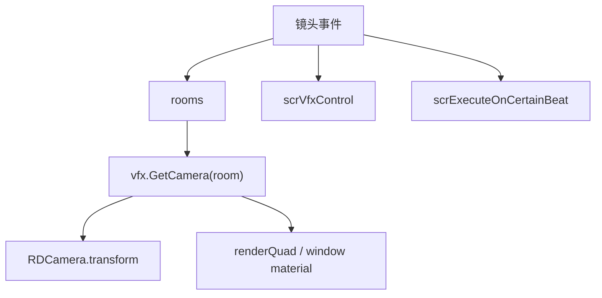

# 镜头与震屏事件

本页深写 `MoveCamera`、`ShakeScreen`、`PulseCamera` 和 `ShakeScreenCustom`。这组事件负责房间相机的位置、缩放、旋转、脉冲和震动。

## 事件总览

| 事件 | 事件类 | Inspector 面板 | 执行时机 | 主要职责 |
| --- | --- | --- | --- | --- |
| `MoveCamera` | `LevelEvent_MoveCamera` | `InspectorPanel_MoveCamera` | `OnBar` | 移动、缩放、旋转房间相机或 render quad 材质 |
| `ShakeScreen` | `LevelEvent_ShakeScreen` | `InspectorPanel_ShakeScreen` | `OnBar` | 使用 Low、Medium、High 三档预设震屏 |
| `PulseCamera` | `LevelEvent_PulseCamera` | `InspectorPanel_PulseCamera` | `OnBar` | 按频率投递多次镜头脉冲 |
| `ShakeScreenCustom` | `LevelEvent_ShakeScreenCustom` | `InspectorPanel_ShakeScreenCustom` | `OnBar` | 使用自定义时长、振幅、频率和震动类型 |

四个事件都使用 `RoomsUsage.ManyRoomsAndOnTop`，因此可以作用于多个房间，也能指向 `OnTop` 层。

## MoveCamera 基本信息

| 项目 | 内容 |
| --- | --- |
| 源码 | `RDFucked/Assets/Scripts/Assembly-CSharp/RDLevelEditor/LevelEvent_MoveCamera.cs` |
| 继承 | `LevelEvent_Base` |
| 接口 | `IDurationHaver` |
| 房间用法 | `RoomsUsage.ManyRoomsAndOnTop` |
| 排序偏移 | `-10` |

`MoveCamera` 有两条运行路径：普通相机移动直接操作 `RDCamera.transform`；render quad 或窗口内容移动则操作材质上的 `_PosX`、`_PosY`、`_Angle` 和 `_Scale`。

## MoveCamera 字段与属性

| 名称 | 类型 | 默认值 | 控件 | 作用 |
| --- | --- | --- | --- | --- |
| `legacyOnTopMovement` | `bool` | 解码时设置 | 不直接序列化 | 记录版本号小于 53 的旧 `OnTop` 移动行为 |
| `cameraPosition` | `Float2?` | `(50, 50)` | `PositionPicker` | 镜头或材质偏移位置 |
| `zoom` | `int?` | `100` | `InputField`，单位 `%` | 镜头缩放百分比 |
| `angle` | `float?` | `0` | `InputField`，单位 degrees | 镜头或材质旋转角度 |
| `duration` | `float` | `1` | `InputField`，单位 beats | 动画持续拍数 |
| `ease` | `Ease` | 枚举默认值 | 自动枚举控件 | DOTween 缓动类型 |
| `realMovement` | `bool` | `false` | 高级模式字段 | 切换到真实相机移动 |
| `window` | `int` | `-1` | 条件字段 | `realMovement` 开启时指向窗口 dancer |

## MoveCamera 条件与验证

| 方法 | 行为 |
| --- | --- |
| `EnableRealMovementIf()` | 返回 `RDBase.isAdvanced`，高级模式下显示 `realMovement` |
| `EnableRealMovementWindowIf()` | `realMovement` 为真且 `window != -1` 时显示窗口字段 |
| `SaveRealMovementIf()` | 只有 `realMovement` 为真时保存该字段 |
| `Validate()` | 限制 `zoom` 到 1 到 9999，限制 `angle` 到 -9999 到 9999；非真实移动时限制位置到 -100 到 200 |

`Decode()` 会处理旧版本数据：版本号小于 25 时设置 `room = 4`；版本号小于 53 时 `legacyOnTopMovement = true`。

## MoveCamera Run

`Run()` 在 `RunOnBeat()` 中执行。每个目标房间先通过 `base.vfx.GetCamera(room)` 取得 `RDCamera`，再用 `conductor.DurationBeatsToTime(beat - 1, duration)` 把拍数换算为秒。

### 真实相机路径

当目标是 `OnTop`，或 `realMovement` 开启且 `window == -1` 时，事件直接操作 `RDCamera.transform`。

| 属性 | 行为 |
| --- | --- |
| `cameraPosition.x` | kill `quad_MoveXTween`，再 `DOLocalMoveX(RDWidth * x / 100, seconds)` |
| `cameraPosition.y` | kill `quad_MoveYTween`，再 `DOLocalMoveY(RDHeight * y / 100, seconds)` |
| `angle` | 调用 `camera.Rotate(angle, seconds, ease)` |
| `zoom` | 调用 `camera.Zoom(zoom / 100f, seconds, ease)` |

`legacyOnTopMovement` 为真时，会先对 `camera.transform` 执行 `DOKill()`，清掉旧版本 OnTop 移动残留的 tween。

### 材质路径

其他情况下，事件操作房间 render quad 或窗口 dancer 材质。

| 属性 | 材质字段 | 换算 |
| --- | --- | --- |
| `cameraPosition.x` | `_PosX` | `x / 100f - 0.5f` |
| `cameraPosition.y` | `_PosY` | `y / 100f - 0.5f` |
| `angle` | `_Angle` | `angle * PI / 180f` |
| `zoom` | `_Scale` | `zoom / 100f` |

这条路径不会直接移动相机 transform，而是改变房间或窗口内容的采样材质参数。

## ShakeScreen

| 项目 | 内容 |
| --- | --- |
| 源码 | `RDFucked/Assets/Scripts/Assembly-CSharp/RDLevelEditor/LevelEvent_ShakeScreen.cs` |
| 继承 | `LevelEvent_Base` |
| 事件类型 | 预设震屏 |

### 属性

| 名称 | 类型 | 默认值 | 控件 | 作用 |
| --- | --- | --- | --- | --- |
| `shakeLevel` | `StrengthLevel` | `Medium` | `Slider` | 震屏强度档位 |
| `shakeType` | `EditorShakeType` | 枚举默认值 | `Dropdown` | `Normal`、`Smooth` 或 `Rotate` |

### 强度映射

| `shakeLevel` | `amount` | `smoothDuration` | `smoothStrength` |
| --- | --- | --- | --- |
| `Low` | `5` | `0.3` | `2` |
| `Medium` | `10` | `0.6` | `3` |
| `High` | `20` | `1` | `4` |

当 `shakeType == Normal` 时，事件会读取关卡级别的 `level.smoothShake` 和 `level.rotateShake`。前者会把类型切到 `Smooth`，后者会把类型切到 `Rotate`。

| 最终类型 | 调用 |
| --- | --- |
| `Smooth` | `vfx.ShakeCamSmooth(smoothDuration, smoothStrength, room)` |
| `Rotate` | `vfx.ShakeCamRotate(smoothDuration, smoothStrength, room)` |
| `Normal` | `vfx.ShakeCam(15, amount, room)` |

## PulseCamera

| 项目 | 内容 |
| --- | --- |
| 源码 | `RDFucked/Assets/Scripts/Assembly-CSharp/RDLevelEditor/LevelEvent_PulseCamera.cs` |
| 继承 | `LevelEvent_Base` |
| 事件类型 | 镜头脉冲 |

### 属性

| 名称 | 类型 | 默认值 | 控件 | 作用 |
| --- | --- | --- | --- | --- |
| `strength` | `int` | `1` | `Slider` | 脉冲缩放强度，范围 0 到 2 |
| `count` | `int` | `1` | `InputField`，单位 pulses | 脉冲次数 |
| `frequency` | `float` | `1` | `InputField`，单位 beats | 相邻脉冲之间的拍数间隔 |

### 运行逻辑

`Run()` 会先计算 `pulseTime = Min(0.3f, frequency)`，再把 `strength` 转为缩放量。

| `strength` | `zoom` |
| --- | --- |
| `0` | `0.03` |
| `1` | `0.1` |
| `2` | `0.2` |

之后 `frequency` 会被限制到不小于 `0.001`。每个房间、每次脉冲都会调用 `scrExecuteOnCertainBeat.Add()`，在 `beat - 1 + frequency * index` 触发 `rdCamera.PulseCamera(zoom, pulseTime)`。

## ShakeScreenCustom

| 项目 | 内容 |
| --- | --- |
| 源码 | `RDFucked/Assets/Scripts/Assembly-CSharp/RDLevelEditor/LevelEvent_ShakeScreenCustom.cs` |
| 继承 | `LevelEvent_Base` |
| 事件类型 | 参数化震屏 |

### 属性

| 名称 | 类型 | 默认值 | 控件 | 作用 |
| --- | --- | --- | --- | --- |
| `shakeType` | `EditorShakeType` | 枚举默认值 | `Dropdown` | `Normal`、`Smooth`、`Rotate` 或 `BassDrop` |
| `duration` | `float` | `0.5` | `InputField` | 持续时间；单位由 `useBeats` 决定 |
| `amplitude` | `float` | `1` | 自动数值控件 | 振幅，范围 0 到 50 |
| `frequency` | `float` | `10` | 条件数值控件 | 频率，范围 0 到 50 |
| `fadeOut` | `bool` | `false` | `Checkbox` | Smooth 和 Rotate 模式下是否衰减 |
| `useBeats` | `bool` | `false` | `Checkbox` | 为真时把 `duration` 当作 beat 数换算为秒 |

### 条件字段

| 方法 | 行为 |
| --- | --- |
| `EnableFrequencyIf()` | `shakeType != Normal` 时显示 `frequency` |
| `EnableFadeOutIf()` | `shakeType == Smooth` 或 `shakeType == Rotate` 时显示 `fadeOut` |

### 运行逻辑

`duration <= 0` 时直接结束。否则先计算秒数：`useBeats` 为真时使用 `conductor.DurationBeatsToTime(beat - 1, duration)`，为假时直接使用 `duration`。

| `shakeType` | 调用 |
| --- | --- |
| `Smooth` | 清理平滑震动，再用 `DOShakePosition(secs, Vector3(amplitude, amplitude, 0), frequency * 10, 90, false, fadeOut)` |
| `Rotate` | 清理旋转震动，再用 `DOShakeRotation(secs, amplitude, frequency * 10, 90, fadeOut)` |
| `BassDrop` | `vfx.BassDropNew(room, amplitude, secs, secs * 1.5f, RoundToInt(frequency))` |
| `Normal` | `cam.ShakeWithDuration(secs, RoundToInt(amplitude))` |

`InspectorPanel_ShakeScreenCustom` 只覆盖属性面板的单位显示：当 `useBeats` 为真时，`duration` 单位显示为 beats；否则显示秒。

## 调用关系

## 使用边界

| 需求 | 对应事件 |
| --- | --- |
| 持续移动、缩放、旋转镜头 | `MoveCamera` |
| 快速使用三档震屏 | `ShakeScreen` |
| 按拍数做重复镜头脉冲 | `PulseCamera` |
| 精确控制震动时长、振幅、频率和衰减 | `ShakeScreenCustom` |

`MoveCamera` 的 `realMovement` 会改变操作对象：不开启时主要改变房间或窗口显示材质，开启后可以直接移动相机或窗口内容。
