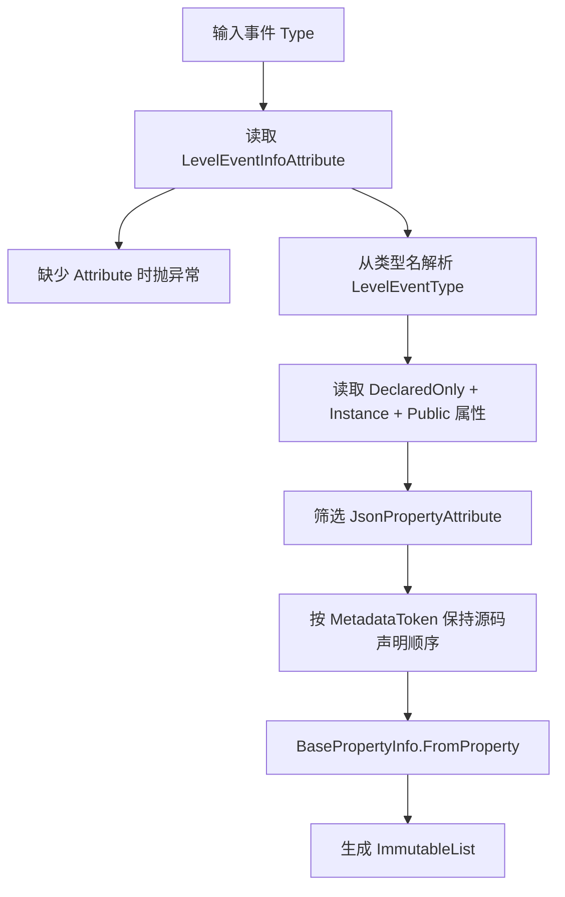

# LevelEventInfo 与 LevelEventInfoAttribute

## 基本信息

| 项目 | 内容 |
| --- | --- |
| `LevelEventInfo` 源码路径 | `RDFucked/Assets/Scripts/Assembly-CSharp/RDLevelEditor/LevelEventInfo.cs` |
| `LevelEventInfoAttribute` 源码路径 | `RDFucked/Assets/Scripts/Assembly-CSharp/LevelEventInfoAttribute.cs` |
| 命名空间 | `RDLevelEditor`；`LevelEventInfoAttribute` 位于全局命名空间并引用 `RDLevelEditor` |
| 角色 | 描述 `LevelEvent_*` 的事件类型、执行时机、行控制、房间使用方式和事件属性列表 |

具体事件类通过 `[LevelEventInfo(...)]` 标记基础行为。`LevelEventInfo` 在运行时接收事件 `Type`，读取这个 Attribute，并反射收集该事件类声明的公开实例属性，生成 `BasePropertyInfo` 列表。

## LevelEventInfo 字段与属性

| 名称 | 类型 | 作用 |
| --- | --- | --- |
| `eventTypeEnum` | `LevelEventType` | 由类型名 `RDLevelEditor.LevelEvent_` 后缀解析得到的事件枚举。 |
| `attribute` | `LevelEventInfoAttribute` | 事件类上标记的基础元数据。 |
| `propertiesInfo` | `ImmutableList<BasePropertyInfo>` | 当前事件声明的、带 `JsonPropertyAttribute` 的公开实例属性描述。 |
| `name` | `string` | 返回 `eventTypeEnum.ToString()`。 |
| `usesRow` | `bool` | `attribute.defaultRow != -10` 时为 `true`。 |
| `showsRowControl` | `bool` | `usesRow` 为真，且事件不是 `AddClassicBeat`、`AddOneshotBeat`、`AddFreeTimeBeat`、`SetRowXs`、`SetOneshotWave` 时为真。 |

## LevelEventInfo 构造流程

`propertiesInfo` 只收集当前事件类自己声明的公开实例属性，不包含父类属性。事件通用字段由 `LevelEvent_Base` 负责。

## LevelEventInfoAttribute 字段

| 名称 | 类型 | 默认值 | 作用 |
| --- | --- | --- | --- |
| `executionTime` | `LevelEventExecutionTime` | `OnBar` | 默认执行时机。 |
| `sortOffset` | `int` | `0` | 事件排序偏移。 |
| `usesBar` | `bool` | `true` | 编码、解码和面板是否使用小节。 |
| `usesBeat` | `bool` | `true` | 编码、解码和面板是否使用节拍。 |
| `usesType` | `bool` | `true` | 公共编码中是否写入事件类型。 |
| `defaultRow` | `int` | `-10` | 默认行号；`-10` 表示不使用行，`-1` 表示所有行。 |
| `usesTargetId` | `bool` | `false` | 是否使用 `target` 字段代替编辑器纵向位置。 |
| `roomsUsage` | `RoomsUsage` | `NotUsed` | 事件如何使用 `rooms` 数组。 |
| `constantConditionalsOnly` | `bool` | `false` | 条件面板是否只允许常量条件。 |

## 相关枚举

### LevelEventExecutionTime

| 值 | 数字 | 作用 |
| --- | --- | --- |
| `OnPrebar` | `0` | 在小节预处理阶段运行。 |
| `OnBar` | `1` | 在小节内节拍调度阶段运行。 |

### RoomsUsage

| 值 | 数字 | 作用 |
| --- | --- | --- |
| `NotUsed` | `0` | 事件不使用房间数组。 |
| `OneRoom` | `1` | 事件作用于单个房间。 |
| `ManyRooms` | `2` | 事件作用于多个普通房间。 |
| `ManyRoomsAndOnTop` | `3` | 事件作用于多个房间并允许 OnTop 选项。 |
| `OneRoomOrOnTop` | `4` | 事件作用于单房间或 OnTop。 |

### Tab

| 值 | 数字 | 作用 |
| --- | --- | --- |
| `None` | `-1` | 无标签页。 |
| `Song` | `0` | 歌曲标签页。 |
| `Rows` | `1` | 行标签页。 |
| `Actions` | `2` | 动作标签页。 |
| `Rooms` | `3` | 房间标签页。 |
| `Sprites` | `4` | 精灵标签页。 |
| `Windows` | `5` | 窗口标签页。 |

## LevelEventType 范围

`LevelEventType` 从 `None = 0` 到 `HideWindow = 80`。事件类命名遵循 `LevelEvent_` 加枚举名，例如 `LevelEvent_PlaySong` 对应 `LevelEventType.PlaySong`。

| 范围 | 代表类型 |
| --- | --- |
| 歌曲与节拍 | `PlaySong`、`SetCrotchetsPerBar`、`SetBeatsPerMinute`、`PlaySound`、`SetBeatSound` |
| 行与玩家 | `AddClassicBeat`、`AddOneshotBeat`、`AddFreeTimeBeat`、`PulseFreeTimeBeat`、`MoveRow`、`TintRows` |
| 视觉与镜头 | `SetTheme`、`SetVFXPreset`、`Flash`、`MoveCamera`、`ShakeScreen`、`InvertColors` |
| 文本与叙事 | `ShowDialogue`、`FloatingText`、`AdvanceText`、`ReadNarration`、`NarrateRowInfo` |
| 房间与精灵 | `ShowRooms`、`MoveRoom`、`MakeSprite`、`Move`、`Tint`、`Tile` |
| 窗口 | `WindowResize`、`SetWindowContent`、`ReorderWindows`、`RenameWindow`、`HideWindow` |
| 控制与脚本 | `TagAction`、`CallCustomMethod`、`FinishLevel`、`Comment` |

## 与其他类型的关系

| 类型 | 关系 |
| --- | --- |
| `LevelEvent_Base` | 构造函数读取 `GC.levelEventsInfo[type]`，初始化执行时机、排序、房间和行。 |
| `BasePropertyInfo` | `LevelEventInfo` 通过 `BasePropertyInfo.FromProperty` 生成事件专属属性描述。 |
| `InspectorPanel` | 自动面板读取 `levelEventInfo.propertiesInfo` 创建属性控件。 |
| `RDEditorConstants.levelEventTabs` | `LevelEvent_Base.defaultTab` 和 `InspectorPanel.Localize` 用它定位事件标签页。 |

