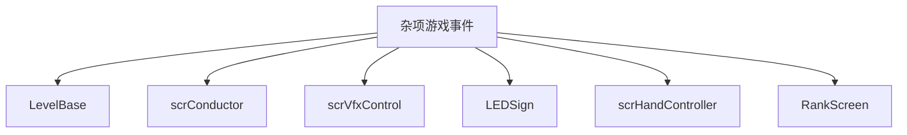

# 杂项游戏事件

本页深写 `SetHeartExplodeVolume`、`SetHeartExplodeInterval`、`SayReadyGetSetGo`、`BassDrop`、`ShowStatusSign`、`FinishLevel`、`SetHandOwner` 和 `SetPlayStyle`。这些事件分布在爆心、RDGS 语音、状态牌、关卡完成、手部归属和播放风格控制中。

## 事件总览

| 事件 | 事件类 | 执行时机 | 主要职责 |
| --- | --- | --- | --- |
| `SetHeartExplodeVolume` | `LevelEvent_SetHeartExplodeVolume` | `OnPrebar` | 设置爆心音量倍率 |
| `SetHeartExplodeInterval` | `LevelEvent_SetHeartExplodeInterval` | `OnPrebar` | 设置爆心间隔类型和 beat 间隔 |
| `SayReadyGetSetGo` | `LevelEvent_SayReadyGetSetGo` | `OnBar`，预备音在 `RunPrebar()` | 播放 ready/get/set/go、count 和口令语音 |
| `BassDrop` | `LevelEvent_BassDrop` | `OnBar` | 对目标房间触发 BassDrop VFX |
| `ShowStatusSign` | `LevelEvent_ShowStatusSign` | `OnBar` | 显示状态牌文字并按设置朗读 |
| `FinishLevel` | `LevelEvent_FinishLevel` | `OnBar` | 进入结算或 gameover 推进 |
| `SetHandOwner` | `LevelEvent_SetHandOwner` | `OnBar` | 改变手部所属角色 |
| `SetPlayStyle` | `LevelEvent_SetPlayStyle` | `OnBar` | 设置下一小节和 conductor play style |

## SetHeartExplodeVolume

| 名称 | 类型 | 默认值 | 作用 |
| --- | --- | --- | --- |
| `volume` | `int` | `60` | 写入 `level.heartExplodeMultiplier = volume * 0.01f` |
| `description` | `bool` | `false` | Inspector 说明文本 |

`GetTooltipText()` 返回百分比字符串。

## SetHeartExplodeInterval

| 名称 | 类型 | 默认值 | 条件 | 作用 |
| --- | --- | --- | --- | --- |
| `intervalType` | `HeartExplodeType` | `GatherAndCeil` | 始终显示 | 爆心间隔类型 |
| `interval` | `float` | `1` | `intervalType != Disabled` | 爆心间隔 beat |

`Run()` 写入 `level.heartExplodeType` 和 `level.crotchetsToExplode`。

## SayReadyGetSetGo

| 名称 | 类型 | 默认值 | 作用 |
| --- | --- | --- | --- |
| `oneshotVoiceGroup` | `AudioMixerGroup` | 运行时获取 | RDGS voice mixer group |
| `oneshotClicksGroup` | `AudioMixerGroup` | 运行时获取 | RDGS click mixer group |
| `phraseToSay` | `OneshotPhraseToSay` | 枚举默认值 | 要播放的短语或数字 |
| `voiceSource` | `GameVoiceSource` | `Nurse` | 语音来源 |
| `tick` | `float` | `1` | 分解短语间隔 beat |
| `volume` | `int` | `100` | 语音音量百分比 |
| `prebar` | `bool` | 运行时设置 | 当前是否处于 `RunPrebar()` |

`OnCreate()` 默认把 `room` 设为 4。`Decode()` 中，旧数据没有 `rooms` 时也设为 4。

### 编辑器转换按钮

| 方法 | 行为 |
| --- | --- |
| `BreakIntoSeparateEvents()` | 把组合短语拆成多个单词事件，按 `tick` 重新排布 beat，然后删除原事件 |
| `ChangeToSetCountSound()` | 对 Count 系列事件创建 `SetCountingSound`，根据 voiceSource 和目标行类型选择 counting voice |

### Prepare 与运行

`Prepare()` 会把组合短语拆成多个动态 `LevelEvent_SayReadyGetSetGo`，加入 `level.dynamicallyAddedEvents`。`RunPrebar()` 设置 `prebar = true`，`Run()` 设置 `prebar = false`，二者都调用 `RunInternal()`。

`RunInternal()` 会在 `level.noGetSet` 为假时按 `phraseToSay` 分发到 `SayRea()`、`SayDy()`、`SayGet()`、`SaySet()`、`SayGo()`、`SayCount()` 等方法。prebar 阶段播放 click 和 voice；非 prebar 阶段调用 `level.BeepReady/Get/Set/Go()`。

`GetWordSequence()` 定义组合短语展开规则，例如 `SayReaDyGetSetGoNew` 展开为 `JustSayRea`、`JustSayDy`、`JustSayGet`、`JustSaySet`、`JustSayGo`。

## BassDrop

| 名称 | 类型 | 默认值 | 作用 |
| --- | --- | --- | --- |
| `strength` | `StrengthLevel` | `High` | Low、Medium、High 三档 |
| `description` | `bool` | `false` | Inspector 说明文本 |

强度映射：

| `strength` | 数值 |
| --- | --- |
| `Low` | `0.15` |
| `Medium` | `0.4` |
| `High` | `1` |

`Run()` 对每个目标房间调用 `vfx.BassDropNew(room, strengthValue)`。

## ShowStatusSign

| 名称 | 类型 | 默认值 | 条件 | 作用 |
| --- | --- | --- | --- | --- |
| `text` | `string` | 空字符串 | 始终显示 | 状态牌文本，支持 `&#124;` 分段和 `[[key]]` 本地化 |
| `duration` | `float` | `4` | 始终显示 | 持续时间，单位由 `useBeats` 决定 |
| `useBeats` | `bool` | `true` | 始终显示 | 为真时把 duration 从 beat 换算成秒 |
| `narrate` | `bool` | `true` | Narration 可用 | 是否朗读 |

版本号不高于 50 的数据会把 `narrate` 设为 false。`Run()` 在 scrub 时返回；之后处理本地化片段和 `{}` 变量，最后调用 `game.statusText.SetStatusText(text, null, duration, narrateFlag)`。外部自定义关卡且强制朗读开启时，也会朗读。

## FinishLevel

`FinishLevel` 只有说明字段。`Run()` 在 beat 上调用：

```csharp
game.rankscreen.AdvanceGameover()
```

## SetHandOwner

| 名称 | 类型 | 默认值 | 作用 |
| --- | --- | --- | --- |
| `hand` | `Hand` | `Right` | 左手、右手或双手 |
| `character` | `Character` | `Player` | 手部归属角色 |

`Run()` 对每个目标房间取得对应 `scrHandController`。目标手匹配左手时调用 `leftArm.SetToCharacter(character)`，匹配右手时调用 `rightArm.SetToCharacter(character)`。

## SetPlayStyle

| 名称 | 类型 | 默认值 | 条件 | 作用 |
| --- | --- | --- | --- | --- |
| `nextBar` | `int` | `1` | 私有字段 | 下一小节值 |
| `relative` | `bool` | `true` | 公共字段 | `NextBar` 是否相对当前 bar |
| `playStyle` | `PlayStyleChange` | `Normal` | 始终显示 | Normal、Loop、Prolong、Immediately 等 |
| `NextBar` | `int` | `nextBar` | `playStyle != Loop` | 绝对或相对下一小节 |
| `Relative` | `bool` | `relative` | `playStyle != Loop` | 切换相对/绝对模式 |

`NextBar` setter 在非相对模式下把值限制到至少 1，并在值被修正时刷新 Inspector。`Run()` 中，相对模式调用 `currentLevel.SetNextBarRelative(nextBar)`，绝对模式调用 `currentLevel.SetNextBar(nextBar)`，随后调用 `conductor.SetPlayStyle(playStyle)`。

## 调用关系


