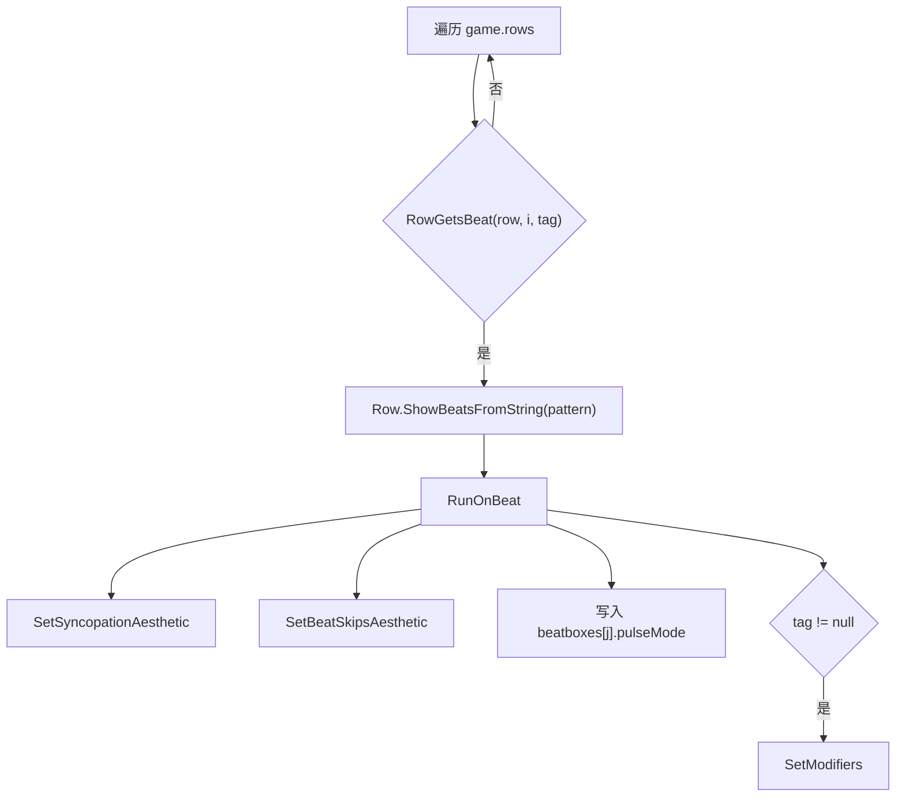

# SetRowXs

`LevelEvent_SetRowXs` 用来设置行的 X pattern、Synco 位置和 Synco 提示音参数。它会影响 Classic 节拍的显示、行节拍跳过、切分提示和 Synco 美术表现。

## 基本信息

| 项目 | 内容 |
| --- | --- |
| 事件类型 | `LevelEventType.SetRowXs` |
| 事件类 | `LevelEvent_SetRowXs` |
| 面板类 | `InspectorPanel_SetRowXs` |
| 时间线控件 | `LevelEventControl_SetRowXs` |
| 源码 | `RDFucked/Assets/Scripts/Assembly-CSharp/RDLevelEditor/LevelEvent_SetRowXs.cs` |
| 面板源码 | `RDFucked/Assets/Scripts/Assembly-CSharp/RDLevelEditor/InspectorPanel_SetRowXs.cs` |
| 控件源码 | `RDFucked/Assets/Scripts/Assembly-CSharp/RDLevelEditor/LevelEventControl_SetRowXs.cs` |
| 继承 | `LevelEvent_Base` |
| 执行时机 | `LevelEventExecutionTime.OnBar` |
| 排序偏移 | `-1` |
| 房间使用 | `RoomsUsage.NotUsed` |

## 属性

| 属性 | 类型 | 默认值 | 序列化 | 作用 |
| --- | --- | --- | --- | --- |
| `pattern` | `string` | `------` | 是 | 行 beatbox 的 X pattern，`x` 表示跳过或禁用对应 beatbox |
| `syncoBeat` | `int` | `-1` | 是 | Synco 所在 pulse 索引，`-1` 表示关闭 |
| `syncoSwing` | `float` | `0f` | 是 | Synco Swing 偏移，限制在 0 到 1 |
| `syncoVolume` | `int` | `70` | 是 | Synco 提示声音量百分比 |
| `syncoPitch` | `int` | `100` | 是 | Synco 提示音高百分比 |
| `syncoStyle` | `SyncoStyle` | 枚举默认值 | 是 | Synco cue 样式 |
| `syncoPlayModifierSound` | `bool` | `true` | 是 | Chirp 样式下是否播放开启提示音 |
| `syncoPlayModifierOffSound` | `bool` | `true` | 是 | Chirp 样式下是否播放关闭提示音 |

## 条件显示方法

| 方法 | 返回条件 |
| --- | --- |
| `EnableIfSynco()` | `syncoBeat >= 0` |
| `EnableIfSyncoChirp()` | `syncoBeat >= 0` 且 `syncoStyle == SyncoStyle.Chirp` |
| `EnableIfPlayModifierSound()` | `syncoPlayModifierSound` |

## Decode

`Decode(Dictionary<string, object> dict)` 负责兼容旧版本 Synco 字段。

| 关卡版本 | 行为 |
| --- | --- |
| `<= 57` | 把 `syncoVolume` 设为 0，并关闭 `syncoPlayModifierSound`、`syncoPlayModifierOffSound` |
| `<= 63` | 若存在 `syncoPlayModifierSound`，把它复制到 `syncoPlayModifierOffSound`；否则关闭 off sound |
| 其他 | 直接交给基类解码 |

## Validate

| 字段 | 修正规则 |
| --- | --- |
| `syncoSwing` | 限制在 0 到 1 之间 |

## RunPrebar

`RunPrebar()` 在小节前设置运行时行修饰，并处理 Chirp 样式提示音。

| 分支 | 行为 |
| --- | --- |
| `tag == null` | 遍历所有运行时行，对能接收当前行节拍的行调用 `SetModifiers` |
| `syncoBeat >= 0` | 写入行的 `syncoVolume` 和 `syncoPitch` |
| `syncoStyle != Chirp` | 不播放 modifier on/off 提示音 |
| `syncoStyle == Chirp` 且开启 Synco | 在目标拍播放 `sndSyncoModifierOn`，并记录是否需要 off sound |
| `syncoStyle == Chirp` 且关闭 Synco | 如果行上记录了 off sound，就播放 `sndSyncoModifierOff` |

Chirp 提示音通过 `conductor.PlayBeat` 播放，使用 `CuesoundsParent` 混音组，并乘上行音量、行音高和行声像。

## Run

`Run()` 负责更新运行时行的美术状态和 beatbox pulse 模式。

`tag != null` 时，`RunPrebar` 不会提前对所有行调用 `SetModifiers`，所以 `Run()` 会在按拍执行时补上运行修饰。

## SetModifiers

`SetModifiers(Row prop)` 写入三个运行时状态：

| 调用 | 作用 |
| --- | --- |
| `prop.SetSyncopationCueStyle(syncoStyle)` | 设置 Synco cue 样式 |
| `prop.SetSyncopation(syncoBeat, syncoSwing)` | 设置 Synco 位置和 Swing |
| `prop.SetBeatSkips(Row.ShowBeatsFromString(pattern))` | 按 pattern 设置跳过节拍 |

## Inspector 面板

`InspectorPanel_SetRowXs` 使用自动属性控件，但重写属性更新和保存。

| 方法 | 行为 |
| --- | --- |
| `UpdateUIProperties(LevelEvent_Base levelEvent)` | 把事件的 `syncoBeat` 写入 `PropertyControl_BeatModifiers`，再刷新所有属性 |
| `SaveProperties(LevelEvent_Base levelEvent)` | 从 `PropertyControl_BeatModifiers` 读回 `syncoBeat`；对 `syncoSwing` slider 设置吸附间隔；保存后刷新该行 Classic 控件 |

保存末尾会调用 `timeline.UpdateClassicControlsForRow(levelEvent_SetRowXs.row)`，因此 SetRowXs 会立即影响同一行 Classic 节拍在时间线上的显示。

## 时间线控件

`LevelEventControl_SetRowXs` 用 3 组图像显示 pattern 和 Synco：

| 字段 | 类型 | 作用 |
| --- | --- | --- |
| `Xs` | `Image[]` | pattern 中为 `x` 的位置显示 X |
| `syncoArrows` | `Image[]` | `syncoBeat` 对应位置显示 Synco 箭头 |
| `LineSegments` | `Image[]` | 非 Synco 位置显示连接线段 |

`UpdateUIInternal()` 会把控件放在事件的 `barAndBeat` 位置，Y 坐标按 `visualRowIndex` 计算，宽度固定为 28，高度为 `cellHeight`。随后遍历 `pattern` 字符串，同步 X、Synco 箭头和线段显示。

## 与其他事件的关系

| 事件 | 关系 |
| --- | --- |
| `AddClassicBeat` | Hold 且 `setXs` 非 `NoChange` 时，`Prepare()` 会创建配套 `SetRowXs` |
| `AddClassicBeat` | 拆成 FreeTime 时会读取最近的 `SetRowXs`，用于 Synco 偏移 |
| `AddFreeTimeBeat` / `PulseFreeTimeBeat` | 拆 Classic 后的目标事件，受 `SetRowXs` 的行修饰影响 |
| `AddOneshotBeat` | 同属行节拍系统，但不直接依赖 `SetRowXs` |

## 相关页面

| 页面 | 关系 |
| --- | --- |
| [行与节拍事件](/api/editor-events/row-events.md) | 所属事件分组 |
| [AddClassicBeat](/api/editor-events/AddClassicBeat.md) | 生成或读取 `SetRowXs` 的 Classic 事件 |
| [事件运行路径](/api/editor-events/runtime-flow.md) | `RunPrebar` 和 `Run` 调度机制 |
| [Inspector 面板读写链路](/api/editor-events/inspector-flow.md) | 面板保存与属性控件机制 |
