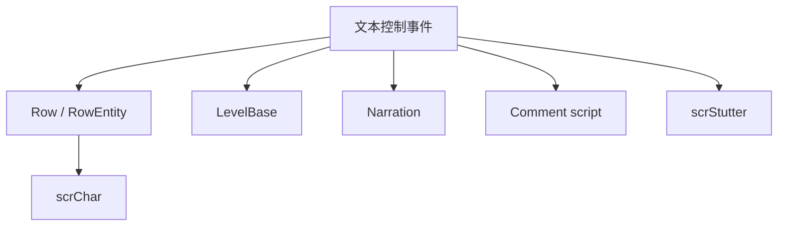

# 文本控制与脚本事件

本页深写 `PlayExpression`、`TextExplosion`、`Comment`、`CommentShow`、`TagAction`、`Stutter`、`ReadNarration`、`NarrateRowInfo` 和 `ChangeCharacter`。这组事件连接角色表情、文本显示、编辑器注释脚本、标签触发、房间 Stutter、旁白与换角色。

## 事件总览

| 事件 | 事件类 | 执行时机 | 主要职责 |
| --- | --- | --- | --- |
| `PlayExpression` | `LevelEvent_PlayExpression` | `OnBar` | 播放或替换行角色 expression |
| `TextExplosion` | `LevelEvent_TextExplosion` | `OnBar` | 在目标房间创建 20 个滚动文字爆炸 |
| `Comment` | `LevelEvent_Comment` | `OnBar` | 普通编辑器注释，或执行 `()=>` 注释脚本 |
| `CommentShow` | 无独立事件类 | 由 `Comment.show` 驱动 | 播放时显示注释面板 |
| `TagAction` | `LevelEvent_TagAction` | `OnBar` | 运行、启用或禁用标签事件 |
| `Stutter` | `LevelEvent_Stutter` | `OnBar` | 添加或取消房间 stutter |
| `ReadNarration` | `LevelEvent_ReadNarration` | `OnBar` | 朗读自定义文本 |
| `NarrateRowInfo` | `LevelEvent_NarrateRowInfo` | `OnBar`，预备音在 `RunPrebar()` | 朗读行连接、断开、在线等信息 |
| `ChangeCharacter` | `LevelEvent_ChangeCharacter` | `OnBar` | 切换行角色或自定义角色 |

## PlayExpression

| 名称 | 类型 | 默认值 | 条件 | 作用 |
| --- | --- | --- | --- | --- |
| `expression` | `string` | `neutral` | 始终显示 | 要播放或写入的表情动画名 |
| `replace` | `bool` | `false` | 始终显示 | 是否替换角色默认表情槽 |
| `targetExpression` | `OverrideExpression` | 枚举默认值 | `replace == true` | 被替换的表情槽 |

`Run()` 会 clamp 行索引，然后取得 `game.rows[row].ent.character`。`replace` 为真时，会根据 `targetExpression` 替换 `neutralAnimName`、`happyAnimName`、`barelyAnimName`、`missedAnimName`、`prehitAnimName` 或 `beepAnimName`。若当前表情就是被替换表情，事件会立即播放新表情。

非替换模式下直接调用：

```csharp
character.PlayExpression(expression, disableOverride: true, ignoreKeep: false, 1f, alreadyPrefixed: true)
```

当当前关卡 `shadowRowsCopyExpressions` 为真时，同一 host/shadow 关系的行也会播放同一个 expression。

## TextExplosion

| 名称 | 类型 | 默认值 | 作用 |
| --- | --- | --- | --- |
| `textExplosions` | `List<RDScrollyText>` | `Prepare()` 创建 | 缓存每个房间的滚动文字对象 |
| `textCount` | `const int` | `20` | 每个房间创建 20 个文字对象 |
| `text` | `string` | `Example` 或本地化示例 | 显示文本 |
| `color` | `ColorOrPalette` | `Color.black` | 文本颜色 |
| `mode` | `TextExplosionMode` | 枚举默认值 | 普通或随机颜色模式 |
| `direction` | `TextExplosionDirection` | 枚举默认值 | 滚动方向 |
| `speed` | `float` | `100` | 速度百分比 |
| `ease` | `Ease` | `Linear` | 缓动 |

`Prepare()` 对每个目标房间创建 20 个 `RDScrollyText`。`Run()` 中，Samurai 模式会把文本改为 `Samurai.`。随后事件转义文本，计算随机速度倍率和方向，再对每个 `RDScrollyText` 调用 `Setup(...).Run()`。

## Comment 与 CommentShow

| 名称 | 类型 | 默认值 | 作用 |
| --- | --- | --- | --- |
| `text` | `string` | 空值 | 注释文本或 `()=>` 脚本 |
| `color` | `ColorOrPalette` | 调色板第 10 项 | 注释背景颜色 |
| `show` | `bool` | `false` | 播放时是否显示注释面板 |

`Encode()` 会根据当前 tab 设置 `usesY = tab != Tab.Sprites`。`GetCommentColors()` 根据背景颜色亮暗返回文本色、背景色和轮廓色。

### 注释脚本

当文本以 `()=>` 开头时，`Run()` 会把它当成内置注释脚本。支持的命令包括：

| 命令 | 参数 | 行为 |
| --- | --- | --- |
| `create` | prefab, x, y | 从 `Resources/PublicPrefabs/` 实例化对象并移动到百分比坐标 |
| `freeze` | playStyle | 调用 `conductor.Freeze()` |
| `unfreeze` | playStyle | 调用 `conductor.SetPlayStyle()` |
| `setPlayStyle` | playStyle | 调用 `conductor.SetPlayStyle()` |
| `shockwave` | distortion/duration/size, value | 设置关卡 shockwave 倍率 |
| `roomOpacity` | room, opacity, duration | Tween 房间材质 `_Opacity` |
| `wavyRowsAmplitude` | room, amplitude, duration | Tween 房间 `wavyRowsAmplitude` |
| `trueCameraMove` | room, x, y, duration, ease | 直接移动房间相机 parent |
| `windowSize` | x, y, duration | 设置主窗口 dancer scale |
| `roomPeek` | room, enabled, update | 设置房间 peek window mode |

普通注释且 `show` 为真时，编辑器播放、非 scrub、并且 `commentPlaybackEnabled` 时会显示 `InspectorPanel_CommentShow`，写入注释文本、小节、节拍和颜色。

## TagAction

| 名称 | 类型 | 默认值 | 作用 |
| --- | --- | --- | --- |
| `action` | `TagAction` | 枚举默认值 | `Run`、`RunAll`、`RunRandom`、`Enable`、`Disable`、`EnableAll`、`DisableAll` |
| `tagName` | `string` | 空值 | 目标标签名，支持 `{}` 变量求值 |

`Run()` 会根据 `action` 分成运行标签和启停标签两类。运行标签时，为避免递归，若当前不是标签运行中，会分别调度非声音事件和声音事件；若已经处于标签运行中，则按 `runningTagEventType` 决定只运行声音或非声音。

`RunTag()` 先调用 `level.EvaluateCurlyBracketsInString(tagName)`，然后按 action 调用 `RunTagWithType()`、`RunTagContaining()`、`RunRandomTagWithType()`、`EnableTag()`、`DisableTag()`、`EnableTagsContaining()` 或 `DisableTagsContaining()`。

## Stutter

| 名称 | 类型 | 默认值 | 条件 | 作用 |
| --- | --- | --- | --- | --- |
| `action` | `StutterAction` | 枚举默认值 | 始终显示 | Add 或 Cancel |
| `sourceBeat` | `float` | `1` | Add | 取样来源 beat |
| `length` | `float` | `1` | Add | stutter 长度 |
| `loops` | `int` | `1` | Add | 循环次数 |

`Validate()` 会把 `sourceBeat` 限制在 `1` 到当前 `beat`，`length` 至少为 0 且 0 会被改为 1，`loops` 至少为 1。`Prepare()` 会启用目标房间的 `stutter` 组件。`Run()` 中 Add 调用 `stutter.AddStutter(beat - 1, sourceBeat - 1, length, loops)`，Cancel 调用 `EndStutterOnBeat(beat - 1)`。

## ReadNarration

| 名称 | 类型 | 默认值 | 作用 |
| --- | --- | --- | --- |
| `text` | `string` | 本地化示例文本 | 朗读文本 |
| `category` | `NarrationCategory` | `Description` | Notification、Description、Subtitles、Instruction |

`Run()` 在 scrub 或分类未启用时返回。文本会按 `|` 拆分；形如 `[[key]]` 的片段会替换为本地化文本，然后移除富文本颜色标签，再经 `currentLevel.EvaluateCurlyBracketsInString()` 求值，最后在 beat 上调用 `Narration.Say(textToSay, category, false)`。

## NarrateRowInfo

| 名称 | 类型 | 默认值 | 条件 | 作用 |
| --- | --- | --- | --- | --- |
| `infoType` | `NarrateInfoType` | 枚举默认值 | 始终显示 | Connect、Update、Disconnect、Online、Offline |
| `soundOnly` | `bool` | `false` | 始终显示 | 只播放提示音 |
| `narrateSkipBeats` | `NarrateSkipBeats` | 枚举默认值 | 非 Disconnect | 是否朗读 skip beats |
| `skipsUnstable` | `bool` | `false` | skip beats 开启 | skip 稳定性标记 |
| `customPattern` | `string` | `------` | 自定义 skip pattern | 自定义节拍修饰 |
| `customPlayer` | `RDPlayer` | `AutoDetect` | 始终显示 | 声像玩家 |
| `customRowLength` | `int?` | `7` | 高级模式 | 自定义行长度 |

`RunPrebar()` 会根据 `infoType` 播放提示音：Connect 用 `sndPatientConnect`，Update 用 `sndPatientUpdate`，Disconnect 用 `sndPatientDisconnect`，Online 用 `sndOttoActivate`，Offline 用 `sndOttoDeactivate`。`Run()` 调用 `NarrateNow()`，内部调用 `Narration.NarrateRowInfo()`。

`TaggedActionVariant()` 在非 scrub 且 Narration 开启时立即播放提示音并朗读。

## ChangeCharacter

| 名称 | 类型 | 默认值 | 条件 | 作用 |
| --- | --- | --- | --- | --- |
| `character` | `Character` | 枚举默认值 | 始终显示 | 新角色 |
| `customCharacter` | `string` | 空字符串 | `character == Custom` | 自定义角色名 |
| `transition` | `TransitionType` | `Instant` | 始终显示 | Smooth 或 Instant |

`Prepare()` 在 `customCharacter` 非空时调用 `LevelEvent_MakeRow.UpdateCustomCharacter()` 加载资源。`Run()` 中，自定义角色调用 `ChangeCharacterCustom(customCharacter, transition != Instant)`；普通角色调用 `ChangeCharacter(character, transition != Instant)`。

## 调用关系



