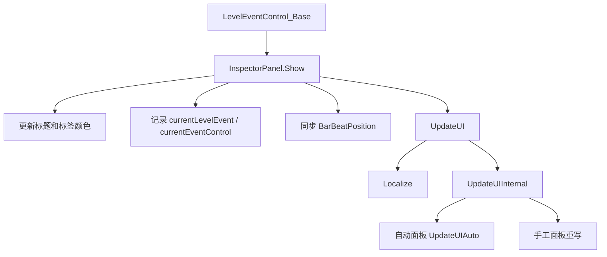

# Inspector 面板读写链路

本页记录 `InspectorPanel` 如何把时间线事件显示到右侧属性面板，并把用户输入保存回 `LevelEvent_Base` 子类。

## 源码位置

| 类型 | 源码路径 | 职责 |
| --- | --- | --- |
| `InspectorPanel` | `RDFucked/Assets/Scripts/Assembly-CSharp/RDLevelEditor/InspectorPanel.cs` | 所有事件属性面板基类 |
| `Property` | `RDFucked/Assets/Scripts/Assembly-CSharp/RDLevelEditor/Property.cs` | 把 `BasePropertyInfo` 包装成 UI 属性行 |
| `PropertyControl` | `RDFucked/Assets/Scripts/Assembly-CSharp/RDLevelEditor/PropertyControl.cs` | 每个字段的具体输入控件 |
| `InspectorPanel_AddOneshotBeat` | `RDFucked/Assets/Scripts/Assembly-CSharp/RDLevelEditor/InspectorPanel_AddOneshotBeat.cs` | 复杂手工面板示例 |

## 面板显示流程

## Awake

| 路径 | 行为 |
| --- | --- |
| 自动面板 | `auto == true` 时调用 `AwakeAuto()`，创建位置控件、属性列表和属性控件 |
| 手工面板 | 从已有层级中查找 `position`，再调用 `position.Setup(this)` |
| 通用设置 | 把 `defaultGroup` 设置为 `LevelEditorInspectorPanel` |

## AwakeAuto

`AwakeAuto()` 根据面板类名反查事件类型。例如 `InspectorPanel_Flash` 会去掉 `InspectorPanel_` 前缀，得到 `Flash`，再解析为 `LevelEventType.Flash`。

| 步骤 | 行为 |
| --- | --- |
| 创建位置控件 | 实例化 `editor.inspectorPanelManager.positionPrefab` |
| 创建属性容器 | 实例化 `gc.propertiesList` |
| 解析事件类型 | 从类名后缀解析 `LevelEventType` |
| 读取事件信息 | 从 `GC.levelEventsInfo` 读取 `LevelEventInfo` |
| 行控件 | `levelEventInfo.showsRowControl` 为真时创建旧版行控件 |
| 属性控件 | 遍历 `levelEventInfo.propertiesInfo`，跳过 `DontShowAttribute`，调用 `Property.Create` |

## Show

`Show(LevelEventControl_Base levelEventControl)` 是选中时间线事件后打开面板的入口。

| 操作 | 说明 |
| --- | --- |
| 读取事件 | 从 `levelEventControl.levelEvent` 取得当前事件 |
| 位置控件 | 按 `usesBeat`、`roomsUsage` 更新小节、节拍、房间和条件按钮显示 |
| 面板切换 | 调用 `inspectorPanelManager.HideAll()` 隐藏其他面板 |
| 标题 | 使用 `RDString.Get("editor." + levelEvent.type)` 写入标题 |
| 颜色 | 使用当前 `TabSection.color` 更新标题、Toggle 和 Hover 颜色 |
| 当前对象 | 写入 `currentLevelEvent` 和 `currentEventControl` |
| UI 刷新 | 调用 `UpdateUI(levelEvent)` |
| 条件面板 | 条件列表已打开时，同步切换到当前事件的条件面板 |

## Save

`Save(LevelEvent_Base levelEvent, bool isNew)` 负责把面板值写回事件对象。

| 步骤 | 行为 |
| --- | --- |
| 位置保存 | 非新建事件会从 `position` 写回 `barAndBeat`、`rooms`、`tag`、`tagRunNormally` |
| 面板保存 | 调用 `SaveInternal(levelEvent)` |
| 自动高度 | 自动面板激活时启动 `UpdateLevelEventHeight(false)` |

`SaveInternal` 的默认分支如下：

| 面板类型 | 保存路径 |
| --- | --- |
| 自动面板 | 调用 `SaveAuto(levelEvent)` |
| 手工面板 | 基类调用 `RDEditorUtils.NotImplemented()`，子类必须重写 |

## UpdateUI

`UpdateUI(LevelEvent_Base levelEvent)` 从事件对象读取数据并显示到面板。

| 步骤 | 行为 |
| --- | --- |
| 防重入 | `isUpdatingUI` 为真时不进入刷新 |
| 位置控件 | 写入 `position.levelEvent`、`rooms`、`barAndBeat`、`eventTag`、`tagRunNormally` |
| 条件按钮 | 调用 `position.UpdateConditionalsButton()` |
| 本地化 | 调用 `Localize()` |
| 面板刷新 | 调用 `UpdateUIInternal(levelEvent)` |
| 高度刷新 | 自动面板启动 `UpdateLevelEventHeight(true)` |

`UpdateUIInternal` 的默认分支与保存一致：自动面板调用 `UpdateUIAuto(levelEvent)`，手工面板由子类重写。

## 输入监听

`InspectorPanel` 用 `AddOnEditListeners*` 系列方法把 UI 控件的变化事件统一接到保存路径。

| 方法 | 行为 |
| --- | --- |
| `AddOnEditListeners(...)` | 输入变化后先保存当前事件，再执行额外动作 |
| `AddOnEditListenersSaveLast(...)` | 先执行额外动作，再保存当前事件 |
| `AddOnEditListenersNoSave(...)` | 只执行额外动作，不保存事件 |
| `AddOnEditListenersGeneric(...)` | 根据控件类型绑定不同 Unity 事件 |
| `RegisterForChangeAction(...)` | 播放音效，调用 `currentEventControl.SaveAndUpdateUI()`，再执行额外动作 |
| `RegisterForChangeActionSaveLast(...)` | 执行额外动作后保存并刷新时间线控件 |
| `RegisterForChangeActionNoSave(...)` | 直接执行额外动作 |
| `RegisterToggle(...)` | 给 Toggle 添加 `ClickEvent`，用点击事件触发保存 |

## 支持的监听对象

| 控件类型 | 绑定事件 | 默认音效 |
| --- | --- | --- |
| `InputField` | `onEndEdit` | `sndEditorValueChange` |
| `ColorPicker` | `onEndEdit` | `sndEditorValueChange` |
| `PositionPicker` | `x.onEndEdit`、`y.onEndEdit` | `sndEditorValueChange` |
| `ExpPositionPicker` | `x.onEndEdit`、`y.onEndEdit` | `sndEditorValueChange` |
| `ToggleGroup` | 子 Toggle 点击 | `sndButtonClick` |
| `Dropdown` | `onValueChanged` | `sndListClick` |
| `Toggle` | `onValueChanged` | `sndButtonRadio` |
| `Slider` | 点击和结束拖拽 | 点击使用 `sndSliderGrab` |
| `Button` | `onClick` | `sndButtonClick` |
| `CharacterPicker` | `onEndEdit` | `sndButtonClick` |

## 自动面板读写

自动面板的字段来自 `LevelEventInfo.propertiesInfo`。

| 方向 | 路径 |
| --- | --- |
| 显示 | `UpdateUIAuto(levelEvent)` 遍历 `properties`，调用 `Property.UpdateUI(levelEvent)` |
| 保存 | `SaveAuto(levelEvent)` 遍历 `properties`，调用 `Property.Save(levelEvent)` |
| 控件创建 | `Property.Create(info, this)` 创建属性行，再由 `PropertyControl.Create` 选择 prefab |

## 手工面板示例：AddOneshotBeat

`InspectorPanel_AddOneshotBeat` 是复杂手工面板，直接声明多个 Toggle、InputField、Button、RDEventTrigger 和布局对象。

### Awake

| 操作 | 行为 |
| --- | --- |
| 绑定循环与模式输入 | `loops`、`loopInterval`、`delay`、`freezeshot`、`burnshot`、`heldshot`、`useSubdiv`、`subdivisions` 变化后保存并显示边框 |
| 绑定基础输入 | `tick`、`skipshot`、`heartshot`、`subdivSound`、`holdCue`、`beatsound` 变化后保存 |
| 细分按钮 | 鼠标按下或拖入时调用 `ActivateSubdivButton` |
| Tick 标签 | 点击 `tickLabel` 切换普通 tick 与 `subdivTickOverride` 显示 |
| 开发字段 | `beatsoundContainer` 只在 `RDBase.isDev` 时显示 |

### UpdateUIInternal

| 读取字段 | 写入 UI |
| --- | --- |
| `barAndBeat` | `position.barAndBeat` |
| `tick` / `subdivTickOverride` | `tick.text` |
| `loops` | `loops.text` |
| `interval` | `loopInterval.text` |
| `pulseType` | `useSubdiv`、`heartshot`、细分图标 |
| `skipshot` | `skipshot.isOn` |
| `freezeBurnMode` | `freezeshot.isOn`、`burnshot.isOn`、`delayProperty` |
| `hold` | `heldshot.isOn`、`holdCueField` |
| `subdivSound` | `subdivSound` ToggleGroup |
| `holdCue` | `holdCue` ToggleGroup |
| `delay` | `delay.text` |
| `sound` | `beatsound.text` |

面板还会按 `pulseType`、`hold`、循环和细分状态调整容器显示、高度、按钮颜色和操作按钮显示。

### SaveInternal

| UI 来源 | 写回事件字段 |
| --- | --- |
| `tick.text` | `tick` 或 `subdivTickOverride` |
| `useSubdiv`、`heartshot` | `pulseType` |
| `freezeshot`、`burnshot` | `freezeBurnMode` |
| `subdivisions.text` | `subdivisions`，并在大于 1 时设为 Triangle |
| `skipshot` | `skipshot` |
| `heldshot` | `hold` |
| `loopInterval.text` | `interval` |
| `loops.text` | `loops` |
| `delay.text` | `delay` |
| `subdivSound` | `subdivSound` |
| `holdCue` | `holdCue` |
| `beatsound.text` | `sound` |

保存末尾会调用 `Validate()`、`CapXPosForPositiveFreezeBurnCueTime()`，再刷新面板 UI。

## 相关页面

| 页面 | 关系 |
| --- | --- |
| [InspectorPanel](/api/editor-events/InspectorPanel.md) | 基类成员和面板管理器说明 |
| [编辑器控件索引](/api/editor-events/editor-controls.md) | `InspectorPanel_*`、`PropertyControl_*` 类型索引 |
| [BasePropertyInfo](/api/editor-events/BasePropertyInfo.md) | 自动面板字段来源 |
| [行与节拍事件](/api/editor-events/row-events.md) | `AddOneshotBeat` 所属事件分组 |
