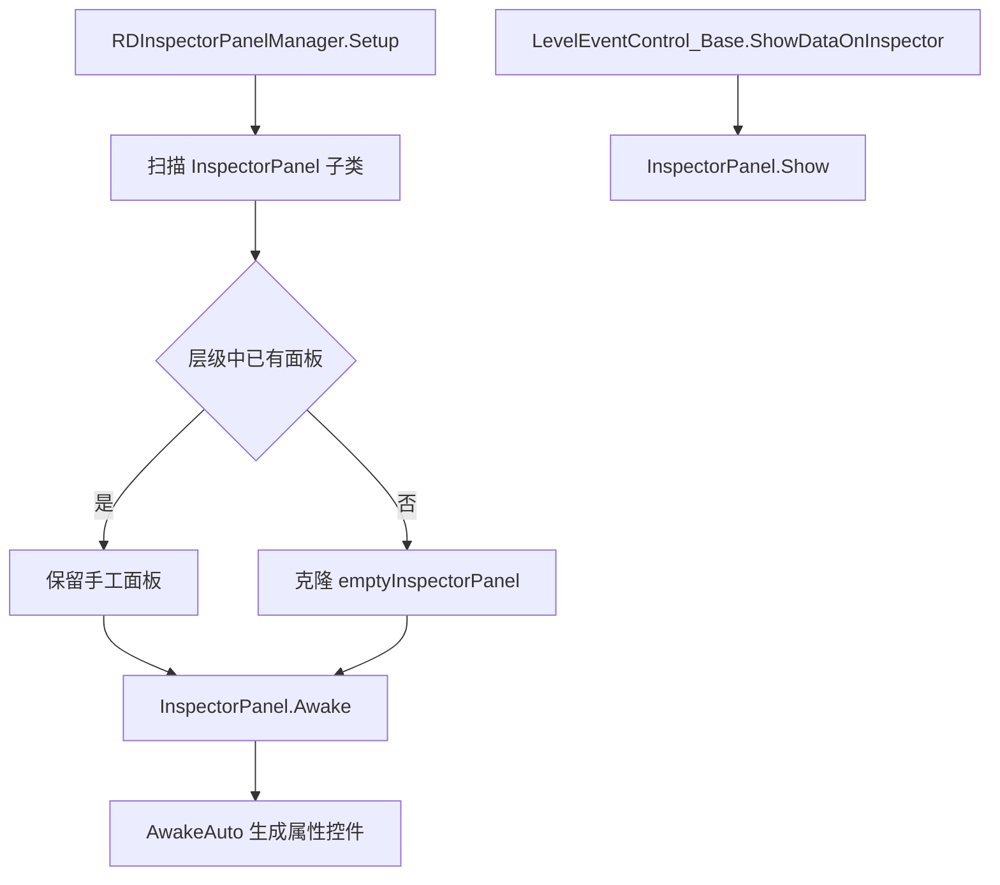
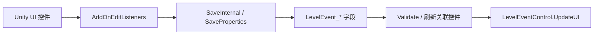

# Inspector 面板索引与专项行为

本页整理 `InspectorPanel_*` 子类的覆盖范围和特殊逻辑。`InspectorPanel` 基类负责显示、保存、本地化和自动属性控件；各子类只在需要事件专属 UI 或字段联动时重写方法。

## 面板类型来源

| 来源 | 说明 |
| --- | --- |
| 手工面板 | Unity 层级中已有对应面板实例，子类字段直接绑定到场景 UI。 |
| 自动面板 | `RDInspectorPanelManager.Setup()` 扫描 `InspectorPanel` 子类，缺失实例时克隆空面板并设置 `auto = true`。 |
| 空子类 | 类存在但没有重写方法，例如 `InspectorPanel_PlaySong`、`InspectorPanel_ShowDialogue`，用途是让自动面板能按事件名解析类型。 |
| 专项子类 | 重写 `UpdateUIInternal`、`SaveInternal`、`UpdateUIProperties` 或 `SaveProperties`，用于复杂面板或属性联动。 |

## 创建与显示链路

## 方法重写类型

| 重写点 | 作用 | 常见用途 |
| --- | --- | --- |
| `UpdateUIInternal(LevelEvent_Base levelEvent)` | 从事件对象读取字段，刷新手工 UI。 | `AddOneshotBeat`、`FloatingText`、`MakeRow`、`MakeSprite`、`ChangePlayersRows` |
| `SaveInternal(LevelEvent_Base levelEvent)` | 从手工 UI 写回事件字段。 | `AddOneshotBeat`、`FloatingText`、`MakeRow`、`MakeSprite`、`AdvanceText` |
| `UpdateUIProperties(LevelEvent_Base levelEvent)` | 自动属性控件刷新前后插入联动。 | `AddClassicBeat`、`SetRowXs`、`CallCustomMethod`、`ChangeCharacter`、`Comment`、`HideRow` |
| `SaveProperties(LevelEvent_Base levelEvent)` | 自动属性保存前后插入联动。 | `AddClassicBeat`、`SetRowXs`、`CallCustomMethod`、`ChangeCharacter`、`Comment`、`HideRow` |

自动面板与空子类仍然会使用 `InspectorPanel.UpdateUIAuto()` 和 `InspectorPanel.SaveAuto()`，字段来源是 `LevelEventInfo.propertiesInfo`。

## 重点专项面板

| 面板 | 对应事件 | 专项行为 |
| --- | --- | --- |
| `InspectorPanel_AddClassicBeat` | `AddClassicBeat` | 在 `swing` 属性控件刷新与保存时设置 slider 最大值为 `tick * 2`，并把 `snapInterval` 设为 `1 / editor.denominator`；鼠标指向或拖动 swing 时显示当前时间线控件边框。 |
| `InspectorPanel_AddOneshotBeat` | `AddOneshotBeat` | 手工维护 tick、loop、interval、delay、freeze、burn、hold、subdivision、beatsound 等控件；保存后调用 `Validate()` 和 `CapXPosForPositiveFreezeBurnCueTime()`。 |
| `InspectorPanel_SetRowXs` | `SetRowXs` | 刷新 `pattern` 属性前把 `syncoBeat` 写入 `PropertyControl_BeatModifiers`；保存后从控件取回 `syncoBeat`，并刷新同一行 Classic 控件。 |
| `InspectorPanel_CallCustomMethod` | `CallCustomMethod` | 在方法字段和说明字段之间建立联动，维护方法补全、描述文本和参数显示。 |
| `InspectorPanel_FloatingText` | `FloatingText` | 手工处理歌词、颜色、描边、对齐、字体、位置、大小、旋转、子文本显示、淡出、模式和旁白分类。 |
| `InspectorPanel_AdvanceText` | `AdvanceText` | 按 `id` 查找对应 `FloatingText`，显示当前片段信息，并保存推进 id 与淡出时长。 |
| `InspectorPanel_MakeRow` | `MakeRow` | 手工处理行类型、玩家、角色、CPU 标记、房间、音量、偏移、音高、声像、可见性和长度。 |
| `InspectorPanel_MakeSprite` | `MakeSprite` | 手工处理精灵文件、角色、自定义资源、房间、可见性、预览、深度和角色错误文本。 |
| `InspectorPanel_ChangePlayersRows` | `ChangePlayersRows` | 按当前行数据生成玩家换行选择，处理没有行时的说明文本。 |
| `InspectorPanel_LevelSettings` | `LevelSettings` | 大型关卡设置面板，处理基本信息、导出信息、作者列表、预览歌曲、评级门槛、色板和发布相关字段。 |

## 空子类与自动属性面板

这些子类文件只声明类或只保留极少量代码。它们让 `AwakeAuto()` 能按 `InspectorPanel_事件名` 解析出 `LevelEventType`，再根据事件属性自动生成 UI。

| 分组 | 面板 |
| --- | --- |
| 歌曲与音频 | `InspectorPanel_PlaySong`、`InspectorPanel_SetBeatsPerMinute`、`InspectorPanel_SetCrotchetsPerBar`、`InspectorPanel_PlaySound`、`InspectorPanel_SetBeatSound`、`InspectorPanel_SetCountingSound`、`InspectorPanel_SetClapSounds`、`InspectorPanel_SetGameSound` |
| 视觉与镜头 | `InspectorPanel_SetTheme`、`InspectorPanel_SetVFXPreset`、`InspectorPanel_SetBackgroundColor`、`InspectorPanel_SetForeground`、`InspectorPanel_SetSpeed`、`InspectorPanel_Flash`、`InspectorPanel_CustomFlash`、`InspectorPanel_MoveCamera`、`InspectorPanel_PulseCamera`、`InspectorPanel_ShakeScreen`、`InspectorPanel_ShakeScreenCustom`、`InspectorPanel_FlipScreen`、`InspectorPanel_InvertColors`、`InspectorPanel_TintRows`、`InspectorPanel_PaintHands`、`InspectorPanel_DesktopColor` |
| 房间 | `InspectorPanel_ShowRooms`、`InspectorPanel_MoveRoom`、`InspectorPanel_FadeRoom`、`InspectorPanel_MaskRoom`、`InspectorPanel_SetRoomPerspective`、`InspectorPanel_SetRoomContentMode`、`InspectorPanel_ReorderRooms` |
| 精灵 | `InspectorPanel_Move`、`InspectorPanel_Tint`、`InspectorPanel_Tile`、`InspectorPanel_PlayAnimation`、`InspectorPanel_SetVisible`、`InspectorPanel_ReorderSprite`、`InspectorPanel_Blend` |
| 文本与脚本 | `InspectorPanel_ShowDialogue`、`InspectorPanel_ReadNarration`、`InspectorPanel_NarrateRowInfo`、`InspectorPanel_PlayExpression`、`InspectorPanel_ChangeCharacter`、`InspectorPanel_Comment`、`InspectorPanel_CommentShow`、`InspectorPanel_TagAction`、`InspectorPanel_TextExplosion`、`InspectorPanel_Stutter` |
| 窗口与流程 | `InspectorPanel_NewWindowDance`、`InspectorPanel_SetMainWindow`、`InspectorPanel_RenameWindow`、`InspectorPanel_WindowResize`、`InspectorPanel_HideWindow`、`InspectorPanel_SetWindowContent`、`InspectorPanel_ReorderWindows`、`InspectorPanel_SetPlayStyle`、`InspectorPanel_ShowStatusSign`、`InspectorPanel_FinishLevel`、`InspectorPanel_SayReadyGetSetGo`、`InspectorPanel_BassDrop` |

## 自动属性联动面板

自动属性面板仍然能通过重写 `UpdateUIProperties` 和 `SaveProperties` 做字段之间的联动。

| 面板 | 联动 |
| --- | --- |
| `InspectorPanel_AddClassicBeat` | `swing` slider 范围跟随 `tick`，拖动时显示时间线边框。 |
| `InspectorPanel_SetRowXs` | `pattern` 控件与 `syncoBeat` 互相同步，`syncoSwing` slider 按编辑器分母吸附。 |
| `InspectorPanel_CallCustomMethod` | 方法名控件、方法说明控件和参数显示同步。 |
| `InspectorPanel_ChangeCharacter` | 自定义角色与普通角色字段之间同步，并刷新角色选择控件。 |
| `InspectorPanel_Comment` | 注释显示状态和注释颜色写回事件。 |
| `InspectorPanel_HideRow` | 行显示隐藏相关属性与行控件状态同步。 |
| `InspectorPanel_MaskRoom` | 遮罩房间字段刷新时同步专属属性控件状态。 |

## 手工面板读写模式

手工面板通常遵循同一模式：

1. `Awake()` 或初始化阶段调用 `AddOnEditListeners(...)` 给 `InputField`、`Toggle`、`Dropdown`、`Slider` 等控件绑定保存监听。
2. `UpdateUIInternal(levelEvent)` 把事件字段写入 UI，并根据字段组合开关容器、高度、颜色或提示文本。
3. `SaveInternal(levelEvent)` 从 UI 读取字段，写回具体 `LevelEvent_*`。
4. 保存后调用事件自己的验证方法或刷新关联时间线控件。

## 与事件专页的对应

| 面板 | 事件页面 |
| --- | --- |
| `InspectorPanel_AddClassicBeat` | [AddClassicBeat](/api/editor-events/AddClassicBeat.md) |
| `InspectorPanel_AddOneshotBeat` | [AddOneshotBeat](/api/editor-events/AddOneshotBeat.md) |
| `InspectorPanel_SetRowXs` | [SetRowXs](/api/editor-events/SetRowXs.md) |
| `InspectorPanel_PlaySong` | [PlaySong](/api/editor-events/PlaySong.md) |
| `InspectorPanel_SetBeatsPerMinute`、`InspectorPanel_SetCrotchetsPerBar` | [歌曲时间线事件](/api/editor-events/SongTimingEvents.md) |
| `InspectorPanel_PlaySound`、`InspectorPanel_SetBeatSound`、`InspectorPanel_SetCountingSound`、`InspectorPanel_SetClapSounds`、`InspectorPanel_SetGameSound` | [音频与声音事件](/api/editor-events/AudioSoundEvents.md) |
| `InspectorPanel_FloatingText`、`InspectorPanel_AdvanceText` | [FloatingText 事件](/api/editor-events/FloatingTextEvents.md) |
| `InspectorPanel_ShowDialogue` | [ShowDialogue](/api/editor-events/ShowDialogue.md) |
| `InspectorPanel_MakeRow`、`InspectorPanel_SetOneshotWave`、`InspectorPanel_SpinningRows`、`InspectorPanel_ChangePlayersRows` | [行控制与自由节拍事件](/api/editor-events/RowControlEvents.md) |
| `InspectorPanel_MakeSprite`、`InspectorPanel_Move`、`InspectorPanel_PlayAnimation` | [精灵生命周期事件](/api/editor-events/SpriteLifecycleEvents.md) |
| `InspectorPanel_Tint`、`InspectorPanel_Tile`、`InspectorPanel_SetVisible`、`InspectorPanel_ReorderSprite`、`InspectorPanel_Blend` | [精灵渲染与排序事件](/api/editor-events/SpriteRenderEvents.md) |
| `InspectorPanel_NewWindowDance`、`InspectorPanel_SetMainWindow`、`InspectorPanel_RenameWindow`、`InspectorPanel_WindowResize`、`InspectorPanel_HideWindow`、`InspectorPanel_SetWindowContent`、`InspectorPanel_ReorderWindows` | [窗口控制事件](/api/editor-events/WindowControlEvents.md) |

## 相关页面

| 页面 | 关系 |
| --- | --- |
| [InspectorPanel](/api/editor-events/InspectorPanel.md) | 面板基类、自动面板、保存监听和管理器。 |
| [Inspector 面板读写链路](/api/editor-events/inspector-flow.md) | 详细解释面板从显示到保存的调用路径。 |
| [编辑器控件索引](/api/editor-events/editor-controls.md) | 时间线控件、Inspector 面板、属性控件三层入口。 |
| [BasePropertyInfo](/api/editor-events/BasePropertyInfo.md) | 自动属性面板的字段来源与控件映射。 |
