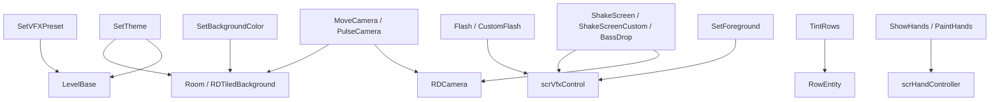

# 视觉、镜头与特效事件

本页覆盖主题、VFX preset、背景前景贴图、闪光、镜头、震屏、翻转、反色、手部显示和行染色相关的 `LevelEvent_*`。

## 事件总览

| 事件 | 源码 | 执行时机 | 房间用法 | 主要作用 |
| --- | --- | --- | --- | --- |
| `LevelEvent_SetTheme` | `RDLevelEditor/LevelEvent_SetTheme.cs` | `OnBar` | `ManyRooms` | 切换房间主题背景，并控制主题横向滚动。 |
| `LevelEvent_SetVFXPreset` | `RDLevelEditor/LevelEvent_SetVFXPreset.cs` | `OnBar`，`MiawMiaw` 使用 `RunPrebar` | 由 preset 决定 | 启用、禁用或配置主题 VFX。 |
| `LevelEvent_SetBackgroundColor` | `RDLevelEditor/LevelEvent_SetBackgroundColor.cs` | `OnBar` | `ManyRoomsAndOnTop` | 设置背景颜色或背景图片层。 |
| `LevelEvent_SetForeground` | `RDLevelEditor/LevelEvent_SetForeground.cs` | `OnBar` | `ManyRoomsAndOnTop` | 设置前景图片层。 |
| `LevelEvent_Flash` | `RDLevelEditor/LevelEvent_Flash.cs` | `OnBar` | `ManyRoomsAndOnTop` | 按短、中、长三档触发白闪。 |
| `LevelEvent_CustomFlash` | `RDLevelEditor/LevelEvent_CustomFlash.cs` | `OnBar` | `ManyRoomsAndOnTop` | 自定义闪光起止颜色、透明度和 easing。 |
| `LevelEvent_InvertColors` | `RDLevelEditor/LevelEvent_InvertColors.cs` | `OnBar` | `ManyRoomsAndOnTop` | 启用或关闭屏幕反色。 |
| `LevelEvent_FlipScreen` | `RDLevelEditor/LevelEvent_FlipScreen.cs` | `OnBar` | `ManyRoomsAndOnTop` | 水平或垂直翻转房间画面。 |
| `LevelEvent_MoveCamera` | `RDLevelEditor/LevelEvent_MoveCamera.cs` | `OnBar` | `ManyRoomsAndOnTop` | 移动、旋转、缩放房间相机或 render quad 材质。 |
| `LevelEvent_PulseCamera` | `RDLevelEditor/LevelEvent_PulseCamera.cs` | `OnBar` | `ManyRoomsAndOnTop` | 连续 pulse camera。 |
| `LevelEvent_ShakeScreen` | `RDLevelEditor/LevelEvent_ShakeScreen.cs` | `OnBar` | `ManyRoomsAndOnTop` | 低、中、高三档震屏。 |
| `LevelEvent_ShakeScreenCustom` | `RDLevelEditor/LevelEvent_ShakeScreenCustom.cs` | `OnBar` | `ManyRoomsAndOnTop` | 自定义震屏类型、时长、振幅、频率。 |
| `LevelEvent_BassDrop` | `RDLevelEditor/LevelEvent_BassDrop.cs` | `OnBar` | `ManyRoomsAndOnTop` | 触发 BassDrop 镜头效果。 |
| `LevelEvent_TextExplosion` | `RDLevelEditor/LevelEvent_TextExplosion.cs` | `OnBar` | `ManyRooms` | 创建 20 个滚动爆炸文字对象。 |
| `LevelEvent_ShowStatusSign` | `RDLevelEditor/LevelEvent_ShowStatusSign.cs` | `OnBar` | 不使用 | 设置状态牌文字和旁白。 |
| `LevelEvent_DesktopColor` | `RDLevelEditor/LevelEvent_DesktopColor.cs` | `OnBar` | 不使用 | Tween 窗口舞蹈模拟背景色。 |
| `LevelEvent_TintRows` | `RDLevelEditor/LevelEvent_TintRows.cs` | `OnBar` | 全行时 `ManyRoomsAndOnTop` | 设置行边框、描边、染色、透明度、心脏样式和行效果。 |
| `LevelEvent_ShowHands` | `RDLevelEditor/LevelEvent_ShowHands.cs` | `OnBar` | `ManyRoomsAndOnTop` | 显示、隐藏或切换手部。 |
| `LevelEvent_PaintHands` | `RDLevelEditor/LevelEvent_PaintHands.cs` | `OnBar` | `ManyRoomsAndOnTop` | 给手臂 sprite 设置边框、染色和透明度。 |

## SetTheme

| 项目 | 内容 |
| --- | --- |
| Attribute | `OnBar, sortOffset -10, RoomsUsage.ManyRooms` |
| 主要对象 | `LevelBase`、`Room` |
| 版本迁移 | 版本低于 9 时把 `Kaleidoscope` 改为 `HallOfMirrors`；版本低于 30 时 `moveRowContainer = true` |

| 属性 | 类型 | 默认值 | 作用 |
| --- | --- | --- | --- |
| `preset` | `RDTheme` | 默认枚举值 | 主题预设。 |
| `variant` | `int` | `0` | 主题变体；仅 `RDEditorConstants.ThemeVariants` 包含该主题时启用。 |
| `enablePosition` | `bool` | `false` | 是否启用主题横向位置。 |
| `positionX` | `float` | `0` | 主题横向位置，单位 px。 |
| `positionDuration` | `float` | `0` | 主题滚动时长，单位 beat。 |
| `positionEase` | `Ease` | `Linear` | 主题滚动 easing。 |
| `firstRowOnFloor` | `bool` | `false` | 开发模式下显示的主题选项；为 false 时编码会移除此字段。 |
| `skipPaintEffects` | `bool` | `true` | 传给 `ShowThemeBackgrounds` 的反向参数。 |

`Prepare()` 会遍历 `rooms` 调用 `currentLevel.PreloadTheme(preset, room, variant)`。`Run()` 则在 beat 上调用 `ShowThemeBackgrounds`；启用位置时调用 `rooms[room].ScrollTheme`，否则调用 `TryResetScroll`。

## SetVFXPreset

| 项目 | 内容 |
| --- | --- |
| Attribute | `OnBar, sortOffset -10, RoomsUsage.ManyRooms` |
| 主要对象 | `LevelBase`、`Room.preloadedVFX` |
| 房间用法 | `Decode()` 后从 `RDEditorConstants.VFXInfos[preset].roomsUsage` 写回 `roomsUsage` |

| 属性 | 类型 | 默认值 | 启用条件 |
| --- | --- | --- | --- |
| `preset` | `RDThemeFX` | 默认枚举值 | 始终显示。 |
| `enable` | `bool` | `true` | `preset != DisableAll`。 |
| `threshold` | `float?` | `0.3` | `VFXInfo.hasThreshold`。 |
| `intensity` | `float?` | `100` | `VFXInfo.hasIntensity`。 |
| `color` | `ColorOrPalette?` | `Color.white` | `VFXInfo.hasColor`。 |
| `amount` | `Float2?` | `(1, 1)` | `VFXInfo.hasXY`。 |
| `xySpeed` | `Float2?` | `(0, 0)` | `VFXInfo.hasXYSpeed`。 |
| `speedPerc` | `float?` | `100` | `VFXInfo.hasSpeed`。 |
| `duration` | `float` | `0` | `VFXInfo.hasEase`。 |
| `ease` | `Ease` | `Linear` | `VFXInfo.hasEase`。 |

`Decode()` 负责兼容 VFX 重构前的数据：读取旧 `floatX/floatY`，为 `CustomScreenScroll` 补 `xySpeed`，为旧 Drawing、RadialBlur 补默认值，并把 legacy preset 交给 `InspectorPanel_SetVFXPreset.AddLegacyPresetToLevel`。

`Run()` 的分支：

| 条件 | 行为 |
| --- | --- |
| `preset == MiawMiaw` | `Run()` 直接返回，由 `RunPrebar()` 启用或禁用。 |
| `preset == DisableAll` 且 `room == -1` | 遍历 `VFXInfos`，禁用 `ManyRoomsAndOnTop` 类型效果。 |
| `preset == DisableAll` 且指定房间 | 调用 `level.AddThemeFX(preset, room)`。 |
| `enable == true` | 计算参数后调用 `level.AddThemeFX(...)`。 |
| `enable == false` | 调用 `level.DisableThemeFX(preset, room)`。 |

## SetBackgroundColor 与 SetForeground

### 共同机制

| 行为 | 说明 |
| --- | --- |
| 图片字段兼容 | `Decode()` 把旧版单字符串 `image` 转为字符串数组。 |
| 滚动字段兼容 | tiled 模式下，`Encode()` 把 `speed` 改写为 `scrollX` 和 `scrollY`；`Decode()` 读取旧字段还原 `Float2`。 |
| 预加载 | `Prepare()` 加载 `images` 中的贴图，并为目标房间创建对应 sorting layer。 |
| 播放 | `Run()` 通过 `RunOnBeat` 显示贴图层或隐藏贴图层。 |

### SetBackgroundColor

| 属性 | 类型 | 默认值 | 作用 |
| --- | --- | --- | --- |
| `backgroundType` | `BackgroundType` | 默认枚举值 | `Color` 时设置背景色，`Image` 时显示背景图片。 |
| `images` | `string[]` | 空数组 | 背景图片序列。 |
| `color` | `ColorOrPalette` | `Color.white` | 背景色或图片 tint。 |
| `fps` | `float` | `30` | 多图片帧率。 |
| `contentMode` | `ContentMode` | `ScaleToFill` | 图片填充方式。 |
| `filter` | `TextureFilter` | 默认枚举值 | `NearestNeighbor` 时使用 Point，否则 Bilinear。 |
| `tilingType` | `TilingType` | 默认枚举值 | tiled 时的滚动或 pulse 类型。 |
| `speed` | `Float2` | `(0, 0)` | tiled 滚动速度。 |
| `duration` | `float` | `0` | tiled 过渡时长。 |
| `interval` | `float` | `1` | pulse tiled 间隔。 |
| `ease` | `Ease` | `Linear` | tiled 过渡 easing。 |

`Run()` 中，颜色背景会先把 RGB 乘以 alpha，再调用 `vfx.BgColor(color, room)`。图片背景会调用 `rooms[room].GetTextureLayer(RDSortingLayer.Background).Show(...)`。

### SetForeground

`SetForeground` 与背景图片路径相同，但固定作用于 `RDSortingLayer.Foreground`，运行时调用 `vfx.GetForegroundTextureLayer(room).Show(...)`。没有图片时把前景 layer 的 GameObject 设为 inactive。

## Flash、CustomFlash 与 InvertColors

### Flash

| 属性 | 类型 | 默认值 | 作用 |
| --- | --- | --- | --- |
| `simpleDuration` | `SimpleDuration` | `Short` | `Short = 1 beat`，`Medium = 2 beats`，`Long = 4 beats`。 |
| `duration` | `float` | 计算属性 | `IDurationHaver` 接口使用，setter 抛 `NotImplementedException`。 |

`Run()` 把 simple duration 换算为秒，然后对每个房间调用 `vfx.Flash(room, seconds, 1f)`。

### CustomFlash

| 属性 | 类型 | 默认值 | 作用 |
| --- | --- | --- | --- |
| `startColor` | `ColorOrPalette?` | `Color.white` | 起始颜色；为空时使用当前 overlay 颜色。 |
| `startOpacity` | `int?` | `100` | 起始透明度百分比。 |
| `endColor` | `ColorOrPalette?` | `Color.white` | 结束颜色。 |
| `endOpacity` | `int?` | `0` | 结束透明度百分比。 |
| `background` | `bool` | `false` | 为真时使用房间背景 overlay。 |
| `duration` | `float` | `2` | 持续 beat 数。 |
| `ease` | `Ease` | `Linear` | Tween easing。 |
| `reducedStrength` | `int?` | `50` | reduced flash 模式下的起始透明度倍率。 |

`Decode()` 会从旧版 8 位颜色字符串中拆出 alpha，并写入 `startOpacity` 或 `endOpacity`。`Run()` 中会读取 `Persistence.GetFlashIntensity()` 和 `game.reducedFlash`，再调用 `scrQuad.TweenColorFromTo(...)`。

### InvertColors

| 属性 | 类型 | 默认值 | 作用 |
| --- | --- | --- | --- |
| `enable` | `bool` | `true` | 是否反色。 |

`Run()` 对每个房间调用 `vfx.InvertScreenColors(enable, room)`。

## FlipScreen 与 BassDrop

### FlipScreen

| 属性 | 类型 | 默认值 | 作用 |
| --- | --- | --- | --- |
| `flip` | `bool[]` | `[true, false]` | `flip[0]` 控制 X，`flip[1]` 控制 Y。 |

`Encode()` 把数组形式改写为 `flipX`、`flipY` 两个字段。`Decode()` 支持从 `flipX`、`flipY` 还原数组。`Run()` 调用 `vfx.SetFlipScreenX` 和 `vfx.SetFlipScreenY`。

### BassDrop

| 属性 | 类型 | 默认值 | 作用 |
| --- | --- | --- | --- |
| `strength` | `StrengthLevel` | `High` | `Low = 0.15`，`Medium = 0.4`，`High = 1`。 |
| `description` | `bool` | `false` | UI 描述属性，不保存运行效果。 |

`Run()` 对每个房间调用 `vfx.BassDropNew(room, strengthValue)`。

## MoveCamera 与 PulseCamera

### MoveCamera

| 项目 | 内容 |
| --- | --- |
| 版本迁移 | 版本低于 25 时 `room = 4`；版本低于 53 时 `legacyOnTopMovement = true` |
| 主要对象 | `RDCamera`、房间 render quad material、窗口舞蹈 material |

| 属性 | 类型 | 默认值 | 作用 |
| --- | --- | --- | --- |
| `cameraPosition` | `Float2?` | `(50, 50)` | 相机或材质位置百分比。 |
| `zoom` | `int?` | `100` | 缩放百分比，范围 `1` 到 `9999`。 |
| `angle` | `float?` | `0` | 旋转角度。 |
| `duration` | `float` | `1` | 持续 beat 数。 |
| `ease` | `Ease` | 默认枚举值 | DOTween easing。 |
| `realMovement` | `bool` | `false` | 高级选项，保存时只有为真才写入。 |
| `window` | `int` | `-1` | `realMovement` 为真时指定窗口材质。 |

`Run()` 的两条路径：

| 条件 | 行为 |
| --- | --- |
| `room == -1` 或 `realMovement && window == -1` | 直接移动 `RDCamera.transform`，调用 `camera.Rotate` 和 `camera.Zoom`。 |
| 指定房间或窗口材质 | 对材质 `_PosX`、`_PosY`、`_Angle`、`_Scale` 做 tween。 |

### PulseCamera

| 属性 | 类型 | 默认值 | 作用 |
| --- | --- | --- | --- |
| `strength` | `int` | `1` | `0 = 0.03`，`1 = 0.1`，`2 = 0.2` zoom。 |
| `count` | `int` | `1` | pulse 次数。 |
| `frequency` | `float` | `1` | pulse 间隔 beat。 |

`Run()` 会对每个目标房间和每次 pulse 调用 `scrExecuteOnCertainBeat.Add`，触发 `RDCamera.PulseCamera(zoom, pulseTime)`。

## ShakeScreen 与 ShakeScreenCustom

### ShakeScreen

| 属性 | 类型 | 默认值 | 作用 |
| --- | --- | --- | --- |
| `shakeLevel` | `StrengthLevel` | `Medium` | 低、中、高三档震屏强度。 |
| `shakeType` | `EditorShakeType` | 默认枚举值 | `Normal`、`Smooth` 或 `Rotate`。 |

强度映射：

| `shakeLevel` | Normal amount | Smooth duration | Smooth strength |
| --- | --- | --- | --- |
| `Low` | `5` | `0.3` | `2` |
| `Medium` | `10` | `0.6` | `3` |
| `High` | `20` | `1` | `4` |

`shakeType == Normal` 时会读取 `level.smoothShake` 和 `level.rotateShake` 改成对应类型。运行时分别调用 `vfx.ShakeCam`、`vfx.ShakeCamSmooth` 或 `vfx.ShakeCamRotate`。

### ShakeScreenCustom

| 属性 | 类型 | 默认值 | 作用 |
| --- | --- | --- | --- |
| `shakeType` | `EditorShakeType` | 默认枚举值 | `Normal`、`Smooth`、`Rotate`、`BassDrop`。 |
| `duration` | `float` | `0.5` | 时长；`useBeats` 为真时按 beat 转秒。 |
| `amplitude` | `float` | `1` | 振幅。 |
| `frequency` | `float` | `10` | 频率；非 Normal 类型启用。 |
| `fadeOut` | `bool` | `false` | Smooth 和 Rotate 类型启用。 |
| `useBeats` | `bool` | `false` | 是否把 duration 当 beat。 |

`Run()` 中，Smooth 使用 `DOShakePosition`，Rotate 使用 `DOShakeRotation`，BassDrop 调用 `vfx.BassDropNew`，Normal 调用 `RDCamera.ShakeWithDuration`。

## TextExplosion 与 ShowStatusSign

### TextExplosion

| 属性 | 类型 | 默认值 | 作用 |
| --- | --- | --- | --- |
| `text` | `string` | 本地化 `editor.TextExplosion.exampleText` 或 `Example` | 爆炸文字内容。 |
| `color` | `ColorOrPalette` | `Color.black` | 固定颜色模式使用的颜色。 |
| `mode` | `TextExplosionMode` | 默认枚举值 | 包含随机颜色模式。 |
| `direction` | `TextExplosionDirection` | 默认枚举值 | 控制滚动方向。 |
| `speed` | `float` | `100` | 速度百分比。 |
| `ease` | `Ease` | `Linear` | 滚动 easing。 |

`Prepare()` 为每个目标房间创建 20 个 `RDScrollyText`。`Run()` 会转义文本，Samurai 模式下替换为 `Samurai.`，再逐个调用 `Setup(...).Run()`。

### ShowStatusSign

| 属性 | 类型 | 默认值 | 作用 |
| --- | --- | --- | --- |
| `text` | `string` | 空字符串 | 状态牌文本。 |
| `duration` | `float` | `4` | 显示时长。 |
| `useBeats` | `bool` | `true` | 是否把 duration 从 beat 换算成秒。 |
| `narrate` | `bool` | `true` | 旁白开关；`Narration.IsAvailable` 时显示。 |

`Decode()` 对版本不高于 50 的关卡强制 `narrate = false`。`Run()` 在 scrubbing 时直接返回；显示前会处理 `[[key]]` 本地化片段，并通过 `currentLevel.EvaluateCurlyBracketsInString` 解析花括号变量，最后调用 `statusText.SetStatusText`。

## DesktopColor

| 属性 | 类型 | 默认值 | 作用 |
| --- | --- | --- | --- |
| `startColor` | `ColorOrPalette?` | `Color.white` | 起始颜色；关闭时使用当前背景色。 |
| `endColor` | `ColorOrPalette?` | RGBA `(0.514, 0.306, 0.592, 1)` | 结束颜色。 |
| `duration` | `float` | `2` | 持续 beat 数。 |
| `ease` | `Ease` | `Linear` | Tween easing。 |

`Run()` 读取 `game.simulateWD?.background`，先 kill 旧 tween，再设置起始颜色，并在颜色不同的时候用 `DOColor` 过渡到结束颜色。

## TintRows、ShowHands 与 PaintHands

### TintRows

| 属性 | 类型 | 默认值 | 作用 |
| --- | --- | --- | --- |
| `border` | `BorderType?` | `None` | 行边框类型。 |
| `borderColor` | `ColorOrPalette` | `Color.white` | 边框颜色。 |
| `borderOpacity` | `int` | `100` | 边框透明度百分比。 |
| `borderPulse` | `bool?` | `true` | 边框是否随音量 pulse。 |
| `borderPulseMin` | `float` | `0.1` | pulse 最小 alpha。 |
| `borderPulseMax` | `float` | `1` | pulse 最大 alpha。 |
| `tint` | `bool?` | `false` | 是否染色。 |
| `tintColor` | `ColorOrPalette` | `Color.white` | 染色颜色。 |
| `tintOpacity` | `int` | `100` | 染色透明度百分比。 |
| `opacity` | `int?` | `100` | 行整体透明度。 |
| `duration` | `float` | `0` | 过渡 beat 数。 |
| `ease` | `Ease` | `Linear` | Tween easing。 |
| `effect` | `RowEffect?` | `None` | 行特效，例如 Electric。 |
| `effectSound` | `bool` | `true` | Electric cue 音。 |
| `heart` | `RDHeartType?` | `Default` | 心脏样式。 |
| `heartTransition` | `bool` | `true` | 切换心脏时是否过渡。 |

`UpdateRoomsUsage()` 在 `row == -1` 时使用 `ManyRoomsAndOnTop`，否则不使用房间数组。`RunPrebar()` 为 Electric 效果播放 cue 音。`Run()` 会给所有行或指定行调用 `TintRow`，并同步 shadow 行宿主。

### ShowHands

| 属性 | 类型 | 默认值 | 作用 |
| --- | --- | --- | --- |
| `hand` | `Hand` | `Right` | 目标手。 |
| `action` | `HandAction` | 默认枚举值 | 显示、隐藏或其他手部动作。 |
| `extent` | `HandExtent` | 默认枚举值 | 显示单手时的伸出范围。 |
| `forceRaise` | `bool` | `true` | 显示或隐藏时是否强制抬手。 |
| `alignVisibleArea` | `bool` | `false` | 是否对齐可见区域。 |
| `instant` | `bool` | `false` | 是否无过渡执行。 |

`Run()` 会选取房间对应的 `scrHandController`，设置 `lastHandAction` 和可见区域对齐，再调用左右手 `RDArm.Toggle`。

### PaintHands

| 属性 | 类型 | 默认值 | 作用 |
| --- | --- | --- | --- |
| `hands` | `Hand` | `Right` | 目标手。 |
| `border` | `BorderType?` | `None` | 手臂 sprite 边框。 |
| `borderColor` | `ColorOrPalette` | `Color.white` | 边框颜色。 |
| `borderPulse` | `bool?` | `true` | 边框 alpha 是否随音量 pulse。 |
| `borderPulseMin` | `float` | `0.1` | pulse 最小 alpha。 |
| `borderPulseMax` | `float` | `1` | pulse 最大 alpha。 |
| `tint` | `bool?` | `false` | 是否染色。 |
| `tintColor` | `ColorOrPalette` | `Color.white` | 染色颜色。 |
| `opacity` | `int?` | `100` | 透明度。 |
| `duration` | `float` | `0` | 过渡 beat 数。 |
| `ease` | `Ease` | `Linear` | Tween easing。 |

`Run()` 通过房间索引取得 `scrHandController`，再按 `hands` 分别处理左右 `RDArm`。`TintArm` 遍历 `arm.allSprites`，对每个 `Entity` tween 边框、染色和透明度。

## 关系图

