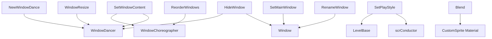

# 窗口与剩余事件

本页覆盖窗口舞蹈、窗口缩放、窗口内容、窗口标题、窗口可见性、窗口排序，以及剩余的播放风格和精灵混合事件。

## 事件总览

| 事件 | 源码 | 执行时机 | 主要对象 | 主要作用 |
| --- | --- | --- | --- | --- |
| `LevelEvent_NewWindowDance` | `RDLevelEditor/LevelEvent_NewWindowDance.cs` | `OnBar` | `WindowDancer` | 切换窗口舞蹈 preset，并设置位置、速度、振幅、角度、频率和 ease。 |
| `LevelEvent_WindowResize` | `RDLevelEditor/LevelEvent_WindowResize.cs` | `OnBar` | `WindowDancer` | 缩放窗口、同步 camera zoom，并设置 pivot。 |
| `LevelEvent_SetWindowContent` | `RDLevelEditor/LevelEvent_SetWindowContent.cs` | `OnBar` | `WindowChoreographer`、`WindowDancer` | 设置窗口显示 OnTop 或指定房间内容，并调整窗口相机。 |
| `LevelEvent_SetMainWindow` | `RDLevelEditor/LevelEvent_SetMainWindow.cs` | `OnBar` | `Window` | 设置哪个窗口渲染 UI。 |
| `LevelEvent_RenameWindow` | `RDLevelEditor/LevelEvent_RenameWindow.cs` | `OnBar` | `Window` | 重置、设置或追加窗口标题。 |
| `LevelEvent_HideWindow` | `RDLevelEditor/LevelEvent_HideWindow.cs` | `OnBar` | `WindowDancer`、`Window` | 显示或隐藏窗口，并设置透明、无边框高级选项。 |
| `LevelEvent_ReorderWindows` | `RDLevelEditor/LevelEvent_ReorderWindows.cs` | `OnBar` | `WindowChoreographer` | 设置窗口 z 顺序。 |
| `LevelEvent_SetPlayStyle` | `RDLevelEditor/LevelEvent_SetPlayStyle.cs` | `OnBar` | `LevelBase`、`scrConductor` | 设置下一小节和播放风格。 |
| `LevelEvent_Blend` | `RDLevelEditor/LevelEvent_Blend.cs` | `OnBar` | `CustomSprite` material | 设置精灵材质混合模式。 |

## 窗口索引规则

窗口事件大多使用 `y` 作为窗口索引，并通过 `tab` 做兼容：

| 事件 | 窗口索引 |
| --- | --- |
| `NewWindowDance` | `tab != Tab.Windows` 时返回 `0`，否则返回 `y`。 |
| `WindowResize` | `tab != Tab.Windows` 时返回 `0`，否则返回 `y`。 |
| `SetWindowContent` | `window => y`。 |
| `SetMainWindow` | `window => y`。 |
| `RenameWindow` | `window => y`。 |
| `HideWindow` | `window => y`。 |

所有窗口事件运行前都会检查 `game.windowChoreographer`；对象不存在时直接返回。

## NewWindowDance

| 项目 | 内容 |
| --- | --- |
| Attribute | `OnBar, RoomsUsage.NotUsed` |
| 接口 | `IDurationHaver` |
| 主要对象 | `game.windowChoreographer.dancers[window]` |

| 属性 | 类型 | 默认值 | 启用条件 |
| --- | --- | --- | --- |
| `preset` | `WindowDancePreset` | 默认枚举值 | 始终显示。 |
| `samePresetBehavior` | `SamePresetBehavior` | `Reset` | `preset != Move`。 |
| `position` | `Float2` | `(50, 50)` | 始终显示。 |
| `reference` | `ReferenceType` | 默认枚举值 | `preset == Move`。 |
| `speed` | `float` | `0` | `Wrap` 或 `Ellipse` 且不是 Keep。 |
| `useCircle` | `bool` | `false` | `preset == Ellipse`。 |
| `amplitude` | `float?` | `0` | 非向量振幅 preset。 |
| `amplitudeVector` | `Float2` | `(0, 0)` | 向量振幅 preset。 |
| `angle` | `float?` | `0` | `Sway`、`Ellipse`，或 `Wrap` 且不是 Keep。 |
| `frequency` | `float` | `0` | `Sway`、`Wrap`、`ShakePer` 且不是 Keep。 |
| `period` | `float` | `0` | `ShakePer` 且不是 Keep。 |
| `subEase` | `Ease` | `Linear` | `Sway`、`ShakePer` 且不是 Keep。 |
| `easeType` | `EasingType` | 默认枚举值 | `Sway` 且不是 Keep。 |
| `easingDuration` | `float` | 代理 `duration` | 写入 `duration`。 |
| `ease` | `Ease` | `Linear` | 始终显示。 |

`Decode()` 做两个版本迁移：

| 版本条件 | 迁移 |
| --- | --- |
| `< 56` | 处理旧 `usePosition`、角度换算、`Wrap` 振幅翻倍、`Sway` 和 `ShakePer` 的频率/周期/ease 字段迁移。 |
| `< 63` 且 `preset == Ellipse` | `speed *= 100`。 |

`Run()` 会构造 `WindowDancePresetInfo`，把百分比、角度、频率和时长换算为运行时单位，然后调用：

1. `windowDancer.ChangePreset(...)`
2. 必要时 `windowDancer.SetPivot(...)`
3. `windowDancer.UpdatePreset()`
4. `game.windowDanceEventCalled = true`

## WindowResize

| 项目 | 内容 |
| --- | --- |
| Attribute | `OnBar, RoomsUsage.NotUsed` |
| 接口 | `IDurationHaver` |
| 主要对象 | `WindowDancer` |

| 属性 | 类型 | 默认值 | 作用 |
| --- | --- | --- | --- |
| `scale` | `FloatExpression2?` | `(1, 1)` | 目标窗口缩放，最大值被限制到 `2`。 |
| `zoomMode` | `ZoomMode` | 默认枚举值 | 缩放时是否同步 camera zoom。 |
| `pivotMode` | `PivotMode` | 默认枚举值 | 默认 pivot 或边缘 anchor。 |
| `pivot` | `Float2?` | `(50, 50)` | 默认 pivot 模式下的 pivot 百分比。 |
| `anchorType` | `PivotAnchorType` | `LeftEdge` | AnchorEdge 模式下的边缘类型。 |
| `duration` | `float` | `1` | 过渡 beat 数。 |
| `ease` | `Ease` | `Linear` | Tween easing。 |

`Decode()` 中，旧数据有 `scale` 但没有 `zoomMode` 时，把 `zoomMode` 设为 `None`。

`Run()` 的行为：

| 条件 | 行为 |
| --- | --- |
| `scale.HasValue` | 调用 `windowDancer.SetScale(scale, easeDur, ease, pivotAnchorType)`。 |
| `zoomMode == Fill` | 使用 scale X/Y 的较大值设置 camera zoom。 |
| `zoomMode` 其他非 None 值 | 使用 scale X/Y 的较小值设置 camera zoom。 |
| `pivotMode == Default && pivot.HasValue` | 调用 `windowDancer.SetPivot(pivot / 100, Center, Center, easeDur, ease)`。 |
| scale 或 pivot 发生变化 | 调用 `windowDancer.UpdatePreset()`。 |

## SetWindowContent

| 项目 | 内容 |
| --- | --- |
| Attribute | `OnBar, RoomsUsage.NotUsed` |
| 主要对象 | `WindowChoreographer`、`WindowDancer` |

| 属性 | 类型 | 默认值 | 作用 |
| --- | --- | --- | --- |
| `contentMode` | `WindowContentMode?` | `OnTop` | 窗口内容来源；空值表示不切换内容。 |
| `roomIndex` | `int` | `0` | `contentMode == Room` 时使用。 |
| `position` | `Float2?` | `(50, 50)` | 窗口相机位置。 |
| `zoom` | `int?` | `100` | 窗口相机 zoom。 |
| `angle` | `float?` | `0` | 窗口相机角度。 |
| `duration` | `float` | `1` | 过渡 beat 数。 |
| `ease` | `Ease` | 默认枚举值 | Tween easing。 |

`Run()` 中，`contentMode == OnTop` 时传 `-1` 给 `SetWindowContentToRoom`，`contentMode == Room` 时传 `roomIndex`。随后用 `WindowDancer.SetCamPosition`、`SetCamAngle`、`SetCamZoom` 调整窗口相机。

## SetMainWindow

`SetMainWindow` 只有 UI 描述属性。`Run()` 遍历 `windowChoreographer.dancers`，把每个 `Window.shouldRenderUI` 设置为 `index == window`，从而指定主 UI 渲染窗口。

## RenameWindow

| 属性 | 类型 | 默认值 | 作用 |
| --- | --- | --- | --- |
| `action` | `WindowNameAction` | 默认枚举值 | Reset、Set 或 Append。 |
| `text` | `string` | 空字符串 | Set 或 Append 时使用。 |

`Run()` 找到 `dancers[window].window` 后：

| `action` | 行为 |
| --- | --- |
| `Reset` | `window.ResetTitle()` |
| `Set` | `window.SetTitle(text)` |
| `Append` | `window.SetTitle(text, append: true)` |

## HideWindow

| 属性 | 类型 | 默认值 | 作用 |
| --- | --- | --- | --- |
| `show` | `bool` | `false` | 是否显示窗口。 |
| `transparent` | `bool?` | `false` | 高级选项，设置窗口透明。 |
| `frameless` | `bool?` | `false` | 高级选项，设置窗口无边框。 |

`Run()` 调用 `windowDancer.SetVisible(show)`。`transparent` 和 `frameless` 有值时，分别调用 `window.SetTransparent(value)` 和 `window.SetFrameless(value)`。

## ReorderWindows

| 属性 | 类型 | 默认值 | 作用 |
| --- | --- | --- | --- |
| `order` | `int[]` | `[0, 1, 2, 3]` | 窗口 z 顺序。 |

`Run()` 在 `windowChoreographer` 存在时把 `windowChoreographer.zOrder` 设为 `order`。

## SetPlayStyle

| 项目 | 内容 |
| --- | --- |
| Attribute | `OnBar, RoomsUsage.NotUsed` |
| 主要对象 | `LevelBase`、`scrConductor` |

| 字段 | 类型 | 默认值 | 作用 |
| --- | --- | --- | --- |
| `nextBar` | `int` | `1` | 下一小节值的实际存储。 |
| `relative` | `bool` | `true` | 是否按相对小节处理。 |

| 属性 | 类型 | 保存键 | 作用 |
| --- | --- | --- | --- |
| `playStyle` | `PlayStyleChange` | `PlayStyle` | 播放风格：Normal、Loop、Prolong、Immediately、ExtraImmediately、ProlongOneBar。 |
| `NextBar` | `int` | `NextBar` | 相对模式直接写入；绝对模式限制至少为 `1`。 |
| `Relative` | `bool` | `Relative` | 切换相对/绝对模式，并重新验证 `NextBar`。 |

`Run()` 在 beat 上先设置下一小节：相对模式调用 `currentLevel.SetNextBarRelative(nextBar)`，绝对模式调用 `currentLevel.SetNextBar(nextBar)`；随后调用 `conductor.SetPlayStyle(playStyle)`。

## Blend

| 项目 | 内容 |
| --- | --- |
| Attribute | `OnBar, usesTargetId true` |
| 目标 | `LevelBase.sprites[target]` |

| 属性 | 类型 | 默认值 | 作用 |
| --- | --- | --- | --- |
| `blendType` | `SpriteBlendType` | 默认枚举值 | None、Additive、Multiply、Invert。 |

`Run()` 取得目标精灵 Renderer 材质后设置 shader blend 参数：

| `blendType` | `_BlendFirst` | `_BlendSecond` |
| --- | --- | --- |
| `Additive` | `1` | `1` |
| `Multiply` | `2` | `10` |
| `Invert` | `4` | `10` |
| 其他 | `1` | `10` |

## 关系图

