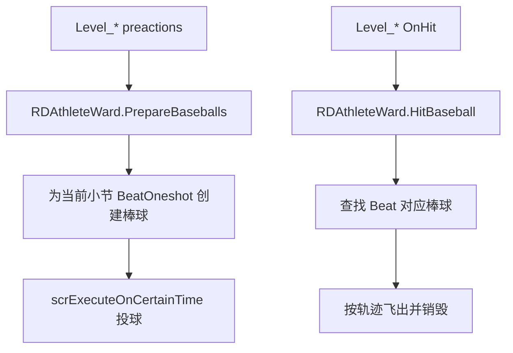

# 运动与节奏变体

本页覆盖阶段 5 的第三组官方关卡脚本：`Level_Freezeshot`、`Level_FreezeshotH`、`Level_FreezeshotBooth`、`Level_AthleteTherapy`、`Level_AthleteFinale` 和 `Level_Injury`。这些脚本围绕体育场棒球、记分牌灯、afterimage、杯子投掷、特殊棒球、理疗绳、泡泡、手机直播和病房滚动展开。

## 源码范围

| 类 | 源码路径 | 继承 | 主要职责 |
| --- | --- | --- | --- |
| `Level_Freezeshot` | `RDFucked/Assets/Scripts/Assembly-CSharp/Level_Freezeshot.cs` | `LevelBase` | 读取 room2 的 `RDAthleteWard`，准备棒球、命中棒球、安排记分牌灯和 afterimage。 |
| `Level_FreezeshotH` | `RDFucked/Assets/Scripts/Assembly-CSharp/Level_FreezeshotH.cs` | `LevelBase` | 生成 burst 粒子，捕捉 `SetVisible` 事件并对 handwrite 动画做特殊淡入淡出。 |
| `Level_FreezeshotBooth` | `RDFucked/Assets/Scripts/Assembly-CSharp/Level_FreezeshotBooth.cs` | `LevelBase` | Booth 版本 afterimage 与 hoodie ward 灯背景切换，并提供 Ian 手部切入。 |
| `Level_AthleteTherapy` | `RDFucked/Assets/Scripts/Assembly-CSharp/Level_AthleteTherapy.cs` | `LevelBase` | 加载蹦极绳、处理 hold 爆炸音、定时运行 tag、偷听成就计数。 |
| `Level_AthleteFinale` | `RDFucked/Assets/Scripts/Assembly-CSharp/Level_AthleteFinale.cs` | `LevelBase` | 终盘 Boss，处理杯子、棒球、HP、屋顶切换、雨、闪电、特殊棒球和失败剧情。 |
| `Level_Injury` | `RDFucked/Assets/Scripts/Assembly-CSharp/Level_Injury.cs` | `LevelBase` | Injury 专用泡泡、泡泡遮罩、手机直播、room render texture、棒球、病房滚动和 JanitorTV 同步。 |

## 与 `RDAthleteWard` 的关系

运动组脚本大量调用 `RDAthleteWard`。其中 `PrepareBaseballs(int bar)` 会遍历当前 `game.beats`，找到当小节、可命中的 `BeatOneshot`，实例化棒球并按 `chakTimeAbs` 提前投向目标行。`HitBaseball(HitType hittype, Beat beat)` 只处理 `HitType.Hit`，命中后播放草地和鸟动画，查找对应棒球，按当前 `BaseballTrajectoryType` 选择飞向屏幕、界外或普通角度，并在完成时销毁棒球。

记分牌灯由 `usingLights` 控制。`SetScoreboardLightWithChar(bool home, int index, char value)` 只在 `usingLights` 开启且 index 位于 0 到 13 时写灯；`SetScoreboardLightsWithString(bool home, string value, int startIndex, bool eraseLightsToRight)` 从指定 index 写入字符串，并按参数清理右侧灯。

## `Level_Freezeshot`

`Level_Freezeshot` 使用数据构造函数接收 `RDLevelData`。私有属性 `stadium` 会从 `room2.athleteWard` 取得 `RDAthleteWard` 并缓存。

### 字段

| 字段 | 类型 | 作用 |
| --- | --- | --- |
| `_stadium` | `RDAthleteWard` | 体育场环境缓存。 |
| `afterimageRenderers` | `List<Renderer>` | afterimage quad 的 renderer 列表。 |
| `afterimageTextures` | `List<RenderTexture>` | afterimage 使用的 render texture 列表。 |
| `renderTexPaster` | `scrPasteToRenderTex` | room2 画面复制到目标 render texture 的组件。 |
| `afterimageSequence` | `Sequence` | 周期性复制当前帧的 DOTween 序列。 |
| `lightTimings` | `float[]` | 16 个灯位在小节内触发的 beat 偏移。 |
| `lightPatterns` | `string[]` | 19 小节的灯光 pattern。 |
| `currentTextureIndex` | `int` | 当前写入的 afterimage texture 下标。 |
| `pasteIntervalSeconds` | `float` | afterimage 复制间隔。 |
| `fadeTimeSeconds` | `float` | afterimage 淡出时长。 |
| `afterimageColor` | `Color` | afterimage 叠色。 |
| `scaleTarget` | `float` | afterimage 淡出时的缩放目标。 |

### 生命周期

| 方法 | 行为 |
| --- | --- |
| `LoadBigAssets()` | 创建 16 个 render texture 和 16 个 HUD afterimage quad；设置 quad 尺寸为 HUD 原生分辨率；把 `room2.renderTexPaster` 启用。 |
| `preactions()` | 每小节读取 `conductor.barNumber`，调用 `stadium.PrepareBaseballs(bar)`。 |
| `actions()` | 根据当前小节读取 `lightPatterns`，按 `lightTimings` 安排记分牌灯；超过 pattern 范围后关闭 `stadium.usingLights`。 |
| `OnHit(HitType, Beat)` | 调用 `stadium.HitBaseball(hitType, beat)`。 |

### Afterimage 方法

| 方法 | 作用 |
| --- | --- |
| `SetAfterimageParams(float pasteSeconds, float fadeSeconds, string colorHex, float size)` | 设置复制间隔、淡出时长、颜色和缩放目标；此方法带 `[ListedMethod(false)]`。 |
| `ToggleAfterimages(bool on)` | 关闭旧序列；开启时创建无限循环序列，周期调用 `PasteCurrentFrame()`。 |
| `PasteCurrentFrame()` | 显示当前 renderer，把 room2 当前画面复制到对应 texture，设置 `_Opacity`、`_Scale`、`_ColorOverlay`，并用 DOTween 淡出；随后轮转下标。 |

`TurnOnLight(int index)` 会把 0 到 15 的 pattern 位映射到主客队灯列。前 8 位写 home，后 8 位换算到 guest 侧；偶数位写 `°`，奇数位写 `o`。

## `Level_FreezeshotH`

`Level_FreezeshotH` 是 Freezeshot 夜班的粒子与手写动画辅助脚本。它没有覆写 `Init()` 或 `LoadBigAssets()`，主要通过公开方法接受事件调用。

### Burst 字段与方法

| 成员 | 类型 | 作用 |
| --- | --- | --- |
| `burstSprite` | `CustomSprite` | burst 粒子的模板 sprite。 |
| `particlesPerBeat` | `float` | 每 beat 生成粒子的速度，默认 10。 |
| `burstLengthMin` / `burstLengthMax` | `int` | 单次 burst 粒子数量范围，默认 3 到 8。 |
| `burstDistanceMin` / `burstDistanceMax` | `float` | 粒子每段移动距离范围，默认 20 到 50。 |
| `burstAngleVariation` | `float` | 每段角度扰动，默认 45。 |
| `particleFadeBeats` | `float` | 粒子淡出 beat 数，默认 3。 |
| `currentBurst` | `int` | `DoBurst()` 使用并递增的种子。 |
| `alreadyAnimatedTargets` | `HashSet<string>` | 已触发 handwrite 特殊淡入淡出的目标 id。 |

| 方法 | 作用 |
| --- | --- |
| `DoBurst()` | 使用 `currentBurst` 调用 `DoBurstSeeded()`，随后递增种子。 |
| `DoBurstSeeded(int seed)` | 用固定 seed 生成粒子数量、起点和角度，实例化 `burstSprite`，按 `particlesPerBeat` 依次显隐、淡出并销毁。 |
| `SetBurstAngleVariation(float)` | 设置角度扰动。 |
| `SetBurstDistance(float, float)` | 设置最小和最大移动距离。 |
| `SetBurstFadeTime(float)` | 设置淡出 beat 数。 |
| `SetBurstSpeed(float)` | 设置每 beat 粒子数量。 |
| `SetBurstLength(int, int)` | 设置粒子数量范围。 |
| `SetBurstSprite(string)` | 从 `sprites` 字典按名称设置模板。 |
| `SetBurstSpriteByIndex(int)` | 从 `sprites.ElementAtOrDefault(id)` 设置模板。 |

`LevelEventWasRun(LevelEvent_Base levelEvent)` 会捕捉 `LevelEvent_SetVisible`。当事件显示目标 sprite，且目标 `customAnimation.data.name` 包含 `handwrite`，脚本把目标 id 加入 `alreadyAnimatedTargets`，对材质 `_SpecialFade` 做三段 tween，并把 overlay color 设置为浅灰。

## `Level_FreezeshotBooth`

Booth 版本与普通 Freezeshot 同样使用 afterimage，但只创建 6 个 render texture。灯光不调用 `RDAthleteWard` 记分牌灯，而是在第 2 个小节从 `room2.coleWard` 的 `RDHoodieBoyWard.lightBackgroundsContainer` 中收集 16 个灯背景对象。

| 方法 | 行为 |
| --- | --- |
| `LoadBigAssets()` | 创建 6 个 afterimage quad，启用 `room2.renderTexPaster`。 |
| `actions()` | 第 2 小节收集灯背景；按 `lightPatterns` 与 `lightTimings` 开关灯背景。 |
| `SetAfterimageParams(float pasteSeconds, float fadeSeconds)` | 设置复制间隔和淡出时长。 |
| `ToggleAfterimages(bool on)` | 开启或关闭 afterimage 循环。 |
| `PasteCurrentFrame()` | 复制当前帧并用固定 cyan 叠色淡出。 |
| `EnterIanHand(float timeMult)` | 把 1 号手切到 Ian 右手，刷新手部位置，并把手控制器 Y 位置设为 9。 |

## `Level_AthleteTherapy`

`Level_AthleteTherapy` 负责理疗段落中的蹦极绳、hold 爆炸音、延迟 rummage 声、tag 计时器和偷听成就。

| 字段 | 类型 | 作用 |
| --- | --- | --- |
| `hitSound` | `AudioSource` | hold 按下时播放的爆炸音。 |
| `hitTime` | `double` | hold beat 的 release 时间。 |
| `rope` | `BungeeRope` | `BungeeRope/BungeeRope` prefab 实例。 |
| `timerDestination` | `float` | 等待触发 tag 的目标 `Time.timeSinceLevelLoad`。 |
| `tagToRunAfterTimer` | `string` | 计时结束后运行的 tag。 |
| `rummageSound` | `AudioSource` | `sndStretchRummage` 音源。 |
| `eavesdroppingProgress` | `int` | 偷听成就进度。 |

| 方法 | 行为 |
| --- | --- |
| `LoadBigAssets()` | 加载 `BungeeRope/BungeeRope`，取得 `BungeeRope`，并默认隐藏。 |
| `preactions()` | 第 1 小节把 row0 玩家粒子缩放设为 0。 |
| `OnHeldPress(HitType, Beat)` | 记录 release 时间，并在该时间播放高通爆炸音。 |
| `OnHit(HitType, Beat)` | 当 JustMiss 且音频位置还没到 release 时间时，停止 hold 爆炸音。 |
| `Update()` | 当计时 tag 存在且达到目标时间，运行该 tag 并清空字段。 |

### 公开方法

| 方法 | 作用 |
| --- | --- |
| `MoveRope(float x, float y)` | 设置蹦极绳世界位置。 |
| `ShowRope(bool show)` | 开关蹦极绳对象。 |
| `ScheduleRummageSound()` | 2.3 秒后立即播放 `sndStretchRummage`。 |
| `FadeRummageSound()` | 让 rummage 声在 0.15 秒内淡出停止。 |
| `KillBeats()` | 遍历当前 `game.beats` 并销毁所有 beat。 |
| `StartTimer(float beats, string tagToRun)` | 把 beat 时长换算成秒，计时结束后运行指定 tag。 |
| `IncrementEavesdroppingProgress()` | 偷听进度加 1。 |
| `TryGrantEavesdroppingAchievement()` | 当进度等于 3，解锁 `Achievement.Eavesdropping`。 |

`BungeeRope.Awake()` 会把绳子初始 Y 设为 -2，再用 1 秒 InOutSine 循环移动到 2；它同时初始化分段聚光灯并显示第 0 细分。

## `Level_AthleteFinale`

`Level_AthleteFinale` 是运动线终盘 Boss。它接收 `RDLevelData`，在 `Init()` 中设置 checkpoint、cutscene 段落、音乐、`/` 跳转小节、HP 控制器和 `diaAthleteFinale`。

### 字段

| 字段 | 类型 | 作用 |
| --- | --- | --- |
| `bossText` | `RDBossStageText` | boss 舞台文字。 |
| `samuraiHittingCups` | `bool` | 控制是否在 `preactions()` 中准备杯子。 |
| `hittingBaseballs` | `bool` | 控制是否准备棒球。 |
| `nicoleRow` / `samuraiRow` / `luckyRow` | `Row` | 杯子、棒球和心形变化使用的行。 |
| `samuraiRowP2` / `luckyRowP2` | `Row` | 二人模式下的额外行。 |
| `coffeeShop` | `RDCoffeeShop` | 杯子 prefab 来源。 |
| `stadium` | `RDAthleteWard` | 体育场环境。 |
| `cupDict` | `Dictionary<Beat, Transform>` | beat 到杯子对象的映射。 |
| `cupSeqDict` | `Dictionary<Beat, Sequence>` | beat 到杯子 tween 序列的映射。 |
| `cupPrefab` | `GameObject` | 从咖啡店 cups_4 取得的杯子模板。 |
| `hpController` | `HPBarController` | Boss HP 控制器。 |
| `dealBossDamage` | `bool` | 控制 `OnHit()` 是否扣 boss HP。 |
| `notesCount` | `int` | Boss 最大 HP，默认 29。 |
| `startedRooftopTransition` | `bool` | 屋顶季节切换是否已经初始化。 |
| `specialBallSequence` | `Sequence` | 特殊棒球 tween。 |

### 生命周期

| 方法 | 行为 |
| --- | --- |
| `Init()` | 设置 checkpoint 为 71；设置 cutscene 段落 199-222、133-160、71-99；使用 `sndDDS`；`/` 跳到 151；加载 `diaAthleteFinale`。 |
| `LoadBigAssets()` | 设置 `missesToCrackHeart = 25`、`levelType = Boss`、`bossActNum = 5`；设置 Oneshot flash margin；加载并定位 boss 文字。 |
| `preactions()` | 第 1 小节缓存行、咖啡店和体育场，显示 Edega，设置 Nicole 排序，给杯子 prefab 加 `SpeedTrail`，设置 boss HP，并注册 miss 回调让 Lucky 裂心、Samurai 治疗；随后按开关准备杯子和棒球。 |
| `actions()` | 第 163、183、193、199 小节切换 `dealBossDamage`、`mistakeWeight` 和 `missesToCrackHeart`。 |
| `OnHit(HitType, Beat)` | 依次调用 `HitCup()`、`stadium.HitBaseball()`；`dealBossDamage` 开启时扣 boss HP。 |
| `FailLevel(RowEntity)` | 设置失败 rank、停止 UI flash 文本、延迟裂心和聚光灯、播放多 checkpoint gameover 对话、清周期节拍、隐藏实体并运行 `FailLevel` tag。 |

### 杯子与特殊棒球

| 方法 | 作用 |
| --- | --- |
| `PrepareCups(int bar)` | 遍历当前 beat，给当小节可命中的 `BeatOneshot` 准备杯子；二人模式按 Samurai 行分配。 |
| `SetupCup(BeatOneshot oneshot, bool player2)` | 创建杯子，在 `chakTimeAbs` 前安排 Nicole 投掷，落到 Samurai 行附近，随后抖动、淡出并销毁。 |
| `HitCup(HitType hittype, Beat beat)` | 命中对应 beat 时，从 Samurai 位置把杯子打飞并替换 tween 序列。 |
| `ThrowSpecialBall(int row, float beats, float skipTo)` | 创建特殊棒球，调用 `stadium.ThrowBaseball()`，并跳到序列指定进度。 |
| `DoSpecialBallSpeed(float speed, float beats, string easeStr)` | 对特殊棒球序列的 `timeScale` 做 tween。 |
| `TryHitSpecialBall(int row, float beats)` | 注册一次命中与 miss 回调；命中时调用 `HitSpecialBall()`。 |
| `HitSpecialBall(int row, float beats)` | 完成旧特殊球序列，创建新特殊球并从角色位置飞出。 |

### 场景公开方法

| 方法 | 作用 |
| --- | --- |
| `ShowBossText(float enterSpeed, float waitSpeed, float exitSpeed)` | 非 scrubbing 时显示白色 boss 文字并播放。 |
| `MoveSky(int room, float y, float durBeats, string easeStr)` | 移动指定 rooftop 的天空。 |
| `MoveSkyscrapers(int room, float y, float durBeats, string easeStr)` | 移动指定 rooftop 的楼群。 |
| `MoveRooftop(int room, float y, float durBeats, string easeStr)` | 移动指定 rooftop 的屋顶。 |
| `RooftopTransition(int room, int step)` | 按 step 切换夏季和秋季天空、楼群、屋顶。 |
| `SetCharacterLayer(int row, int layer)` | 设置指定行角色 sprite 排序为 `10 * layer`。 |
| `ShowEdega(bool show)` | 开关 `stadium.physioEdega`。 |
| `TogglePhysioLights(bool on)` | 设置理疗灯光 alpha 为 1 或 0。 |
| `SetRain(float baseballsPerSecond)` | 调用 `stadium.SetRain()`。 |
| `KillRain()` | 调用 `stadium.KillRain()`。 |
| `PlayLightning(bool showTeam)` | 调用 `stadium.AnimateLightning()`。 |
| `PlaySystemErrorSound(int num)` | Windows 下播放系统声音，编号 1 到 4 对应不同 `SystemSounds`。 |

## `Level_Injury`

`Level_Injury` 把运动线的棒球系统与 Injury 专用泡泡、手机直播和病房滚动连接起来。它使用 `room0` 体育场、`room1` 理疗房、`room2` 主病房和 `room3` 泡泡遮罩。

### 字段

| 字段 | 类型 | 作用 |
| --- | --- | --- |
| `injuryBubbles` | `scrInjuryBubbles` | 泡泡粒子与屏障控制。 |
| `bubbleMask` | `BubbleMask` | 泡泡遮罩对象。 |
| `phone` | `RDHoodiePhone` | Hoodie 手机直播对象。 |
| `phoneRoomX` | `float` | 手机所在房间 X 偏移，源码设置为 6000。 |
| `spriteData` | `List<LevelEvent_MakeSprite>` | 当前关卡 sprite 事件数据，用于查找 JanitorTV。 |
| `_stadium` / `_physioWard` / `_ward` | 环境缓存 | 分别缓存体育场、理疗房和主病房环境。 |
| `bubbleTween` / `phoneTween` / `streamTween` | `Tween` | 泡泡、手机和直播流移动 tween。 |
| `ballInited` | `bool` | room2 棒球 voxel 音量跟踪是否已初始化。 |
| `fallingBaseballsBaseSpd` | `float` | 下落棒球粒子基础 simulation speed。 |
| `wardScrolling` | `bool` | 主病房是否正在 seamless 滚动。 |
| `wardScrollSpeed` | `float` | 主病房滚动速度。 |
| `wardStartX` / `wardDistance` | `float` | 主病房滚动起点与累计距离。 |
| `janitorTV` | `CustomSprite` | JanitorTV sprite 缓存。 |

### 生命周期

| 方法 | 行为 |
| --- | --- |
| `LoadBigAssets()` | 加载 `BubbleParticles`，把泡泡墙、泡泡和屏障移到 HUD 顶部，移到 room0 并关闭系统；加载 `BubbleMask`，创建圆形和方形 collider；加载 `RDHoodiePhone` 并放到 room2 下方；缓存当前 sprite 数据。 |
| `preactions()` | 第 1 小节重建 room3 和 room2 的 render texture；每小节调用 `stadium.PrepareBaseballs(num)`。 |
| `OnHit(HitType, Beat)` | 调用 `stadium.HitBaseball(hitType, beat)`。 |
| `actions()` | 空实现。 |

### 泡泡与遮罩方法

| 方法 | 作用 |
| --- | --- |
| `ToggleBubbles(bool on)` | 开关泡泡系统。 |
| `FlipBubbles(bool flipped)` | 把泡泡对象旋转到 0 或 180 度。 |
| `MoveBubblesToRoom(int room)` | 把泡泡对象移动到指定房间中心。 |
| `MoveBubbles(float percent, float durBeats, string easeType)` | 按百分比和缓动移动泡泡 Y。 |
| `RunBubbleMask()` | 设置 `bubbleMask.playing = true`。 |
| `PauseBubbleMask()` | 设置 `bubbleMask.playing = false`。 |
| `DisableBubbleMask()` | 隐藏 bubble mask 对象。 |
| `EnableBubbleMask()` | 显示 bubble mask 对象。 |
| `MoveBubbleShape(int shapeID, float x, float y, float duration, string easeString)` | 移动指定 collider 形状。 |
| `ScaleBubbleShape(int shapeID, float x, float y, float duration, string easeString)` | 缩放指定 collider 形状。 |

### 记分牌、手机、棒球与病房

| 方法 | 作用 |
| --- | --- |
| `ToggleScoreboardLights(bool on)` | 设置体育场 `usingLights`，开启时清空灯。 |
| `SetScoreboardLights(bool home, string text, int startIndex)` | 从指定位置写入主队或客队灯文字。 |
| `ClearScoreboardLights(bool home)` | 清空主队或客队灯。 |
| `ClearAllScoreboardLights()` | 清空全部灯。 |
| `TogglePhone(bool on)` | 开关手机对象。 |
| `ToggleStream(bool on)` | 开关手机直播内容。 |
| `ToggleStreamUI(bool on)` | 以 0 秒切换直播 UI。 |
| `MovePhone(float xPerc, float yPerc, float durBeats, string easeStr)` | 按 HUD 百分比移动手机。 |
| `MoveStream(float yPerc, float durBeats, string easeStr)` | 移动直播流 pivot。 |
| `ShowOrHideStreamUI(bool show, float durBeats)` | 以 beat 时长切换直播 UI。 |
| `MoveHand(float yPerc, float durBeats, string easeStr)` | 移动手机里的手。 |
| `ToggleHandPress(bool pressing, float durBeats, string easeStr)` | 切换手机手部按压状态。 |
| `SetTransferTargetForRow(int sourceRow, int destRow)` | 设置行转移目标。 |
| `ToggleBaseball(bool on)` | 开关 room2 voxel 棒球，并注册音量 tracker 控制棒球缩放。 |
| `ToggleFallingBaseballs(bool on)` | 开关 room2 下落棒球粒子。 |
| `SetFallingBaseballsSpeed(float spdPercent)` | 以百分比修改下落棒球 simulation speed。 |
| `FadePhysioFG(float opPercent, float durBeats)` | 淡入淡出理疗房前景。 |
| `FadePhysioLights(float opPercent, float durBeats)` | 淡入淡出理疗房灯光。 |
| `StartWardScroll(float scrollSpeed)` | 开启主病房 seamless 滚动，启用 extra、隐藏 right end，并注册 update。 |
| `StopWardScroll()` | 停止主病房滚动。 |
| `WardUpdate()` | 每帧用累计距离对 510 宽度取模，移动主病房 X。 |
| `ToggleJanitorTVSync(bool on)` | 查找 filename 为 `JanitorTV` 的 sprite，并绑定或解绑帧更新回调。 |

`JanitorTVUpdate(CustomAnimation anim, CustomAnimationClip clip, int frame)` 会按帧奇偶把 `room0.renderQuadPivot` 的 X 位置设为 177 或 179 减去半个 RD 宽度，用于让画面随 JanitorTV 动画帧同步偏移。

## Mod 关注点

| 场景 | 注意事项 |
| --- | --- |
| 调用 afterimage 方法 | `SetAfterimageParams()` 只写参数，必须再调用 `ToggleAfterimages(true)` 才会周期复制帧。 |
| 调用棒球方法 | `HitBaseball()` 需要 `PrepareBaseballs()` 已为对应 beat 建立字典项；这些脚本通常在 `preactions()` 中完成准备。 |
| 调用 `Level_AthleteFinale` 杯子方法 | 杯子依赖第 1 小节缓存的 `nicoleRow`、`samuraiRow`、`coffeeShop` 和 `cupPrefab`。 |
| 调用 Injury 手机方法 | 手机 prefab 在 `LoadBigAssets()` 加载；移动与 UI 方法依赖 `RDHoodiePhone` 的 `streamPivot` 和内部手部对象。 |
| 调用病房滚动 | `StartWardScroll()` 会注册 update 回调并移动 `room2.hospitalWard`，停止时只关闭滚动布尔值。 |

## 下一步

阶段 5 下一组深写视觉与窗口特殊关卡，覆盖 `Level_SVT`、`Level_Smokin`、`Level_Blurred`、`Level_Bitterness`、`Level_Montage`、`Level_Montage2` 和 `Level_Trailer`。
