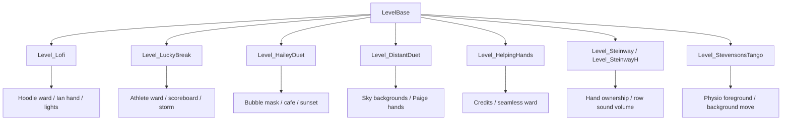

# 叙事与场景关卡

本页覆盖阶段 5 的第五组官方关卡脚本：`Level_Lofi`、`Level_Lounge`、`Level_LuckyBreak`、`Level_HaileyDuet`、`Level_DistantDuet`、`Level_HelpingHands`、`Level_Steinway`、`Level_SteinwayH` 和 `Level_StevensonsTango`。这些脚本以叙事场景、手部归属、房间背景、灯光、咖啡店、体育场和 credits 流程为主。

## 源码范围

| 类 | 源码路径 | 继承 | 主要职责 |
| --- | --- | --- | --- |
| `Level_Lofi` | `RDFucked/Assets/Scripts/Assembly-CSharp/Level_Lofi.cs` | `LevelBase` | 加载 HoodieBoy ward 到 room2，安排灯光 pattern，并切换 Ian 手。 |
| `Level_Lounge` | `RDFucked/Assets/Scripts/Assembly-CSharp/Level_Lounge.cs` | `LevelBase` | 当前源码只保留空的生命周期覆写。 |
| `Level_LuckyBreak` | `RDFucked/Assets/Scripts/Assembly-CSharp/Level_LuckyBreak.cs` | `LevelBase` | 使用体育场棒球、记分牌、雨、风暴、闪电和 Edega 显示。 |
| `Level_HaileyDuet` | `RDFucked/Assets/Scripts/Assembly-CSharp/Level_HaileyDuet.cs` | `LevelBase` | 加载泡泡遮罩、夕阳背景、咖啡店交互和 Nicole/Logan 杯子投掷。 |
| `Level_DistantDuet` | `RDFucked/Assets/Scripts/Assembly-CSharp/Level_DistantDuet.cs` | `LevelBase` | 加载双层城市天空，处理 Paige 手部、夜间病房、天空滚动和灰度切换。 |
| `Level_HelpingHands` | `RDFucked/Assets/Scripts/Assembly-CSharp/Level_HelpingHands.cs` | `LevelBase` | 加载 seamless 主病房与 credits，处理 credits/preorders 滚动和行挂载。 |
| `Level_Steinway` | `RDFucked/Assets/Scripts/Assembly-CSharp/Level_Steinway.cs` | `LevelBase` | 按玩家模式配置 Ian 手，控制鸟声与 Mrs Stevenson 音量。 |
| `Level_SteinwayH` | `RDFucked/Assets/Scripts/Assembly-CSharp/Level_SteinwayH.cs` | `LevelBase` | Steinway 夜班音量辅助方法。 |
| `Level_StevensonsTango` | `RDFucked/Assets/Scripts/Assembly-CSharp/Level_StevensonsTango.cs` | `LevelBase` | 移动理疗房背景并开关前景 renderer。 |

## 叙事脚本关系

## `Level_Lofi`

`Level_Lofi` 使用数据构造函数接收 `RDLevelData`。它加载 `RDHoodieBoyWard/RDHoodieBoyWard`，把实例绑定到 `room2`，X 坐标移动到 6000，并把 room2 的行容器 Y 设置为 -30。

### 字段

| 字段 | 类型 | 作用 |
| --- | --- | --- |
| `hoodieBoyWard` | `RDHoodieBoyWard` | room2 的 Hoodie boy ward 实例。 |
| `lightPatterns` | `string[]` | 30 小节的 16 位灯光 pattern。 |

### 生命周期

| 方法 | 行为 |
| --- | --- |
| `LoadBigAssets()` | 加载 hoodie ward；设置 room2 行容器高度；禁用 1 号玩家手可用权、禁用 2 号 CPU 手可用权，并把 1 号右手设为 CPU。 |
| `preactions()` | 空覆写。 |
| `actions()` | 读取当前小节 pattern；按 pattern 位安排 `TurnOnLight()` 或 `TurnOffLights()`，偶数位使用 `i / 4`，奇数位使用 `i / 4 + 0.25 - 0.15` 的 beat 偏移。 |

| 方法 | 作用 |
| --- | --- |
| `EnterIanHand(float timeMult)` | 把 1 号右手切为 Ian，刷新右手位置，并把 handController1 的 Y 设为 9。 |

## `Level_Lounge`

`Level_Lounge` 当前源码只包含数据构造函数，以及空的 `Init()`、`preactions()` 和 `actions()` 覆写。它在文档中保留条目，用于覆盖清单和后续索引。

## `Level_LuckyBreak`

`Level_LuckyBreak` 通过 `RDAthleteWard` 连接棒球、记分牌、天气和体育场事件。`stadium` 从 `room0.athleteWard` 缓存，`ward` 从 `room2.athleteWard` 缓存。

### 字段

| 字段 | 类型 | 作用 |
| --- | --- | --- |
| `athleteHomeEnt` | `RowEntity` | 主队运动员实体字段。 |
| `athleteGuestEnt` | `RowEntity` | 客队运动员实体字段。 |
| `_stadium` | `RDAthleteWard` | room0 体育场缓存。 |
| `_ward` | `RDAthleteWard` | room2 athlete ward 缓存。 |

### 生命周期与命中

| 方法 | 行为 |
| --- | --- |
| `preactions()` | 第 1 小节开启体育场灯并清空；每小节调用 `stadium.PrepareBaseballs(num)`。 |
| `OnHit(HitType, Beat)` | 调用 `stadium.HitBaseball()`；按 beat 行 id 是否为 0 判断 home，并更新记分牌。 |

### 公开方法

| 方法 | 作用 |
| --- | --- |
| `SetBaseballTrajectory(string trajectoryString)` | 设置棒球轨迹。 |
| `SetBaseballAngleRange(float minAngle, float maxAngle)` | 设置棒球角度范围。 |
| `SetRain(float baseballsPerSecond)` | 设置棒球雨。 |
| `KillRain()` | 停止棒球雨。 |
| `CustomBaseball(...)` | 按起点、终点、高度、旋转、透明度、时长和缓动创建自定义棒球。 |
| `ToggleScoreboardLights(bool on)` | 开关记分牌灯，开启时清空全部灯。 |
| `SetScoreboardLights(bool home, string text, int startIndex)` | 写入主队或客队灯文字。 |
| `SetScoreboardLightsGentle(bool home, string text, int startIndex)` | 写入灯文字且不清空右侧灯。 |
| `ClearScoreboardLights(bool home)` | 清空主队或客队灯。 |
| `ClearAllScoreboardLights()` | 清空全部灯。 |
| `SetTrackingScore(bool on)` | 开关体育场分数跟踪。 |
| `SetGlitchyLights(bool on)` | 开关 glitchy lights。 |
| `AdvanceScoreboardInning()` | 推进记分牌 inning。 |
| `DoLightning(bool showTeam)` | 播放闪电动画。 |
| `SetStorm(bool storm, bool animate)` | 设置风暴状态。 |
| `SetTeamStare()` | 设置队伍盯视、隐藏棒球 holder，并清理 row0 玩家粒子。 |
| `ShowPreStorm()` | 进入 pre storm 状态。 |
| `ShowEdega(bool show)` | 在 room2 ward 中开关 Edega。 |

## `Level_HaileyDuet`

`Level_HaileyDuet` 混合 Injury 的泡泡遮罩、Intimate 背景和咖啡店投杯。`nicole` 指向 row12，`logan` 指向 row1，`cafe` 从 room0 coffeeShop 取得。

### 初始化素材

| 方法 | 行为 |
| --- | --- |
| `LoadBigAssets()` | 加载 `BubbleMask`，创建圆形和方形 collider 并挂到 room3；为 room1 添加 sunset、city、couple 和 foreground 四组背景；调用 `SunsetVisible(false)`。 |
| `preactions()` | 第 1 小节关闭 room0 Cole ward spectrum；重建 room3 render texture。 |

### 公开方法

| 方法 | 作用 |
| --- | --- |
| `SunsetVisible(bool visible)` | 开关四组 Intimate 背景。 |
| `SunsetUmbrella(float fps)` | 设置 couple 背景播放 `Intimate_CoupleSS` 的 1 到 5 帧动画，并按传入 fps 播放一次。 |
| `CafeVisible(bool visible)` | 开关 cafe 特殊柜台；显示时把 Nicole 排序放到柜台后一层，隐藏时还原排序。 |
| `CafeMan(bool visible)` | 控制 CoffeeMan 滑入或滑出。 |
| `ThrowCoffee()` | 从 Nicole 附近投出第一个 4 杯 sprite，跳到 Logan 附近，旋转、抖动，再下落并淡出。 |
| `RunBubbleMask()` | 运行泡泡遮罩。 |
| `PauseBubbleMask()` | 暂停泡泡遮罩。 |
| `StopBubbleMask()` | 停止遮罩内所有泡泡粒子。 |
| `DisableBubbleMask()` | 隐藏泡泡遮罩对象。 |
| `EnableBubbleMask()` | 显示泡泡遮罩对象。 |
| `MoveBubbleShape(int shapeID, float x, float y, float duration, string easeString)` | 移动指定遮罩 collider。 |
| `ScaleBubbleShape(int shapeID, float x, float y, float duration, string easeString)` | 缩放指定遮罩 collider。 |
| `SetBubbleSpeed(float s)` | 设置每个泡泡粒子的 simulation speed，附带 0.8 到 1.2 的随机倍率。 |

## `Level_DistantDuet`

`Level_DistantDuet` 加载两组城市天空背景。普通组使用 `Intimate_SkySS`、`Intimate_CityBackSS` 和 `Intimate_CityFrontSS`；当 `data.settings.description == "nightshift"` 时，第一组资源名追加 `_Blue/0`。第二组 city 背景会旋转 180 度、Y 移到 60，并设置 greyscale。

### 字段

| 字段 | 类型 | 作用 |
| --- | --- | --- |
| `sky` | `Background` | 天空背景。 |
| `cityFront` / `cityBack` | `Background` | 第一组城市前后景。 |
| `cityFront2` / `cityBack2` | `Background` | 第二组城市前后景。 |
| `skyBackgrounds` | `Background[]` | 第一组天空背景。 |
| `skyBackgrounds2` | `Background[]` | 第二组天空背景。 |
| `allSkyBackgrounds` | `Background[]` | 两组背景合并数组。 |
| `skySpeedMult` | `float` | 天空滚动速度倍数。 |
| `skySpeedTween` | `Tween` | 天空速度 tween。 |

### 公开方法

| 方法 | 作用 |
| --- | --- |
| `SetNightMode()` | 查找所有 `RDMainWard` 并切到 night。 |
| `DDHandSetup(bool isNightShift)` | 单人时设置 Paige 左手；按玩家模式刷新 handController1/2，并把 Y 设为 -25。 |
| `GlowHandsOn()` | 给所有手设置白色边框。 |
| `GlowHandsOff()` | 清空所有手边框。 |
| `Room1HandSetup(bool isNightShift)` | 显示 handController0，并按夜班和二人模式决定显示 BothHands 或 RightHand。 |
| `HidePaigeHand()` | 单人模式下隐藏 handController2 左臂。 |
| `SetSkySpeed(float speed, float durBeats, string easeStr)` | 带 `[ListedMethod(false)]`；设置或 tween `skySpeedMult` 并刷新所有天空背景 X 速度。 |
| `ToggleSecondSky(bool on)` | 带 `[ListedMethod(false)]`；开关第二组天空背景。 |
| `ToggleGreySky(bool on)` | 带 `[ListedMethod(false)]`；开关第一组天空背景灰度。 |

## `Level_HelpingHands`

`Level_HelpingHands` 加载 seamless 主病房与 credits。`room2Ward` 被放到 X 7020、Y 99，`scrollRoom = 2`；`credits` 移到 X 3000，设置为 HelpingHands 模式并关闭 logo 声音。

| 字段 | 类型 | 作用 |
| --- | --- | --- |
| `room2Ward` | `RDMainWard` | seamless 滚动主病房。 |
| `speedTween` | `Tween` | credits 速度 tween。 |
| `credits` | `RDCredits` | credits 资源实例。 |
| `creditsSpeed` | `float` | credits Y 方向滚动速度。 |
| `preordersSpeed` | `float` | preorders X 方向滚动速度。 |

| 方法 | 作用 |
| --- | --- |
| `preactions()` | 第 1 小节隐藏 `handControllerOnTop`。 |
| `actions()` | 第 30 小节注册 `Update2()`，设置 ward 滚动速度 200，并把 creditsSpeed 设为 0。 |
| `SetWardNight()` | 把所有 `RDMainWard` 设为 night。 |
| `SetWardDay()` | 把所有 `RDMainWard` 设为 day。 |
| `BeginCredits()` | 把 room1 行实体挂到 credits 下，并重播 logo。 |
| `EndCredits()` | 把 room1 行实体挂回 room1 rowContainer。 |
| `BeginPreorders()` | 停止旧速度 tween，清 creditsSpeed，并切换 credits 到 preorders。 |
| `TweenCreditsSpeed(float s, float d, string e)` | 按缓动 tween creditsSpeed。 |
| `Update2()` | creditsSpeed 大于 0 时上移 credits；preordersSpeed 大于 0 时左移 credits。 |

## `Level_Steinway`

`Level_Steinway` 在第 2 小节设置 Ian 手部归属。二人模式下，脚本根据 P1/P2 当前 hand update type 判断 Ian 替换哪只手，并同步 CPU/玩家可用手与 CPU 手；单人模式下，room0 和 room1 都设置为 Ian 左手、CPU 可用左手、玩家可用右手。

| 方法 | 作用 |
| --- | --- |
| `ToggleIanInRoom(int room, bool enable, bool replace)` | 当 replace 为 true 时，根据当前玩家手型决定显示 Ian 或玩家的另一只手；随后更新指定房间 hand controller。 |
| `ToggleBirdsVolume(bool on, bool solo)` | 控制 row0 到 row3 的鸟声量；solo 时除 row0 外音量为 0；pan 在二人模式用 `GC.PanP1`，单人按行递增。 |
| `ToggleMrsStevensonVolume(bool on)` | 控制 row4 的音量与 pan；二人模式 pan 为 `GC.PanP2`，单人为 -0.5。 |

## `Level_SteinwayH`

`Level_SteinwayH` 当前源码的 `Init()`、`preactions()`、`actions()` 都为空。它保留与 `Level_Steinway` 相同的两个音量公开方法：

| 方法 | 作用 |
| --- | --- |
| `ToggleBirdsVolume(bool on, bool solo)` | 控制 row0 到 row3 的鸟声量与 pan。 |
| `ToggleMrsStevensonVolume(bool on)` | 控制 row4 的音量与 pan。 |

## `Level_StevensonsTango`

`Level_StevensonsTango` 通过私有属性 `physioWard` 从 room0 的 `athleteWard` 取得 `RDAthleteWard`。

| 方法 | 作用 |
| --- | --- |
| `MoveBackground(float posX, float durationInBeats, string ease)` | 把 beat 时长换算为秒，解析缓动，并 tween `physioWard.transform` 的 local X。 |
| `ToggleForeground(bool toggled)` | 开关 `physioWard.physioFg` 的 `MeshRenderer.enabled`。 |

## 源码研究关注点

| 场景 | 注意事项 |
| --- | --- |
| 手部归属 | DistantDuet、Lofi、Steinway 都会直接调用 `SetHandToIan`、`SetHandToPaige` 或 hand controller 更新方法。 |
| 体育场复用 | LuckyBreak 使用 `RDAthleteWard` 棒球、分数、灯光、风暴和雨；与运动页中的 baseball 流程共享底层对象。 |
| 泡泡遮罩 | HaileyDuet 自己创建 BubbleMask collider，调用移动或缩放方法前需要对应 shapeID 存在。 |
| Credits 挂载 | HelpingHands 会把 room1 行实体临时挂到 credits 下，结束时再挂回房间 rowContainer。 |
| 空壳关卡 | Lounge 与 SteinwayH 的空生命周期也要保留在覆盖清单中，防止后续误判为漏写。 |

## 复核状态

本页已纳入 [官方关卡覆盖清单](/api/levels/coverage.md)，对应叙事与场景关卡类群已完成阶段 7 复核。
