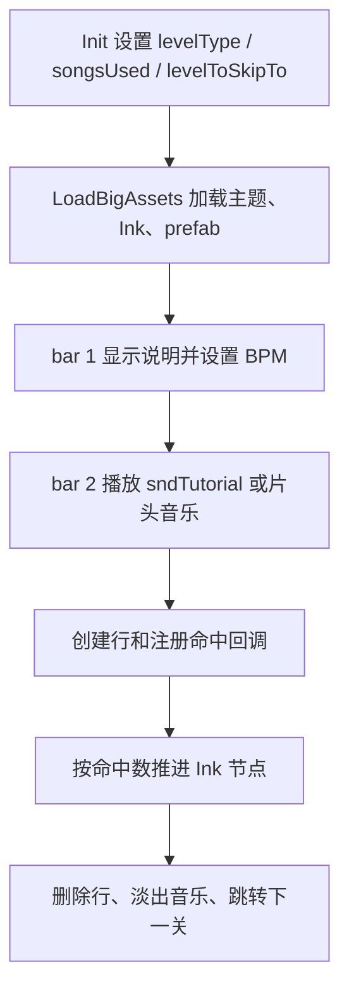

# 教程与开场关卡

本页深写阶段 5 的第一组官方关卡脚本：开场、教程和片头字幕。它们负责新玩家教学、Booth 变体跳转、Oneshot 教程、特殊手部提示、片头主题轮播和进入下一关的流程。

## 源码范围

| 脚本 | 源码路径 | 继承 | 主要职责 |
| --- | --- | --- | --- |
| `Level_Intro` | `RDFucked/Assets/Scripts/Assembly-CSharp/Level_Intro.cs` | `LevelBase` | 标题、首段对话、基础七拍教程、basement 过场和跳转。 |
| `Level_Tutorial_1` | `RDFucked/Assets/Scripts/Assembly-CSharp/Level_Tutorial_1.cs` | `LevelBase` | Expo/双人 Classic 教程，处理控制器文本和一二玩家切换。 |
| `Level_Tutorial_2` | `RDFucked/Assets/Scripts/Assembly-CSharp/Level_Tutorial_2.cs` | `LevelBase` | Intimate 前置 Classic 教程，包含 `ShowRowX()` 行跳拍演示。 |
| `Level_Tutorial_3` | `RDFucked/Assets/Scripts/Assembly-CSharp/Level_Tutorial_3.cs` | `LevelBase` | Classy 前置短教程，按 Ink 节点串行跳转。 |
| `Level_Tutorial_Boss2` | `RDFucked/Assets/Scripts/Assembly-CSharp/Level_Tutorial_Boss2.cs` | `LevelBase` | Boss2/Booth 前置 Oneshot 教程。 |
| `Level_Tutorial_DistantDuet` | `RDFucked/Assets/Scripts/Assembly-CSharp/Level_Tutorial_DistantDuet.cs` | `LevelBase` | DistantDuet 前置 swing Classic 教程。 |
| `Level_Tutorial_EighthDelay` | `RDFucked/Assets/Scripts/Assembly-CSharp/Level_Tutorial_EighthDelay.cs` | `LevelBase` | EighthDelay 前置 Oneshot 延迟教程。 |
| `Level_Tutorial_Lofi` | `RDFucked/Assets/Scripts/Assembly-CSharp/Level_Tutorial_Lofi.cs` | `LevelBase` | Lofi 教程中的蜘蛛 prefab 控制方法。 |
| `Level_Tutorial_Oneshot` | `RDFucked/Assets/Scripts/Assembly-CSharp/Level_Tutorial_Oneshot.cs` | `LevelBase` | SVT 前置完整 Oneshot 教程。 |
| `Level_Tutorial_OneshotIntro` | `RDFucked/Assets/Scripts/Assembly-CSharp/Level_Tutorial_OneshotIntro.cs` | `LevelBase` | Lofi 前置 Oneshot 入门教程。 |
| `Level_OpeningCreds` | `RDFucked/Assets/Scripts/Assembly-CSharp/Level_OpeningCreds.cs` | `LevelBase` | 片头字幕、主题轮播、角色轮换和返回选关。 |

## 总体流程

教程脚本大量使用 `scrExecuteOnHit` 注册一次性或持久命中回调。Oneshot 教程还覆写 `BeepGet()`、`BeepSet()`、`BeepGo()`，在提示音阶段显示或隐藏 `RDClass.Vfx.oneshotSpotlights`。

## 跳转目标与资源

| 脚本 | `songsUsed` | Ink 或资源 | `levelToSkipTo` |
| --- | --- | --- | --- |
| `Level_Intro` | `sndIntro2`、`sndTutorial` | `diaIntro`、`RDBasement`、`many_notes_tile_filled` | Booth 为 `OrientalInsomniac`，普通为 `OrientalTechno`。 |
| `Level_Tutorial_1` | `sndTutorial` | Booth/双人/移动端选择不同 dialogue 文件 | Booth 为 `OrientalInsomniac`，普通为 `OrientalTechno`。 |
| `Level_Tutorial_2` | `sndTutorial` | `diaTutorialIntimate` | `Intimate`。 |
| `Level_Tutorial_3` | `sndTutorial` | `diaTutorial3` | `Classy`。 |
| `Level_Tutorial_Boss2` | `sndTutorial` | `diaTutorialBoss2` | Booth 为 `Boss2Booth`，普通为 `Lofi`。 |
| `Level_Tutorial_DistantDuet` | `sndTutorial` | `diaTutorialDistantDuet` | `DistantDuet`。 |
| `Level_Tutorial_EighthDelay` | `sndTutorial` | `diaTutorialEighthDelay` | `SVT` 字段初始化；完成时直接跳 `EighthDelay`。 |
| `Level_Tutorial_Lofi` | 无显式音乐 | `Spiders/Spiders` prefab | 脚本内无跳转。 |
| `Level_Tutorial_Oneshot` | `sndTutorial` | `diaTutorialOneshot` | `SVT`。 |
| `Level_Tutorial_OneshotIntro` | `sndTutorial` | `diaTutorialOneshotIntro` | `Lofi`。 |
| `Level_OpeningCreds` | `sndOpeningCredits` | `Noise` 背景、`RDCreditsNames`、多个 `RDTheme` | 完成后 `GoToLevelSelect()`。 |

## Level_Intro

`Level_Intro` 使用 `LevelPhase` 把流程拆成 `TitleScreen`、`FirstDialogue`、`Tutorial`、`AfterTutorial` 和 `OpeningCredits`。`preactions()` 与 `actions()` 都先读取 `conductor.barNumber`，再按 `levelPhase` 分发到对应方法。

### 字段

| 字段 | 类型 | 行为 |
| --- | --- | --- |
| `farmer`、`farmer_reflection` | `scrChar` | 患者角色和倒影。Divekick 模式下角色改为 `Tentacle`。 |
| `drIan`、`drIan_reflection` | `scrChar` | Ian 和倒影。 |
| `backgroundNotes` | `Background` | 教程音乐开始时显示的音符背景。 |
| `levelPhase` | `LevelPhase` | 当前开场阶段。 |
| `helpgiven` | `bool` | 第一次 miss 帮助文本开关。 |
| `firstBarOnTutorial` | `int` | 教程开始小节前一小节编号。 |
| `sceneContainer` | `Transform` | 开场角色容器。 |
| `pressCount` | `float` | 第一个教程小节内玩家按键计数。 |
| `hasHitOnce` | `bool` | 防止重复触发 EveryBeat 帮助。 |
| `playTutorialMusic` | `int` | `PlayTutorialMusic()` 到 `FirstDialogue_Preactions()` 的状态桥。 |
| `dictIntro` | `Dictionary<string, object>` | Ink 参数，包含控制器名称。 |
| `rdBasement` | `GameObject` | basement 环境 prefab。 |

### 生命周期

| 方法 | 行为 |
| --- | --- |
| `Init()` | 设置 `multiroom`、歌曲、隐藏手、Booth/普通跳转目标，计算宽高比，填充 `P1ControlName` Ink 参数。 |
| `LoadBigAssets()` | 调用基础加载，添加 notes 背景，创建 `sceneContainer`，加载 `diaIntro` 和 `RDBasement`。 |
| `ShowingLogo_Preactions(1)` | 设置 cutscene、BPM 82、无歌曲、创建 Ian/Farmer 及倒影、设置 room0 黑色 overlay，并启动 Booth 或普通开场协程。 |
| `FirstDialogue_Preactions()` | `playTutorialMusic == 0` 时设置 BPM 88、8 拍每小节并播放教程音乐。 |
| `Tutorial_Preactions()` | 第一次进入时记录教程起点；第 1 到 6 个相对小节逐步创建七拍、Freeze、命中/失误回调和过场。 |
| `ShowDrGreyCutscene()` | 关闭 Beat、删除行、淡出并启动 `LoadNextLevel()`。 |
| `LoadNextLevel()` | 跑 `part2` 或 `part2_EXPO`，淡出音乐，停止 ambience，写入首次游玩状态，跳到 `levelToSkipTo`。 |

### 公开方法

| 方法 | 行为 |
| --- | --- |
| `RunPart2Ish()` | 运行 `part2ish` 或 `part2ish_EXPO`，结束后进入 `Tutorial` 阶段。 |
| `ShowArm()` | 显示顶部手部控制器并滑入。 |
| `EveryBeat()` | 玩家在第一个教程小节过密按键时停止 beats，播放 shout effect，跑 `EveryBeat` Ink 后恢复 OnBeat。 |
| `PlayTutorialMusic()` | 标记播放教程音乐，显示 notes 背景，切到 Handmode，并停止 basement ambience。 |
| `ShowBasement()` | 隐藏 notes 背景，切 cutscene，显示 basement ambience。 |
| `CreateRow()` | 创建 Classic 行，设置角色位置和 sprite glow；旁白开启时播连接提示并叙述行信息。 |
| `DiaTutorialHit(string)` | 设置下一小节播放风格并运行指定 Ink 节点。 |

## Classic 教程

### Level_Tutorial_1

| 区域 | 行为 |
| --- | --- |
| `Init()` | 设置 `levelType = Tutorial`，根据 Booth、自定义按钮、双人和移动端选择 dialogue 文件；写入控制器名和玩家条颜色参数。 |
| `LoadBigAssets()` | 显示教程主题。 |
| `preactions()` bar 1 | 显示 beatbox 文本，注册任意按键计数，显示跳过教程状态，运行 `expoTwoPlayer0`，设置 BPM 88。 |
| bar 2 | Freeze，播放教程音乐，3 秒后创建 Classic 行并滑入手。 |
| bar 3 | 设置 P1 第七拍命中提示，开启 margin error，注册命中、miss、完全漏按回调。 |
| bar 5 | 切换到 P2 玩家并继续七拍教程。 |
| bar 8 | 关闭 Beat、删除行、淡出并跳到目标关卡。 |

`callTextHit()` 会根据 `missedAny` 选择 `expoTwoPlayer1Perfect` 或 `expoTwoPlayer3`。`spaceprompt()` 在没有按键时运行 `expoTwoPlayer0NoInput`。

### Level_Tutorial_2

| 区域 | 行为 |
| --- | --- |
| `Init()` | 设置 `dialogueName = diaTutorialIntimate`、`levelToSkipTo = Intimate`、`multiroom = true`。 |
| `LoadBigAssets()` | 显示教程主题。 |
| bar 1 | 显示 beatbox 文本，注册任意按键检测，运行 `Tutorial0`，无歌曲，BPM 88。 |
| bar 2 | Freeze，播放教程音乐，创建 Farmer Classic 行，设置 `sndHatTight` 行声音和音量。 |
| bar 3 | 注册命中和 miss 回调，开始 Classic 七拍。 |
| bar 7 | 关闭 Beat、删除行、隐藏手、淡出并跳到 `Intimate`。 |
| `actions()` | 第 1 到 3 小节分别做描述旁白、行连接旁白和 nurse 文本。 |

`ShowRowX()` 把第 1 行 skip pattern 设置为 `----xx`，旁白开启时播放患者更新音并叙述行信息。

### Level_Tutorial_3

`Level_Tutorial_3` 是短教程。构造函数接收 `RDLevelData` 并传给 `LevelBase`。`Init()` 设置 `sndTutorial`、`levelType = Tutorial` 和 `levelToSkipTo = Classy`。`LoadBigAssets()` 显示教程主题并加载 `diaTutorial3`。第 1 小节 `preactions()` 设置 BPM 88 并播放教程音乐；`actions()` 运行 `Tutorial0`，两秒后运行 `Tutorial1`，随后淡出音乐并跳到 `Classy`。

## Oneshot 教程

Oneshot 教程脚本共享一套结构：第 1 小节设置 hit sound、BPM、跳过提示和 `NoMusic` 节点；第 2 小节播放 `sndTutorial` 并延迟创建 Oneshot 行；第 3 小节使用 `OneshotSayGetSet()` 提示；后续小节注册 hit 计数并在计数归零后跳转。

| 脚本 | 命中目标 | 跳转 | 特殊行为 |
| --- | --- | --- | --- |
| `Level_Tutorial_OneshotIntro` | 第一阶段 6 次、第二阶段 6 次 | `Lofi` | 第 6 小节 `crotchetsPerBar = 16`，添加 4 个 Oneshot 节拍。 |
| `Level_Tutorial_Oneshot` | 第一阶段 6 次、第二阶段 14 次 | `SVT` | 第 5 小节 `OnBeatOneshotConstInterval(1, 1, 8f, 2f)`；第 6 小节切到 32 crotchets 并切换 loop。 |
| `Level_Tutorial_Boss2` | 第一阶段 6 次 | Booth 为 `Boss2Booth`，普通为 `Lofi` | 使用 `diaTutorialBoss2`；第一次命中区分 perfect/非 perfect；完成后按 miss 状态选择 `Interlude2` 或 `Interlude2NoMisses`。 |
| `Level_Tutorial_EighthDelay` | 第一阶段 6 次 | 完成时跳 `EighthDelay` | 创建 `TutorialNoteBlack` 背景，使用 `OneshotSayGetSet(0f, 1.5f)` 和 `AddBeatOneshot(1, 0f, 1.5f)`。 |

### 共享字段

| 字段 | 行为 |
| --- | --- |
| `phase1hitstogo` / `phase1HitsLeft` | 第一阶段剩余命中次数。 |
| `phase2hitstogo` / `phase2HitsLeft` | 第二阶段剩余命中次数。 |
| `firstTimeHitPossible` | 首次命中是否仍能走 perfect 文本。 |
| `anymisses` / `anyMisses` | 记录是否发生过任意 miss，用于选择结尾 Ink。 |
| `helpgiven` / `helpGiven`、`helpgiven2` | 控制首次 miss 和完全漏按帮助文本。 |
| `nursesaid` | 第 3 小节 nurse 文本只运行一次。 |

### Beep 覆写

| 方法 | 行为 |
| --- | --- |
| `BeepGet()` | 调用 `base.BeepGet()`，然后 `oneshotSpotlights.Show(0)`。 |
| `BeepSet()` | 调用 `base.BeepSet()`，然后 `oneshotSpotlights.Show(1)`。 |
| `BeepGo()` | 隐藏 `oneshotSpotlights`。 |

## DistantDuet 教程

`Level_Tutorial_DistantDuet` 是 Classic swing 教程。`Init()` 设置 `levelToSkipTo = DistantDuet`，第一阶段和第二阶段各 3 次命中。`callText2()` 创建 Farmer Classic 行并设置 sprite glow。第 3 小节用 `OnBeatClassic(1, 1, 0f, 1f, 1, SwingBeatType.SwingCustom, false, 0.5f)` 开启第一阶段；第 4 小节关闭第 1 行 Beat，注册第二阶段命中，使用 `OnBeatClassic(2, 1, 1f, 1f, 1, SwingBeatType.SwingCustom, false, 0.5f)`。第二阶段结束后根据 `missedAny` 选择 `Interlude2` 或 `Interlude2NoMisses`，然后删除行、淡出并跳转。

## Lofi 教程蜘蛛控制

`Level_Tutorial_Lofi` 不覆写教学小节逻辑，只加载 `Spiders/Spiders` prefab 并提供公开方法给事件或脚本调用。

| 方法 | 行为 |
| --- | --- |
| `LoadBigAssets()` | 加载 public prefab，取得 `Spider` 组件，移动到 x=112、y=320，并默认隐藏。 |
| `LowerSpider(bool bigSpider)` | 首次调用时激活 spider，然后调用 `spider.Lower(bigSpider)`。 |
| `RaiseSpider(bool bigSpider)` | 首次调用时激活 spider，然后调用 `spider.Raise(bigSpider)`。 |
| `ToggleHand(bool enable)` | 设置 `spider.handTrans.gameObject` 显隐。 |

## OpeningCreds

`Level_OpeningCreds` 是片头字幕关卡。它不是普通教程，但属于开场组：`levelType = Intro`，完成后返回选关。

### 初始化与素材

| 方法 | 行为 |
| --- | --- |
| `Init()` | 设置 `sndOpeningCredits`、高 rank 下限、`multiroom = true`、`fullResolutionRenderTextures = true`、心碎类型、单行非 boss 和 intro 类型。 |
| `LoadBigAssets()` | 预加载 room0 FX、Noise 前景、light strip、多个 `RDTheme`、`ShakeOnHeartBeat`，并加载 `RDCreditsNames`。 |
| `preactions()` bar 1 | 设置 room overlay、音量 tracker、vignette、text mask、kaleidoscope embers、BPM 94、播放音乐、创建 Classic 行、设置 shaker 行声音和噪声透明度。 |

### 小节行为

| 小节 | 行为 |
| --- | --- |
| 1 到 4 | 使用 `ShowMaskedText()` 显示 7TH BEAT GAMES、RHYTHM DOCTOR、GET READY 等文本。 |
| 5 | Flash，显示 CrossesStraight，隐藏 noise，删除初始 overlay tracker，启用 margin feedback。 |
| 9 | 切到 CubesFallingNiceBlue，角色模式改为 silhouette。 |
| 13 | 添加 BassDropOnHit 和 ShakeOnHeartBeat，切 Matrix，关闭 margin flash feedback，设置白色 silhouette。 |
| 15 到 24 | 按小节切角色和主题，显示不同 credits 名称。 |
| 25 | 切 CrossesFalling，角色改为 Samurai。 |
| 33 到 40 | 启用 infinite zoom 和 seven beat army 参数，逐步提高视觉速度。 |
| 41 | 关闭 infinite zoom，删除行，视觉速度降到 0.5。 |
| 42 | 调用 `FinishOpeningCreds()`。 |

`FinishOpeningCreds()` 会淡出，1 秒后保存 mistakes 数据并回到选关。

## 脚本间差异

| 类型 | Classic 教程 | Oneshot 教程 | OpeningCreds |
| --- | --- | --- | --- |
| 主要节拍 API | `OnBeatClassic()`、`OnBeat()` | `OneshotSayGetSet()`、`AddBeatOneshot()`、`ChangeLoopOneshot()` | `OnBeatClassic()`、`AddBeat()`、主题/VFX API |
| 判定回调 | `scrExecuteOnHit` 处理 hit/miss/no input | hit 计数与 miss 帮助，Beep 聚光灯 | 不以教程判定文本为核心 |
| 跳转 | 下一主线或教程目标 | 下一主线或 Oneshot 目标 | 回到选关 |
| 资源重点 | Ink、教程主题、手部控制器 | Ink、Oneshot hit sound、聚光灯 | 多主题、Noise、credits、text mask |

## Mod 关注点

| 场景 | 注意事项 |
| --- | --- |
| 调用教程公开方法 | `ShowRowX()`、`LowerSpider()`、`RaiseSpider()`、`ToggleHand()` 等依赖当前关卡已加载对应行或 prefab。 |
| 改命中计数 | Oneshot 教程把命中次数存在脚本字段中，`scrExecuteOnHit.Clear()` 会影响后续阶段。 |
| 改跳转 | 多数教程通过 `levelToSkipTo` 跳转，`Level_Tutorial_EighthDelay` 完成时直接传 `Level.EighthDelay`。 |
| 改 Ink 文本 | 教程节点名写死在脚本中，节点缺失会影响 `.Prolong()`、`.WaitForNextBarOnEnd()` 和跳转回调。 |
| 复用 OpeningCreds 视觉 | 该脚本依赖 `RDCreditsNames`、多套 `RDTheme`、room0 text mask、Noise 背景和 `sevenBeatArmy`。 |
