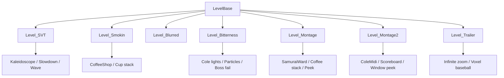

# 视觉与窗口特殊关卡

本页覆盖阶段 5 的第四组官方关卡脚本：`Level_SVT`、`Level_Smokin`、`Level_Blurred`、`Level_Bitterness`、`Level_Montage`、`Level_Montage2` 和 `Level_Trailer`。这些脚本集中处理 kaleidoscope、咖啡店杯堆、角色染色、Boss 失败、粒子雨、窗口 peek、MIDI 可视化、无限缩放和 trailer 专用演示逻辑。

## 源码范围

| 类 | 源码路径 | 继承 | 主要职责 |
| --- | --- | --- | --- |
| `Level_SVT` | `RDFucked/Assets/Scripts/Assembly-CSharp/Level_SVT.cs` | `LevelBase` | 开启 kaleidoscope，处理命中减速、聚光灯提示、tile/flip/zoom 和 Oneshot 波形模式。 |
| `Level_Smokin` | `RDFucked/Assets/Scripts/Assembly-CSharp/Level_Smokin.cs` | `LevelBase` | 加载咖啡店前后景，管理杯堆、疲劳表情、顾客、夜间灯光和快速 beat 视觉。 |
| `Level_Blurred` | `RDFucked/Assets/Scripts/Assembly-CSharp/Level_Blurred.cs` | `LevelBase` | 设置 cutscene 段落，提供电视移除和角色染色方法。 |
| `Level_Bitterness` | `RDFucked/Assets/Scripts/Assembly-CSharp/Level_Bitterness.cs` | `LevelBase` | Bitterness Boss，管理 Cole 灯、咖啡店、医院层、Boss 文字、粒子和失败流程。 |
| `Level_Montage` | `RDFucked/Assets/Scripts/Assembly-CSharp/Level_Montage.cs` | `LevelBase` | Montage 第一段 Boss，处理 Samurai ward、咖啡杯堆、窗口 peek、手动心形和 Boss 完成状态。 |
| `Level_Montage2` | `RDFucked/Assets/Scripts/Assembly-CSharp/Level_Montage2.cs` | `LevelBase` | Montage 第二段 Boss，处理 CareLess 粒子、ColeMidi、记分牌、窗口 peek、接球回调和失败 tag。 |
| `Level_Trailer` | `RDFucked/Assets/Scripts/Assembly-CSharp/Level_Trailer.cs` | `LevelBase` | Trailer 演示脚本，控制 HP、无限缩放、rooftop、room1 棒球 voxel 和二人模式切换。 |

## 视觉脚本关系

## `Level_SVT`

`Level_SVT` 通过 `LoadBigAssets()` 把关卡标为单行非 Boss，并开启 `room0.kaleidoscopeMode`。它的两个行访问器 `oneshotRow` 和 `oneshotRowP2` 分别指向 `game.rows[0].ent` 与 `game.rows[1].ent`。

### 字段

| 字段 | 类型 | 作用 |
| --- | --- | --- |
| `shakeybeat` | `scrExecuteOnEveryHB` | 半拍执行器字段。 |
| `randombeat` | `scrExecuteOnEveryBeat` | 每拍执行器字段。 |
| `currentTween` | `Tweener` | 当前 oneshot slowdown tween。 |
| `slowdown` | `scrExecuteOnHit` | 命中时触发 slowdown 的回调。 |
| `kaleidoRot` | `scrExecuteOnUpdate` | 每帧旋转 kaleidoscope camera 的 update 回调。 |
| `kaleidoAngle` | `float` | Kaleidoscope 当前旋转角度。 |
| `kaleidoRotSpeed` | `float` | Kaleidoscope 旋转速度，默认 25。 |
| `_kre` | `bool` | Kaleidoscope 旋转启用标记。 |
| `wMult` | `float` | Oneshot wave 尺寸倍数。 |
| `wMode` | `int` | 当前 wave 模式。 |

### 生命周期与提示音

| 方法 | 行为 |
| --- | --- |
| `preactions()` | 第 1 小节设置视觉 beat 倍率；非低闪光时注册音量 tracker，把 kaleidoscope 颜色映射到 Oneshot 行和手部叠加色；第 9、12、16、19 小节开关 slowdown。 |
| `actions()` | 第 1 小节开启 kaleidoscope、设置 sprite glow、注册命中 slowdown 和 kaleidoscope 旋转 update；后续小节调整视觉 beat 倍率、镜头震动和 kaleidoscope 速度，并在第 13 小节运行 `diaSVT` 的 `Interlude`。 |
| `BeepGet()` | 调用基类提示，并显示 oneshot spotlight 0。 |
| `BeepSet()` | 调用基类提示，并显示 oneshot spotlight 1。 |
| `BeepGo()` | 隐藏 oneshot spotlight。 |
| `OnMistake()` | 空覆写。 |

### 公开方法

| 方法 | 作用 |
| --- | --- |
| `randombeatfn()` | zoom out，随机设置 tile 数和屏幕 X/Y 翻转。 |
| `randombeattame()` | 随机设置 1 到 3 的 tile 数。 |
| `zoomin()` | 重置 tile 和翻转，并 zoom 到 2。 |
| `zoomout()` | zoom 回 1。 |
| `WhiteKaleidoscope()` | 把 kaleidoscope 两组颜色设为白色。 |
| `NormalKaleidoscope()` | 把 kaleidoscope 颜色设为脚本默认组合。 |
| `ColorKaleidoscope(float r, float g, float b, int mode)` | 按 mode 设置 A 色、B 色或两者。 |
| `EnableKaleidoRot()` | 开启 kaleidoscope 旋转。 |
| `EaseKaleidoRot()` | 开启旋转，把速度从 0 tween 到 10。 |
| `DisableKaleidoRot()` | 重置角度并关闭旋转；关闭时 camera rotation 归零。 |
| `SetWaveMult(float mult)` | 设置 wave 倍数并重套当前 wave mode。 |
| `SetWaveMode(int waveMode)` | 按 0 到 3 切换 BoomAndRush、Spring、放大 Spring 或 Spike，并同步 P2 行。 |

## `Level_Smokin`

`Level_Smokin` 使用咖啡店前后景构建杯堆段落。`LoadBigAssets()` 加载两个 `RDCoffeeShop`，一个只保留背景并移动到 room1，另一个只保留前景并移动到下一房间；同时缓存 4、8、12 杯堆的初始坐标。

### 字段

| 字段 | 类型 | 作用 |
| --- | --- | --- |
| `_tiredness` | `int` | 角色疲劳等级，setter 会刷新表情。 |
| `doingLongCue` | `bool` | BeepReady 到 BeepGo 的长 cue 状态。 |
| `playedRea` | `bool` | 长 cue 中是否已经播放 ready 灯光状态。 |
| `playedHitActionThisFrame` | `bool` | 避免同一帧重复投杯。 |
| `coffeeShopBg` / `coffeeShopFg` | `RDCoffeeShop` | 咖啡店背景和前景实例。 |
| `currentCup` | `int` | 当前杯堆投出的杯子下标。 |
| `currentStack` | `tk2dSprite[]` | 当前使用的杯堆。 |
| `currentStackPos` | `Vector2[]` | 当前杯堆原始位置。 |
| `startedStack` | `bool` | 杯堆是否处于投掷状态。 |
| `cupPos_4` / `cupPos_8` / `cupPos_12` | `Vector2[]` | 4、8、12 杯堆的原始坐标。 |

### 命中与杯堆

`OnHit(HitType hitType, Beat beat)` 只在本帧未处理过且 `beat.rowID <= 1` 时执行。命中不是 `HitType.Hit` 时，`ThrowCoffee(true)` 会用较低抛物线投杯并触发 `FlashBubble()`；命中时执行 `ThrowCoffee(false)`。

| 方法 | 作用 |
| --- | --- |
| `StartStack(int newStack = -1)` | 结束旧杯堆 tween，按 4、8、12 选择杯堆，滑入 CoffeeMan，进入快速 beat 状态并刷新表情。 |
| `EndStack()` | 0.15 秒后滑出 CoffeeMan，重置 currentCup，退出快速 beat 状态并刷新表情。 |
| `ThrowCoffee(bool miss)` | 以 1/6 秒延迟显示一个杯子，从 barista 位置跳回原位；miss 时终止堆叠并延迟调用 `CollapseStack()`。 |
| `CollapseStack()` | 对当前杯堆每个杯子执行跳落、旋转、淡出和隐藏，并播放 `Coffeeman_miss`。 |
| `SetTiredness(int t)` | 设置疲劳等级并刷新表情。 |
| `SetExpressions(bool stacking)` | 根据 tiredness 和 stacking 改写角色 neutral/happy/noHappy/noMiss。 |

### 场景与提示灯方法

| 方法 | 作用 |
| --- | --- |
| `ChangeCountertopLayer()` | 切换前景柜台、特殊柜台和背景柜台显示。 |
| `HideCustomers(int from, int count)` | 隐藏指定范围顾客。 |
| `HideCole(int from)` | 用 4.5 秒隐藏指定顾客。 |
| `ShowCustomers(int from, int count)` | 显示指定范围顾客。 |
| `TransitionToNight()` | 前后景咖啡店切到夜间。 |
| `DisableNightLights()` | 隐藏夜间灯光对象。 |
| `OpenDoor()` | 打开咖啡店门。 |
| `SetWaveSize(float width, float height)` | 同步两条 oneshot 行的波形宽高。 |
| `FastBeatTrigger(bool isFast)` | 快速状态切 Spring 且波形为 0.75；普通状态切 BoomAndRush 且波形为 1。 |

`BeepReady()` 会进入长 cue，设置灯光 1 或 2；`BeepGet()` 在长 cue 时设置灯光 3，否则设置 2；`BeepSet()` 设置灯光 4；`BeepGo()` 清灯并重置 long cue 状态。

## `Level_Blurred`

`Level_Blurred` 是轻量视觉辅助脚本。`LoadBigAssets()` 设置两个 cutscene 段落：26 到 47，以及 0 到 9。

| 方法 | 作用 |
| --- | --- |
| `RemoveTVs()` | 取得 room0 的 `RDMainWard` 并调用 `ToggleTVs(false, true)`。 |
| `DisableCharacterTinting(int row)` | 从行实体的 `tintableEntities` 中移除自身，并让角色使用独立 shader data。 |
| `TintCharacter(int row, string colorHex, float duration)` | 把 hex 转成颜色，并调用角色 `TweenColor()` 从半透明黑过渡到目标色。 |

## `Level_Bitterness`

`Level_Bitterness` 是 Boss 脚本。`Init()` 设置 checkpoint 97、`/` 跳到 90，并隐藏 HP 控制器。`LoadBigAssets()` 加载 Bitterness 粒子、Boss 文字，设置 `levelType = Boss`、game over 窗口舞蹈保留、退出时 glitch obstruction，并加载 `diaBitterness`。

### 字段与环境缓存

| 字段 | 类型 | 作用 |
| --- | --- | --- |
| `_coleWard` | `RDHoodieBoyWard` | room0 Cole ward 缓存。 |
| `_coffeeShop` | `RDCoffeeShop` | room1 咖啡店缓存。 |
| `_frontHospital` | `RDMainWard` | room2 前景医院缓存。 |
| `_backHospital` | `RDMainWard` | room3 背景医院缓存。 |
| `bossText` | `RDBossStageText` | Boss 舞台文字。 |
| `brokenLightTimer` | `float` | 破灯随机触发计时。 |
| `brokenLightsInUse` | `bool[]` | 每盏破灯是否正在动画中。 |
| `brokenLightUpdate` | `scrExecuteOnUpdate` | 破灯 update 回调。 |
| `nicoleSortOrder` | `int` | Nicole 原始排序缓存。 |
| `iconParticles` | `scrBitternessParticles` | icon 粒子雨和 burst。 |
| `bgSprites` | `List<tk2dSprite>` | 背景 alpha tween 操作的 sprite 集合。 |
| `bgAlphaTween` | `Tween` | 背景透明度 tween。 |

### 生命周期与失败

| 方法 | 行为 |
| --- | --- |
| `preactions()` | 第 1 小节隐藏前景医院非 Foreground 对象、隐藏背景医院 Foreground 对象；初始化破灯数组；把 `missesToCrackHeart` 设为 `rankLowerBounds[1]`；按窗口舞蹈分辨率计算 `b6`。 |
| `OnMistake(RowEntity)` | 当 `numMistakes > missesToCrackHeart`，调用 `game.FailLevel()`。 |
| `FailLevel(RowEntity)` | 选择失败主角色；设置失败 rank；清周期节拍和 DOTween；延迟最终裂心、gameover 表情、聚光灯与 bossFailRestart；带 97 小节 checkpoint 信息播放 gameover 对话；运行 `FailLevel` tag。 |

### 公开方法

| 方法 | 作用 |
| --- | --- |
| `ShowBossText(int room, float xPerc, float yPerc)` | 非 scrubbing 时按房间与百分比位置显示并播放 Boss 文字。 |
| `HideBossText()` | 隐藏 Boss 文字。 |
| `InfectAll()` | 让所有存在实体的行快速感染心形。 |
| `PlayGlitchNoise()` | 立即播放 `sndNoiseMed`。 |
| `ToggleColeSpectrum(bool on)` | 开关 Cole ward spectrum。 |
| `ToggleColeLights(bool on)` | 开关 Cole 所有灯。 |
| `TurnOnColeLight(int index)` | 点亮指定 Cole 灯。 |
| `IncrementColeLightCounter(bool lightOn)` | 推进 Cole 增量灯计数。 |
| `SetColeLightCounter(int index, bool lightOn)` | 设置 Cole 增量灯计数。 |
| `StartBrokenLights()` | 注册 update，随机挑未占用灯执行破灯动画。 |
| `StopBrokenLights()` | 移除破灯 update 并关闭 Cole 灯。 |
| `HideCustomers(int from, int count)` | 隐藏咖啡店顾客。 |
| `ShowCustomers(int from, int count)` | 显示咖啡店顾客。 |
| `RandomizeCustomers(int from, int count)` | 随机化咖啡店顾客。 |
| `MoveNicoleLayer(bool bg)` | 把 Nicole 移到 Background 排序或还原。 |
| `ToggleCoffeeNightLights(bool on)` | 开关咖啡店夜间灯。 |
| `ToggleIconRain(bool toggle)` | 开关 icon rain 粒子。 |
| `ToggleFastIconRain(bool toggle)` | 开关 fast icon rain 粒子。 |
| `DeactivateFastIconRain()` | 停止 fast icon rain。 |
| `SetIconBurstPos(float xPerc, float yPerc)` | 设置 burst 粒子位置。 |
| `ToggleIconBurst(bool toggle)` | 开关 burst 对象。 |
| `EmitIconBurst(int amount)` | 发射指定数量 burst 粒子。 |
| `KillAllIconParticles()` | 关闭全部 icon 粒子系统。 |
| `TweenBGAlpha(float alphaPercent, float durBeats)` | 收集 Cole 和咖啡店背景 sprite，按 beat 时长 tween 透明度。 |
| `SetHospitalX(float x)` | 同步设置四个房间医院 X。 |
| `SetColeHospitalX(float x)` | 设置 Cole 房间医院 X。 |
| `SetNicoleHospitalX(float x)` | 设置 Nicole 房间医院 X。 |
| `SneakyKaleidoscope(int room)` | 对指定房间显示 Kaleidoscope 主题背景。 |

## `Level_Montage`

`Level_Montage` 是 Montage 第一段 Boss。`Init()` 设置 checkpoint 168 和 71，`/` 跳到 168，并解除暂停阻塞。`LoadBigAssets()` 设置 Boss、`noBossFail`、手动心形裂纹，读取 `Persistence.GetLevelRank(Level.Montage).passed`，加载 `RDSamuraiWard` 和 Boss 文字。

### 关键状态

| 字段 | 类型 | 作用 |
| --- | --- | --- |
| `samuraiWard` | `RDSamuraiWard` | Samurai 房间专用环境。 |
| `missedOnce` | `bool` | 是否已经出现 miss 或从后段 scrub。 |
| `levelWasAlreadyPassed` | `bool` | 进入关卡前 Montage 是否已通过。 |
| `coffeeShop` | `RDCoffeeShop` | room2 咖啡店。 |
| `coffeeShopOneshotRow` | `RowEntity` | 杯堆使用的 oneshot 行，来源 row7。 |
| `currentStack` / `currentStackPos` | `tk2dSprite[]` / `Vector2[]` | 当前杯堆和原始位置。 |
| `startedStack` / `missedStack` | `bool` | 杯堆状态。 |
| `currentCup` | `int` | 当前杯子下标。 |
| `cupPos_4` / `cupPos_20` | `Vector2[]` | 4 杯和 20 杯原始位置。 |
| `tiredness` | `int` | 疲劳等级，setter 刷新表情。 |
| `bossText` | `RDBossStageText` | Boss 文字。 |

### 生命周期与流程

| 方法 | 行为 |
| --- | --- |
| `preactions()` | 第 1 小节设置 `missesToCrackHeart = rankLowerBounds[1]`；后段 scrub 且非编辑器时标记 `missedOnce`。 |
| `actions()` | 第 28 小节缓存咖啡店、row7 和杯堆坐标；第 65 小节开启 room0/room1 window peek；第 71 小节关闭 peek。 |
| `Update()` | 第 28 到 38 小节每帧重置 `playedHitActionThisFrame`。 |
| `OnHit(HitType, Beat)` | 第 28 到 38 小节每帧只投一次咖啡；非 Hit 当作 miss。 |
| `OnMistake(RowEntity)` | 非 `b9` 时记录 miss；超过裂心阈值调用 `FailBoss(false)`，否则更新所有心形。 |

### 公开方法

| 方法 | 作用 |
| --- | --- |
| `OpenSamuraiDoors()` | 启动 Samurai ward 开门协程。 |
| `ShowSamuraiLanterns()` | 显示 Samurai lanterns。 |
| `ShowSamuraiWard(bool active)` | 开关 Samurai ward。 |
| `StartStack(int newStack = -1)` | 选择 4 或 20 杯堆，滑入 CoffeeMan，进入快速 beat 状态。 |
| `EndStack()` | 滑出 CoffeeMan，重置杯堆并退出快速 beat。 |
| `SetWaveSize(float width, float height)` | 设置 row7 波形宽高。 |
| `FastBeatTrigger(bool isFast)` | 快速时 row7 切 Spring，普通时切 BoomAndRush。 |
| `ShowBossText()` | 非 scrubbing 时显示白色 Boss 文字。 |
| `CalibratePeek(int roomID, int windowID)` | 用指定 window dancer 中心校准房间 peek。 |
| `SetLevelAsPassed()` | 保存 Boss 通过状态；已通过且本次无 miss 时显示 boss perfect 状态文字。 |
| `PrepNextLevel()` | 设置最后游玩关卡为 `Level.Montage2`。 |
| `AlmostBreakHeart(int row)` | 把指定行心形设置到差一击破裂。 |
| `FailBoss(bool survivedSomehow)` | 调用轻量失败；`b9` 分支运行 `FakeFailLevel`，否则增加死亡并运行 `FailLevel`。 |
| `RunGameOverDialogue()` | 使用 `GameOver_Montage` 播放 gameover 对话。 |

## `Level_Montage2`

`Level_Montage2` 是 Montage 第二段 Boss。`Init()` 设置 checkpoint 286 和 213，`/` 跳到 210。`LoadBigAssets()` 设置 Boss、`bossActNum = 7`、`noBossFail`、手动心形裂纹，加载 CareLess 粒子和 `ColeMidi/ColeMidi`，并加载 `diaMontage`。

### 关键方法

| 方法 | 作用 |
| --- | --- |
| `ToggleMidi(bool toggle)` | 开关 CareLess spiral 粒子和 ColeMidi；开启时模拟粒子、播放并让 MIDI note renderer 淡入。 |
| `SetScoreboardLights(bool home, string text, int startIndex)` | 调用体育场记分牌字符串写入。 |
| `ClearAllScoreboardLights()` | 清空体育场灯。 |
| `SetTrackingScore(bool on)` | 设置体育场是否跟踪分数。 |
| `LinkRowsSoIDontHaveToVFXThis(int parentID, int childID)` | 把 child 行实体挂到 parent 行实体下。 |
| `UnlinkRow(int rowID, int room)` | 把行实体挂回指定房间 rowContainer。 |
| `InfectAll()` | 感染所有存在实体的行。 |
| `ToggleCatching(int room, bool rightHand, bool on)` | 选择房间对应的 hand controller，开关指定手的 catching。 |
| `EnableTextPeek()` / `DisableTextPeek()` | 开关 room2 文本 peek，并设置自定义缩放。 |
| `EnableHandPeek()` / `DisableHandPeek()` | 用 window dancer 位置校准并开关 room0 hand peek。 |
| `FindLyric()` | 从 `scrVfxControl.instance.allLyrics` 读取 id 27 的歌词对象。 |
| `ReplaceLyric(string text)` | 替换已缓存歌词文本。 |
| `AddMistakeIfMissed()` | 已 miss 且当前 mistake 小于 1 时补一次 P1 mistake。 |
| `FailBoss()` | `i9 < 3` 时轻量失败、增加死亡并运行 `FailLevel` tag。 |
| `FailSection()` | 运行 `FailLevel_{i9}` tag。 |
| `HideAllCharacters()` | 隐藏所有行实体。 |
| `RunGameOverDialogue()` | 使用 213 与 289 小节 checkpoint 信息播放 `GameOver_Montage2`。 |
| `CancelWindowDance()` | 取消窗口舞蹈。 |

`actions()` 在第 60、174、189 小节切换 row5 的 `noHappy` 和 `noMiss`；第 191 小节注册 Early、Hit、Late 三类回调运行 `coleCatchEarly`、`coleCatchPerfect`、`coleCatchLate`；第 192 小节清理这些回调。

`OnHit(HitType hitType, Beat beat)` 在 `stadium.trackingScore` 开启时更新记分牌；第 60 到 75 小节中，held pulse beat 如果不是 Hit，会运行 `showHold` tag。

## `Level_Trailer`

`Level_Trailer` 是 trailer 专用演示脚本。它保留 `lastOneshot` 字段，但当前源码中没有使用它。

| 方法 | 行为 |
| --- | --- |
| `LoadBigAssets()` | 空协程，直接返回一帧。 |
| `preactions()` | 第 34 小节重建 room1 render texture，深度参数为 24。 |
| `actions()` | 第 26 小节显示 HP、按 `CountHits()` 设置 boss HP、设置 Oneshot flash margin 并隐藏部分 flash text 字号；第 27 小节关闭 flash text；第 28 小节隐藏玩家 HP 和 boss HP；第 40 小节在 beat 1 开启 infinite zoom 与 HP，在 beat 2 关闭并恢复 culling mask。 |
| `OnHit(HitType, Beat)` | 第 24 到 27 小节内对 boss HP 扣血。 |

### 公开方法

| 方法 | 作用 |
| --- | --- |
| `MoveSky(int room, float y, float durBeats, string easeStr)` | 移动指定 rooftop 的天空层。 |
| `MoveSkyscrapers(int room, float y, float durBeats, string easeStr)` | 移动指定 rooftop 的楼群层。 |
| `MoveRooftop(int room, float y, float durBeats, string easeStr)` | 移动指定 rooftop 的屋顶层。 |
| `ToggleBaseball(bool on)` | 开关 room1 voxel 棒球；首次开启时注册音量 tracker 缩放棒球。 |
| `ToggleFallingBaseballs(bool on)` | 开关 room1 下落棒球粒子。 |
| `SetFallingBaseballsSpeed(float spdPercent)` | 以百分比修改下落棒球 simulation speed。 |
| `TriggerTwoPlayer()` | 切换 `GC.twoPlayerMode`，并让 `scnGame` 刷新玩家交换和玩家模式状态。 |

## 源码研究关注点

| 场景 | 注意事项 |
| --- | --- |
| SVT slowdown | `slowdown` 是持久命中回调，部分小节会启用或禁用；改动 `RDTime.speed` 会影响它的触发分支。 |
| 咖啡杯堆 | Smokin 与 Montage 都依赖先缓存杯堆坐标，再用 `StartStack()` 进入投掷状态。 |
| Bitterness 失败 | `FailLevel()` 会 `DOTween.KillAll()`，并运行 `FailLevel` tag；与其他 tween 或窗口效果共存时要考虑清理顺序。 |
| Window peek | Montage 与 Montage2 使用 `windowChoreographer.dancers` 的窗口中心校准 peek，调用前需要窗口舞蹈对象存在。 |
| Trailer 二人切换 | `TriggerTwoPlayer()` 直接翻转 `GC.twoPlayerMode`，随后调用游戏场景刷新玩家模式。 |

## 复核状态

本页已纳入 [官方关卡覆盖清单](/api/levels/coverage.md)，对应视觉与窗口特殊关卡类群已完成阶段 7 复核。
