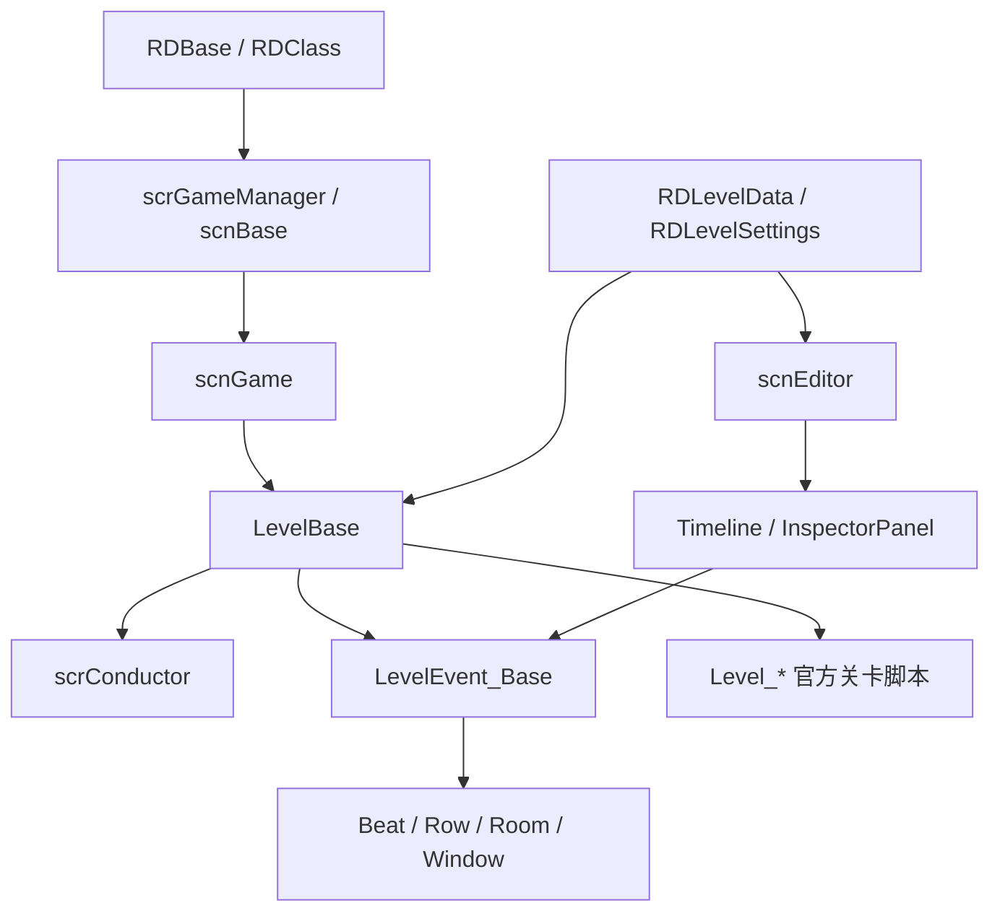

# 阶段 7 全站复核

本页记录阶段 7 的全站收口状态。复核目标不是继续堆页面，而是确认源码覆盖、导航、交叉链接、术语和缺失项清单已经能支撑后续阅读。

## 复核结论

| 项目 | 状态 | 说明 |
| --- | --- | --- |
| 主工程源码文件名覆盖 | 已完成 | `Assembly-CSharp` 下 1050 个 `.cs` 文件均已在文档正文中命中 |
| `Level_*.cs` 关卡归属 | 已完成 | 当前源码目录 75 个 `Level_*.cs` 文件均已进入官方关卡专题页或文件级说明 |
| 编辑器事件覆盖 | 已完成 | `LevelEventType` 0 到 80 已归入事件分组页或重点事件页 |
| `InspectorPanel_*` 覆盖 | 已完成 | Inspector 主干页、专项行为页和编辑器 UI 辅助页已经覆盖主要面板类族 |
| 运行时系统覆盖 | 已完成 | 节拍、判定、输入、行、房间、窗口、音频、场景、暂停和辅助类页面已经形成导航闭环 |
| 数据模型与枚举覆盖 | 已完成 | 关卡数据、设置、条件、错误、音频模型、属性反射和轻量枚举已经分组 |
| 交叉链接 | 已完成 | 已完成全站 Markdown 链接抽查和 docsify 侧边栏路由检查 |
| 术语表 | 已完成 | 已补充核心类、节拍、小节、行、房间、窗口、条件、rank 和数据模型术语 |
| 调用图 | 已完成 | 已补 [主干调用图](/api/review/call-graphs.md)，覆盖关卡数据、编辑器读写、音乐时间、判定、窗口和视觉系统 |

## 主干阅读路径

## 阶段 5 复核

阶段 5 的复核重点是确认源码目录中的 `Level_*.cs` 文件没有遗漏。当前源码目录统计为 75 个文件，[官方关卡覆盖清单](/api/levels/coverage.md) 已逐项归属。

| 类群 | 归属页面 | 复核结果 |
| --- | --- | --- |
| 教程与开场 | [教程与开场关卡](/api/levels/tutorials-opening.md) | 已覆盖教程、片头、Oneshot 教学和 Boss 教学脚本 |
| Boss 与高压段落 | [Boss 与高压段落](/api/levels/boss-high-pressure.md) | 已覆盖 Boss、低血量、失败覆写和高压段落脚本 |
| 运动与节奏变体 | [运动与节奏变体](/api/levels/athlete-freezeshot.md) | 已覆盖棒球、体育场、afterimage、杯子、泡泡和直播脚本 |
| 视觉与窗口特殊关卡 | [视觉与窗口特殊关卡](/api/levels/visual-special.md) | 已覆盖窗口、粒子、后处理、特殊镜头和演示脚本 |
| 叙事与场景关卡 | [叙事与场景关卡](/api/levels/story-scene-levels.md) | 已覆盖手部、灯光、背景、体育场和 credits 脚本 |
| 其余官方与测试脚本 | [其余官方与测试脚本](/api/levels/misc-official-levels.md) | 已覆盖早期主线、活动曲、联动曲、测试脚本和空实现脚本 |

## 缺失项清单状态

| 清单 | 当前状态 | 结论 |
| --- | --- | --- |
| [未分类源码覆盖清单](/modding/source-coverage.md) | 文件名未命中为 `0` | 作为最终覆盖统计依据保留 |
| [官方关卡覆盖清单](/api/levels/coverage.md) | 75 个关卡脚本均已归属 | 阶段 5 已完成 |
| [事件覆盖清单](/api/editor-events/event-coverage.md) | 事件编号已归属 | 阶段 2 已完成 |
| [阶段 3 与阶段 4 复核](/api/review/stage-3-4-review.md) | 运行时和数据模型已复核 | 阶段 3 与阶段 4 已完成 |

## 复核队列

| 顺序 | 任务 | 完成条件 |
| --- | --- | --- |
| 1 | 页面内链接抽查 | 已完成：主要模块页面、API 索引和复核页链接无失效 |
| 2 | 术语表补充 | 已完成：补齐 beat、bar、crotchet、row、room、window、event、condition、rank 等常用术语 |
| 3 | 调用图补充 | 已完成：建立 [主干调用图](/api/review/call-graphs.md) |
| 4 | 文字口径统一 | 已完成：统一为源码研究文档 |
| 5 | 最终完成判定 | 已完成：阶段 0 到阶段 7 均为 `已完成` |
