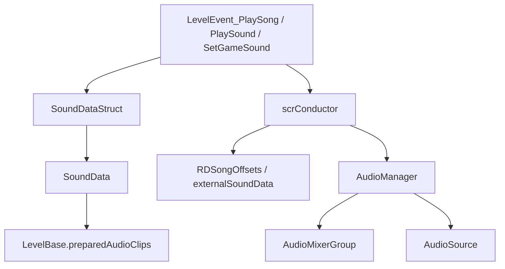

# 音频运行时

本页整理运行时音频系统。RD 的音频播放分成三层：`AudioManager` 负责实际 `AudioSource` 与音频缓存，`scrConductor` 负责把关卡节拍时间换算成 Unity DSP 调度时间，编辑器事件中的 `SoundData` 和 `SoundDataStruct` 负责把关卡文件里的声音字段转换成可播放数据。

## 源码范围

| 类型 | 源码路径 | 职责 |
| --- | --- | --- |
| `AudioManager` | `RDFucked/Assets/Scripts/Assembly-CSharp/AudioManager.cs` | 全局音频单例，加载内部和外部音频，创建 `AudioSource`，播放、缓存、清理音频对象。 |
| `scrConductor` | `RDFucked/Assets/Scripts/Assembly-CSharp/scrConductor.cs` | 音乐时间轴，负责歌曲、节拍音、反馈音和绝对时间音频调度。 |
| `RDGameSounds` | `RDFucked/Assets/Scripts/Assembly-CSharp/RDGameSounds.cs` | 游戏音效表，保存 clap、mistake、heart explosion、hold、freeze、burn 等音效配置。 |
| `RDGameSoundData` | `RDFucked/Assets/Scripts/Assembly-CSharp/RDGameSoundData.cs` | 单个游戏音效的数据结构，包含文件名、音量、pitch 范围和 pan。 |
| `SoundData` | `RDFucked/Assets/Scripts/Assembly-CSharp/RDLevelEditor/SoundData.cs` | 编辑器声音字段的运行时对象，负责准备音频、编码解码、外部音频标记和预览播放。 |
| `SoundDataStruct` | `RDFucked/Assets/Scripts/Assembly-CSharp/RDLevelEditor/SoundDataStruct.cs` | 声音字段的不可变结构体，用于事件属性、序列化、旧字段迁移和 UI 提示。 |
| `RDSongOffsets` | `RDFucked/Assets/Scripts/Assembly-CSharp/RDSongOffsets.cs` | 内置声音偏移、音量、prebar、loop destination 和全局音量系数表。 |
| `SongOffset` | `RDFucked/Assets/Scripts/Assembly-CSharp/SongOffset.cs` | 单个声音条目偏移数据。 |
| `RDAudioLoadType` / `RDAudioLoadResult` | `RDFucked/Assets/Scripts/Assembly-CSharp/RDAudioLoadType.cs`、`RDAudioLoadResult.cs` | 音频加载结果枚举与返回结构。 |
| `MixerPath` | `RDFucked/Assets/Scripts/Assembly-CSharp/MixerPath.cs` | AudioMixerGroup 名称常量。 |
| `MixerParameters` | `RDFucked/Assets/Scripts/Assembly-CSharp/MixerParameters.cs` | AudioMixer 暴露参数名称常量。 |
| `RDAmbienceAudioSource` | `RDFucked/Assets/Scripts/Assembly-CSharp/RDAmbienceAudioSource.cs` | 场景环境音源，按距离、模式、动画帧或随机间隔播放环境音。 |
| `SongLoop` | `RDFucked/Assets/Scripts/Assembly-CSharp/SongLoop.cs` | 基于 PCM reader 的循环音频工具类。 |

## 总体流程

`LevelEvent_PlaySong`、`LevelEvent_PlaySound`、`LevelEvent_SetBeatSound`、`LevelEvent_SetGameSound` 和 `LevelEvent_SetClapSounds` 都会在 `Prepare()` 中把 `SoundDataStruct` 转成 `SoundData`。`SoundData.Prepare()` 负责确认音频来源、写入 `preparedAudioClips`，并把外部音频或缺少内置偏移表的内部音频登记到 `scrConductor.externalSoundData`。

## AudioManager

`AudioManager` 继承 `Singleton<AudioManager>`。`Awake()` 初始化音频缓存、MP3 stream 列表、活动音源列表、音乐轨列表、`Resources/Audio Source` prefab、`MasterMixer` 里的 mixer group 字典，并把 `Fallback` 设为默认输出组。

### 字段与属性

| 成员 | 类型 | 作用 |
| --- | --- | --- |
| `audioLib` | `Dictionary<string, AudioClip>` | 已加载的内部或外部 `AudioClip` 缓存。外部 clip 使用 `filename + "*external"`。 |
| `mp3Streams` | `Dictionary<string, MP3Stream>` | MP3 stream 缓存。 |
| `mp3Samples` | `Dictionary<string, int>` | MP3 样本位置缓存。 |
| `rdMP3Streams` | `List<RDMP3Stream>` | 使用 streaming MP3 加载时创建的 RDMP3Stream 列表。 |
| `liveSources` | `List<AudioSource>` | 由 `MakeSource()` 创建的短音效和定时音效。 |
| `audioSourcePrefab` | `GameObject` | `Resources.Load<GameObject>("Audio Source")` 得到的音源 prefab。 |
| `musicTracks` | `List<AudioSource>` | 用于 cross fade 的音乐轨列表。 |
| `tracksActive` | `List<bool>` | 与 `musicTracks` 对齐，决定每条轨淡入或淡出。 |
| `maxMusicVol` | `float` | cross fade 的目标音量，默认 `0.4`。 |
| `appPaused` | `bool` | `OnApplicationPause()` 写入的应用暂停状态。 |
| `audioClipsLoaded` | `int` | 仅作显示用的已加载 clip 计数。 |
| `Mixer` | `AudioMixer` | 延迟加载 `Resources.Load<AudioMixer>("MasterMixer")`。 |
| `loadingAudioClips` | `Dictionary<string, string>` | 音频加载中状态表。 |

### 方法

| 方法 | 行为 |
| --- | --- |
| `GetMixerGroup(string)` | 从 `mixerGroups` 返回指定 AudioMixerGroup；找不到时记录 warning 并返回 null。 |
| `Update()` | 应用暂停或 `AudioListener.pause` 时跳过；清理停止的 `liveSources` 和 `musicTracks`；对音乐轨执行 `CrossFadeAudioSource()`。 |
| `SetTrackActivity(int, bool)` | 修改指定音乐轨的淡入淡出状态。 |
| `AddMusicTrack(AudioSource, bool)` | 把音乐轨加入 `musicTracks` 和 `tracksActive`。 |
| `StopAllSounds()` | 停止并销毁所有 live source。 |
| `MuteAllSounds()` / `UnmuteAllSounds()` | 把 live source 音量设为 `0` 或 `maxMusicVol`。 |
| `CrossFadeAudioSource(AudioSource, bool)` | 淡入时向 `maxMusicVol` 插值，淡出时向 `0` 插值。 |
| `MakeSource(string, AudioClip, Transform)` | 实例化音源 prefab，设置名字、父节点和 clip，并加入 `liveSources`。 |
| `FindOrLoadAudioClip(string)` | 以文件名作为缓存 key 查找 `audioLib`；未命中时从 `Resources` 加载，并兼容缺少 `snd` 前缀的名称。 |
| `FindOrLoadAudioClipExternal(string)` | 按扩展名加载外部 AIFF、OGG、WAV、MP3，返回 `RDAudioLoadResult`。 |
| `Play(...)` | 静态入口，创建音源并用 `PlayScheduled(time)` 定时播放。 |
| `PlayImmediately(...)` | 静态入口，创建音源并立即播放，也支持只创建不播放。 |
| `PlayExternal(...)` | 使用已有外部 `AudioClip` 创建音源并定时播放。 |
| `FlushData()` | 清空音频缓存、MP3 stream、clip 引用，并销毁所有子音源。 |
| `DestroyAllAudioSources()` | 销毁 `AudioManager` transform 下所有子对象。 |

### 内部音频加载

`FindOrLoadAudioClip()` 用 `Path.GetFileName(clipName)` 作为短名 key。读取顺序是：

| 步骤 | 行为 |
| --- | --- |
| 缓存短名 | 命中 `audioLib[text]` 时直接返回。 |
| 缓存 `snd` 前缀 | 命中 `audioLib["snd" + text]` 时返回该条目。 |
| Resources 原名 | 调用 `Resources.Load<AudioClip>(clipName)`。 |
| Resources `snd` 前缀 | 用 `clipName.Replace(text, "snd" + text)` 再尝试加载。 |
| 成功 | 增加 `audioClipsLoaded`，写入 `audioLib[text]`。 |
| 失败 | 记录 warning，返回 null。 |

4 月 1 日并且任意存档通关 `Level.OrientalInsomniac` 时，`sndPagerCursorMove`、`sndPagerButton`、`sndMenuSelect` 和 `sndMenuSelectBoss` 会被替换成 `sndDoctahWeh` 或 `sndDoctahHehehe`。

### 外部音频加载

| 扩展类型 | 加载方式 | 结果 |
| --- | --- | --- |
| AIFF / OGG / WAV | `UnityWebRequestMultimedia.GetAudioClip()` | 空 clip 按格式返回对应错误类型，成功返回 `SuccessExternalClipLoaded`。 |
| MP3 streaming | 编辑器 `GC.levelEditor_streamMP3Loading` 或自定义关卡选择 `GC.customLevelSelect_streamMP3Loading` 开启时使用 `RDMP3Stream.CreateMP3Stream()`。 | clip 写入 `audioLib[filename + "*external"]` 并加入 `rdMP3Streams`。 |
| MP3 非 streaming | `MP3SharpUnity.CreateAudioClipUsingMP3File(path)` | 成功返回外部 clip，异常时返回 `ErrorLoadingMP3`。 |
| 其他扩展 | 无加载器 | 返回 `ErrorFormatNotSupported`。 |

## scrConductor 音频调度

`scrConductor` 的私有 `Play(string sound, double timeFSAB, bool isSong, ...)` 是歌曲和节拍音共用的调度核心。它先从 `externalSoundData` 或 `RDSongOffsets` 取 offset、volume、folder、prebar，再决定传给 `AudioManager` 的路径和 DSP 时间。

### 全局音量

| 属性 | 计算方式 |
| --- | --- |
| `GlobalSongVolume` | `RDSongOffsets.GlobalSongVolumeDebug * GC.VolSongs` |
| `GlobalBeatsoundVolume` | `RDSongOffsets.GlobalBeatsoundVolumeDebug * GC.VolBeatsounds` |
| `GlobalJyiSoundVolume` | `RDSongOffsets.GlobalJyiSoundVolumeDebug * GC.VolBeatsounds` |
| `GlobalHandPopSoundVolume` | `RDSongOffsets.GlobalHandPopSoundVolumeDebug * GC.VolBeatsounds` |
| `GlobalOtherSoundVolume` | `RDSongOffsets.GlobalNonBeatSoundVolumeDebug * GC.VolMenuSounds` |

### 歌曲播放

| 方法 | 行为 |
| --- | --- |
| `PlaySong(string, AudioMixerGroup, float, float, bool, float)` | 记录 `currentSongString`，设置 loop destination，再调用私有 `Play(..., isSong: true)`。 |
| `ReplaySong()` | 把当前歌移到 `previousSong`，再播放 `currentLoopDestinationString`。 |
| `PlayNoSong()` | 不创建音频，但设置 `startOfSong`、`startOfNextBar`、prebar 和 `songStarted`。 |
| `StopSong(float)` | 停止当前歌曲，支持 fade 参数。 |

歌曲模式下，`Play()` 会要求 `timeFSAB == 0`。它把 `SongOffset.offset` 按 pitch 缩放，写入 `songHeaderLengthDSpeedAdjusted`；把 `prebarBeats * crotchet` 写入 `songHeaderLengthPrebar`；再依据同步状态计算 `num2`，也就是传给 `AudioSource.PlayScheduled()` 的 DSP 时间。随后更新 `startOfNextBar`、`startOfSong`、`startOfSongBarNumber`、`startOfLastPrebar`、`startOfLastBeatVisual`、`currentSong`、`volume`、`pitch` 和 `pan`。

### 节拍音与反馈音

| 方法 | 行为 |
| --- | --- |
| `PlayBeat(string, float, ...)` | 在非 scrub 或 gameplay beat 情况下播放节拍音；使用 `GlobalBeatsoundVolume`；把音源加入 `audiosourcesFromPlayBeat` 并记录 `lastScheduledTime`。 |
| `PlayBeat(GameSoundType, float, ...)` | 从 `RDGameSounds.Get()` 取文件名、音量、pitch、pan，再调用字符串版本。 |
| `PlayBeatInCrotchets(string, float, ...)` | 用 `BeatToTime(crotchets)` 换算后播放。 |
| `PlayBeatFromSongStart(string, double, ...)` | 用 song start 作为参考播放。 |
| `PlayImmediately(string, ...)` | 即时播放，用外部音频时走 `AudioManager.PlayExternal()`，内部音频走 `RDSongOffsets.fullPath`。 |
| `PlayImmediatelyLevelEditor(string, AudioMixerGroup, float, float)` | 编辑器即时预览入口，忽略 listener pause。 |
| `PlayFeedback(GameSoundType, ...)` | 播放 mistake、heart explosion、hand pop 等反馈音，并对大小失误做 0.05 秒同玩家限流。 |
| `PlayAbs(string, double, ...)` | 按绝对 DSP 时间播放，并减去 offset。 |

节拍音的私有 `Play()` 分支会在 `RDBase.debugSettings.BeatSounds` 开启时执行。调度时间是 `startOfNextBar + timeFSAB - offset`，pan 会乘以 `GlobalPanningStrength` 和 `GlobalPanningInvert`。

## SoundData 与 SoundDataStruct

`SoundDataStruct` 是事件属性层使用的结构体，`SoundData` 是运行时准备和播放层使用的对象。

### SoundDataStruct 字段

| 字段 | 类型 | 作用 |
| --- | --- | --- |
| `filename` | `string` | 声音文件名或内置声音枚举名。 |
| `volume` | `int` | 百分比音量，默认 `100`。 |
| `pitch` | `int` | 百分比 pitch，默认 `100`。 |
| `pan` | `int` | 百分比 pan，默认 `0`。 |
| `offset` | `int` | 毫秒偏移，默认 `0`。 |
| `used` | `bool` | 该声音项是否启用。 |

| 属性或方法 | 行为 |
| --- | --- |
| `volumePercentage` / `pitchPercentage` / `panPercentage` | 把整数百分比换成 `float`。 |
| `offsetInSeconds` | 把毫秒换成秒。 |
| `Decode(IReadOnlyDictionary<string, object>)` | 从事件字典读取声音字段，并处理旧版本音量和旧声音名迁移。 |
| `MigrateLegacySound(...)` | 把旧版 `filename/offset/volume/pitch/pan` 或 `p1Filename` 等字段迁移成新结构。 |
| `Encode(string, bool)` | 编码为 RD 关卡文本中的对象字段。 |
| `ToSoundData()` | 创建 `SoundData` 并复制音量、pitch、pan、offset 和 used。 |
| `FromSoundData(SoundData)` | 从运行时声音对象生成结构体。 |
| `Validated()` | clamp 音量 `0..300`、pitch `0..300`、pan `-100..100`。 |
| `IsExternalClip()` | 调用 `RDEditorUtils.FindClip(filename)` 判断外部音频。 |
| `LocalizedName()` | `filename` 能解析为 `SoundEffect` 时返回本地化枚举名。 |
| `GetTooltip()` | 生成编辑器 tooltip。 |

### SoundData 字段与方法

| 成员 | 作用 |
| --- | --- |
| `filename` | 声音名。 |
| `volume` / `pitch` / `minPitch` / `maxPitch` / `pan` / `offset` | 声音参数，内部以百分比整数和毫秒保存。 |
| `externalClip` | `Prepare()` 或 `IsExternalClip()` 写入的外部音频标记。 |
| `loadSuccessful` | `Prepare()` 的加载结果标记。 |
| `groupSubtype` | `SetGameSound` 组内子类型。 |
| `used` | 是否启用该声音项。 |
| `conductorFilename` | 内部音频返回 `filename`，外部音频返回 `filename + "*external"`。 |
| `Prepare()` | 查找并加载音频，写入 `preparedAudioClips` 和 `scrConductor.externalSoundData`。 |
| `Validate()` | clamp 音量、pitch 和 pan。 |
| `Decode(Dictionary<string, object>)` | 解码旧版和新版声音字段。 |
| `Encode(bool)` | 只编码不同于默认值的字段。 |
| `CopyFrom(SoundData)` | 复制声音参数。 |
| `PlayImmediately(string)` | 编辑器预览，调用 `scrConductor.PlayImmediately()` 并加入 `soundSettingsPopup.audioSources`。 |
| `IsExternalClip()` | 调用 `RDEditorUtils.FindClip()` 并刷新 `externalClip`。 |

`SoundData.Prepare()` 处理三种路径：

| 加载结果 | 行为 |
| --- | --- |
| `SuccessExternalClipLoaded` | 从 `AudioManager.audioLib[conductorFilename]` 取 clip，写入 `LevelBase.preparedAudioClips`，并把 offset 写入 `scrConductor.externalSoundData`。 |
| `SuccessInternalClipLoaded` | 标记为内部音频；如果 `RDSongOffsets.Get(text)` 返回 dummy 且 `externalSoundData` 没有该 key，则写入一个 `isInternal = true` 的 `SongOffset`。 |
| 错误结果 | 标记为内部音频并记录 warning。 |

## RDGameSounds

`RDGameSounds` 是 `Resources/RDGameSounds` prefab 上的 `MonoBehaviour`。第一次访问 `RDGameSounds.data` 时会调用 `Init()`，实例化 prefab，复制 `sounds` 到 `defaults`，并建立 `defaultSounds` 字典。

| 成员 | 作用 |
| --- | --- |
| `defaults` | 初始化时保存的默认音效数组。 |
| `sounds` | 当前可被事件修改的音效数组。 |
| `defaultSounds` | 按 `GameSoundType` 索引的默认音效字典。 |
| `data` | 延迟初始化并返回当前实例。 |
| `Get(GameSoundType)` | 在线性扫描 `sounds` 后返回对应数据。 |
| `Set(GameSoundType, string, float, float, float)` | 修改文件名，并按参数更新音量、pitch 和 pan；`-1000` 表示保持原值。 |
| `SetVolume` / `SetMinPitch` / `SetMaxPitch` / `SetPan` | 单独修改对应字段。 |
| `LoadDefaults()` | 把 `defaults` 复制回 `sounds`。 |
| `Init()` | 从 Resources 实例化数据对象并建立默认字典。 |

### GameSoundType 分组

| 分组 | 枚举值 |
| --- | --- |
| Classic / Oneshot clap | `ClapSoundP1Classic`、`ClapSoundP2Classic`、`ClapSoundP1Oneshot`、`ClapSoundP2Oneshot`、`ClapSoundCPUClassic`、`ClapSoundCPUOneshot` |
| 失误与手部 | `SmallMistake`、`BigMistake`、`Hand1PopSound`、`Hand2PopSound` |
| 爆心 | `HeartExplosion`、`HeartExplosion2`、`HeartExplosion3` |
| Clap hold | `ClapSoundHoldLongEnd`、`ClapSoundHoldLongStart`、`ClapSoundHoldShortEnd`、`ClapSoundHoldShortStart`，以及 P2 对应枚举 |
| Pulse hold | `PulseSoundHoldStart`、`PulseSoundHoldShortEnd`、`PulseSoundHoldEnd`、Alt 和 P2 对应枚举 |
| Freeze / burn | `FreezeshotSoundCueLow`、`FreezeshotSoundCueHigh`、`FreezeshotSoundRiser`、`FreezeshotSoundCymbal`、`BurnshotSoundCueLow`、`BurnshotSoundCueHigh`、`BurnshotSoundRiser`、`BurnshotSoundCymbal` |
| 组合事件 | `ClapSoundHold`、`PulseSoundHold`、`ClapSoundHoldP2`、`PulseSoundHoldP2`、`FreezeshotSound`、`BurnshotSound`、`Skipshot`、`HoldshotSound`、`HoldshotSoundCue`、`HoldshotSoundClapStart`、`HoldshotSoundClapLongEnd`、`HoldshotSoundClapShortEnd` |

## MixerPath 与 MixerParameters

`RDUtils.GetMixerGroup(string)` 直接调用 `AudioManager.GetMixerGroup()`，因此 `MixerPath` 中的字符串需要和 `MasterMixer` 内的 group 名称一致。

| 类别 | MixerPath 常量 |
| --- | --- |
| 音乐 | `LevelMusic`、`MenuMusic`、`MenuNightMusic`、`OtherMusic`、`CLSPreviewMusic`、`CustomMusicSound` |
| Beat sound | `BeatsoundsParent`、`BeatsoundsRoom00..03`、`BeatsoundsRow00..15`、`CustomBeatSound` |
| Hit sound | `PlayerOneHitsounds`、`PlayerTwoHitsounds`、`CPUHitsounds`、`PlayerOneClapClassic`、`PlayerTwoClapClassic`、`CustomHitSound` |
| Cue / feedback | `RDGSVoice`、`RDGSClicks`、`CountingVoice`、`SpecialOneshotCues`、`ElectricCues`、`Distractions`、`LowHealthBeeps`、`CustomCueSound`、`HeartExplosion00..02`、`MistakesParent`、`HandPopSounds`、`Applause` |
| UI 与编辑器 | `InterfaceSoundsParent`、`LevelInterface`、`LevelCutscene`、`LevelResults`、`MainMenu`、`PauseMenu`、`StoryLevelSelect`、`CustomLevelSelect`、`LevelEditorParent`、`LevelEditorActive`、`LevelEditorInspectorPanel`、`LevelEditorTimeline`、`MetronomeClicks` |
| 其他 | `DialogueParent`、`AmbienceParent`、`Fallback`、`IanDesktop` |

`MixerParameters` 保存暴露参数名，`RDUtils.SetMixerVolume()` 会把线性音量转换成 mixer dB：大于 `1` 时使用 `(value - 1) * 10`，`0..1` 时使用 `(value - 1) * 20`，`0` 以下写入 `-80`。

## RDSongOffsets 与 SongOffset

`RDSongOffsets.instance` 从 `Resources/RDSongOffsets` 加载 ScriptableObject，并在 `Setup()` 中把 `misc` 列表填入 `data` 字典。

| SongOffset 字段 | 作用 |
| --- | --- |
| `name` | 声音名，不带扩展名。 |
| `offset` | 播放偏移，`scrConductor` 会按 pitch 缩放后从调度时间中扣除。 |
| `volume` | 单个声音的音量倍率。 |
| `numberOfBeatsFromSongStart` | 歌曲循环相关的节拍位置。 |
| `prebarBeats` | 歌曲开始前的 prebar 拍数。 |
| `loopDestination` | `PlaySong()` 记录的 loop destination。 |
| `folder` | Resources 下音频子目录。 |
| `dummy` | `Get()` 找不到条目时创建的占位标记。 |
| `accuracy` | Fizzd offset 精度字段。 |
| `isInternal` | `SoundData.Prepare()` 为缺少偏移表的内部音频写入的标记。 |
| `fullPath` | `folder + "/" + name`。 |

| 方法 | 行为 |
| --- | --- |
| `Setup()` | 初始化 `data` 和 `externalData`，把 `misc` 中不存在的 name 写入 `data`。 |
| `Get(string)` | 去掉 `.ogg` 后查 `data[name]` 或 `data["snd" + name]`；找不到时返回 offset `0`、volume `1`、dummy `true` 的新条目。 |
| `UpdateData()` | 扫描 `TrueAssets/Audio/Resources`，把音频文件夹写回 `SongOffset.folder`，新文件加入 `misc` 和 `data`。 |
| `ImportFromCSV(string)` | 从 CSV 写入 offset 和 volume。 |
| `ExportToCSV()` | 把 `misc` 导出到 `Application.dataPath + "/ExportedSongOffsets.csv"`。 |

## 环境音与循环音频

### RDAmbienceAudioSource

`RDAmbienceAudioSource` 继承 `RDBase`，用于关卡和关卡选择场景的环境音。

| 模式 | 行为 |
| --- | --- |
| `SimpleLoop` | 使用当前 clip 循环播放，进入范围时从随机 sample 开始。 |
| `DynamicShots` | 随机选择 clip，等待 `minInterval..maxInterval` 后播放一次，播放结束后再次排队。 |
| `OnAnimation` | 随机选择 clip，等 `tk2dSpriteAnimator.CurrentFrame == onFrame` 时播放。 |

`Start()` 会从 `scnLevelSelect.instance.listener` 或 `scnGame.instance.listener` 取得 listener，并把二维距离换算成包含 listener Z 距离的 `AudioSource.minDistance` 和 `maxDistance`。`Update()` 根据平面距离进入或离开范围，进入时调用 `Play()`，离开时暂停。`FadeOut()` 使用 DOTween 淡出并停止音源。

### SongLoop

`SongLoop` 把 `AudioClip` 转成 16-bit PCM byte 数组，再创建 streaming `AudioClip`。`PCMReaderCallback(float[])` 每次读取一段 byte，超过结尾时从开头继续复制，实现循环；`PCMSetPositionCallback(int)` 只更新 `samplesRead`。

## 编辑器事件入口

| 事件 | 音频落点 |
| --- | --- |
| `LevelEvent_PlaySong` | `Prepare()` 加载歌曲；`Run()` 设置 BPM，并用 `scrConductor.PlaySong()` 播放到 `LevelMusic`。 |
| `LevelEvent_PlaySound` | `Run()` 用 `scrConductor.PlayBeat()` 在 beat 上调度；标签动作使用 `scrConductor.PlayImmediately()`。 |
| `LevelEvent_SetBeatSound` | `Prepare()` 加载 pulse sound；`Run()` 调用 `Row.SetPulseSounds()`。 |
| `LevelEvent_SetClapSounds` | 按 `RowType` 写入 P1/P2/CPU 的 classic 或 oneshot clap `GameSoundType`。 |
| `LevelEvent_SetGameSound` | 按 `soundType` 或组内 subtype 调用 `RDGameSounds.Set()`。 |

`LevelEvent_PlaySound.GetMixerPath()` 会按 `CustomSoundType` 选择 `CustomMusicSound`、`CustomBeatSound`、`CustomHitSound`、`CustomOtherSound` 或 `CustomCueSound`。

## 源码研究关注点

| 场景 | 关注内容 |
| --- | --- |
| 即时播放内部音效 | 使用 `scrConductor.PlayImmediately(sound, gain, RDUtils.GetMixerGroup(path), pitch, pan)`。 |
| 按 beat 调度音效 | 使用 `scrConductor.instance.PlayBeat(sound, time, gain, group, pitch, pitch, pan)`，time 是当前小节内换算后的秒。 |
| 按绝对时间调度 | 使用 `scrConductor.instance.PlayAbs(sound, dspTime, gain, isBeatSound, group, pitch, pan)`。 |
| 改默认游戏音效 | 使用 `RDGameSounds.Set(GameSoundType, filename, volume, pitch, pan)`，会影响后续通过 `GameSoundType` 播放的反馈音。 |
| 访问 mixer group | 使用 `RDUtils.GetMixerGroup(MixerPath.LevelMusic)` 或其他 `MixerPath` 常量。 |
| 外部音频 key | 外部音频加载成功后使用 `filename + "*external"`，`scrConductor.SoundIsExternal()` 通过该后缀判断。 |
| 清理缓存 | `AudioManager.FlushData()` 会清空 `audioLib`、MP3 stream 和所有音源对象。 |
| Beat sound 开关 | `scrConductor.PlayBeat()` 和 `PlayImmediately(..., isBeatSound: true)` 会受 `RDBase.debugSettings.BeatSounds` 影响。 |

## 相关页面

| 页面 | 关系 |
| --- | --- |
| [运行时系统总览](/api/runtime/overview.md) | 阶段 3 总入口。 |
| [scrConductor](/api/core/scrConductor.md) | 音乐时间轴、BPM、播放和 Scrub 核心类。 |
| [歌曲与音频事件](/api/editor-events/song-audio-events.md) | 编辑器事件分组中的歌曲与音频事件。 |
| [音频与声音事件](/api/editor-events/AudioSoundEvents.md) | 音频事件重点页。 |
| [节拍与判定](/api/runtime/beats-judgement.md) | Beat 类如何使用 `RDGameSounds` 和 mixer group。 |

