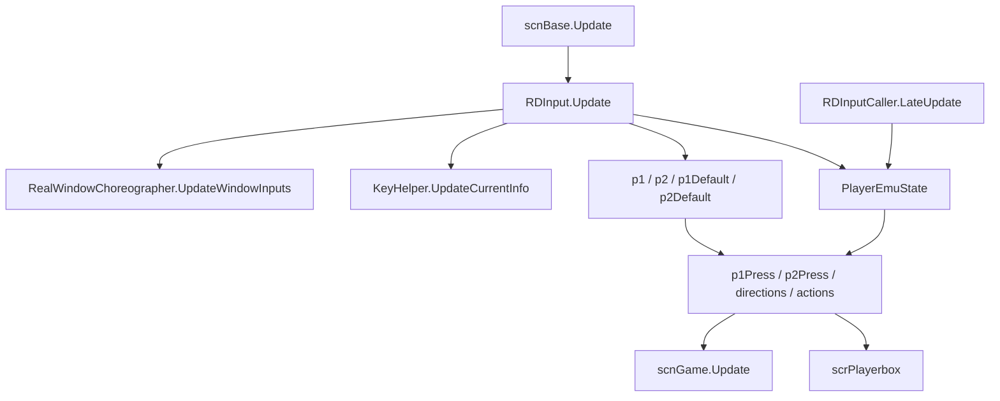
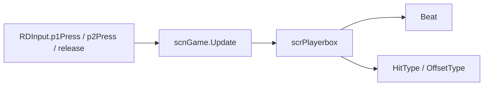

# 输入系统

本页整理运行时输入链路。`RDInput` 是全局静态门面，负责每帧刷新 P1、P2、默认键盘、模拟按键和系统级动作；`RDInputType` 及其子类负责把键盘、Rewired 手柄、触摸按钮和自定义按钮统一成同一组动作。

## 源码范围

| 类型 | 源码路径 | 职责 |
| --- | --- | --- |
| `RDInput` | `RDFucked/Assets/Scripts/Assembly-CSharp/RDInput.cs` | 静态输入聚合器，维护玩家输入、方向、系统动作、手柄连接、窗口舞蹈输入和玩家交换。 |
| `RDInputType` | `RDFucked/Assets/Scripts/Assembly-CSharp/RDInputType.cs` | 输入后端抽象基类，定义 `Main`、方向、取消、重开、跳过、表情方向和选择动作。 |
| `RDInputType_Keyboard` | `RDFucked/Assets/Scripts/Assembly-CSharp/RDInputType_Keyboard.cs` | 键盘与鼠标后端，提供 P1/P2 两套键位和编辑器按键过滤。 |
| `RDInputType_Joystick` | `RDFucked/Assets/Scripts/Assembly-CSharp/RDInputType_Joystick.cs` | Rewired 手柄后端，读取玩家 action id 和方向轴。 |
| `RDInputType_Touch` | `RDFucked/Assets/Scripts/Assembly-CSharp/RDInputType_Touch.cs` | 触摸后端，读取 Unity touch 和虚拟按钮帧状态。 |
| `RDInputType_CustomButton` | `RDFucked/Assets/Scripts/Assembly-CSharp/RDInputType_CustomButton.cs` | 自定义按钮后端，使用 Unity Input Manager 的 `P1` / `P2` 按钮名。 |
| `RDInputAction` | `RDFucked/Assets/Scripts/Assembly-CSharp/RDInputAction.cs` | 输入动作枚举。 |
| `RDButtonState` | `RDFucked/Assets/Scripts/Assembly-CSharp/RDButtonState.cs` | 按钮状态枚举。 |
| `RDInputCaller` | `RDFucked/Assets/Scripts/Assembly-CSharp/RDInputCaller.cs` | Unity 组件，`LateUpdate()` 调用 `RDInput.LateUpdate()`。 |

## 总体流程

`scnBase.Update()` 调用 `RDInput.Update()`。输入状态写入静态字段后，`scnGame`、`LevelBase`、`scrPlayerbox`、暂停菜单、关卡选择、校准和小游戏都直接读取这些字段。`RDInputCaller.LateUpdate()` 在帧末推进模拟按键状态。

## RDInput 字段

| 字段 | 类型 | 作用 |
| --- | --- | --- |
| `allInputs` | `List<RDInputType>` | 当前参与聚合的输入后端列表，包含 P1、P2 和两套默认键盘输入。 |
| `p1` / `p2` | `RDInputType` | P1/P2 主输入后端。PC 默认使用 `RDInputType_Joystick`，自定义按钮模式使用 `RDInputType_CustomButton`。 |
| `p1Default` / `p2Default` | `RDInputType` | P1/P2 默认键盘后端。 |
| `touchBlockedFrame` | `int` | 触摸输入屏蔽帧。 |
| `didSetup` | `bool` | `Setup()` 是否已经完成。 |
| `p1Press` / `p2Press` | `bool` | 当前帧 P1/P2 主键按下。 |
| `p1IsPressed` / `p2IsPressed` | `bool` | 当前帧 P1/P2 主键保持。 |
| `p1Release` / `p2Release` | `bool` | 当前帧 P1/P2 主键释放。 |
| `p1HoldTime` / `p2HoldTime` | `float` | `tapsOnly` 模式下维持短按保持状态的计时。 |
| `anyPlayerPress` | `bool` | 任意玩家主键按下。 |
| `anyPlayerIsPressed` | `bool` | 任意玩家主键保持。 |
| `anyPlayerRelease` | `bool` | 任意玩家主键释放。 |
| `skipPressed` / `restartPressed` / `quitPressed` | `bool` | 跳过、重开和退出动作按下。 |
| `cancelPress` / `cancelIsPressed` / `cancelRelease` | `bool` | 取消动作按下、保持和释放。 |
| `leftPress` / `rightPress` / `upPress` / `downPress` | `bool` | 方向动作按下。 |
| `leftIsPressed` / `rightIsPressed` / `upIsPressed` / `downIsPressed` | `bool` | 方向动作保持。 |
| `leftRelease` / `rightRelease` / `upRelease` / `downRelease` | `bool` | 方向动作释放。 |
| `finerControlPress` / `finerControlIsPressed` / `finerControlRelease` | `bool` | 精细控制动作状态。 |
| `faceLeftPress` / `faceLeftIsPressed` / `faceLeftRelease` | `bool` | 向左表情或朝向动作状态。 |
| `faceUpPress` / `faceUpIsPressed` / `faceUpRelease` | `bool` | 向上表情或朝向动作状态。 |
| `selectPress` / `selectIsPressed` / `selectRelease` | `bool` | 选择动作状态。 |
| `xAxis` / `yAxis` | `float` | 从手柄后端聚合出的水平和垂直轴值。 |
| `emuStates` | `PlayerEmuState[]` | P1/P2 模拟按键状态。 |

## RDInput 属性

| 属性 | 类型 | 作用 |
| --- | --- | --- |
| `key1` / `key2` / `key3` | `bool` | `Alpha1`、`Alpha2`、`Alpha3` 的当前帧按下状态。 |
| `persistenceSwapped` | `bool` | 读取 `Persistence.GetSwapP1AndP2Controls()`。 |
| `actuallySwapped` | `bool` | 读取 `p1.schemeIndex == 1`，表示当前输入后端实际交换状态。 |
| `p1SetupIndex` / `p2SetupIndex` | `int` | 根据持久化交换状态返回设置界面使用的玩家索引。 |
| `touchBlocked` | `bool` | 以当前帧为单位读写触摸屏蔽状态。 |
| `editorMode` | `bool` | `scnEditor.instance != null`。 |
| `anyKeyDown` | `bool` | 当前帧任意键按下，过滤 `F1` 到 `F12`。 |
| `controlIsPressed` | `bool` | Windows/Linux 读取 Ctrl，macOS 运行时读取 Meta。 |

## 初始化

`Setup()` 只在 `didSetup == false` 时执行。它注册 Rewired 手柄连接与断开事件，创建 P1/P2 输入后端和默认键盘输入，并初始化模拟按键数组。

| 平台或模式 | P1/P2 主输入 | 默认输入 |
| --- | --- | --- |
| `scnBase.isSwitch` | `RDInputType_Joystick` | `RDInputType_Keyboard` |
| `scnBase.isCustomButton` | `RDInputType_CustomButton` | `RDInputType_Keyboard` |
| 其他情况 | `RDInputType_Joystick` | `RDInputType_Keyboard` |

初始化结束后，`allInputs` 的顺序是 `p1`、`p2`、`p1Default`、`p2Default`。`SetPlayerSoundPanning()` 会同步 P1/P2 音频声像。

## 每帧刷新

`RDInput.Update()` 的刷新顺序：

| 步骤 | 行为 |
| --- | --- |
| 1 | 当前窗口舞蹈器是 `RealWindowChoreographer` 时，调用 `UpdateWindowInputs()`。 |
| 2 | 用 `ReInput.controllers.GetLastActiveController()` 更新 `KeyHelper` 的当前输入提示信息。 |
| 3 | 调用 `p1`、`p2`、`p1Default`、`p2Default` 的 `Update()`。 |
| 4 | 读取 P1/P2 主键按下、保持和释放，合并主后端、默认键盘和模拟按键。 |
| 5 | `scnGame.tapsOnly` 开启时，把按下和释放都视为短按，并用 `p1HoldTime` / `p2HoldTime` 维持 `0.25` 秒保持状态。 |
| 6 | 调用 `GetState()` 聚合取消、方向、跳过、重开、退出、表情、选择等动作。 |
| 7 | 调用 `GetAxis()` 聚合手柄水平和垂直轴。 |

## 输入动作与按钮状态

### RDInputAction

| 值 | 作用 |
| --- | --- |
| `Main` | 玩家主输入。 |
| `Cancel` | 取消或返回。 |
| `Left` / `Right` / `Up` / `Down` | 方向输入。 |
| `Skip` | 跳过关卡。 |
| `Restart` | 重开关卡。 |
| `Quit` | 退出关卡或场景。 |
| `FinerControl` | 精细调整修饰键。 |
| `FaceLeft` / `FaceUp` | 角色朝向或表情方向。 |
| `Select` | 选择动作。 |
| `None` | 空动作。 |

### RDButtonState

| 值 | 作用 |
| --- | --- |
| `WentDown` | 当前帧按下。 |
| `WentUp` | 当前帧释放。 |
| `IsDown` | 当前帧保持按下。 |
| `IsUp` | 当前帧未按下。 |

`RDInputType.Get(RDInputAction action, RDButtonState state = RDButtonState.WentDown)` 使用 `switch` 把枚举动作分发到具体方法。`Quit`、`Skip`、`Restart` 不接收 `RDButtonState`，由对应后端直接返回按下状态。

## RDInputType 抽象接口

| 成员 | 行为 |
| --- | --- |
| `schemeIndex` | 当前输入方案索引，P1/P2 交换时会切换。 |
| `Update()` | 默认空实现，子类按需覆盖。 |
| `SwapSchemeIndex()` | 在 `0` 与 `1` 之间切换 `schemeIndex`。 |
| `Main(RDButtonState)` | 玩家主输入。 |
| `Skip()` / `Restart()` / `Quit()` | 系统级按下动作。 |
| `Cancel(RDButtonState)` | 取消动作。 |
| `Left` / `Right` / `Up` / `Down` | 方向动作。 |
| `FinerControl(RDButtonState)` | 精细控制动作。 |
| `FaceLeft(RDButtonState)` / `FaceUp(RDButtonState)` | 表情或朝向动作。 |
| `Select(RDButtonState)` | 选择动作。 |

## 键盘后端

`RDInputType_Keyboard` 定义两组主键。`schemeIndex == 0` 使用 `MainScheme1`，`schemeIndex != 0` 使用 `MainScheme2`。

| 组 | 按键 |
| --- | --- |
| `MainScheme1` | `Y`、`U`、`I`、`O`、`P`、`LeftBracket`、`RightBracket`、`H`、`J`、`K`、`L`、`Semicolon`、`Quote`、`N`、`M`、`Comma`、`Period`、`Slash`、`RightShift`、`Return`、`Space` |
| `MainScheme2` | `Q`、`W`、`E`、`R`、`T`、`CapsLock`、`A`、`S`、`D`、`F`、`G`、`LeftShift`、`Z`、`X`、`C`、`V`、`B` |
| `FinerControlKeys` | `LeftShift`、`RightShift` |
| `EditorKeys` | `F`、`A`、`M`、`N`、`O`、`S`、`P` |

| 动作 | 键盘实现 |
| --- | --- |
| `Main` | 当前主键组，外加可用时的鼠标键；编辑器模式下按下 `EditorKeys` 会屏蔽主输入。 |
| 当前鼠标键 | `schemeIndex == 0` 使用 `Mouse0`，`schemeIndex != 0` 使用 `Mouse1`。 |
| `Cancel` | `Escape`。 |
| `Skip` | `S` 当前帧按下。 |
| `Restart` | `R` 当前帧按下。 |
| `Quit` | `Q` 当前帧按下。 |
| `Left` / `Right` / `Up` / `Down` | 四个方向键。 |
| `FinerControl` | `LeftShift` 或 `RightShift`。 |
| `FaceLeft` | `A`。 |
| `FaceUp` / `Select` | 固定返回 false。 |

`mouseButtonsAvailable` 会在游戏、Ink 编辑器输入和校准输入等场景允许鼠标主键；暂停、编辑器冲突和部分 UI 状态会让鼠标主键不参与主输入。

## 手柄后端

`RDInputType_Joystick` 使用 Rewired `Player`。构造函数按 `schemeIndex` 调用 `ReInput.players.GetPlayer(schemeIndex)`，`SwapSchemeIndex()` 后会重新获取当前玩家。

| 动作 | Rewired action id 或规则 |
| --- | --- |
| `Main` | 游戏状态读取 `54`，非游戏状态读取 `53`。 |
| `Cancel` | 游戏可取消状态读取 `60`，否则读取 `52`。 |
| `Left` | `58`。 |
| `Right` | `59`。 |
| `Up` | `56`。 |
| `Down` | `57`。 |
| `FinerControl` | `55`。 |
| `FaceLeft` | `61`。 |
| `FaceUp` | `62`。 |
| `Skip` / `Restart` / `Quit` / `Select` | 固定返回 false。 |

| 轴属性 | 计算 |
| --- | --- |
| `LeftAxis` | `-GetAxis(58)` |
| `RightAxis` | `GetAxis(59)` |
| `UpAxis` | `GetAxis(56)` |
| `DownAxis` | `-GetAxis(57)` |

`GetActionState(int actionID, RDButtonState state)` 把 `WentDown` 映射为 `player.GetButtonDown(actionID)`，`WentUp` 映射为 `GetButtonUp`，`IsDown` 映射为 `GetButton`，`IsUp` 映射为 `!GetButton`。

## 手柄连接与断开

`Setup()` 注册 `ControllerConnectedEvent` 和 `ControllerDisconnectedEvent`。这两个回调只处理 `RDInputType_Joystick`。

| 手柄数量 | 行为 |
| --- | --- |
| 1 个手柄 | 同一个 controller 加到 P1 和 P2；启用单手柄双人 maps 分类，禁用普通分类。 |
| 多个手柄 | 平衡 P1/P2 的 controller；空缺玩家会取得新 controller；启用普通分类，禁用单手柄分类。 |
| 断开后 | 重新计算玩家 controller 分配与 map 分类。 |

单手柄双人模式中，P1 与 P2 共享一个物理 controller，但使用不同 map 分类读取动作。

## 触摸后端

`RDInputType_Touch` 同时处理 Unity touch 和虚拟按钮。`blocked` 在游戏场景中读取 `RDInput.touchBlocked` 和暂停状态，非游戏场景读取 `RDInput.touchBlocked`。

| 成员 | 作用 |
| --- | --- |
| `virtualButtonLeftFrame_WentDown` / `WentUp` | 左虚拟按钮按下和释放帧。 |
| `virtualButtonRightFrame_WentDown` / `WentUp` | 右虚拟按钮按下和释放帧。 |
| `virtualButtonUpFrame_WentDown` / `WentUp` | 上虚拟按钮按下和释放帧。 |
| `virtualButtonDownFrame_WentDown` / `WentUp` | 下虚拟按钮按下和释放帧。 |
| `virtualButtonCancelFrame_WentDown` / `WentUp` | 取消虚拟按钮按下和释放帧。 |
| `virtualButtonFaceLeftFrame_WentDown` / `WentUp` | 向左表情虚拟按钮按下和释放帧。 |
| `virtualButtonFaceUpFrame_WentDown` / `WentUp` | 向上表情虚拟按钮按下和释放帧。 |
| `virtualButtonSelectFrame_WentDown` / `WentUp` | 选择虚拟按钮按下和释放帧。 |

| 方法 | 行为 |
| --- | --- |
| `GetTouchDown(int playerIndex)` | 读取指定玩家触摸开始。 |
| `GetTouch(int playerIndex)` | 读取指定玩家触摸保持。 |
| `GetTouchUp(int playerIndex)` | 读取指定玩家触摸结束或取消。 |
| `GetTouchForPhase(int playerIndex, TouchPhase phase)` | 双人触摸游戏读取 `scnGame.instance.leftFinger` / `rightFinger`，其他场景读取第一个 touch。 |
| `IsTouchPressed(int playerIndex)` | 按 finger id 或第一个 touch 判断当前是否仍在按住。 |
| `ResetAllVirtualButtons()` | 清空所有虚拟按钮帧。 |
| `VirtualTouchCheck(RDButtonState state, int wentDownFrame, ref int wentUpFrame)` | 根据帧号返回虚拟按钮按下、释放或保持。 |

触摸后端的 `Main` 固定返回 false，方向、取消、表情和选择由虚拟按钮帧提供。`Skip`、`Restart`、`Quit`、`FinerControl` 固定返回 false。

## 自定义按钮后端

`RDInputType_CustomButton` 继承键盘后端，只覆盖主输入和退出。

| 成员 | 行为 |
| --- | --- |
| `currentButtonName` | `schemeIndex == 0` 使用 `P1`，`schemeIndex != 0` 使用 `P2`。 |
| `Main(WentDown)` | `Input.GetButtonDown(currentButtonName)`。 |
| `Main(WentUp)` | `Input.GetButtonUp(currentButtonName)`。 |
| `Main(IsDown)` | `Input.GetButton(currentButtonName)`。 |
| `Main(IsUp)` | `!Input.GetButton(currentButtonName)`。 |
| `Quit()` | 调用键盘后端的 `Quit()`。 |

## 模拟按键

`RDInput.PlayerEmuState` 用于 CPU、自动模式和脚本驱动的临时按键状态。`Beat`、`scrPlayerbox`、`RDArm` 和 `scnGame` 都会读取或写入它。

| 类型或成员 | 作用 |
| --- | --- |
| `PlayerEmuKey.Down` | 模拟当前帧按下。 |
| `PlayerEmuKey.IsDown` | 模拟持续按住。 |
| `PlayerEmuKey.Up` | 模拟当前帧释放。 |
| `PlayerEmuKey.IsUp` | 模拟未按下。 |
| `PlayerEmuKey.Null` | 无待处理状态。 |
| `index` | 玩家索引。 |
| `status` | 当前模拟状态。 |
| `preCache` | 下一次 `LateUpdate()` 要写入的状态。 |
| `lastFrameUpdated` | 最近设置帧，用于帧级状态转换。 |

| 方法 | 行为 |
| --- | --- |
| `SetKey(PlayerEmuKey key)` | 把状态写入 `preCache`，并把 `lastFrameUpdated` 设置为 `Time.frameCount + 1`。 |
| `GetKey(PlayerEmuKey keyType)` | 根据当前帧把 `Down` 转成 `IsDown`，把 `Up` 转成 `IsUp`，再返回状态是否匹配。 |
| `LateUpdate()` | 若 `preCache` 不是 `Null`，把它写入 `status` 并清空 `preCache`。 |

`scnGame.tapsOnly` 开启时，`GetKey()` 对释放状态有额外处理：`Up` 可以作为 `IsUp` 使用，配合 `RDInput.Update()` 的 0.25 秒短按保持计时。

## 辅助方法

| 方法 | 行为 |
| --- | --- |
| `Reinitialize()` | 清空 `didSetup` 并重新执行 `Setup()`。 |
| `GetState(RDInputAction action, RDButtonState state = WentDown)` | 遍历 `allInputs`，任一后端返回 true 则返回 true。 |
| `GetAxis(bool xAxis)` | 遍历 `allInputs` 中的手柄后端并累加水平或垂直轴。 |
| `CheckForStateInKeys(IEnumerable<KeyCode> keys, RDButtonState state)` | 对一组 `KeyCode` 调用 `CheckForStateInKey()`。 |
| `CheckForStateInKey(KeyCode key, RDButtonState state)` | 读取 Unity `Input`，并合并 `RealWindowChoreographer.CheckInputState(key, state)`。 |
| `SwapP1AndP2Controls(bool changePersistence)` | 交换 P1/P2 主后端与默认键盘的 `schemeIndex`，更新声像、玩家显示和持久化设置。 |
| `SetPlayerSoundPanning()` | 根据交换状态设置 `GC.TWO_PLAYER_PANNING_STRENGTH`、`GC.PanP1` 和 `GC.PanP2`。 |

`SwapP1AndP2Controls()` 在游戏场景里还会调用 `scnGame.instance.SwitchPlayers()` 与 `LoadPlayerHandPopSounds()`。当 `changePersistence` 为 true 时，它会写入 `Persistence.SetSwapP1AndP2Controls()` 并刷新旁白输入提示。

## LevelBase 转发属性

`LevelBase` 把常用输入状态转成关卡脚本属性，官方关卡脚本可以直接读取这些属性。

| LevelBase 属性 | 来源 |
| --- | --- |
| `upPress` / `downPress` / `leftPress` / `rightPress` | `RDInput` 对应方向按下字段。 |
| `upIsPressed` / `downIsPressed` / `leftIsPressed` / `rightIsPressed` | `RDInput` 对应方向保持字段。 |
| `upRelease` / `downRelease` / `leftRelease` / `rightRelease` | `RDInput` 对应方向释放字段。 |
| `anyPlayerPress` | `RDInput.anyPlayerPress`。 |
| `p1Press` / `p2Press` | `RDInput.p1Press` / `RDInput.p2Press`。 |
| `p1IsPressed` / `p2IsPressed` | `RDInput.p1IsPressed` / `RDInput.p2IsPressed`。 |
| `p1Release` / `p2Release` | `RDInput.p1Release` / `RDInput.p2Release`。 |
| `arePlayerInputsSwapped` | `RDInput.persistenceSwapped`。 |

## 主要调用点

| 调用点 | 使用内容 |
| --- | --- |
| `scnBase.Update()` | 每帧调用 `RDInput.Update()`。 |
| `scnGame.Update()` | 读取 P1/P2 主输入、释放、取消、方向和模拟按键，驱动游戏判定、暂停、调试和双人交换。 |
| `scrPlayerbox.SpaceBarEvent()` | 读取玩家主输入和模拟按键，进入按下判定。 |
| `scrPlayerbox.SpaceBarReleased()` | 处理玩家释放和 hold 释放。 |
| `PauseMenu` | 读取方向、取消、跳过、重开、退出和主输入。 |
| `scnLevelSelect`、`LevelDetail`、`HeartMonitor` | 读取方向、取消和主输入导航 UI。 |
| `scnCalibration` | 读取方向、取消和主输入调整校准。 |
| `RDInk` | 读取方向和主输入推进对话，并在触摸交互后设置 `touchBlocked`。 |
| `RhythmWeightlifter`、`RhythmStackerManager` | 读取运行时动作和触摸虚拟按钮。 |
| `VirtualTouchControls` | 写入 `RDInputType_Touch` 的虚拟按钮帧。 |
| `KeyHelperButton` | 根据 `RDInputAction` 显示按键提示和按下状态。 |

## 与节拍判定的关系

`RDInput` 不计算命中窗口，也不直接修改错误统计。它只把每帧输入状态标准化。命中窗口、Perfect、JustMiss、BigMiss、hold release 和命中条显示由 `scrPlayerbox`、`Beat` 和 `HitStripManager` 处理。

## Mod 关注点

| 场景 | 关注内容 |
| --- | --- |
| 读取输入 | 优先读取 `LevelBase` 转发属性或 `RDInput` 静态字段。 |
| 模拟玩家输入 | 使用 `RDInput.emuStates[(int)player].SetKey(...)` 写入模拟按下或释放。 |
| 双人交换 | 调用 `SwapP1AndP2Controls()` 会影响声像、玩家显示、持久化和游戏手部音效。 |
| 自定义设备 | `RDInputType` 是后端抽象入口；新后端需要实现完整动作集。 |
| 触摸 UI | 虚拟按钮通过写入 `RDInputType_Touch.virtualButton*Frame_*` 参与聚合。 |
| 窗口输入 | `CheckForStateInKey()` 会合并真实窗口舞蹈器捕获的键盘状态。 |

## 相关页面

| 页面 | 关系 |
| --- | --- |
| [运行时系统总览](/api/runtime/overview.md) | 阶段 3 总入口。 |
| [节拍与判定](/api/runtime/beats-judgement.md) | 输入进入命中判定后的处理。 |
| [scnGame](/api/core/scnGame.md) | 游戏场景读取输入并驱动判定、暂停和玩家交换。 |
| [LevelBase](/api/core/LevelBase.md) | 关卡脚本读取输入状态的转发入口。 |
| [scrConductor](/api/core/scrConductor.md) | 输入判定所依赖的音频时间轴。 |
