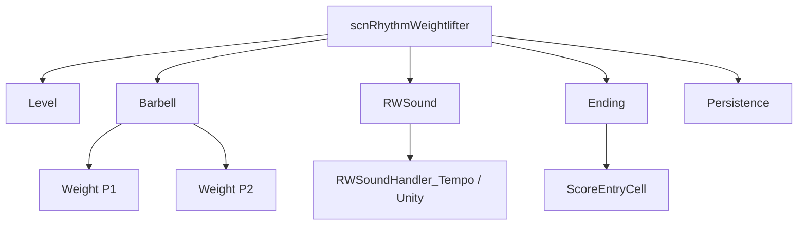

# 小游戏与测试组件

本页覆盖 `RhythmWeightlifter` 独立小游戏、Bullet 校准测试、行进入波形测试、旁白测试、波形测试和调试开关类。它们大多不参与主线关卡事件执行，但会复用 RD 的输入、存档、旁白、音频、DOTween、波形材质和场景基础类。

## 源码范围

| 类型族 | 文件 | 职责 |
| --- | --- | --- |
| Rhythm Weightlifter 场景 | `RhythmWeightlifter/scnRhythmWeightlifter.cs` | 独立举重小游戏场景，包含 intro、选关、gameplay、结算、删除数据和语言选择屏幕 |
| Rhythm Weightlifter 数据 | `Level.cs`、`LevelCharacter.cs`、`LevelCharacterName.cs`、`ScoreEntry.cs`、`ScoreEntryCell.cs`、`Failure.cs` | 关卡重量、角色、分数、排行榜、失败原因和 UI 单元 |
| 举重核心组件 | `Barbell.cs`、`Weight.cs` | 左右重量状态、平衡判定、下落、举起、节奏一致性和进度 |
| 举重音频封装 | `RWSound*.cs` | 在 Tempo 引擎或 Unity AudioSource 上播放和定时声音 |
| Bullet 测试 | `Bullet.cs`、`BulletShooter.cs` | 用音乐时间生成子弹，测试心形位置偏移和时间 offset |
| 波形和行进入测试 | `RowEntranceTest/RowEntranceTest.cs`、`RDWaveTester.cs`、`WaveTestManager.cs` | 测试 RDWave 材质参数、行进入波形、材质 keyword 和编辑器预览 |
| 旁白和媒体测试 | `NarrationTest.cs`、`HitStripTest.cs`、`MovieTest.cs`、`DataPathTest.cs`、`Test.cs` | 测试旁白队列、命中条闪光、空电影组件、空路径组件和 MP3 stream |
| 调试开关 | `DebugSettings.cs`、`DisableObjectIfNotDebug.cs`、`DisableObjectIfNotDebugAmbience.cs`、`EnableGraphicIfDebug.cs`、`RDDebug.cs`、`StoryDebugScreen.cs`、`scrBeatboxDebug.cs` | 调试配置、按调试状态启停对象、剧情进度调试和输入打印 |

## Rhythm Weightlifter 总览

`scnRhythmWeightlifter` 继承 `scnBase`，通过 `scnBase._instance` 暴露 `gameInstance`。它有独立的屏幕状态、输入处理、暂停、选关、无限模式、结算、旁白、移动端布局和调试组合键逻辑。

### 屏幕与状态

| 枚举或状态 | 值 | 行为 |
| --- | --- | --- |
| `Screen` | `Intro`、`LevelSelect`、`Gameplay`、`Ending`、`DeleteData`、`LanguageSelection` | 场景内主要屏幕。`SetScreen` 切换 GameObject、播放转场并调用对应进入逻辑。 |
| `HeadHeight` | `Low = 33`、`Mid = 66`、`High = 67` | 根据举重进度调整身体和脚部姿态。 |
| `GameState` | `Playing`、`Paused`、`NoLift`、`GoodLift` | 控制暂停 UI、失败/成功状态、统计面板、指示器和状态牌。 |
| `Failure` | 枚举文件 | 失败原因由举重平衡和速度/一致性逻辑写入，`Barbell.Update` 会设置 `Failure.Consistency` 或 `Failure.Speed`。 |
| `DogMode` | 属性 | 切换后让部分举重音效使用 dog 版本，并把 torso sprite 改为 dog sprite。 |
| `Metronome` | 属性 | 打开时设置 `nextBar = soundController.Clock` 并移动节拍灯；关闭时清空已排程节拍声音。 |
| `ShowingScore` | 属性 | 进入结算显示时锁手部刚体、停止节拍器、计算 consistency 与 speed、保存关卡成绩、更新 UI、处理无限模式生命和结局触发。 |

### 核心字段

| 字段 | 类型 | 作用 |
| --- | --- | --- |
| `levels` | `Level[]` | 普通模式关卡配置，保存左右重量、角色、BPM、容器和成绩。 |
| `barbell` | `Barbell` | 左右重量、杆线、平衡和举起进度的聚合对象。 |
| `inGameInk`、`outGameInk` | `RDInk` | 游戏内和游戏外对话。 |
| `flexHigh`、`flexLow`、`wobbleHigh`、`wobbleLow`、`dropP1`、`dropP2` | `RWSound` | 举起、晃动和掉落音效。 |
| `metronomeLTimes`、`metronomeRTimes` | `List<double>` | 已排程的左右节拍器亮灯时间。 |
| `easyLevels`、`mediumLevels`、`hardLevels`、`extremeLevels` | `List<Level>` | 无限模式关卡池。 |
| `infiniteModeCurrentLives` | `int` | 无限模式生命数，最大值为 3。 |
| `currentInfiniteModeRound` | `int` | 无限模式当前轮数。 |

### 重要流程

| 方法 | 行为 |
| --- | --- |
| `Awake()`、`Start()` | 初始化屏幕字典、音频控制器、关卡数据、输入、角色、权重、语言索引、移动端布局和初始屏幕。 |
| `Update()` | 每帧处理移动端调试组合键、节拍器排程、barbell 更新、输入、暂停、选关、举重按键、结算推进、语言选择和无限模式调试。 |
| `LevelIndex` setter | 夹取关卡索引，移动关卡容器，刷新统计，重置 barbell，写重量文本、屏幕文本、实际重量对象和角色。 |
| `CalculateConsistencyScore()` | 从两侧 `Weight.CalculateConsistency()` 取值并夹到 0 到 50。 |
| `CalculateSpeedScore()` | 根据举重完成时间、最大重量和 BPM 计算 speed 分，最终范围由 `speedScoreMin` 与 `speedScoreMax` 限制。 |
| `ChangeLevel(int direction)` | 在选关中改变关卡，跳过未解锁关卡，并播放当前关卡旁白。 |
| `PlayLevelDialogue()` | 按 `level{LevelIndex}` 或后缀 knot 播放举重关卡对话。 |
| `SetLevelFailed()` | 进入失败状态，播放失败音效、状态 UI、旁白，并在无限模式中扣生命。 |
| `ResetGameplay(bool playWhistle)` | 重置 barbell、失败原因、UI、节拍器和手部刚体，按参数播放哨声。 |
| `ShowGameplayScreen(bool show, bool showingScore)` | Tween 前景、角色和分数 UI，控制 gameplay 屏幕显示。 |
| `InitializeInfiniteModeLevels()` | 创建四个难度池并打乱，设置无限模式池索引和上一关。 |
| `GetRandomInfiniteModeLevel()` | 按轮数从 easy、medium、hard、extreme 池取关卡；相同左右重量的关卡会从各池移除以降低重复。 |
| `UpdateInfiniteModeLivesUI()` | 根据当前生命数更新心形 sprite。 |
| `TempoEngineURL()` | 打开 Tempo Engine URL。 |

## 举重数据与计分

| 类型 | 成员 | 行为 |
| --- | --- | --- |
| `Level` | `player1Weight`、`player2Weight`、`leftCharacter`、`rightCharacter`、`bpm` | 单个举重关卡配置。默认 BPM 为 220。 |
| `Level.Load()` | 存档读取 | 从 `Persistence` 读取当前关卡的 consistency、speed 和 score。 |
| `Level.Save()` | 存档写入 | 用本轮 `lastConsistency`、`lastSpeed`、`lastScore` 与已有值取最大，再写入 `Persistence`。 |
| `Level.GetRank(int score)` | rank 计算 | 先把 score 除以 2；0 返回 `-`，小于 20 为 F，小于 40 为 D，小于 60 为 C，小于 80 为 B，小于 100 为 A，否则为 S。 |
| `LevelCharacter` | `sprite`、`name` | 角色图与 `LevelCharacterName` 绑定。 |
| `ScoreEntry` | `character`、`initialsKey`、`score` | 排行榜条目结构。 |
| `ScoreEntryCell.Setup(...)` | UI 写入 | 写 rank、角色 icon、initials 和 score。玩家条目会启用背景和前景。 |
| `ScoreEntryCell.PlayBlink()` | 玩家高亮 | 设置 4.5 秒闪烁时间；`LateUpdate` 中让玩家条目文字颜色交替。 |

`scnRhythmWeightlifter.highScores` 内置 6 个排行榜条目。`Ending.ShowScoreboard` 会把玩家分数作为 `Character.Athlete` 条目加入后按 score 降序排序，再显示前若干 `ScoreEntryCell`。

## Barbell 与 Weight

| 类型 | 成员 | 行为 |
| --- | --- | --- |
| `Barbell` | `p1Weight`、`p2Weight`、`weightRod`、`collarOuterXPos` | 聚合左右重量、线段和外侧卡扣位置。 |
| `Barbell.completed` | 属性 | 左右 y 都达到 `maxY` 时为 true。 |
| `Barbell.Setup()` | 初始化 | 分别调用左右 `Weight.Setup`。 |
| `Barbell.Reset()` | 重置 | 两侧 weight 回到 `minY`，清空交替音效标志和进度。 |
| `Barbell.Update(bool levelWin)` | 平衡与进度 | 更新左右 weight，按左右高度差设置 `unbalancedWarning`；高度差超过阈值时设置失败原因并播旁白；进度取左右较低高度的 inverse lerp，并在跨过 0.5 时播 halfway 旁白。 |
| `Barbell.Lift(bool p1, float levelWeight)` | 举起一侧 | 按玩家选择高/低音效并在 dog mode 下替换为 dog 音效，然后调用对应 `Weight.Lift()`。 |
| `Weight.y` | 属性 | 夹取到 `barbell.minY` 到 `barbell.maxY + 1`，同步 point 与 sprite 位置，并触发 gameplay 文案淡出检查。 |
| `Weight.CurrentWeight` | 属性 | 设置重量级别时启用对应 `weights[]` 子对象。 |
| `Weight.Update(bool levelWin)` | 下落与晃动 | 高于最低点时按总重量、胜利状态和 inconsistent 状态计算下落；落到底时清空 hitTimes 并播放 drop 音效；hitTimer 到期后播放 wobble 并标记 inconsistent。 |
| `Weight.Lift()` | 单次输入 | 按杆长度的一定比例除以当前重量增加 y；记录 hit time，并根据两次输入间隔设置 hitTimer。 |
| `Weight.CalculateConsistency()` | 一致性分 | 用 hitTimes 间隔的相邻比例变化计算标准差，再按输入密度换算到 0 到 50 的分值区间。 |
| `Weight.Toggle(bool show)` | 砝码显隐 | 通过 DOTween 移动 weightsContainer 和 collarInner，显示时追加回弹式小动画。 |
| `Weight.AnimateOuterCollar()` | 外侧卡扣 | 根据当前重量移动外侧卡扣，并在完成后把它设为 weightsContainer 子对象。 |

## Rhythm Weightlifter 音频封装

| 类型 | 成员 | 行为 |
| --- | --- | --- |
| `RWSound` | `Volume`、`Pan`、`Setup()`、`Play()`、`Schedule()`、`Unschedule()` | 持有 AudioClip、volume、pan 和 handler。当前 `Setup()` 创建 `RWSoundHandler_Tempo`，并把当前组件作为 coroutine context。 |
| `RWSoundController` | `Clock`、`Volume`、`Setup()` | 声音控制器抽象。 |
| `RWSoundController_Tempo` | `TempoAudio.Clock`、`TempoAudio.Volume`、`TempoAudio.StartClock()` | 使用 TempoStudio 的时钟和音量。 |
| `RWSoundController_Unity` | `AudioSettings.dspTime` | Unity AudioSource 版本的控制器，`Setup()` 为空。 |
| `RWSoundHandler` | `Setup`、`Play`、`Schedule`、`Unschedule` | 声音播放 handler 抽象。 |
| `RWSoundHandler_Tempo` | `TempoSound` | 创建 `TempoSound` GameObject，调用 `Init(audioClip)`，并用 TempoSound 播放、排程和取消排程。 |
| `RWSoundHandler_Unity` | `AudioSource` | 创建 AudioSource GameObject；`Schedule` 会临时添加复制 AudioSource 并 `PlayScheduled(time)`，结束后 coroutine 销毁复制组件。 |

## 结算与无限模式

| 类型或方法 | 行为 |
| --- | --- |
| `Ending.ShowScoreboard(int playerScore)` | 合并内置高分和玩家分数，排序后填充 `ScoreEntryCell`；用 DOTween 依次播放标题下落、结果面板进入、玩家条目扩展和闪烁；同时播旁白和音效。 |
| `Ending.ShowReward()` | 根据 `playerHighScoreRank` 选择 Best、Good 或 Bad 结局资源，播放结果图、文字逐行显示、旁白和音效。 |
| `scnRhythmWeightlifter.GetFinalRank(int score)` | 遍历 `highScores`，用最终总分决定整体 rank。 |
| `scnRhythmWeightlifter.CalculateFinalScore()` | 累加普通关卡的 `Persistence.GetRhythmWeightlifterScore(i)`。 |
| `scnRhythmWeightlifter.InitializeInfiniteModeLevels()` | 按难度创建并打乱无限模式关卡池。 |
| `scnRhythmWeightlifter.SkipInfiniteRound()` | 调试跳过当前无限模式轮，递增轮数并回到 gameplay。 |
| `scnRhythmWeightlifter.SkipInfiniteRoundWithLevel(Level customLevel)` | 设置 `_debugForcedInfiniteLevel` 后跳到指定重量组合的无限模式轮。 |

## Bullet 校准测试

| 类型 | 成员 | 行为 |
| --- | --- | --- |
| `Bullet` | `speed`、`birthTime`、`InitialHeartLeftBorder` | `Update()` 按 `conductor.audioPos - (birthTime + 4 * crotchet)` 计算横向位移；`LateUpdate()` 在 remove 标志置位后销毁对象。 |
| `Bullet.Remove()` | 延迟销毁 | 只设置 `mRemoveFlag`，真正销毁在 `LateUpdate()`。 |
| `BulletShooter.Start()` | 初始化 | 关闭 vSync，隐藏 bullet prefab，读取 heart 初始 x 与 tk2d bounds，设置 BPM 88，播放 `sndTutorial`，并从第 5 到第 49 拍排程 `sndKick`。 |
| `BulletShooter.LateUpdate()` | 时间追踪 | 用 `Time.realtimeSinceStartup` 推进本地 `mAudioPos`，同时用 conductor `audioPos` 做平均校正；到下一拍时发射子弹；子弹撞到心形左边界时让心形 flash 并移除子弹。 |
| `BulletShooter.LeftButtonPressed()`、`RightButtonPressed()` | 心形偏移 | 每次调整 `mOffsetHeartPosX` 1 像素，范围限制在 -10 到 10。 |
| `BulletShooter.GetTimeOffset()` | 偏移换算 | 返回 `mOffsetHeartPosX / bulletSpeed`。 |

## 波形、行进入和材质测试

| 类型 | 成员 | 行为 |
| --- | --- | --- |
| `RowEntranceTest.TweenInfo` | `from`、`to`、`extraDuration`、`ease`、`random` | 行进入测试中单个材质或 Transform 参数的 tween 配置。 |
| `RowEntranceTest.Play()` | 行进入动画 | 杀掉旧 sequence，启用 `lineEntrance`，同时 tween 宽度、位置、canvas width、heart X、heart scale、sine width、triangle frequency、sine height、triangle offset 和 triangle lock；`loop` 为真时无限循环。 |
| `RDWaveTester` | `waveAnimation`、`playbackEditorTime`、`timeScale`、`loopTime` | 根据运行时或编辑器时间采样 `RDWaveAnimation` 曲线，并写入 `_WaveTime`、`_SineWidth`、`_SineHeight`、`_TriangleOffset`、`_TriangleFrequency`、`_TriangleOffsetLock`。 |
| `WaveTestManager.Awake()` | 批量生成 | 实例化 `WaveCount` 个 wave prefab，设置 y 坐标，初始化 `RDWaveRenderer_Pulse` local keywords，并默认打开 waves4 和 glow。 |
| `WaveTestManager.OnGUI()` | 调试按钮 | 用 IMGUI 按钮切换 shadows、heart、border type 和 waves 数，变化后写入每个 wave 材质 keyword。 |

## 旁白、命中条与媒体测试

| 类型 | 行为 |
| --- | --- |
| `NarrationTest` | 继承 `scnBase`。`Start()` 打开并暂停 accessibility；`Update()` 在字符串或元素类型变化时调用 `Narration.Say`；`Uninterruptable()` 和 `Interruptable()` 直接调用 `UAP_AccessibilityManager.Say` 测试可中断性。 |
| `HitStripTest` | `Awake()` 把 `Time.timeScale` 设为 1；第 30 帧调用 `hitStrip.Flash(hold: true)`。 |
| `MovieTest` | 空 `MonoBehaviour`，只作为场景挂载占位。 |
| `DataPathTest` | 空 `Start()` 与 `Update()`，用于路径测试挂载。 |
| `Test` | 要求 `AudioSource`。`Start()` 用硬编码路径创建 `RDMP3Stream`，把流式 MP3 clip 赋给 AudioSource 并播放。 |
| `scrBeatboxDebug` | 空 `LateUpdate()`，作为 beatbox 调试脚本占位。 |

## 调试配置与剧情调试

| 类型 | 成员 | 行为 |
| --- | --- | --- |
| `DebugSettings` | `instance` | 静态单例，保存调试开关和平台/语言开关。 |
| `DebugSettings` | `Debug`、`NoPro`、`Auto`、`BeatSounds`、`ForceNoSteamworks`、`EmulateMobile`、`InstantDialogue`、`SkipMenuTransitions`、`PaigeStays`、`DebugAmbience`、`RunningOnSteamDeck`、`GiveAchievements`、`WindowMovement`、`Language`、`PauseOnFocusLost`、`UnlimitedFramerate` | 属性 setter 写入字段后调用 `Save(true)`；`PaigeStays` 额外写 `Persistence.SetPaigeEnding`，`PauseOnFocusLost` 同步 `Application.runInBackground`，`UnlimitedFramerate` 在 10000 与 120 间切换 `Application.targetFrameRate`。 |
| `DisableObjectIfNotDebug` | `LateUpdate()` | `DebugSettings.Debug` 为真时启用目标对象，为假时禁用目标对象。 |
| `DisableObjectIfNotDebugAmbience` | `LateUpdate()` | 按 `DebugSettings.DebugAmbience` 启停目标对象，且 `OnlyOnDesktop` 为真时移动端不处理。 |
| `EnableGraphicIfDebug` | `LateUpdate()` | 把目标 `Graphic.enabled` 同步为 `DebugSettings.Debug`。 |
| `RDDebug.GetKeyDown(KeyCode keyCode)` | 输入打印 | 只有 `RDDebug.active` 为真且按键按下时打印 key 并返回 true。 |
| `StoryDebugScreen` | 剧情进度调试 | 构造 `StoryStep[]`，每个 step 写入 `Persistence` 中的 rank、cutscene、last played level 或全通状态；下拉框选择后执行 `FastForwardToStoryStep` 并回到关卡选择。 |
| `StoryDebugScreen.Update()` | 快捷 rank | Debug 或 booth 状态下，数字键 1 到 4 把当前关卡 rank 设置为不同值；Debug 状态还会控制调试面板显隐。 |
| `StoryDebugScreen.OnDropdownOpened()` | 下拉染色 | 按 `StoryStep.color` 给下拉项背景染色，名称以 `[` 开头的项不可交互。 |

## 与其他页面的关系

| 页面 | 关系 |
| --- | --- |
| [平台与服务辅助类](/api/runtime/platform-services.md) | 解释 `RDRichPresence` 对 `scnRhythmWeightlifter` 状态的识别，以及平台服务启动。 |
| [视觉与动画辅助类](/api/runtime/visual-animation-helpers.md) | 覆盖 `RDWaveAnimation`、`SpriteAnimation`、`Bpm*Animation` 等被测试和举重 UI 复用的动画组件。 |
| [节拍与判定](/api/runtime/beats-judgement.md) | `HitStripTest` 和 Bullet 测试复用命中条、conductor 与 beat 音频概念。 |
| [音频运行时](/api/runtime/audio-runtime.md) | 举重音频封装、BulletShooter 和 MP3 stream 测试都依赖音频运行时。 |
| [官方关卡覆盖清单](/api/levels/coverage.md) | `Level_AfterimageTest`、`Level_djtest` 已归入官方关卡脚本覆盖清单。 |
