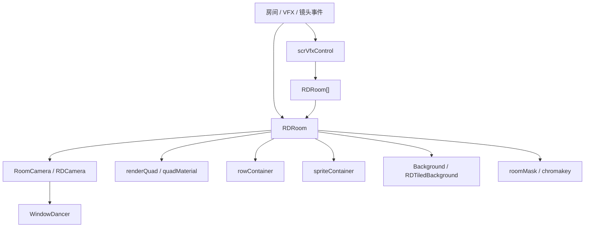

# 房间与 VFX 系统

本页整理运行时房间、相机、背景前景和全局 VFX 链路。`scrVfxControl` 是全局视觉控制器，`RDRoom` 是单个房间的渲染与内容容器，`RDCamera` / `RoomCamera` 控制相机尺寸、移动、缩放和窗口舞蹈 blit，`Background` / `RDTiledBackground` 负责主题背景和自定义贴图层。

## 源码范围

| 类型 | 源码路径 | 职责 |
| --- | --- | --- |
| `scrVfxControl` | `RDFucked/Assets/Scripts/Assembly-CSharp/scrVfxControl.cs` | 全局 VFX 控制器，管理房间数组、HUD camera、overlay、flash、shake、背景、前景、歌词、粒子、后处理和分辨率。 |
| `RDRoom` | `RDFucked/Assets/Scripts/Assembly-CSharp/RDRoom.cs` | 单个房间容器，管理 room camera、render texture、房间 quad、行容器、精灵容器、背景容器、遮罩、透视、主题和房间级 VFX。 |
| `RDCamera` | `RDFucked/Assets/Scripts/Assembly-CSharp/RDCamera.cs` | 相机基类，管理 orthographic size、移动 tween、缩放、旋转和 shake tween。 |
| `RoomCamera` | `RDFucked/Assets/Scripts/Assembly-CSharp/RoomCamera.cs` | 房间相机，按 render texture 自定义比例修正相机尺寸，并把房间画面 blit 到窗口舞蹈窗口。 |
| `Background` | `RDFucked/Assets/Scripts/Assembly-CSharp/Background.cs` | 主题背景 sprite，支持平铺、滚动、动画帧、跟随镜头、颜色、透明度和排序层。 |
| `RDTiledBackground` | `RDFucked/Assets/Scripts/Assembly-CSharp/RDTiledBackground.cs` | 自定义背景和前景贴图层，支持 content mode、滚动、pulse 平铺、动画纹理和排序层。 |
| `BackgroundData` | `RDFucked/Assets/Scripts/Assembly-CSharp/BackgroundData.cs` | `Background` 的初始化数据。 |
| `BackgroundType` | `RDFucked/Assets/Scripts/Assembly-CSharp/BackgroundType.cs` | 背景事件的颜色或图片类型。 |
| `RoomSelectType` | `RDFucked/Assets/Scripts/Assembly-CSharp/RoomSelectType.cs` | 房间选择枚举，覆盖 Room1 到 Room4。 |
| `RoomTransitionType` | `RDFucked/Assets/Scripts/Assembly-CSharp/RoomTransitionType.cs` | 房间显示事件使用的显示、隐藏和保持状态。 |

## 主干关系

房间画面由房间相机渲染到 `renderTexture`，再通过房间 quad 显示在主画面或窗口舞蹈窗口中。行、精灵、背景和房间 overlay 都挂在 `RDRoom` 的容器下，房间事件通过 room index 操作对应房间。

## 枚举与常量

### 房间与背景

| 枚举 | 值 | 用途 |
| --- | --- | --- |
| `RoomSelectType` | `Room1`、`Room2`、`Room3`、`Room4` | 编辑器房间选择，对应索引 0 到 3。 |
| `RoomTransitionType` | `Show`、`Hide`、`KeepVisible`、`KeepHidden` | 房间显隐事件的目标状态。 |
| `BackgroundType` | `Color`、`Image` | 背景颜色事件的模式。 |
| `ContentMode` | `Center`、`ScaleToFill`、`AspectFit`、`AspectFill`、`Tiled`、`Real` | 自定义背景、前景和房间内容的缩放或平铺方式。 |
| `TilingType` | `Scroll`、`Pulse` | 自定义 tiled 背景移动方式。 |
| `TileType` | `Both`、`Horizontal`、`Vertical`、`None` | 主题 `Background` 的平铺方向。 |
| `FollowBeatType` | `None`、`OneFramePerBeat`、`HeadbobStyle` | 主题 `Background` 的动画跟拍方式。 |

### VFX 与相机

| 枚举 | 值 | 用途 |
| --- | --- | --- |
| `CameraSizeCalculation` | `Default`、`FullyDynamic`、`DefaultOrLess` | `RDCamera` 计算相机尺寸的模式。 |
| `MaskType` | `Image`、`Room`、`Color`、`None` | 房间遮罩来源。 |
| `AlphaMode` | `Normal`、`Inverted` | 遮罩 alpha 方向。 |
| `EditorShakeType` | `Normal`、`Smooth`、`Rotate`、`BassDrop` | 震屏事件类型。 |
| `StrengthLevel` | `Low`、`Medium`、`High` | 普通震屏强度。 |
| `SimpleDuration` | `Short`、`Medium`、`Long` | Flash 事件时长，分别对应 1、2、4 crotchets。 |

`scrVfxControl` 的画布基准尺寸是 `352 x 198`，`DefaultAspectRatio` 为 `1.7777778`，最小窗口宽高为 `704 x 396`。`RDRoom.RoomsXOffset` 为 `3000`，用于把不同房间或房间级特效对象在 X 轴上分隔。

## scrVfxControl 全局控制器

`scrVfxControl` 继承 `RDBase`。它保存房间数组入口、HUD camera、全局 shader 数据、背景列表、overlay、spotlight、letterbox、歌词、粒子、文本、后处理和分辨率工具。

### 关键字段

| 字段 | 类型 | 作用 |
| --- | --- | --- |
| `scBackground` / `scLevelElements` | `tk2dSpriteCollectionData` | 背景和关卡元素 sprite collection。 |
| `quad` | `GameObject` | overlay、背景和遮罩用 quad prefab。 |
| `hitStripPrefab` | `GameObject` | 命中条 prefab。 |
| `spotlightPrefab` / `letterboxPrefab` | `GameObject` | 聚光灯和遮幅 prefab。 |
| `matrixModePrefab` / `shadowModePrefab` | `GameObject` | Matrix 和 shadow 模式 prefab。 |
| `shockwavePrefab` | `GameObject` | shockwave prefab。 |
| `lyricsPrefab` / `lyricsSmallPrefab` | `GameObject` | 歌词 prefab。 |
| `particleSpawnerPrefab` | `GameObject` | 粒子生成器 prefab。 |
| `fxNoise` / `fxGlitch` | `Background` | 全局 noise 和 glitch 背景效果。 |
| `hudCameraOverlay` | `scrQuad` | HUD camera 的全局 overlay。 |
| `topObjects` | `Transform` | 顶层对象容器。 |
| `backgrounds` | `List<Background>` | 当前创建的主题背景列表。 |
| `customForeground` | `RDTiledBackground` | 全局自定义前景层。 |
| `allLyrics` | `Dictionary<int, LyricsGame>` | 歌词对象索引。 |
| `flashText` | `TextMesh[]` | 房间 flash text。 |
| `globalShaderData` | `RDShaderProperties` | 全局 shader 参数来源。 |
| `roomsAnimationDuration` | `float` | `ShowRooms()` 使用的房间切换持续时间。 |
| `scrollXMultiplier` / `scrollYMultiplier` | `float` | 背景滚动倍率。 |
| `flashIntensity` | `float` | flash 强度。 |
| `backgroundDimming` | `float` | 背景变暗强度。 |
| `oneshotSpotlights` | `OneshotSpotlights` | Oneshot spotlight 控制器。 |
| `sevenBeatArmy` | `RDSevenBeatArmy` | SevenBeatArmy 效果对象。 |
| `textureCache` | `Dictionary<string, CachedTexture>` | 静态纹理缓存。 |

### 属性

| 属性 | 类型 | 作用 |
| --- | --- | --- |
| `instance` | `scrVfxControl` | 查找场景中的全局 VFX 控制器。 |
| `RDHeight` | `float` | 固定返回 `198`。 |
| `RDWidthInt` / `RDHeightInt` | `int` | 画布尺寸的整数形式。 |
| `hudCamera` | `Camera` | `scrGameManager` 的 HUD camera。 |
| `hudRDCamera` | `RDCamera` | `scrGameManager` 的 HUD `RDCamera`。 |
| `rooms` | `RDRoom[]` | `scnGame.rooms`。 |

### 生命周期与重置

| 方法 | 行为 |
| --- | --- |
| `Awake()` | 初始化单例和全局视觉对象，并设置 `RDBase.Vfx`。 |
| `Start()` | 完成运行时视觉初始化。 |
| `Update()` | 刷新第一帧、矩阵模式、反转屏幕等运行时状态。 |
| `LoadGameEffects()` | 加载关卡内使用的视觉效果对象。 |
| `TurnOnPixelPerfect()` | 开启像素精确相关设置。 |
| `ResetEffects()` | 重置 VFX 状态。 |
| `OnGUI()` | 调试显示相关 GUI。 |

### overlay、flash 与黑屏

| 方法 | 行为 |
| --- | --- |
| `FadeOut(float, int, float)` / `FadeOut(float, int)` | 对指定房间或全局 overlay 淡出。 |
| `FadeIn(float, int, float)` / `FadeIn(float, int)` | 对指定房间或全局 overlay 淡入。 |
| `SetOverlayToAlpha(float, int)` | 直接设置 overlay alpha。 |
| `Strobe(...)` | 按 crotchet 时间安排重复 strobe。 |
| `BlackoutSingleStrobe(...)` | 在开始和结束 crotchet 之间做黑屏 strobe。 |
| `Flash(int, float)` / `Flash(int, float, float)` | 房间或全局白色 flash。 |
| `ReverseFlash(float, int)` | 反向 flash。 |
| `ReverseFlashBg(float, int)` | 背景层反向 flash。 |
| `BlackScreenOn(int)` / `BlackScreenOff(int)` | 开关黑屏。 |
| `GreenScreenOn(int)` / `GreenScreenOff(int)` | 开关绿屏。 |
| `GetRoomOverlay(int)` | 获取指定房间 overlay；`-1` 使用 HUD overlay。 |
| `GetRoomBackgroundOverlay(int)` | 获取指定房间背景 overlay。 |
| `DarkenBackgrounds(int, float, float)` | 淡入背景遮罩。 |
| `FlashBg(int, float, float)` | 背景 flash。 |
| `LightenBackgrounds(int, float)` | 淡出背景遮罩。 |

### 相机、震屏和画面变换

| 方法 | 行为 |
| --- | --- |
| `GetCamera(int room)` | 返回指定房间的 `RDCamera`，`-1` 返回 HUD `RDCamera`。 |
| `ShakeCam(int, int, int)` | 对房间相机执行普通位置 shake。 |
| `ShakeCamSmooth(float, float, int)` | 对房间相机执行平滑位置 shake。 |
| `StopShakeCam(int)` | 停止指定房间相机 shake。 |
| `ShakeCamRotate(float, float, int)` | 对房间相机执行旋转 shake。 |
| `SetFlipScreenX(bool, int)` / `SetFlipScreenY(bool, int)` | 设置画面水平或垂直翻转。 |
| `SetTileScreen(Vector2, int)` | 设置画面 tile。 |
| `ZoomScreen(float, float, float, int)` | 设置屏幕 zoom 与 offset。 |
| `ZoomBackToNormal()` | 恢复屏幕 zoom。 |
| `InvertScreenColors(bool, int)` | 开关颜色反转。 |
| `SetBloomParams(...)` | 设置指定房间或全局 bloom 参数。 |
| `PlayBassDropEffect(int)` / `BassDropNew(...)` | 播放 bass drop 类画面效果。 |

## RDRoom 房间容器

`RDRoom` 是房间级运行时中心。它拥有房间相机、渲染纹理、行容器、精灵容器、背景容器、overlay、遮罩、透视 mesh、主题背景列表和大量主题专用对象。

### RDRoom 关键字段

| 字段 | 类型 | 作用 |
| --- | --- | --- |
| `camera` | `Camera` | 房间相机。 |
| `rdCamera` | `RoomCamera` | 房间相机控制组件。 |
| `quadPrefab` / `renderTextureQuadPrefab` | `GameObject` | 房间 quad 和 render texture quad prefab。 |
| `cameraContainer` | `Transform` | 房间相机容器。 |
| `rowContainer` | `Transform` | 行容器。 |
| `spriteContainer` | `Transform` | 自定义精灵容器。 |
| `overlay` / `backgroundOverlay` | `scrQuad` | 房间 overlay 和背景 overlay。 |
| `backgroundContainerWorldspace` / `backgroundContainerCamera` | `Transform` | 世界空间和跟随相机背景容器。 |
| `oneshotSpotlights` | `OneshotSpotlights` | 房间 Oneshot spotlight。 |
| `stutter` | `scrStutter` | 房间 stutter 效果。 |
| `renderTexPaster` | `scrPasteToRenderTex` | render texture 粘贴组件。 |
| `index` | `int` | 房间索引。 |
| `renderQuad` / `renderQuadPivot` | `GameObject` / `Transform` | 主画面显示房间 render texture 的 quad 和 pivot。 |
| `quadRenderer` / `quadMaterial` / `quadMesh` | `Renderer` / `Material` / `Mesh` | 房间 quad 渲染对象、材质和透视 mesh。 |
| `customTransform` | `bool` | 房间是否使用自定义 transform。 |
| `roomMovedByLevelEvent` | `bool` | 房间是否被 MoveRoom 事件移动过。 |
| `followedByWindow` | `bool` | 房间是否跟随窗口舞蹈。 |
| `renderTexture` | `RenderTexture` | 房间相机输出纹理。 |
| `maskTextures` | `Texture2D[]` | 图片遮罩帧。 |
| `roomMask` | `RenderTexture` | 以其他房间作为遮罩时使用的 render texture。 |
| `currentEnvironment` | `RDEnvironment` | 当前环境对象。 |
| `contentMode` | `ContentMode` | 房间内容模式。 |
| `verticalRowSpacing` | `int` | 行垂直间距，默认 `42`。 |
| `playerBounds` | `Range[]` | 玩家区域边界。 |
| `positionTweenX/Y`、`scaleTweenX/Y` | `Tween` | MoveRoom 位置与缩放 tween。 |
| `pivotTweenX/Y` | `Tween` | MoveRoom pivot tween。 |
| `opacityTween` | `Tween` | FadeRoom opacity tween。 |
| `vertexTweensX/Y` | `Tween[]` | SetRoomPerspective 四角 tween。 |
| `currentVertexPositions` | `Vector3[]` | 房间透视 quad 四角坐标。 |
| `lyrics` | `LyricsGame` | 房间歌词。 |
| `vignette` | `tk2dSprite` | 房间 vignette。 |
| `preloadedThemes` | `List<RDTheme>` | 已预加载主题。 |
| `preloadedVFX` | `List<RDThemeFX>` | 已预加载 VFX。 |

### RDRoom 属性

| 属性 | 类型 | 作用 |
| --- | --- | --- |
| `firstRow` | `RowEntity` | 查找本房间第一个 active 的行实体。 |
| `peekWindowMode` | `bool` | 读写 peek window 模式，并在关闭时还原相机位置。 |
| `kaleidoscopeMode` | `bool` | 创建、启用或关闭 kaleidoscope，并按 multiroom 调整 camera clear flags。 |
| `kaleidoscopeModeCross` | `bool` | 创建、启用或关闭 cross kaleidoscope。 |
| `kaleidoscopeModeEmbers` | `bool` | 预加载并启用 embers kaleidoscope。 |
| `rotatingVoxelMode` | `bool` setter | 创建、启用或关闭 rotating voxel。 |
| `spaceMode` | `bool` | 启用或关闭 space background，并按 multiroom 设置相机输出。 |
| `bloom` / `crossBloom` / `emberBloom` | `VideoBloom` | 房间主相机或特殊相机的 bloom 组件。 |

### 初始化、房间 quad 和透视

| 方法 | 行为 |
| --- | --- |
| `Setup(int, bool)` | 设置房间索引、render texture、render quad、材质、相机、容器、背景和房间专用对象。 |
| `SetMoveRoomEnd()` | 记录 MoveRoom 完成后的 transform、scale、angle、pivot 和透视状态。 |
| `ResetMoveRoomProperties()` | 清空 MoveRoom 使用标记和透视角点标记。 |
| `FinishScrubbing()` | scrub 结束后恢复房间动画和状态。 |
| `SetNormalizedRectToQuad(Rect)` | 按归一化 rect 设置房间 quad 显示区域。 |
| `NormalizedRect()` | 读取当前房间 quad 的归一化 rect。 |
| `AnimateQuad(Rect, Rect, float, bool, Ease)` | 在两个 rect 之间动画房间 quad，并按参数在结束后隐藏。 |
| `EnableRenderingDependingOnRoomSize()` | 按房间尺寸启用或关闭渲染。 |
| `Rotate(float, float, Ease)` | 旋转房间 render quad pivot。 |
| `FinishAnimation()` | 结束房间 quad 动画。 |
| `KillAnimation(bool)` | 停止房间 quad 动画。 |
| `UpdateVertices()` | 根据当前四角坐标更新透视 mesh。 |
| `InitializePerspectiveMesh()` | 创建 16 分段透视 mesh。 |

### 遮罩、内容和行布局

| 方法 | 行为 |
| --- | --- |
| `SetMask(Texture)` | 把材质遮罩设置为指定 texture。 |
| `SetRoomMask(int)` | 使用另一个房间的 render texture 作为遮罩。 |
| `SetColorMask(Color, float, float)` | 设置 chromakey 颜色、cutoff 和 feathering。 |
| `ShowMasks(Texture2D[], FilterMode, float)` | 设置图片遮罩帧、过滤模式和 fps。 |
| `SetMaskAlphaMode(bool)` | 设置遮罩 alpha 是否反向。 |
| `SetPremultiplyAlpha(bool)` | 设置 premultiply alpha。 |
| `SetUsingMask(bool)` | 开关图片或房间遮罩。 |
| `SetUsingChromakey(bool)` | 开关 chromakey 遮罩。 |
| `RepositionRowsAndStrips(bool)` | 重排本房间中的行和玩家 strip。 |
| `RepositionHorizontalStrips(...)` | 设置 P1/P2 水平 strip 的位置。 |
| `SetHorizontalStripsVisible(bool)` | 显示或隐藏水平 strip。 |
| `HasAnyBeatWithinMargin(RDPlayer)` | 检查本房间指定玩家是否有命中范围内 beat。 |

### 主题与房间级 VFX

| 方法 | 行为 |
| --- | --- |
| `HideAllThemeBackgrounds()` | 隐藏所有主题背景。 |
| `DisableThemeGeneralEffects(bool)` | 关闭主题通用效果，可同步重绘行。 |
| `ShowThemeBackgrounds(RDTheme, ...)` | 显示指定主题背景，处理主题变体、行容器、特殊场景对象和行染色。 |
| `PreloadTheme(RDTheme, int)` | 预加载指定主题资源。 |
| `ScrollTheme(float, float, Ease)` | 滚动主题背景。 |
| `TryResetScroll()` / `ResetScroll(float)` | 重置主题滚动状态。 |
| `PreloadFX()` | 预加载本房间 `preloadedVFX` 中的效果。 |
| `DisableAllThemeFX()` | 关闭所有主题 VFX。 |
| `DisableThemeFX(RDThemeFX)` | 关闭指定主题 VFX。 |
| `AddThemeFX(RDThemeFX, ...)` | 开启指定 VFX，并按参数设置强度、位置、速度、颜色和 tween。 |
| `UseMaterial(RDShaderProperties)` | 把 shader properties 应用到房间材质。 |
| `SetShakeIntensityOnHit(int, int)` | 设置 hit 时 shake 执行器。 |
| `SetShakeIntensityDefault(shakeIntensityPreset)` | 使用预设设置 shake 强度。 |
| `SetVignette(bool)` / `SetVignetteAlpha(float)` | 控制房间 vignette。 |
| `BeatboxPulsed(Vector3, int, string, float)` | 在 beatbox pulse 位置显示数字或自定义文本效果。 |
| `MakeShockwave(Vector3, RowEntity)` | 创建 shockwave。 |
| `GetTextureLayer(RDSortingLayer)` | 获取背景或前景 tiled texture layer。 |
| `HideTextureLayer(RDSortingLayer)` | 隐藏指定 texture layer。 |

`RDThemeFX` 覆盖 Vignette、shockwave、BassDrop、shake、wavy rows、tile、row shader、blackout、noise、glitch、rain、matrix、petals、snow、bloom、screen scroll、mosaic、VHS、confetti、blur、dots、brightness、contrast、saturation、diamonds、eyes 等 0 到 73 号效果。`DisableAll` 的枚举值为 57。

## RDCamera 与 RoomCamera

`RDCamera` 在 `Awake()` 中缓存 Unity `Camera`，调用 `UpdateCameraSize()`，并在 `dontMove` 为 false 时把相机 Y 移到 orthographic size。`LateUpdate()` 每帧重新计算相机尺寸。

| 方法 | 行为 |
| --- | --- |
| `UpdateCameraSize(int)` | 按 `CameraSizeCalculation`、render texture 或屏幕宽高计算 aspect，再用 `zoom + pulseAmount` 调整 orthographic size。 |
| `Rotate(float, float, Ease)` | duration 为 0 时直接设置角度，否则启动协程按 ease 旋转。 |
| `Zoom(float, float, Ease)` | duration 为 0 时直接写 `zoom`，否则用 DOTween 缓动。 |
| `PulseCamera(float, float)` | 用 `pulseAmount` 做一次相机 zoom pulse。 |
| `ClearSmoothShake()` | 完成并清除 smooth shake tween。 |
| `ClearRotateShake()` | 完成并清除 rotate shake tween。 |

`RoomCamera.UpdateCameraSize()` 在基类结果上继续处理 render texture：如果 `camera.targetTexture != null`，会按 `customScale` 调整 orthographic size 和 aspect。

`RoomCamera.OnBlittingPass()` 只在 `game.windowDancing` 时执行。它遍历 `WindowChoreographer.dancers`，找到与当前房间索引一致的窗口，把房间 `renderTexture` 通过窗口材质 blit 到窗口 render texture，并在 `window.shouldRenderUI` 时手动渲染 UI camera。

## Background 主题背景

`Background` 继承 `InvisibleEntity`，要求对象带 `tk2dTiledSprite`。它通过 `BackgroundData` 初始化 sprite、scale、tile、followCamera、room、fps、velocity 和 foreground/background sorting layer。

| 方法 | 行为 |
| --- | --- |
| `SetData(BackgroundData)` | 写入背景初始化数据。 |
| `SetForeground(bool)` | 设置是否为前景 sorting layer。 |
| `SetRenderQueue(int)` | 设置材质 render queue。 |
| `SetColor(Color)` / `SetColor(uint)` | 协程下一帧设置 tiled sprite 颜色。 |
| `SetAlpha(float)` / `SetAlphaWithoutCoroutine(float)` | 设置透明度。 |
| `FadeIn(float)` / `FadeOut(float)` | 使用 DOTween 淡入或淡出。 |
| `ScaleTween(float, float)` | 缓动 tiled sprite scale。 |
| `SetBackgroundOrder(int)` | 设置 sorting order。 |
| `SetSortingLayer(string)` | 设置 mesh renderer sorting layer。 |
| `SetFixedPosition(bool)` / `SetForceTiling(bool)` | 修改 `BackgroundData` 中的固定位置和平铺设置。 |
| `SetFollowCamera(bool)` | 切换到房间 camera 或 worldspace 背景容器。 |
| `SetRoom(int)` | 修改所属房间并刷新父容器。 |
| `SetScale(float)` | 设置 `BackgroundData.scale`。 |
| `SetTileType(TileType)` | 设置平铺方向。 |
| `SetFollowBeat(FollowBeatType)` | 设置跟拍动画方式。 |
| `SetAnimation(...)` | 设置动画帧 sprite id。 |
| `PlayAnimation()` / `PauseAnimation()` / `RewindAnimation()` | 控制动画播放。 |
| `OnAnimationEnd(BackgroundCallback)` | 设置非循环动画结束回调。 |
| `SetSprite(string)` | 停止动画并切换到指定 sprite。 |
| `OnBeat()` | `HeadbobStyle` 重置动画；`OneFramePerBeat` 推进一帧。 |

`Background.Update()` 会按 velocity、`scrollXMultiplier`、`scrollYMultiplier` 和 tile 类型移动背景；动画模式会按 fps 或 beat 推进帧。

## RDTiledBackground 自定义贴图层

`RDTiledBackground` 用于 SetBackgroundColor 图片模式和 SetForeground。`Show()` 会设置纹理数组、过滤模式、颜色、sorting layer、content mode、滚动或 pulse 平铺。

| ContentMode | 行为 |
| --- | --- |
| `ScaleToFill` | quad 缩放到 `RDWidth x RDHeight`。 |
| `AspectFit` | 保持比例完整显示。 |
| `AspectFill` | 保持比例填满画布。 |
| `Center` | 使用纹理原始宽高。 |
| `Tiled` | quad 填满画布，按纹理尺寸设置 main texture scale，并开启 scroll 或 pulse。 |

| 方法 | 行为 |
| --- | --- |
| `Show(...)` | 显示纹理层，设置内容模式、过滤、颜色、排序、滚动速度、fps、duration、ease 和 pulse interval。 |
| `Hide()` | 关闭对象。 |
| `Update()` | scroll 模式持续推进 `mainTextureOffset`；pulse 模式使用 `pulseOffset`；多纹理按 `AudioSettings.dspTime` 和 fps 选帧。 |

## 事件入口

| 编辑器事件 | 运行时落点 |
| --- | --- |
| `LevelEvent_ShowRooms` | `Prepare()` 计算显示房间和高度；`Run()` 设置 `vfx.roomsAnimationDuration`，调用 `vfx.ShowRooms()` 并重排行。 |
| `LevelEvent_MoveRoom` | 对 `RDRoom.renderQuadPivot` 和 `renderQuad` 建立位置、缩放、角度、pivot tween，并设置 `customTransform`。 |
| `LevelEvent_FadeRoom` | 对 `RDRoom.quadMaterial` 的 `_Opacity` 做 tween。 |
| `LevelEvent_MaskRoom` | 图片遮罩调用 `ShowMasks()`；房间遮罩调用 `SetRoomMask()`；颜色遮罩调用 `SetColorMask()`。 |
| `LevelEvent_SetRoomPerspective` | 对四个角的 X/Y 建立 tween，写入 `currentVertexPositions` 并调用 `UpdateVertices()`。 |
| `LevelEvent_SetRoomContentMode` | 写入 `RDRoom.contentMode`。 |
| `LevelEvent_SetBackgroundColor` | 颜色模式调用 `vfx.BgColor()`；图片模式调用房间 `GetTextureLayer(Background).Show()`；空图片隐藏背景 layer。 |
| `LevelEvent_SetForeground` | 调用 `vfx.GetForegroundTextureLayer(room).Show()`；空图片关闭前景对象。 |
| `LevelEvent_SetVFXPreset` | `Prepare()` 把 preset 加入房间 `preloadedVFX`；`Run()` 调用 `AddThemeFX()`、`DisableThemeFX()` 或处理 `DisableAll`。 |
| `LevelEvent_Flash` | 按 `SimpleDuration` 换算秒数后调用 `vfx.Flash()`。 |
| `LevelEvent_CustomFlash` | 选择 room overlay 或 background overlay，并执行颜色和 alpha tween。 |
| `LevelEvent_ShakeScreen` | 根据强度和类型调用 `ShakeCam()`、`ShakeCamSmooth()` 或 `ShakeCamRotate()`。 |
| `LevelEvent_ShakeScreenCustom` | 自定义 smooth、rotate、bass drop 或普通 shake。 |
| `LevelEvent_PulseCamera` | 按频率添加 `scrExecuteOnCertainBeat`，调用 `RDCamera.PulseCamera()`。 |
| `LevelEvent_MoveCamera` | 移动真实相机或修改房间/window 材质 `_PosX`、`_PosY`、`_Angle`、`_Scale`。 |

## Mod 关注点

| 场景 | 关注内容 |
| --- | --- |
| 获取房间 | 使用 `RDBase.Vfx.rooms[index]` 或 `scnGame.instance.rooms[index]`。 |
| 操作房间画面 | 移动和缩放房间 quad 使用 `RDRoom.renderQuadPivot`；真实相机移动使用 `RDCamera`。 |
| 操作背景前景 | 背景层使用 `RDRoom.GetTextureLayer(RDSortingLayer.Background)`；前景层使用 `scrVfxControl.GetForegroundTextureLayer(room)`。 |
| 操作遮罩 | 图片、房间和 chromakey 三条路径分别对应 `ShowMasks()`、`SetRoomMask()`、`SetColorMask()`。 |
| 操作 VFX preset | 房间级效果通过 `RDRoom.AddThemeFX()` 与 `DisableThemeFX()` 管理。 |
| 窗口舞蹈 | `RoomCamera.OnBlittingPass()` 会把房间 render texture blit 到对应 `WindowDancer.window`。 |
| 主题细节 | `RDRoom` 包含大量主题专用对象和 `[ListedMethod]` 自定义方法，后续 Mod 索引会按可调用方法单独整理。 |

## 相关页面

| 页面 | 关系 |
| --- | --- |
| [运行时系统总览](/api/runtime/overview.md) | 阶段 3 总入口。 |
| [行与角色系统](/api/runtime/rows-characters.md) | 房间中的行容器、行重排和命中条位置。 |
| [视觉与镜头事件](/api/editor-events/visual-camera-events.md) | Flash、VFX、镜头、背景前景和震屏事件分组。 |
| [房间与精灵事件](/api/editor-events/room-sprite-events.md) | ShowRooms、MoveRoom、MaskRoom、SetRoomPerspective 和房间内容事件分组。 |
| [房间控制事件](/api/editor-events/RoomControlEvents.md) | 房间事件重点页。 |
| [视觉样式与特效事件](/api/editor-events/VisualStyleEvents.md) | Theme 和 VFX preset 重点页。 |
