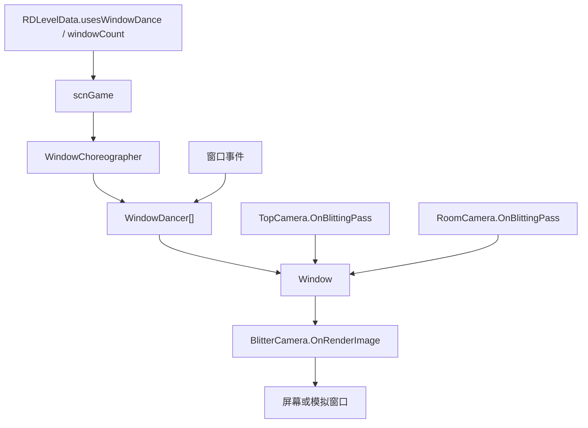

# 窗口系统

本页整理运行时窗口舞蹈系统。窗口舞蹈由 `scnGame` 按关卡数据创建 `WindowChoreographer`，再由 `WindowDancer` 每帧计算窗口位置和尺寸。真实窗口模式使用 OS 窗口，模拟模式使用 UI 中的虚拟窗口。

## 源码范围

| 类型 | 源码路径 | 职责 |
| --- | --- | --- |
| `WindowChoreographer` | `RDFucked/Assets/Scripts/Assembly-CSharp/WindowChoreographer.cs` | 窗口舞蹈抽象编舞器，管理 dancer、z order、准备状态、暂停、校验和房间跟随。 |
| `RealWindowChoreographer` | `RDFucked/Assets/Scripts/Assembly-CSharp/RealWindowChoreographer.cs` | 真实窗口编舞器，创建主窗口或自定义 OS 窗口，处理 fullscreen 切换、输入、焦点和 z order。 |
| `VirtualWindowChoreographer` | `RDFucked/Assets/Scripts/Assembly-CSharp/VirtualWindowChoreographer.cs` | 模拟窗口编舞器，使用 `SimulateWDController` 和 `VirtualWindowView` 在游戏画面内显示窗口。 |
| `WindowDancer` | `RDFucked/Assets/Scripts/Assembly-CSharp/WindowDancer.cs` | 单个窗口的运动控制器，计算 Move、Sway、Wrap、Ellipse、ShakePer 等预设的位置和尺寸。 |
| `Window` | `RDFucked/Assets/Scripts/Assembly-CSharp/Window.cs` | 窗口抽象基类，管理 render texture、材质、标题、边框、大小、位置和显示。 |
| `RealWindow` | `RDFucked/Assets/Scripts/Assembly-CSharp/RealWindow.cs` | 真实窗口抽象基类，封装 MultiWindow `BaseWindow`。 |
| `CustomWindow` | `RDFucked/Assets/Scripts/Assembly-CSharp/CustomWindow.cs` | 额外真实窗口，创建 MultiWindow 窗口、接收键盘事件并呈现 render texture。 |
| `UnityPlayerWindow` | `RDFucked/Assets/Scripts/Assembly-CSharp/UnityPlayerWindow.cs` | Unity 主窗口包装，负责主窗口校验、显示、标题和编辑器 game view 输出。 |
| `VirtualWindow` | `RDFucked/Assets/Scripts/Assembly-CSharp/VirtualWindow.cs` | 模拟窗口，使用 `RectTransform`、RawImage 和边框对象模拟窗口。 |
| `VirtualWindowView` | `RDFucked/Assets/Scripts/Assembly-CSharp/VirtualWindowView.cs` | 模拟窗口 UI 视图，管理 RawImage、边框、标题和编辑器窗口颜色。 |
| `TopCamera` | `RDFucked/Assets/Scripts/Assembly-CSharp/TopCamera.cs` | 顶层相机，把 top camera render texture blit 到窗口内容。 |
| `RoomCamera` | `RDFucked/Assets/Scripts/Assembly-CSharp/RoomCamera.cs` | 房间相机，把房间 render texture blit 到窗口内容。 |
| `BlitterCamera` | `RDFucked/Assets/Scripts/Assembly-CSharp/BlitterCamera.cs` | 窗口舞蹈最终 blit 相机，触发 top 和 room blit 并输出到屏幕。 |
| `WindowCamera` | `RDFucked/Assets/Scripts/Assembly-CSharp/WindowCamera.cs` | 渲染窗口内 overlay/spotlight 内容的相机。 |

## 总体流程

`scnGame` 在加载关卡时检查 `RDC.windowDance`、`RDLevelData.current.usesWindowDance` 和 `windowCount`。`RDC.windowMovement == WindowMovement.Simulate` 时创建 `VirtualWindowChoreographer`，其他窗口舞蹈模式创建 `RealWindowChoreographer(false)`。

## 枚举

| 枚举 | 值 | 用途 |
| --- | --- | --- |
| `WindowMovement` | `Full`、`OneScreen`、`Simulate`、`Off` | 玩家设置中的窗口舞蹈模式；`Simulate` 使用虚拟窗口，`Off` 关闭窗口舞蹈。 |
| `WindowDancePreset` | `Move`、`Sway`、`Wrap`、`Ellipse`、`ShakePer` | `WindowDancer` 的运动预设。 |
| `SamePresetBehavior` | `Keep`、`Reset` | 重复使用同一 preset 时保留或重置时间。 |
| `EasingType` | `Repeat`、`Mirror` | `Sway` 和 `ShakePer` 的子缓动模式。 |
| `ReferenceType` | `Center`、`Edge` | Move preset 的 pivot 参考方式。 |
| `PivotAnchorType` | `None`、`LeftEdge`、`RightEdge`、`BottomEdge`、`TopEdge` | WindowResize 使用的边缘锚点。 |
| `WindowContentMode` | `OnTop`、`Room` | 窗口内容显示 top camera 或指定房间。 |
| `ZoomMode` | `Fill`、`Fit`、`None` | WindowResize 后窗口内容缩放策略。 |
| `PivotMode` | `Default`、`AnchorEdge` | WindowResize 的 pivot 模式。 |
| `WindowNameAction` | `Set`、`Append`、`Reset` | RenameWindow 的标题操作。 |

## WindowChoreographer

`WindowChoreographer` 继承 `RDClass`，是窗口舞蹈的抽象入口。

| 字段或属性 | 类型 | 作用 |
| --- | --- | --- |
| `dancers` | `WindowDancer[]` | 当前窗口 dancer 列表。 |
| `zOrder` | `int[]` | 窗口显示顺序，默认 `0,1,2,3`。 |
| `enabled` | `bool` | 编舞器开关。 |
| `state` | `State` | `Setup`、`Preparing`、`Ready` 状态枚举。 |
| `setup` | `bool` | 编舞器是否完成初始化。 |
| `changingWindowSize` | `bool` | 当前是否在调整窗口尺寸。 |
| `preparedFirstTime` | `bool` | 是否已经完成第一次准备。 |
| `MinimumViewSize` | `Vector2Int` | 最小 view size，值为 `2 x 2`。 |
| `playerWindow` | `UnityPlayerWindow` | 当前平台的 Unity 主窗口。 |
| `WindowDanceResolution` | `Vector2Int` | 抽象属性，由真实或虚拟实现提供舞蹈区域尺寸。 |

| 方法 | 行为 |
| --- | --- |
| `Setup(int dancerCount)` | 抽象初始化方法，子类创建窗口和 dancer。 |
| `SetWindowContentToRoom(int, int)` | 设置指定窗口显示指定房间；`roomIndex == -1` 表示 top camera。 |
| `LateUpdate()` | 游戏开始且未暂停时更新每个 enabled dancer、房间 peek window 和窗口 z order，再执行 `Check()`。 |
| `UpdateWindowZOrders()` | 按 `zOrder` 从后往前把可见窗口置顶。 |
| `Check()` | 在非暂停、非改尺寸、窗口校验失败或 fullscreen 时启动 `PrepareForDancing()`。 |
| `CheckDancers()` | 对每个 dancer 调用 `CheckDefaultValues()`。 |
| `StartUsingCustomWindows()` | 显示 0 号窗口、重置窗口并切到非暂停状态。 |
| `PrepareForDancing()` | 抽象准备流程。 |
| `OnPauseChanged(bool)` | 把暂停状态分发给每个 dancer。 |
| `GetWindowScaleForDancing()` | 根据舞蹈区域和 `352 x 198` 基准计算窗口缩放。 |
| `ShowGlitch(bool)` | 播放 noise 音并显示窗口 glitch。 |
| `Cancel()` | 取消每个 dancer，并按暂停状态处理窗口。 |
| `OnDestroy()` | 销毁所有 dancer 持有的窗口。 |
| `HideWindows()` | 把每个窗口中心移动到舞蹈区域三倍位置。 |
| `UpdateRoomFollowing()` | 标记每个 `RDRoom.followedByWindow`。 |

## RealWindowChoreographer

真实窗口编舞器使用 MultiWindow。构造函数记录 `mainWindowIsDancer`，并在第一次窗口舞蹈分辨率变化前保存窗口状态。

| 方法 | 行为 |
| --- | --- |
| `WindowDanceResolution` | 返回 `platformHelper.WindowDanceResolution`。 |
| `Setup(int)` | 创建 `WindowDancer[]`；0 号可使用 Unity 主窗口，其余使用 `CustomWindowWindows`；退出 fullscreen；重置窗口尺寸；启动 `CustomWindowLoop()`。 |
| `MinimizeIfFullscreen()` | 如果 `Screen.fullScreen` 为 true，切到窗口化并等待 `WindowedSwitchTime`。 |
| `UpdateWindowInputs()` | 遍历 custom window，读取窗口键盘事件。 |
| `CheckInputState(KeyCode, RDButtonState)` | 查询 custom window 中捕获的键盘状态。 |
| `OnPauseChanged(bool)` | 调用基类后，在主窗口不是 dancer 时显示、重置或移走 Unity 主窗口。 |
| `CustomWindowLoop()` | 每个 EndOfFrame 呈现可见 custom window，并调用 `MultiWindowPlugin.IssueRenderEvent()`。 |
| `UpdateWindowZOrders()` | 收集可见真实窗口，加入 Unity 主窗口后调用 `BaseWindow.Arrange()`。 |
| `LateUpdate()` | 执行基类更新，并在 custom window 获得焦点时把焦点还给 Unity 主窗口。 |
| `PrepareForDancing()` | 处理 glitch、fullscreen 切换、暂停状态、dancer 默认值和准备完成标记。 |

`WindowedSwitchTime` 在 macOS 为 `1` 秒，其他平台为 `0.2` 秒。

## VirtualWindowChoreographer

虚拟窗口编舞器用于模拟窗口舞蹈和编辑器预览。

| 方法 | 行为 |
| --- | --- |
| `WindowDanceResolution` | 编辑器中未 setup 时返回 full resolution render texture size；setup 后返回 virtual desktop render texture 尺寸；运行时返回屏幕尺寸。 |
| `Setup(int)` | 设置 `SimulateWDController`、pause menu camera、graphic raycaster；编辑器中创建 virtual desktop render texture；创建 `VirtualWindow` 和 `WindowDancer`；把 view RawImage 绑定到 window render texture。 |
| `SetWindowContentToRoom(int, int)` | 调用基类后，刷新对应 virtual window view 的 RawImage texture。 |
| `PrepareForDancing()` | 检查 dancer 默认值，并立即标记准备完成。 |

虚拟模式中 0 号窗口默认可见，其他窗口初始化后隐藏。

## Window 与窗口实现

`Window` 是抽象窗口基类。构造函数在有 choreographer 时创建 `renderTexture` 和窗口材质，0 号窗口的 render texture depth 为 24，其余为 16；0 号窗口默认 `shouldRenderUI = true`。

| 成员 | 类型 | 作用 |
| --- | --- | --- |
| `index` | `int` | 窗口索引。 |
| `shouldRenderUI` | `bool` | 当前窗口是否渲染 UI camera。 |
| `isTransparent` / `isFrameless` | `bool` | 透明和无边框状态。 |
| `renderTexture` | `RenderTexture` | 窗口内容渲染目标。 |
| `material` | `Material` | blit 使用的 render texture shader 材质。 |
| `title` | `string` | 窗口标题，默认 `Rhythm Doctor`。 |
| `borderColor` | `Color` | 窗口边框颜色。 |

| 方法 | 行为 |
| --- | --- |
| `SetTitle(string, bool)` | 设置或追加窗口标题。 |
| `ResetTitle()` | 重置为 `Rhythm Doctor`。 |
| `SetTransparent(bool)` / `SetFrameless(bool)` | 写入透明或无边框状态，子类可同步真实窗口或 UI。 |
| `FlashBorder(Color, float, bool)` | 设置边框颜色并缓动到透明。 |
| `GetDefaultCenter(WindowChoreographer)` | 返回舞蹈区域中心。 |
| `GetDefaultSize(WindowChoreographer)` | 按 choreographer 缩放得到默认窗口 view size。 |
| `Reset(WindowChoreographer)` | 根据默认中心、边框和 view size 设置窗口 frame。 |
| `ResetPosition(WindowChoreographer)` / `ResetSize(WindowChoreographer)` | 重置位置或尺寸。 |
| `ClearRenderTexture()` | 清空窗口 render texture，透明窗口清为透明色，否则清为黑色。 |
| `CheckIfCurrentViewSizeIsCorrect(...)` | 校验当前 view size 是否在目标尺寸误差范围内。 |

### RealWindow

| 方法 | 行为 |
| --- | --- |
| `GetSize()` / `GetViewSize()` / `GetPosition()` | 从 MultiWindow `BaseWindow` 读取尺寸、视图尺寸和位置。 |
| `SetViewSize(Vector2Int)` | 用当前位置设置 frame。 |
| `SetCenter(Vector2Int)` | 按窗口尺寸换算左上角位置。 |
| `ShowOnTop()` | 调用 `Window.MoveToTop()`。 |
| `SetFrame(Vector2Int, Vector2Int)` | clamp 到最小 view size，加上边框尺寸，经过平台坐标转换后移动窗口。 |
| `SetPosition(Vector2Int, bool)` | 经过平台坐标转换后设置窗口位置。 |

### CustomWindow

`CustomWindow` 创建 MultiWindow `Window`，设置默认图标、render texture、输入和 nearest sampler。它维护 `keyDowns`、`keys`、`keyUps` 三个集合，用于 `RDInput.CheckForStateInKey()` 合并真实自定义窗口输入。

| 方法 | 行为 |
| --- | --- |
| `Validate()` | 固定返回 true。 |
| `OnDestroy()` | 释放 MultiWindow 窗口和图标。 |
| `UpdateWindowInputs()` | 从窗口事件队列读取 KeyDown 和 KeyUp。 |
| `CheckInputState(KeyCode, RDButtonState)` | 根据三个集合返回按下、释放或保持状态。 |
| `Show(bool)` | 调用 MultiWindow `Show()` 或 `Hide()`。 |
| `SetFrameless(bool)` | 同步 `Window.FrameVisible`。 |

### UnityPlayerWindow

`UnityPlayerWindow` 包装 Unity 主窗口。`Validate()` 要求非 fullscreen，并通过最近 view size 列表或窗口舞蹈矩形校验分辨率。`UnityPlayerWindowWindows` 在 Windows 上读取窗口位置、当前显示器中心，隐藏时把主窗口移动到 `-10000, -10000`。

### VirtualWindow

`VirtualWindow` 使用 `VirtualWindowView` 的 `RectTransform` 作为窗口 frame。

| 方法 | 行为 |
| --- | --- |
| `Validate()` | 校验 view size 是否等于当前舞蹈缩放分辨率。 |
| `GetSize()` / `GetBorderSize()` | view size 加 controller border。 |
| `SetPosition(Vector2Int)` | 写入 `rectTransform.anchoredPosition`，加上 border left/bottom。 |
| `SetViewSize(Vector2Int)` | 写入 `rectTransform.sizeDelta`，并设置材质 `_ExtraRatio`。 |
| `ShowOnTop()` | 把 UI transform 置为最后 sibling。 |
| `Show(bool)` | 设置 view GameObject active。 |
| `SetFrameless(bool)` | 隐藏或显示 border image。 |

`VirtualWindowView.LateUpdate()` 会按 controller 的 pixel scale 调整 border rect、pixels per unit，并在编辑器中按 `coloredWindows` 设置窗口边框颜色。

## WindowDancer

`WindowDancer` 是单个窗口的状态机。`LateUpdate()` 在未暂停且 enabled 时调用 `UpdatePreset()`，再把得到的中心点和 view size 写入 `Window.SetFrame()`。

### 关键字段

| 字段 | 类型 | 作用 |
| --- | --- | --- |
| `roomIndex` | `int` | 窗口显示的房间索引，`-1` 表示 top camera。 |
| `currentPresetInfo` | `WindowDancePresetInfo` | 当前窗口舞蹈 preset 参数。 |
| `timeSpentOnCurrentPreset` | `float` | 同一 preset 保留时累计时间。 |
| `transitionV` | `float` | preset 切换过渡进度。 |
| `position` | `Vector2` | 归一化窗口位置。 |
| `amplitude` | `Vector2` | 当前运动振幅。 |
| `pivot` | `Vector2` | 窗口 pivot。 |
| `pivotEdgeV` | `Vector2` | edge reference 混合量。 |
| `_windowScale` | `Vector2` | 窗口缩放。 |
| `timeShift` | `float` | 窗口舞蹈时间偏移。 |
| `forceNoXWrap` / `forceNoYWrap` | `bool` | Wrap preset 的水平或垂直 wrap 禁用开关。 |
| `screenResolution` | `Vector2` | 当前舞蹈区域尺寸。 |
| `viewSize` | `Vector2Int` | 当前窗口 view size。 |
| `window` | `Window` | 绑定窗口对象。 |
| `enabled` / `paused` / `visible` | `bool` | dancer 状态。 |

### Preset 计算

| Preset | 行为 |
| --- | --- |
| `Move` | 直接使用 `position * screenResolution`。 |
| `Sway` | 按 frequency 在一条由 angle 定义的方向上往复移动；`EasingType.Mirror` 使用镜像缓动。 |
| `Wrap` | 沿 angle 方向按 speed 穿过舞蹈区域，并用 `RDUtils.RepeatVector()` 包裹到屏幕内。 |
| `Ellipse` | 用 amplitude 和 speed 围绕中心做椭圆运动。 |
| `ShakePer` | 按 frequency 切换随机目标点，再按 period 和 subEase 插值。 |

`UpdatePreset()` 还会处理 preset 切换时从缓存中心到新轨迹的过渡、edge pivot、window scale，并返回窗口中心与 view size。

### 操作方法

| 方法 | 行为 |
| --- | --- |
| `CheckDefaultValues(bool)` | 初始化或重置屏幕尺寸、窗口中心、view size、position、scale 和 pivot。 |
| `Cancel()` | 禁用 dancer 并重置窗口。 |
| `ChangePreset(...)` | 更新 preset 参数，处理同 preset 保留或重置，创建 position、angle、amplitude 和 transition tween。 |
| `SetScale(Float2, float, Ease, PivotAnchorType)` | 缓动窗口 scale；边缘锚点模式会同步调整 pivot。 |
| `SetPivot(Float2, ReferenceType, ReferenceType, float, Ease)` | 缓动 center 或 edge 参考 pivot。 |
| `SetCamPosition(Float2, float, Ease)` | 缓动窗口材质 `_PosX` 和 `_PosY`。 |
| `SetCamAngle(float, float, Ease)` | 缓动窗口材质 `_Angle`。 |
| `SetCamZoom(float, float, Ease)` | 缓动窗口材质 `_Scale`。 |
| `SetTimeShift(float, float, Ease)` | 缓动窗口舞蹈时间偏移。 |
| `SetVisible(bool)` | 设置 dancer 可见并调用窗口显示。 |
| `OnPauseChanged(bool)` | 真实窗口暂停时显示或重置窗口；虚拟窗口直接保留。 |
| `OnDestroy()` | 销毁窗口对象。 |

## 渲染链路

| 类型 | 行为 |
| --- | --- |
| `TopCamera.OnBlittingPass()` | 对 `roomIndex == -1` 的窗口，把 top camera target texture blit 到窗口 render texture；随后渲染 window camera 和 UI camera。 |
| `RoomCamera.OnBlittingPass()` | 对 `roomIndex == 当前房间` 的窗口，把房间 render texture blit 到窗口 render texture；需要 UI 时渲染 UI camera。 |
| `WindowCamera.RenderManually(Window)` | 把 window camera 渲染到指定窗口 render texture，并按窗口 index 布局 Oneshot spotlights。 |
| `BlitterCamera.OnRenderImage()` | 触发 top 和 room blit；真实窗口模式把 0 号窗口 render texture 输出到屏幕，其他模式输出 top camera target texture。 |

窗口材质会接收 `_WindowScaleX`、`_WindowScaleY`、`_BackgroundColor`、`_BorderColor`、`_PosX`、`_PosY`、`_Angle`、`_Scale`、`_ExtraRatio` 等参数。

## 事件入口

| 编辑器事件 | 运行时落点 |
| --- | --- |
| `LevelEvent_NewWindowDance` | 构建 `WindowDancePresetInfo`，调用 `WindowDancer.ChangePreset()`，并按 reference 设置 pivot。 |
| `LevelEvent_HideWindow` | 调用 `WindowDancer.SetVisible()`，并设置透明或无边框状态。 |
| `LevelEvent_RenameWindow` | 对窗口标题执行 set、append 或 reset。 |
| `LevelEvent_SetMainWindow` | 设置哪个窗口渲染 UI。 |
| `LevelEvent_SetWindowContent` | 通过 `SetWindowContentToRoom()` 切换 top camera 或房间内容，并设置窗口内镜头位置、角度和 zoom。 |
| `LevelEvent_WindowResize` | 调用 `WindowDancer.SetScale()` 和 `SetPivot()`，并按 `ZoomMode` 同步窗口内镜头 zoom。 |
| `LevelEvent_ReorderWindows` | 写入 `WindowChoreographer.zOrder`。 |
| `LevelEvent_MoveCamera` | real movement 关闭时可直接缓动窗口材质中的内容位置、角度和 zoom。 |

## 关卡脚本入口

| 方法 | 行为 |
| --- | --- |
| `LevelBase.SetWindowDanceTimeShift(int, float, float, string)` | 把 beat 偏移换成秒，调用目标 dancer 的 `SetTimeShift()`。 |
| `LevelBase.ToggleWindowDanceWrap(int, bool, bool)` | 切换目标 dancer 的 `forceNoXWrap` 或 `forceNoYWrap`。 |

## 源码研究关注点

| 场景 | 关注内容 |
| --- | --- |
| 判断是否启用窗口舞蹈 | `scnGame.windowDancing` 等于 `windowChoreographer?.setup ?? false`。 |
| 访问窗口 | 从 `scnGame.instance.windowChoreographer.dancers[index].window` 进入窗口对象。 |
| 访问 dancer | `WindowDancer` 保存当前 preset、scale、pivot、roomIndex 和可见状态。 |
| 修改窗口内容 | 使用 `SetWindowContentToRoom(windowIndex, roomIndex)`，`roomIndex == -1` 表示 top camera。 |
| 自定义窗口输入 | 真实 custom window 的键盘事件由 `CustomWindow.UpdateWindowInputs()` 收集，再由 `RDInput.CheckForStateInKey()` 合并。 |
| 真实与虚拟差异 | 真实窗口操作 OS 窗口和 MultiWindow；虚拟窗口操作 UI `RectTransform` 和 RawImage。 |
| 游戏失败 | `scnGame` 在 game over 时会调用 `windowChoreographer.Cancel()`，除非关卡开启 `dontKillWindowDanceOnGameOverUntilExit`。 |

## 相关页面

| 页面 | 关系 |
| --- | --- |
| [运行时系统总览](/api/runtime/overview.md) | 阶段 3 总入口。 |
| [房间与 VFX 系统](/api/runtime/rooms-vfx.md) | 房间 render texture、相机、RoomCamera blit 和 VFX 基础。 |
| [窗口控制事件](/api/editor-events/WindowControlEvents.md) | 窗口事件重点页。 |
| [窗口与剩余事件](/api/editor-events/window-misc-events.md) | 窗口事件分组页。 |
| [输入系统](/api/runtime/input-system.md) | 真实 custom window 键盘输入合并到全局输入。 |

