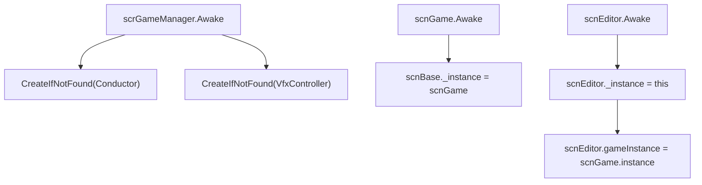

# 入口与单例索引

本页整理 RD 主工程中常用的全局入口、场景入口和单例访问方式。它是源码研究索引，不是外部工具链教程；具体字段和方法仍以核心类页面与运行时页面为准。

## 入口分层

| 层级 | 类型 | 访问方式 | 职责 |
| --- | --- | --- | --- |
| 组件基类 | `RDBase` | 组件脚本继承后使用 `conductor`、`game`、`gm`、`editor` 等属性 | 给 Unity 组件脚本提供全局对象、场景对象、常量和坐标快捷属性 |
| 普通类基类 | `RDClass` | 普通逻辑类继承后使用 `conductor`、`game`、`gm`、`editor` 等属性 | 给非组件对象提供与 `RDBase` 类似的全局入口 |
| 编辑器基类 | `RDEditorBase` | 编辑器 UI 与控件脚本继承后使用 `editor`、`timeline`、`ipm`、`game` | 给 RDLevelEditor 命名空间中的编辑器对象提供时间线、Inspector 和预览场景入口 |
| 全局管理器 | `scrGameManager` | `scrGameManager.instance` 或 `RDBase.gm` / `RDClass.gm` | 保存音量设置、HUD 相机、Ink 对话入口、对象池，并创建 Conductor 与 VFX 控制器 |
| 音频时间轴 | `scrConductor` | `scrConductor.instance` 或 `conductor` 属性 | 管理歌曲、BPM、小节、节拍调度、Scrub、暂停和立即音频播放 |
| 当前场景 | `scnBase` | `scnBase.instance` 或 `RDBase.scnCurrent` | 保存当前场景基类实例、世界相机、音频暂停和平台状态 |
| 游戏场景 | `scnGame` | `scnGame.instance`、`RDBase.game`、`RDClass.game` | 保存当前关卡、行、房间、Beat、判定、暂停、失败和结算流程 |
| 编辑器场景 | `scnEditor` | `scnEditor.instance`、`RDBase.editor`、`RDClass.editor` | 保存关卡编辑器状态、事件控件、Inspector、文件、预览和撤销重做 |
| 全局 VFX | `scrVfxControl` | `RDBase.Vfx`、`RDClass.Vfx` | 管理闪光、黑屏、背景、前景、歌词、粒子、分辨率和房间视觉效果 |

## 基类入口

### RDBase

`RDBase` 继承 `RDBaseDllDummy`，用于 Unity 组件脚本。它本身不声明 Unity 生命周期方法，主要把常用全局对象包成属性。

| 属性 | 返回对象 | 调用前提 |
| --- | --- | --- |
| `conductor` | `scrConductor.instance` | Conductor 对象已经存在，或能被 `FindObjectOfType<scrConductor>()` 找到 |
| `scnCurrent` | `scnBase.instance` | 当前场景已经把 `scnBase._instance` 写入 |
| `game` | `scnBase.instance as scnGame` | 当前场景是游戏场景 |
| `menu` | `scnBase.instance as scnMenu` | 当前场景是菜单场景 |
| `gm` | `scrGameManager.instance` | `scrGameManager.Awake()` 已执行 |
| `ink` | `scrGameManager.instance.inkDialogue` | 全局管理器和 Ink 对话对象已存在 |
| `editor` | `scnEditor.instance` | 当前处于编辑器场景，或编辑器实例已经创建 |
| `gc` | `RDConstants.data` | 常量资源已经加载 |

组件脚本还会使用 `x`、`y`、`xGlobal`、`yGlobal` 快捷读写 transform 坐标。细节见 [RDBase](/api/core/RDBase.md)。

### RDClass

`RDClass` 用于普通 C# 对象，典型子类包括 `LevelBase`、`Beat` 和 `LevelEvent_Base`。它没有 transform 快捷属性，也不缓存单例；每次访问都会直接读取当前静态入口。

| 属性 | 返回对象 | 典型使用者 |
| --- | --- | --- |
| `conductor` | `scrConductor.instance` | `LevelBase`、事件运行、Beat 时间换算 |
| `game` | `scnBase.instance as scnGame` | `LevelBase`、Beat、条件检查 |
| `gm` | `scrGameManager.instance` | 对话、资源和全局管理器访问 |
| `editor` | `scnEditor.instance` | 编辑器状态下的事件和数据对象 |
| `Vfx` | `RDBase.Vfx` | 事件、关卡脚本和运行时视觉控制 |

细节见 [RDClass](/api/core/RDClass.md)。

### RDEditorBase

`RDEditorBase` 位于 `RDLevelEditor` 命名空间，服务编辑器 UI 和事件控件。它不通过 `scnBase.instance` 找游戏场景，而是使用 `scnEditor.gameInstance` 访问预览用 `scnGame`。

| 属性或方法 | 返回对象 | 用途 |
| --- | --- | --- |
| `editor` | `scnEditor.instance` | 编辑器主场景 |
| `ipm` | `editor.inspectorPanelManager` | Inspector 面板管理器 |
| `timeline` | `scnEditor.instance.timelineScript` | 时间线控件 |
| `conductor` | `scrConductor.instance` | 编辑器预览和音频试听 |
| `game` | `scnEditor.gameInstance` | 编辑器内嵌游戏预览 |
| `GetPanel<T>()` | `InspectorPanel` 子类 | 获取手工或自动 Inspector 面板 |
| `LevelEditorPlaySound(...)` | `AudioSource` | 通过 `scrConductor.PlayImmediately()` 播放编辑器 UI 音效 |

## 初始化顺序

`scrGameManager.Awake()` 会把 `instance` 设置为自身，加载音量设置，读取后台静音设置，并调用 `RDBase.CreateIfNotFound("Conductor", Conductor)` 与 `RDBase.CreateIfNotFound("VfxController", scrVfxControl)`。这说明 Conductor 和 VFX 控制器由全局管理器保证存在。

`scnGame.Awake()` 调用 `base.Awake()` 后把 `scnBase._instance` 写成当前游戏场景，因此 `RDBase.game` 和 `RDClass.game` 只有在当前场景确实是 `scnGame` 时才有效。

`scnEditor.Awake()` 写入自己的 `_instance`。编辑器预览流程会把 `scnEditor.gameInstance` 设置为 `scnGame.instance`，因此编辑器侧代码要区分 `scnEditor.instance` 和预览游戏场景。

## 场景入口

| 场景入口 | 保存状态 | 相关页面 |
| --- | --- | --- |
| `scnBase.instance` | 当前场景基类实例、世界相机、音频暂停、平台判断 | [场景流程与暂停流程](/api/runtime/scene-flow.md) |
| `scnGame.instance` | 当前游戏场景，实际是 `scnBase._instance as scnGame` | [scnGame](/api/core/scnGame.md) |
| `scnEditor.instance` | 当前编辑器场景 | [scnEditor](/api/core/scnEditor.md) |
| `scnEditor.gameInstance` | 编辑器预览用游戏场景 | [scnEditor](/api/core/scnEditor.md)、[时间线与事件控件](/api/editor-events/timeline-controls.md) |

## 全局管理器

| 类型 | 入口 | 源码行为 |
| --- | --- | --- |
| `scrGameManager` | `scrGameManager.instance` | `Awake()` 设置实例、缓存 HUD 相机、加载各类音量、创建 Conductor 和 VFX 控制器 |
| `scrConductor` | `scrConductor.instance` | 缓存为空时用 `FindObjectOfType<scrConductor>()` 查找；负责音频时间轴和节拍换算 |
| `scrVfxControl` | `RDBase.Vfx` | `scrVfxControl.Awake()` 写入全局 VFX 入口；运行时房间、镜头、文本和闪光事件会调用它 |
| `RDConstants` | `RDConstants.data` | 常量资源入口，编辑器控件、调色板、音效、图标和 UI 颜色常读取它 |

## 读取前提

| 入口 | 需要确认的状态 |
| --- | --- |
| `RDBase.game` / `RDClass.game` | 当前场景是游戏场景，`scnBase._instance` 能转换为 `scnGame` |
| `RDBase.editor` / `RDClass.editor` | 当前存在 `scnEditor.instance` |
| `RDEditorBase.game` | 编辑器预览场景已经写入 `scnEditor.gameInstance` |
| `RDBase.ink` / `RDClass.ink` | `scrGameManager.instance` 和 `inkDialogue` 已创建 |
| `RDBase.Vfx` / `RDClass.Vfx` | VFX 控制器已经被创建并写入静态入口 |
| `scrConductor.instance` | 场景中存在 Conductor 对象，或全局管理器已创建它 |

## 阅读路线

1. 先读 [RDBase](/api/core/RDBase.md) 和 [RDClass](/api/core/RDClass.md)，确认组件脚本和普通逻辑类如何访问全局对象。
2. 读 [scrConductor](/api/core/scrConductor.md)，理解所有音乐时间和节拍换算的中心。
3. 读 [scnGame](/api/core/scnGame.md) 与 [场景流程与暂停流程](/api/runtime/scene-flow.md)，理解游戏场景如何加载关卡并管理暂停、失败和结算。
4. 读 [scnEditor](/api/core/scnEditor.md)，理解编辑器场景、预览场景和事件控件如何协作。
5. 读 [运行时系统总览](/api/runtime/overview.md)，从入口继续追到 Beat、行、房间、VFX、窗口和输入。
