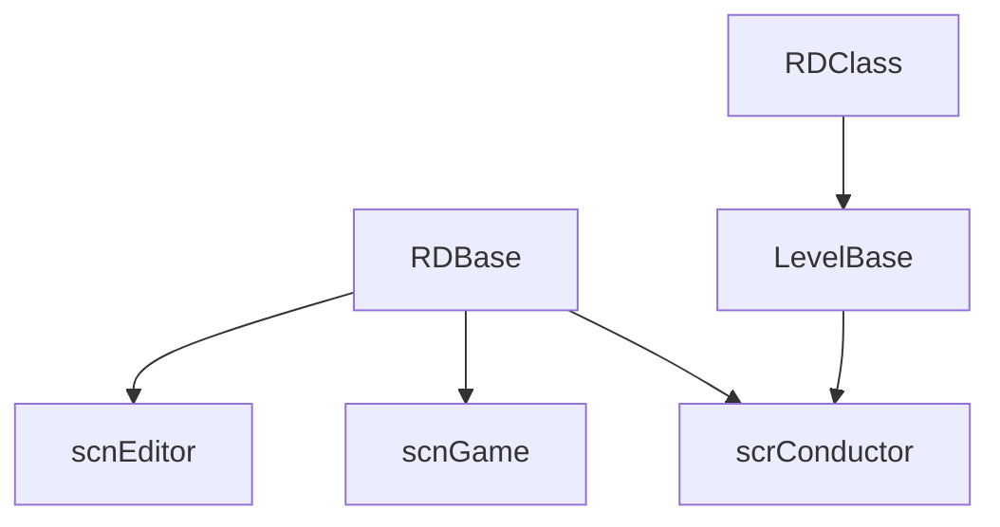

# 核心骨架

## 模块边界

本模块先覆盖以下核心类型：

| 类型 | 源码路径 | 页面 |
| --- | --- | --- |
| `RDBase` | `Assets/Scripts/Assembly-CSharp/RDBase.cs` | [RDBase](/api/core/RDBase.md) |
| `RDClass` | `Assets/Scripts/Assembly-CSharp/RDClass.cs` | [RDClass](/api/core/RDClass.md) |
| `LevelBase` | `Assets/Scripts/Assembly-CSharp/LevelBase.cs` | [LevelBase](/api/core/LevelBase.md) |
| `scrConductor` | `Assets/Scripts/Assembly-CSharp/scrConductor.cs` | [scrConductor](/api/core/scrConductor.md) |
| `scnGame` | `Assets/Scripts/Assembly-CSharp/scnGame.cs` | [scnGame](/api/core/scnGame.md) |
| `scnEditor` | `Assets/Scripts/Assembly-CSharp/RDLevelEditor/scnEditor.cs` | [scnEditor](/api/core/scnEditor.md) |

## 初步关系

## 当前源码结论

| 类型 | 事实 |
| --- | --- |
| `RDBase` | 继承 `RDBaseDllDummy`，提供 `conductor`、`scnCurrent`、`game`、`menu`、`cls`、`gm`、`ink`、`gc`、`editor` 等快捷入口 |
| `RDClass` | 继承 `RDClassDll`，为非 `MonoBehaviour` 风格的 RD 类提供常用单例入口 |
| `LevelBase` | 保存关卡数据、事件列表、BPM 变化、动态事件、关卡行为开关和运行时状态 |
| `scrConductor` | 继承 `RDBase`，保存 BPM、小节、节拍、校准、歌曲播放、节拍音播放、Scrub 和播放风格状态 |
| `scnGame` | 继承 `scnBase`，保存当前关卡、行、房间、Beat 列表、判定记录、HP、暂停、输入和场景 UI |
| `scnEditor` | 继承 `RDEditorBase`，保存编辑器 UI、时间线、Inspector、事件控件列表、关卡设置、打开文件、撤销重做状态 |

## 核心职责分层

| 层 | 代表类型 | 说明 |
| --- | --- | --- |
| Unity 组件便利层 | `RDBase` | 继承 `MonoBehaviour` 链路，为挂在 GameObject 上的脚本提供全局入口和 transform 坐标快捷属性 |
| 非组件逻辑便利层 | `RDClass` | 不继承 `MonoBehaviour`，为关卡、事件等普通 C# 对象提供与 `RDBase` 相似的全局入口 |
| 关卡运行状态层 | `LevelBase` | 保存关卡数据、事件、判定统计、兼容开关和可被关卡事件调用的方法 |
| 音乐时间轴 | `scrConductor` | 提供 BPM、小节、节拍、播放风格、音量和音频播放能力 |
| 游戏场景实例 | `scnGame` | 提供行、房间、判定结果、排行榜、HP、窗口舞蹈等运行时对象 |
| 编辑器场景实例 | `scnEditor` | 提供时间线、Inspector、事件控件、标签页和编辑器状态 |

## 读取顺序建议

1. 先读 [RDBase](/api/core/RDBase.md)，理解组件脚本如何拿到全局对象。
2. 再读 [RDClass](/api/core/RDClass.md)，理解非组件类为什么也能访问游戏和编辑器单例。
3. 再读 [LevelBase](/api/core/LevelBase.md)，它是后续关卡事件、官方关卡脚本和方法索引的中心。
4. 再读 [scrConductor](/api/core/scrConductor.md)、[scnGame](/api/core/scnGame.md)、[scnEditor](/api/core/scnEditor.md)，把时间轴、游戏场景和编辑器场景连起来。

## 源码研究关注点

| 类型 | 关注点 | 风险 |
| --- | --- | --- |
| `RDBase` | 适合从组件脚本中读取当前场景、游戏实例、编辑器实例、音频入口 | 很多属性依赖单例非空，错误场景调用会空引用 |
| `RDClass` | 适合从普通 C# 类中访问 `game`、`conductor`、`editor`、`gc` | 同样依赖场景单例；不适合当作独立数据模型使用 |
| `LevelBase` | 包含大量 `[ListedMethod(true)]` 方法；`MethodAutocompleteUI` 会把带该属性且签名受支持的 void 方法列入公开自定义方法候选 | 方法范围很广，很多会直接改游戏状态、判定、角色、房间或输入 |

## 相关页面

- [事件运行路径](/api/editor-events/runtime-flow.md)：说明 `LevelBase` 与 `LevelEvent_Base` 的调度关系。
- [自定义方法事件](/api/editor-events/custom-methods.md)：说明 `LevelBase` 中带 `[ListedMethod(true)]` 的公开方法如何进入自动补全。
- [编辑器事件系统](/modules/editor-events.md)：说明编辑器事件如何连接运行时和 Inspector UI。
