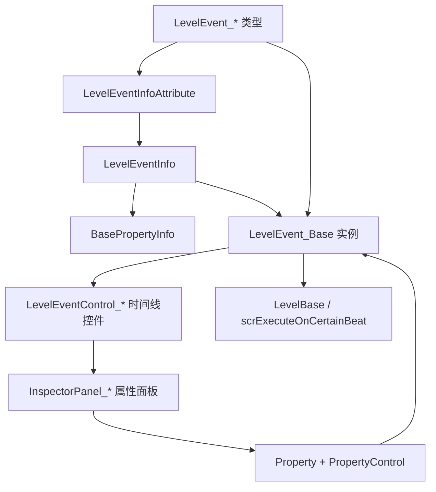

# 编辑器事件系统

## 模块边界

本模块覆盖 `RDFucked/Assets/Scripts/Assembly-CSharp/RDLevelEditor` 中的关卡编辑器事件系统。

优先类型：

| 类型族 | 说明 | 状态 |
| --- | --- | --- |
| `LevelEvent_Base` | 所有关卡事件的数据基类 | 已写初稿 |
| `LevelEvent_*` | 具体事件数据，如移动、播放声音、显示房间、设置 BPM | 待深写 |
| `InspectorPanel` | 编辑器右侧属性面板基类 | 已写初稿 |
| `InspectorPanel_*` | 具体事件 Inspector 面板 | 已建立索引，待逐类深写 |
| `LevelEventControl_*` | 时间线上的事件控件 | 已建立索引，待逐类深写 |
| `ControlAttribute` 及子类 | 自动生成属性控件的元数据 | 已写初稿 |

## 核心流程

## 源码结论

| 项目 | 事实 |
| --- | --- |
| `LevelEventType` 范围 | `None = 0` 到 `HideWindow = 80` |
| `LevelEvent_*` 命名 | 类名去掉 `LevelEvent_` 后解析成 `LevelEventType` |
| `LevelEvent_Base` | 负责公共字段、条件、标签、房间、编码解码、复制克隆和节拍调度 |
| `LevelEventInfo` | 反射读取事件类的 `LevelEventInfoAttribute` 和带 `JsonPropertyAttribute` 的公开实例属性 |
| `LevelEventInfoAttribute` | 记录事件执行时机、排序偏移、是否使用小节、节拍、类型、目标 ID、房间用法等元数据 |
| `BasePropertyInfo` | 把事件属性映射为可解码、可编码、可复制、可生成控件的描述 |
| `InspectorPanel` | 负责显示、保存、更新事件 UI，也能基于 `LevelEventInfo.propertiesInfo` 自动生成属性控件 |
| `RDInspectorPanelManager` | 收集手工面板，并为缺失的 `InspectorPanel` 子类创建自动面板 |

## 已写页面

| 页面 | 内容 |
| --- | --- |
| [LevelEvent_Base](/api/editor-events/LevelEvent_Base.md) | 事件公共字段、属性、编码解码、条件、标签、调度、复制和时间换算。 |
| [LevelEventInfo](/api/editor-events/LevelEventInfo.md) | 事件元数据、Attribute 字段、执行时机、房间用法、标签页和事件类型范围。 |
| [BasePropertyInfo](/api/editor-events/BasePropertyInfo.md) | 事件属性反射、序列化映射、默认控件映射、`Property` 和 `PropertyControl`。 |
| [InspectorPanel](/api/editor-events/InspectorPanel.md) | 自动面板、保存监听、本地化、属性控件更新和 `RDInspectorPanelManager`。 |
| [编辑器控件索引](/api/editor-events/editor-controls.md) | 时间线控件、属性面板和字段控件三层 UI 关系。 |
| [事件覆盖清单](/api/editor-events/event-coverage.md) | 按 `LevelEventType` 枚举顺序记录事件页面归属和覆盖状态。 |
| [事件运行路径](/api/editor-events/runtime-flow.md) | 事件从关卡数据进入 `Prepare`、`RunPrebar`、按节拍调度和 Scrub 追赶的运行链路。 |
| [Inspector 面板读写链路](/api/editor-events/inspector-flow.md) | 自动面板与手工面板的显示、保存、输入监听和字段回写路径。 |
| [AddClassicBeat](/api/editor-events/AddClassicBeat.md) | Classic 节拍事件字段、Hold、Swing、准备、运行、拆 FreeTime 和面板读写。 |
| [AddOneshotBeat](/api/editor-events/AddOneshotBeat.md) | Oneshot 节拍事件字段、验证、解码、准备、预备音频、运行和面板读写。 |
| [PlaySong](/api/editor-events/PlaySong.md) | 歌曲字段、旧音量迁移、音频准备、播放、BPM 设置和时间线控件。 |
| [SetRowXs](/api/editor-events/SetRowXs.md) | X pattern、Synco、运行修饰、面板读写和时间线显示。 |
| [歌曲时间线事件](/api/editor-events/SongTimingEvents.md) | `SetBeatsPerMinute`、`SetCrotchetsPerBar`、面板、时间线和换算关系。 |
| [歌曲与音频事件](/api/editor-events/song-audio-events.md) | `PlaySong`、BPM、拍号、播放音效、行节拍音、计数音、拍手音和游戏音效替换。 |
| [行与节拍事件](/api/editor-events/row-events.md) | `MakeRow`、Classic/Oneshot/FreeTime 节拍、`SetRowXs`、行显示、行移动和玩家换行。 |
| [视觉与镜头事件](/api/editor-events/visual-camera-events.md) | 主题、VFX preset、背景前景、闪光、镜头移动、震屏、行染色和手部显示。 |
| [房间与精灵事件](/api/editor-events/room-sprite-events.md) | 房间显示、房间变换、遮罩、透视、排序，以及自定义精灵创建、移动、染色、平铺和动画。 |
| [文本与脚本控制事件](/api/editor-events/text-control-events.md) | 对话、浮动文字、旁白、注释脚本、标签触发、自定义方法、角色表情、换角色和 Stutter。 |
| [窗口与剩余事件](/api/editor-events/window-misc-events.md) | 窗口舞蹈、窗口缩放、窗口内容、主窗口、窗口标题、窗口显示、窗口排序、播放风格和精灵混合。 |

## Mod 作者关注点

| 入口 | 说明 |
| --- | --- |
| 事件类型 | 具体事件类名与 `LevelEventType` 枚举名一一对应。 |
| 保存字段 | 事件专属字段来自带 `JsonPropertyAttribute` 的公开属性；公共字段来自 `LevelEvent_Base`。 |
| 运行入口 | 具体事件重写 `Run`、`RunPrebar`、`Prepare`、`TaggedActionVariant`。 |
| UI 入口 | 手工面板继承 `InspectorPanel`；自动面板通过 `BasePropertyInfo` 和 `ControlAttribute` 生成。 |
| 条件 | 本地条件存在 `conditionals`，全局条件存在 `globalConditionals`，取反分别使用负数编码和 `~` 前缀。 |

## 待补充

- 重点事件的数据字段和用途专页。
- 重点 Inspector Panel 的逐类字段读写表。
- `LevelEventControl_*` 时间线控件逐类行为。
- 重点事件运行时按模块分类的执行流程。
- Mod 作者可调用事件和字段索引。
