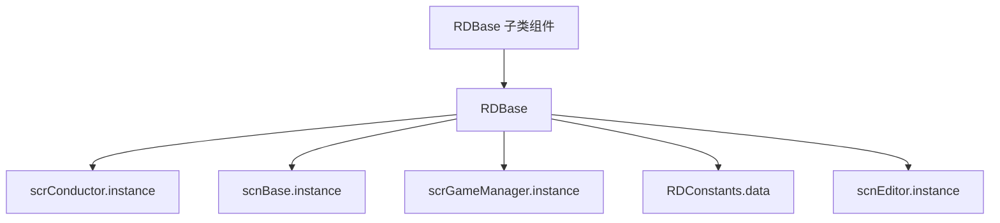

# RDBase

## 基本信息

| 项目 | 内容 |
| --- | --- |
| 源码路径 | `RDFucked/Assets/Scripts/Assembly-CSharp/RDBase.cs` |
| 命名空间 | 全局命名空间 |
| 声明 | `public class RDBase : RDBaseDllDummy` |
| 父类链路 | `RDBaseDllDummy`，其源码声明为 `MonoBehaviour` 子类 |
| 主要职责 | 为 Unity 组件脚本提供 RD 常用单例、场景对象、坐标快捷属性和少量静态工具 |
| 覆盖内容 | 单例入口、静态字段、坐标属性、开发者判断和调用风险 |

## 用途概览

`RDBase` 是 RD 主工程里大量 `MonoBehaviour` 风格脚本的共同便利基类。它不直接实现复杂生命周期，而是把常用全局对象整理成属性，避免每个组件重复写 `scrConductor.instance`、`scnBase.instance`、`scrGameManager.instance` 等访问代码。

对源码研究来说，`RDBase` 的价值在于快速理解“当前组件脚本如何接入全局游戏状态”。它同时也提示了一个重要风险：这些属性几乎都直接读取单例，调用时必须确认当前场景已经创建对应实例。

## 字段

| 名称 | 类型 | 可见性 | 作用 |
| --- | --- | --- | --- |
| `Vfx` | `scrVfxControl` | `public static` | 全局 VFX 控制器引用，供 `RDBase` 和 `RDClass` 系列代码访问视觉效果系统 |
| `appIsInSteamLibrary` | `bool` | `public static` | 标记应用是否位于 Steam 库路径中 |
| `platform` | `Platform` | `public static` | 保存当前平台枚举或平台状态 |
| `discordDevIDs` | `long[]` | `private static` | Discord 开发者 ID 白名单，用于 `isDev` 判断 |
| `steamDevIDs` | `ulong[]` | `private static` | Steam 开发者 ID 白名单，用于 `isDev` 判断 |

## 属性

| 名称 | 类型 | 读写 | 作用 |
| --- | --- | --- | --- |
| `conductor` | `scrConductor` | 只读 | 返回 `scrConductor.instance`，即音乐时间轴和播放控制入口 |
| `scnCurrent` | `scnBase` | 只读 | 返回当前场景基类实例 `scnBase.instance` |
| `game` | `scnGame` | 只读 | 将当前场景实例转换为 `scnGame`，只在游戏场景有效 |
| `menu` | `scnMenu` | 只读 | 将当前场景实例转换为 `scnMenu`，只在菜单场景有效 |
| `cls` | `scnCLS` | 只读 | 返回 `scnCLS.instance` |
| `gm` | `scrGameManager` | 只读 | 返回全局游戏管理器实例 |
| `ink` | `RDInk` | 只读 | 返回 `scrGameManager.instance.inkDialogue`，即 Ink 对话系统入口 |
| `mainCamera` | `Camera` | 只读 | 返回当前场景的世界相机 `scnBase.instance.wrldCamera` |
| `gc` | `RDConstants` | 只读 | 返回全局常量资源 `RDConstants.data` |
| `editorMode` | `bool` | 只读 | 通过 `scnEditor.instance != null` 判断是否处于编辑器场景 |
| `editor` | `scnEditor` | 只读 | 返回关卡编辑器场景实例 |
| `guiRect` | `Rect` | 只读 | 返回 `GC.GUIRect` |
| `currentSceneName` | `string` | 只读 | 返回 Unity 当前激活场景名 |
| `debugSettings` | `DebugSettings` | `protected static` | 返回调试设置单例 |
| `platformHelper` | `PlatformHelper` | 只读 | 返回平台辅助类单例 |
| `xGlobal` | `float` | 读写 | 读写 `transform.position.x` |
| `yGlobal` | `float` | 读写 | 读写 `transform.position.y` |
| `x` | `float` | 读写 | 读写 `transform.localPosition.x` |
| `y` | `float` | 读写 | 读写 `transform.localPosition.y` |
| `isDev` | `bool` | `public static` 只读 | 根据调试设置、Discord/Steam ID、编辑器、Debug Build、Steam 分支等判断开发者状态 |
| `isAdvanced` | `bool` | `public static` 只读 | 开发者直接为真；非开发者读取 `Persistence.GetAdvancedEditorFeatures()` |

## 方法

| 签名 | 行为 |
| --- | --- |
| `CreateIfNotFound(string name, GameObject original = null)` | 先用 `GameObject.Find` 查找同名对象；没有时新建或复制 `original`，并挂到 `scrGameManager.instance.parentContainer` 下 |
| `ShowGUIText(string text)` | 用 `GUI.Label` 在固定矩形 `0,0,200,200` 绘制文字 |
| `PlaySound(string sound, float volume = 1f, AudioMixerGroup group = null, float pitch = 1f, float pan = 0f)` | 直接调用 `scrConductor.PlayImmediately` 播放音效 |
| `IsHalloweenWeek()` | 根据当前日期判断是否处于 10 月 24 日开始的万圣节窗口，2024 年额外延长 4 天 |
| `IsAprilFoolsDay()` | 判断当前日期是否为 4 月 1 日 |

## 生命周期

`RDBase` 本身没有声明 `Awake`、`Start`、`Update` 等 Unity 生命周期方法。它更像一个“访问入口基类”。具体生命周期由子类实现。

## 调用关系

## 注意事项

| 项目 | 说明 |
| --- | --- |
| 单例空引用 | `game`、`menu`、`editor` 都是直接转换或直接返回，当前场景不是对应类型时会得到 `null` |
| `isDev` | 逻辑包含 ID 白名单、Debug Build、Steam 分支、编辑器状态和 `debugSettings.NoPro`，不只是简单的 `Application.isEditor` |
| 坐标快捷属性 | `x/y` 修改 localPosition，`xGlobal/yGlobal` 修改 world position，混用时要注意父物体坐标 |

