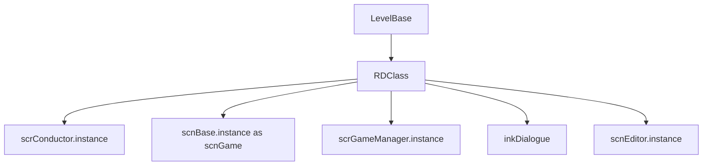

# RDClass

## 基本信息

| 项目 | 内容 |
| --- | --- |
| 源码路径 | `RDFucked/Assets/Scripts/Assembly-CSharp/RDClass.cs` |
| 命名空间 | 全局命名空间 |
| 声明 | `public class RDClass : RDClassDll` |
| 主要职责 | 为非 Unity 组件类提供 RD 常用单例和全局入口 |
| 覆盖内容 | 非组件类的全局入口、常用属性和调用风险 |

## 用途概览

`RDClass` 与 [RDBase](/api/core/RDBase.md) 的定位相似，但它不走 `MonoBehaviour` 组件链路。它主要服务 `LevelBase`、`Beat`、`LevelEvent_Base` 等普通 C# 对象，让这些对象也能访问音乐时间轴、游戏场景、Ink 对话、常量、编辑器实例和平台辅助对象。

源码中 `LevelBase : RDClass`，说明关卡运行逻辑不是 Unity 组件，但依然通过 `RDClass` 读取 `scrConductor.instance`、`scnBase.instance`、`scrGameManager.instance` 等全局状态。

## 属性

| 名称 | 类型 | 读写 | 作用 |
| --- | --- | --- | --- |
| `conductor` | `scrConductor` | 只读 | 返回音乐时间轴和播放控制入口 `scrConductor.instance` |
| `wrldBase` | `scnBase` | 只读 | 返回当前场景基类实例 `scnBase.instance` |
| `game` | `scnGame` | 只读 | 将当前场景实例转换为 `scnGame` |
| `gm` | `scrGameManager` | 只读 | 返回全局游戏管理器实例 |
| `ink` | `RDInk` | 只读 | 返回 `scrGameManager.instance.inkDialogue` |
| `Vfx` | `scrVfxControl` | `public static` 只读 | 转发 `RDBase.Vfx`，让非组件类也能使用 VFX 控制器 |
| `gc` | `RDConstants` | 只读 | 返回全局常量资源 `RDConstants.data` |
| `editorMode` | `bool` | 只读 | 根据 `scnEditor.instance != null` 判断是否处于编辑器环境 |
| `debugSettings` | `DebugSettings` | `protected static` | 返回调试设置单例 |
| `editor` | `scnEditor` | 只读 | 返回关卡编辑器场景实例 |
| `platformHelper` | `PlatformHelper` | 只读 | 返回平台辅助类单例 |

## 方法

`RDClass` 当前源码没有声明普通方法，只提供属性入口。

## 与 RDBase 的区别

| 对比项 | `RDBase` | `RDClass` |
| --- | --- | --- |
| 继承链 | 继承 `RDBaseDllDummy`，间接是 Unity 组件 | 继承 `RDClassDll`，不是组件 |
| 是否有 `transform` 快捷属性 | 有 `x/y/xGlobal/yGlobal` | 无 |
| 典型使用对象 | UI、场景对象、视觉对象、组件脚本 | 关卡逻辑、事件数据、普通逻辑类 |
| VFX 入口 | 静态字段 `Vfx` | 静态属性转发 `RDBase.Vfx` |

## 调用关系

## 注意事项

`RDClass` 并不会保存单例缓存，每次访问属性都会直接取当前静态实例。它适合运行时对象快速读写全局状态，但不适合作为脱离场景的纯数据对象使用。

