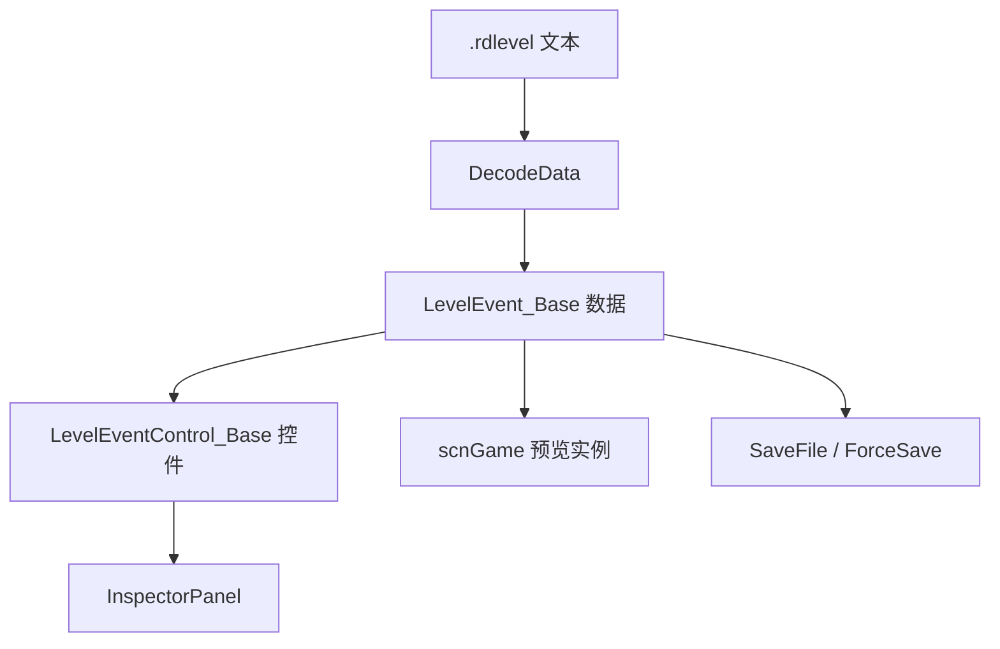

# scnEditor

## 基本信息

| 项目 | 内容 |
| --- | --- |
| 源码路径 | `RDFucked/Assets/Scripts/Assembly-CSharp/RDLevelEditor/scnEditor.cs` |
| 命名空间 | `RDLevelEditor` |
| 声明 | `public class scnEditor : RDEditorBase` |
| 主要职责 | 管理关卡编辑器场景：时间线、事件控件、Inspector、文件打开保存、预览播放、撤销重做、条件、行和精灵数据 |
| 覆盖内容 | 字段、属性、公开方法、编辑器场景状态、时间线、Inspector 和文件流程 |

## 用途概览

`scnEditor` 是 RD 内置关卡编辑器场景。`RDBase.editor`、`RDClass.editor`、`RDEditorBase.editor` 都最终读取 `scnEditor.instance`。

它不是单纯 UI 面板，而是把编辑器的主要状态都集中在同一个场景类里，包括：

- `Timeline` 时间线。
- `RDInspectorPanelManager` 和各类弹窗。
- `LevelEventControl_Base` 控件列表。
- `LevelEvent_MakeRow` 行数据与 `LevelEvent_MakeSprite` 精灵数据。
- 当前 `.rdlevel` 文本、打开文件路径、剪贴板、选中项。
- 预览用的 `scnGame.gameInstance`。

## 内部状态快照

| 类型 | 字段 | 作用 |
| --- | --- | --- |
| `LevelState` | `data`、`selectedIds`、`tab`、`rowsTabIndex`、`rowSelected`、`spritesTabIndex`、`spriteSelected`、`timelinePosX`、`timelinePosY` | 保存撤销重做需要的关卡文本、选择状态、标签页状态和时间线滚动位置 |

## 静态入口

| 名称 | 类型 | 作用 |
| --- | --- | --- |
| `_instance` | `scnEditor` | `instance` 属性的缓存字段 |
| `instance` | `scnEditor` | 编辑器场景单例入口 |
| `gameInstance` | `scnGame` | 编辑器预览用游戏场景实例 |
| `cameFromCustomLevelSelect` | `bool` | 标记是否从自定义关卡选择进入 |
| `customLevelPath` | `string` | 自定义关卡路径 |

## UI 与面板字段

| 分组 | 字段 | 作用 |
| --- | --- | --- |
| Canvas | `canvas`、`canvasRectTransform`、`canvasScaler`、`eventSystem` | 编辑器 Canvas 和事件系统 |
| 预览 | `gameView`、`gameArea`、`gameStatus`、`gamePreviewScaleButton`、`gamePreviewScaleText` | 游戏预览区域和缩放 UI |
| 播放控制 | `rewindButton`、`playPauseButton`、`backwardButton`、`forwardButton`、`startBar`、`scrubbing` | 回放、播放暂停、前后跳转和 Scrub |
| Inspector | `leftPanel`、`bottomPanel`、`rightPanel`、`inspectorPanelManager`、`inspectorTitle`、`deleteEventButton` | 右侧属性编辑和布局区域 |
| 弹窗 | `roomsSelectionPopup`、`colorPickerPopup`、`characterPickerPopup`、`letterMovementPickerPopup`、`publishPopup`、`soundSettingsPopup` | 房间、颜色、角色、字母移动、发布和声音设置弹窗 |
| 条件 | `conditionalsPanel`、`conditionalsPreview`、`conditionals`、`globalConditionals` | 条件列表、全局条件和预览 |
| 标签页 | `tabSections`、`currentTab`、`windowTabButton`、`tabPanels` | 编辑器标签页和面板 |

## 事件控件与数据

| 名称 | 类型 | 作用 |
| --- | --- | --- |
| `eventControls` | `List<LevelEventControl_Base>` | 所有事件控件 |
| `eventControls_sounds` | `List<LevelEventControl_Base>` | Song 标签页事件控件 |
| `eventControls_rooms` | `List<LevelEventControl_Base>` | Rooms 标签页事件控件 |
| `eventControls_windows` | `List<LevelEventControl_Base>` | Windows 标签页事件控件 |
| `eventControls_rows` | `List<List<LevelEventControl_Base>>` | Rows 标签页事件控件，按行分组 |
| `eventControls_actions` | `List<LevelEventControl_Base>` | Actions 标签页事件控件 |
| `eventControls_sprites` | `List<List<LevelEventControl_Base>>` | Sprites 标签页事件控件，按精灵分组 |
| `rowsData` | `List<LevelEvent_MakeRow>` | 行创建事件数据 |
| `spritesData` | `List<LevelEvent_MakeSprite>` | 精灵创建事件数据 |
| `selectedControls` | `List<LevelEventControl_Base>` | 当前选中的事件控件 |
| `clipboard` | `List<LevelEvent_Base>` | 复制剪切事件数据 |

## 文件与关卡数据

| 名称 | 类型 | 作用 |
| --- | --- | --- |
| `rdlevelText` | `string` | 当前关卡文本 |
| `openedFilePath` | `string` | 当前打开文件路径 |
| `levelSettings` | `RDLevelSettings` | 当前关卡设置 |
| `audioClipCache` | `Dictionary<string, AudioClip>` | 编辑器音频缓存 |
| `customCharacterData` | `Dictionary<string, CustomAnimationData>` | 自定义角色数据缓存 |
| `_lastSavedData` | `string` | 最近保存的数据快照 |
| `undoStates` / `redoStates` | `List<LevelState>` | 撤销和重做状态栈 |

## 关键方法分组

| 分组 | 方法 | 作用 |
| --- | --- | --- |
| 缩放与 UI | `ValidateScaleFactor`、`EditorSizePlus`、`EditorSizeMinus`、`CycleGamePreviewScale` | 编辑器缩放和预览缩放 |
| 播放预览 | `ScrubToBar`、`StartPlaying`、`PlayPauseButtonClick`、`ReloadGameScene` | 跳转小节、播放预览、刷新预览场景 |
| 标签页 | `ShowTabSection_*`、`ShowTabSection`、`TryHideWindowTab`、`MoveToWindowTab` | 切换 Song、Rows、Actions、Rooms、Sprites、Windows 标签页 |
| 事件控件 | `CreateEventControl`、`AddNewEventControl`、`SetLevelEventControlType`、`DeleteEventControl` | 创建、添加、改类型和删除事件控件 |
| 文件 | `NewFile`、`OpenFile`、`OpenFileCoroutine`、`SaveFile`、`ForceSave`、`SaveFileAs`、`DecodeData` | 新建、打开、保存、另存和解析关卡 |
| URL 与包 | `OpenWithURL`、`OpenUrl`、`OpenLevelPackage`、`CancelOpeningUrl` | 从 URL 或关卡包打开关卡 |
| 选择 | `SelectEventControl`、`SelectEventControls`、`DeselectEventControl`、`DeselectEverything` | 管理事件控件选择状态 |
| 剪贴板 | `Cut`、`Copy`、`Paste`、`Clone` | 剪切、复制、粘贴、克隆事件 |
| 行与精灵 | `AddNewRow`、`AddNewSprite`、`DeleteRowClick`、`DeleteSpriteClick`、`MoveRowVertically`、`MoveSpriteVertically` | 管理行和精灵事件数据 |
| 撤销重做 | `SaveState`、`ClearStateCache` | 保存和清理编辑器状态快照 |
| 条件 | `AllConditionalsClick`、`SetLastConditionalToSelectedEvents`、`ShowPanelConditionals` | 条件面板和事件条件绑定 |
| 设置与高级功能 | `ShowSettings`、`CheckAdvancedFeatures`、`OnAdvancedOttoClick` | 设置界面和高级功能开关 |

## 编辑器数据流

## 源码研究注意事项

| 项目 | 说明 |
| --- | --- |
| 编辑器和游戏场景并存 | `scnEditor.gameInstance` 保存预览用 `scnGame` |
| 事件控件分标签页保存 | 同一事件会进入总列表和对应标签页列表 |
| 文件保存围绕 `rdlevelText` | 打开、解析、保存流程都围绕当前关卡文本和 `RDLevelData` |
| 撤销重做保存完整状态 | `LevelState` 保存文本、选中 ID、标签页和时间线位置 |

