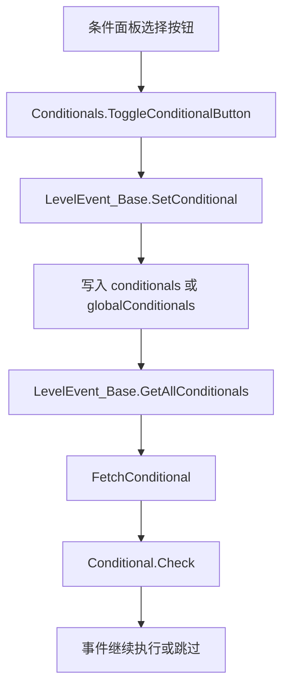

# 条件系统

本页整理 RD 编辑器条件系统。条件数据保存在 `.rdlevel` 的 `conditionals` 根节点中，事件通过 `conditionals` 和 `globalConditionals` 字段引用这些条件；运行时执行事件前由 `LevelEvent_Base.CheckConditionals()` 统一检查。

## 源码范围

| 类型 | 源码路径 | 职责 |
| --- | --- | --- |
| `Conditional` | `RDFucked/Assets/Scripts/Assembly-CSharp/RDLevelEditor/Conditional.cs` | 条件基类，负责类型推导、序列化、反序列化、复制和匹配。 |
| `ConditionalInfo` | `RDFucked/Assets/Scripts/Assembly-CSharp/RDLevelEditor/ConditionalInfo.cs` | 读取条件类上的 `ConditionalInfoAttribute`，并收集带 `JsonPropertyAttribute` 的属性。 |
| `ConditionalID` | `RDFucked/Assets/Scripts/Assembly-CSharp/RDLevelEditor/ConditionalID.cs` | 把事件中保存的本地条件 ID 或全局条件字符串拆成统一结构。 |
| `Conditionals` | `RDFucked/Assets/Scripts/Assembly-CSharp/RDLevelEditor/Conditionals.cs` | 编辑器条件面板，负责创建、编辑、选择、取反、删除、复制和全局条件展示。 |
| `ConditionalsPreview` | `RDFucked/Assets/Scripts/Assembly-CSharp/RDLevelEditor/ConditionalsPreview.cs` | 时间线条件预览浮层。 |
| `ConditionalInspector_*` | `RDFucked/Assets/Scripts/Assembly-CSharp/RDLevelEditor/ConditionalInspector_*.cs` | 各条件类型的编辑控件，负责从 UI 保存条件对象。 |
| `Conditional_*` | `RDFucked/Assets/Scripts/Assembly-CSharp/RDLevelEditor/Conditional_*.cs` | 具体条件实现，负责运行时检查逻辑和显示文本。 |

## 数据保存位置

| 位置 | 类型 | 内容 |
| --- | --- | --- |
| `RDLevelData.conditionals` | `List<Conditional>` | 关卡自定义条件列表，保存到 `.rdlevel` 根节点 `conditionals`。 |
| `LevelEvent_Base.conditionals` | `List<int>` | 单个事件引用的本地条件 ID。正数表示正向条件，负数使用 `-id - 1` 表示取反条件。 |
| `LevelEvent_Base.globalConditionals` | `List<string>` | 单个事件引用的全局条件 ID。原字符串表示正向条件，前缀 `~` 表示取反条件。 |
| `Conditionals.globalConditionals` | `static List<Conditional>` | 编辑器和运行时共用的内置全局条件缓存。 |
| `Conditionals.globalNegatedDescriptions` | `static Dictionary<string, string>` | 全局条件取反后的显示文本。 |

## 条件基类

`Conditional` 继承 `RDClass`，每个子类名称都使用 `Conditional_` 前缀。`type` 属性第一次访问时会从类型名中截取后缀并解析为 `ConditionalType`，例如 `RDLevelEditor.Conditional_LastHit` 对应 `ConditionalType.LastHit`。

| 成员 | 类型 | 行为 |
| --- | --- | --- |
| `typeKey` | `const string` | 条件 JSON 中的 `type` 键。 |
| `idKey` | `const string` | 条件 JSON 中的 `id` 键。 |
| `descriptionKey` | `const string` | 条件 JSON 中的 `name` 键。 |
| `tagKey` | `const string` | 条件 JSON 中的 `tag` 键。 |
| `_type` | `ConditionalType?` | 缓存由类名推导出的条件类型。 |
| `description` | `string` | 条件面板中显示的名称。 |
| `tag` | `string` | 组合条件和用户识别使用的标签；解码时空 tag 会回退到 `id.ToString()`。 |
| `id` | `int` | 本地条件 ID。 |
| `gid` | `string` | 全局条件 ID；本地条件为空。 |
| `type` | `ConditionalType` | 从子类名推导出的条件类型。 |
| `info` | `ConditionalInfo` | 从 `GC.conditionalsInfo[type.ToString()]` 读取的元数据。 |

| 方法 | 行为 |
| --- | --- |
| `Decode(Dictionary<string, object>)` | 根据 `type` 拼出 `RDLevelEditor.Conditional_{type}`，通过反射实例化条件，读取 `name`、`id`、`tag`，再按 `info.propertiesInfo` 解码带 `JsonProperty` 的属性。 |
| `Encode()` | 输出 `type`、`tag`、`name`、`id` 和每个条件属性。 |
| `IsGlobal()` | `gid` 非空时返回 true。 |
| `Matches(ConditionalID)` | 本地条件比较 `numID` 与 `id`，全局条件比较 `ConditionalID.id` 与 `gid`。 |
| `GetSprite()` | 从 `base.editor.conditionalsPanel.typeIconsDict[type]` 取条件图标。 |
| `CopyWithId(int)` | 创建同类型条件，复制 `tag`、`description` 和所有属性，替换为新 ID。 |
| `Check(LevelEvent_Base, bool)` | 抽象方法，由具体条件实现运行时判定。 |
| `ToString()` | 抽象方法，由具体条件提供默认显示文本。 |

## 条件元数据

`ConditionalInfo` 的构造函数读取条件类上的 `ConditionalInfoAttribute`。缺少该 Attribute 会抛出异常。它还会用反射读取该条件类声明的公开实例属性，并筛选带 `JsonPropertyAttribute` 的属性生成 `propertiesInfo`。

| 类型 | 字段 | 行为 |
| --- | --- | --- |
| `ConditionalInfoAttribute` | `isConstant` | 标记条件是否为常量条件。 |
| `ConditionalInfo` | `name` | 从 `RDLevelEditor.Conditional_` 后缀得到的条件名。 |
| `ConditionalInfo` | `attribute` | 条件类上的 `ConditionalInfoAttribute`。 |
| `ConditionalInfo` | `propertiesInfo` | 条件属性名到 `BasePropertyInfo` 的映射。 |

`Conditionals.Awake()` 会把 `allConditionalTypes` 中 `attribute.isConstant` 为 true 的类型收集到 `constantConditionalTypes`。事件元数据要求 `constantConditionalsOnly` 时，条件面板只显示这些常量条件；`LevelEvent_SetRowXs` 在开发模式下例外，非开发模式仍按常量条件限制。

## ConditionalID 编码规则

| 输入格式 | 解析结果 |
| --- | --- |
| `3` | 本地条件，`global = false`，`negated = false`，`numID = 3`，`id = "3"`。 |
| `-4` | 本地取反条件，`global = false`，`negated = true`，`numID = 3`，`id = "3"`。 |
| `p` | 全局条件，`global = true`，`negated = false`，`id = "p"`。 |
| `~p` | 全局取反条件，`global = true`，`negated = true`，`id = "p"`。 |

本地条件取反使用 `-id - 1`，因此 ID `0` 可以编码为 `-1`，不会和普通正数 ID 冲突。编辑器创建条件时从 `1` 开始找空闲 ID。

## 条件类型枚举

| 枚举值 | 数值 | 具体类 | 常量条件 | 检查内容 |
| --- | --- | --- | --- | --- |
| `LastHit` | `0` | `Conditional_LastHit` | 否 | 检查最后一次击打结果。 |
| `Language` | `3` | `Conditional_Language` | 是 | 检查 `RDString.language`。 |
| `Custom` | `4` | `Conditional_Custom` | 否 | 执行自定义表达式。 |
| `TimesExecuted` | `5` | `Conditional_TimesExecuted` | 否 | 检查事件执行次数是否小于上限。 |
| `PlayerMode` | `6` | `Conditional_PlayerMode` | 是 | 检查 `GC.twoPlayerMode`。 |
| `Narration` | `7` | `Conditional_Narration` | 否 | 检查 `Narration.IsEnabled`。 |
| `Composite` | `8` | `Conditional_Composite` | 否 | 保存组合表达式；`Check()` 直接抛出 `NotImplementedException`。 |
| `Accessibility` | `9` | `Conditional_Accessibility` | 是 | 检查闪光或旁白相关可访问性状态。 |

`Conditionals` 面板的 `allConditionalTypes` 只包含 `LastHit`、`Custom`、`TimesExecuted`、`Language`、`PlayerMode` 和 `Accessibility`。`Narration` 与 `Composite` 有类和 Inspector 实现，但不在该数组中作为普通新增类型展示。

## 具体条件

| 条件类 | 属性 | 检查逻辑 |
| --- | --- | --- |
| `Conditional_LastHit` | `row:int`、`resultType:OffsetType` | `row == -1` 时读取 `base.game.allHitOffsets`，否则读取 `base.game.rowsHitOffsets[row]`；列表为空时返回 false；`AnyEarlyOrLate` 会匹配 `SlightlyEarly`、`SlightlyLate`、`VeryEarly`、`VeryLate`，取反时匹配 `Perfect` 或 `Missed`。 |
| `Conditional_Language` | `languageName:SystemLanguage` | 比较 `RDString.language == languageName`。 |
| `Conditional_TimesExecuted` | `maxTimes:int` | 比较 `levelEvent.timesRun < maxTimes`；`maxTimes == 1` 时使用 `ConditionalIcons/TimesExecuted_Once` 图标。 |
| `Conditional_PlayerMode` | `playerModeIsTwoPlayer:bool` | 比较 `GC.twoPlayerMode == playerModeIsTwoPlayer`；一人模式使用 `ConditionalIcons/PlayerMode_1p` 图标。 |
| `Conditional_Accessibility` | `effectType:ConditionalEffectType` | `Flashy` 检查 `!base.game.reducedFlash`，`Narration` 检查 `Narration.IsEnabled`；两个值分别使用 `Accessibility_Flashy` 和 `Narration` 图标。 |
| `Conditional_Narration` | `narrationEnabled:bool` | 比较 `Narration.IsEnabled == narrationEnabled`。 |
| `Conditional_Custom` | `customExpression:string` | 先执行 `base.game.currentLevel.EvaluateCurlyBracketsInString()`，再按表达式规则求值。 |
| `Conditional_Composite` | `compositeExpression:string` | 保存组合表达式文本，`Check()` 抛出 `NotImplementedException`。 |

所有已实现的 `Check()` 都在最终返回前调用 `NegateIf(negated)`，由事件引用侧决定是否取反。

## 自定义表达式

`Conditional_Custom.Check()` 对 `customExpression.Trim()` 后的文本进行分支处理。大括号变量会先交给 `LevelBase.EvaluateCurlyBracketsInString()` 展开。

| 表达式 | 行为 |
| --- | --- |
| `atLeastNPerfects(a,b)` | 在最近 `a` 个击打中统计 `Perfect` 数量，数量大于等于 `b` 时通过。 |
| `atLeastRank(x)` | 用 `currentLevel.GetRankFromMistakes()` 与 `Rank.FromString(x)` 比较；`S+` 分支要求内部值等于 `15`。 |
| `passedLevel(x)` | 将括号内容解析为 `Level` 枚举，调用 `Level.Passed()`。 |
| `buttonPressCount>2` | 检查 `currentLevel.buttonPressCount > 2`。 |
| `neverRun` | 检查当前事件 `timesRun == 0`。 |
| `voiceLanguage==English` | 检查 `RDString.voiceLanguage == SystemLanguage.English`。 |
| `voiceLanguage==Chinese` | 检查 `RDString.voiceLanguage == SystemLanguage.Chinese`。 |
| `platform==Windows` | 检查 `scnBase.isWindows`。 |
| `platform==Mac` | 检查 `scnBase.isMac`。 |
| `windowDanceCanVerticalWrap==true` | 固定返回 true。 |
| `windowDanceCanVerticalWrap==false` | 固定返回 false。 |
| `true` | 固定返回 true。 |
| `false` | 固定返回 false。 |
| `2pMode` | 检查 `GC.twoPlayerMode`。 |
| `1pMode` | 检查 `!GC.twoPlayerMode`。 |
| `narration` | 检查 `Narration.IsEnabled`。 |
| `booth` | 检查 `RDC.booth`。 |
| `paigeLeaves` | 检查 `!Persistence.GetPaigeEnding()`。 |

通用变量表达式支持 `==`、`>`、`<`、`!=`。表达式以 `var` 开头时会按源码中的 `flag` 分支裁剪首尾字符。没有比较符时，直接把表达式交给 `currentLevel.EvalStringWithVariables()` 并按 bool 使用。存在比较符时，左右两侧分别交给 `EvalStringWithVariables()`，bool 值只支持 `==` 和 `!=` 分支；数值比较会把左右值转成 `double` 后比较。

`Conditional_Custom.ToString()` 只给语音语言与平台表达式返回本地化文本；其他表达式返回空字符串。`Conditionals.UpdateConditional()` 会在描述为空时使用 `ToString()` 作为条件名称。

## 编辑器面板

`Conditionals` 有两种打开方式：

| 模式 | 触发方式 | UI 行为 |
| --- | --- | --- |
| 全部条件列表 | `scnEditor.AllConditionalsClick()` 打开条件总面板 | 隐藏返回按钮、弹窗按钮、事件绑定按钮和全局条件容器；只管理关卡条件。 |
| 事件条件列表 | `InspectorPanel` 或 `BarBeatPosition` 调用 `ShowPanelConditionals(panel)` | 隐藏当前 Inspector，显示返回按钮、持续时间按钮、解绑按钮、全局条件容器，并允许把条件绑定到当前事件。 |

### 主要字段

| 字段 | 类型 | 行为 |
| --- | --- | --- |
| `conditionalsInspectors` | `ConditionalInspector[]` | 每种条件类型对应一个编辑器控件。 |
| `conditionalButtons` | `List<ConditionalButton>` | 当前列表里的按钮实例。 |
| `editingId` | `int` | 正在编辑的条件 ID。 |
| `currentPanel` | `InspectorPanel` | 从事件面板进入时保存原面板。 |
| `showingListPanel` | `bool` | 当前显示列表页还是单个条件编辑页。 |
| `conditionalsToShow` | `ImmutableArray<ConditionalType>` | 当前下拉列表允许选择的条件类型。 |
| `duration` | `InputField` | 写入 `currentPanel.currentLevelEvent.conditionalDuration`。 |
| `typeIconsDict` | `Dictionary<ConditionalType, Sprite>` | 懒加载 `Resources/ConditionalIcons/{type}`。 |

### 主要操作

| 方法 | 行为 |
| --- | --- |
| `GetGlobalConditionals()` | 创建内置全局条件并缓存。 |
| `ShowListPanel(bool)` | 切换列表页和编辑页，重建条件按钮，并更新 Inspector 内容高度。 |
| `AddNew()` | 分配空闲 ID，新建 `Conditional_LastHit`；只允许常量条件时新建 `Conditional_Language`。从事件面板进入时同时绑定到当前事件。 |
| `ToggleConditionalButton()` | 对事件绑定执行三态切换：未选中、正向选中、取反选中。 |
| `UpdateConditional()` | 从当前 `ConditionalInspector` 保存条件对象，写回 `editor.conditionals`，并更新 tag、description 和占位名称。 |
| `Clone(int)` | 复制条件属性，插入到原条件之后，名称追加本地化的 clone 文本。 |
| `Edit(int)` | 进入单个条件编辑页，切换类型下拉和对应 Inspector。 |
| `CheckDelete(int)` | 删除前扫描所有 `editor.eventControls`，有关联事件时先弹确认对话框。 |
| `Delete(List<LevelEventControl_Base>, int)` | 从关卡条件列表移除条件，并从所有关联事件中解绑。 |

## 全局条件

`Conditionals.GetGlobalConditionals()` 创建四个内置全局条件：

| gid | 类型 | 初始化值 | 文本键 |
| --- | --- | --- | --- |
| `p` | `Conditional_PlayerMode` | `playerModeIsTwoPlayer = true` | `editor.GlobalConditionals.2p` |
| `f` | `Conditional_Accessibility` | `effectType = Flashy` | `editor.GlobalConditionals.flashy` |
| `n` | `Conditional_Narration` | `narrationEnabled = true` | `editor.GlobalConditionals.narration` |
| `o` | `Conditional_TimesExecuted` | `maxTimes = 1` | `editor.GlobalConditionals.once` |

`usedGlobalConditionals` 的初始列表是 `p`、`f`、`h`、`n`、`o`。`SetConditional()` 只有在 `gid` 存在于这个列表中时才会写入事件的 `globalConditionals`。

## Inspector 子类

| Inspector | UI 字段 | 保存结果 |
| --- | --- | --- |
| `ConditionalInspector_LastHit` | `lastHitRow`、`lastHitType` | 保存 `row = lastHitRow.value - 1` 和 `LastHitTypes[lastHitType.value]`。 |
| `ConditionalInspector_Custom` | `customExpression` | 保存 `customExpression.text`。 |
| `ConditionalInspector_TimesExecuted` | `timesExecutedMaxTimes` | 保存 `int.Parse(timesExecutedMaxTimes.text)`。 |
| `ConditionalInspector_Language` | `language` | 保存 `RDString.AvailableLanguages[language.value]`。 |
| `ConditionalInspector_PlayerMode` | `playerMode` | 下拉值 `1` 保存二人模式，其他保存一人模式。 |
| `ConditionalInspector_Accessibility` | `effectList` | 保存 `AvailableEffectTypes[effectList.value]`。 |
| `ConditionalInspector_Narration` | `onToggle`、`offToggle` | 保存 `narrationEnabled = onToggle.isOn`。 |
| `ConditionalInspector_Composite` | `conditionalsDropdown`、`expression` | 下拉插入其他条件 tag，保存 `compositeExpression = expression.text`。 |

## 事件绑定与运行时检查

`LevelEvent_Base.SetConditional()` 中，`state == false` 表示正向绑定，`state == true` 表示取反绑定，`state == null` 表示解绑。`HasAnyConditionals()`、`HasPositiveConditionals()`、`HasNegativeConditionals()` 用于时间线控件显示条件状态。

`CheckConditionals(bool checkConstantOnly = false)` 会遍历当前事件的所有条件引用，先从 `RDLevelData.current.conditionals` 或 `Conditionals.GetGlobalConditionals()` 找到条件对象，再调用 `conditional.Check(this, negated)`。任一条件返回 false 时，当前事件条件检查失败。

## 预览浮层

`ConditionalsPreview.Show()` 会从事件引用中收集全局条件和本地条件，最多直接显示 7 条；超过 7 条时第 8 行显示剩余数量。全局条件正向文本使用青色，取反文本使用红色系，并显示 `negativeIcon`。本地条件使用白色文本。

## 与其他模块的关系

| 协作对象 | 关系 |
| --- | --- |
| `RDLevelData` | 解码 `conditionals` 根节点时调用 `Conditional.Decode()`，保存时调用 `Conditional.Encode()`。 |
| `LevelEvent_Base` | 保存事件级条件引用，并在运行时执行前调用 `CheckConditionals()`。 |
| `LevelEventControl_Base` 与 `BarBeatPosition` | 根据事件条件状态更新时间线控件外观。 |
| `scnEditor` | 持有 `conditionalsPanel`、`conditionalsPreview`、`conditionals` 和 `globalConditionals`。 |
| `scnGame` | 运行时把全局条件与当前关卡条件合并到执行环境，并在事件调度中检查条件。 |

## 源码研究关注点

| 场景 | 注意事项 |
| --- | --- |
| 新增条件类型 | 类名必须符合 `RDLevelEditor.Conditional_{ConditionalType}`，并带 `ConditionalInfoAttribute`；条件属性需要 `JsonPropertyAttribute` 才会被 `ConditionalInfo` 收集并参与编码解码。 |
| 写入事件条件 | 本地取反条件必须使用 `-id - 1`；全局取反条件必须使用 `~gid`。 |
| 自定义表达式 | 表达式失败分支会记录 `Debug.LogError` 并返回 false；bool 与数值比较分支分开处理。 |
| 组合条件 | `Conditional_Composite.Check()` 抛出 `NotImplementedException`，运行时直接使用该条件会中断调用路径。 |
| 全局条件 | `SetConditional()` 只接受 `usedGlobalConditionals` 中列出的 gid。 |

