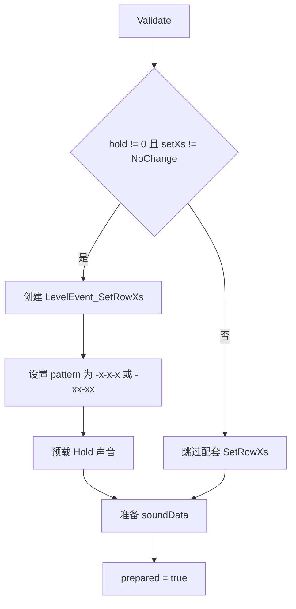

# AddClassicBeat

`LevelEvent_AddClassicBeat` 是 Classic 节拍事件。它负责在指定行生成普通节拍或 Hold 节拍，并支持 Swing、长度、X pattern 切换、拆成 FreeTime 节拍等编辑器操作。

## 基本信息

| 项目 | 内容 |
| --- | --- |
| 事件类型 | `LevelEventType.AddClassicBeat` |
| 事件类 | `LevelEvent_AddClassicBeat` |
| 面板类 | `InspectorPanel_AddClassicBeat` |
| 时间线控件 | `LevelEventControl_AddClassicBeat` |
| 源码 | `RDFucked/Assets/Scripts/Assembly-CSharp/RDLevelEditor/LevelEvent_AddClassicBeat.cs` |
| 面板源码 | `RDFucked/Assets/Scripts/Assembly-CSharp/RDLevelEditor/InspectorPanel_AddClassicBeat.cs` |
| 继承 | `LevelEvent_Base` |
| 执行时机 | `LevelEventExecutionTime.OnPrebar` |
| 房间使用 | `RoomsUsage.NotUsed` |

## 字段

| 字段 | 类型 | 作用 |
| --- | --- | --- |
| `soundData` | `SoundData` | 由 `sound` 转换出的运行时声音数据 |
| `setRowXs` | `LevelEvent_SetRowXs` | Hold 且 `setXs` 需要改 X pattern 时，在 `Prepare` 中创建的配套事件 |

## 属性

| 属性 | 类型 | 默认值 | 序列化 | 作用 |
| --- | --- | --- | --- | --- |
| `tick` | `float` | `1f` | 是 | 节拍之间的间隔 |
| `swing` | `float` | `0f` | 是 | Swing 偏移量；只在 `hold == 0` 时显示 |
| `hold` | `float` | `0f` | 是 | Hold 节拍持续拍数 |
| `setXs` | `SetXs` | 枚举默认值 | 是 | Hold 时附加的 X pattern 改动 |
| `legacy` | `bool` | `false` | 是 | 旧 Swing 算法标记 |
| `length` | `int?` | `7` | 是 | Classic 节拍长度，空值时 `GetLength()` 返回 7 |
| `sound` | `SoundDataStruct?` | `Shaker` | 是 | 自定义节拍声音 |
| `switchToSetRowXs` | `bool` | `false` | 否 | 面板按钮，触发 `SwitchControlToSetRowXs()` |
| `breakIntoFreeTime` | `bool` | `false` | 否 | 面板按钮，触发 `BreakIntoFreeTimeBeats()` |

## 条件显示方法

| 方法 | 返回条件 |
| --- | --- |
| `EnableXsIf()` | `hold != 0` 且 `length` 为空或等于 7 |
| `EnableLegacyIf()` | `legacy` |
| `EnableSwitchIf()` | `!EnableXsIf()` |
| `EnableSwingIf()` | `hold == 0` |
| `EnableLengthIf()` | `RDBase.isAdvanced` |

## Decode

`Decode(Dictionary<string, object> dict)` 在读取旧关卡时处理 Swing 兼容。

| 情况 | 行为 |
| --- | --- |
| 数据中没有 `legacy` | 当关卡版本小于 29，且存在非 0 的 `swing` 字段时，把 `legacy` 设为真 |
| 解码末尾 | 调用 `Validate()` |

## Prepare

`Prepare()` 做三件事：验证字段、为 Hold X pattern 创建配套事件、准备节拍声音。

`setXs == SetXs.FourBeat` 时 pattern 为 `-x-x-x`，其他非 `NoChange` 值使用 `-xx-xx`。创建出的 `setRowXs` 会使用当前事件的小节、节拍、行，并设置 `sortOrderOffset = -1`。

Hold 声音只在 `level.loadedHeldBeatSounds` 为假时加载一次。双人模式下也会加载玩家 2 对应的 Hold 声音。

## Validate

| 字段 | 修正规则 |
| --- | --- |
| `tick` | 小于 0 时修正为 0 |
| `swing` | 限制在 `0` 到 `tick * 2` 之间 |

## Run

`Run()` 使用 `RunOnBeat` 在目标拍执行。它遍历所有运行时行，只对 `RowGetsBeat(row, i, tag)` 且未 muted 的行生成节拍。

| 分支 | 行为 |
| --- | --- |
| 目标行不是原行 | 把 `soundData` 设为 `null`，避免跨行沿用自定义声音 |
| `hold != 0` | 调用 `game.AddBeatHold(i, beat - 1, tick, hold, length, soundData)` |
| `hold == 0` 且 `swing == 0` | 调用 `game.AddBeat`，Swing 类型为 `Normal` |
| `hold == 0` 且 `legacy == true` | 调用 `game.AddBeat`，Swing 类型为 `SwingCustom` |
| `hold == 0` 且 `legacy == false` | 调用 `game.AddBeat`，Swing 类型为 `SwingCustomNew` |

## 长度与 Swing

| 方法 | 行为 |
| --- | --- |
| `GetLength()` | 返回 `length ?? 7` |
| `GetOffsetFromSwing(int pulseIndex, LevelEvent_AddClassicBeat data)` | 旧 Swing 偏移算法，按 `(beat - 1) / tick + pulseIndex` 判断奇偶 |
| `GetOffsetFromSwingNew(int pulseIndex, LevelEvent_AddClassicBeat data)` | 新 Swing 偏移算法，只按 `pulseIndex` 奇偶判断，且 Hold 时不应用 Swing |

两个 Swing 偏移方法在不应用 Swing 时都会返回 `tick * pulseIndex`，并把结果四舍五入到 4 位小数。

## 编辑器操作

| 方法 | 行为 |
| --- | --- |
| `SwitchControlToSetRowXs()` | 播放创建音效，把当前时间线控件切换为 `SetRowXs` |
| `BreakIntoFreeTimeBeats()` | 把 Classic 节拍拆成一个 `AddFreeTimeBeat` 和若干 `PulseFreeTimeBeat`，再删除原控件 |

`BreakIntoFreeTimeBeats()` 会读取时间线上最近的 `SetRowXs`，把 Synco 偏移加入拆出的 Pulse 位置。Hold 且 `setXs` 非 `NoChange` 时，它还会额外创建一个 `LevelEvent_SetRowXs`。

## Inspector 面板

`InspectorPanel_AddClassicBeat` 继承 `InspectorPanel`，使用自动属性控件，但重写了属性更新和保存，用于处理 Swing slider 的范围与吸附。

| 方法 | 行为 |
| --- | --- |
| `UpdateUIProperties(LevelEvent_Base levelEvent)` | 找到名为 `swing` 的属性控件，把 slider 最大值设为 `tick * 2`，把吸附间隔设为 `1 / editor.denominator` |
| `SaveProperties(LevelEvent_Base levelEvent)` | 保存前同步 Swing slider 最大值和吸附间隔 |
| `UpdateSwingTickBorders()` | 鼠标指向或拖动 Swing slider 时显示当前事件边框 |

## 时间线显示

`LevelEventControl_AddClassicBeat` 会为 Classic 节拍绘制主体宽度、黄色击打点、绿色脉冲点、Hold 条和循环边框。主体宽度由 `GetLength()`、`tick`、Swing 和 Synco 偏移共同决定。

## 相关页面

| 页面 | 关系 |
| --- | --- |
| [行与节拍事件](/api/editor-events/row-events.md) | 所属事件分组 |
| [AddOneshotBeat](/api/editor-events/AddOneshotBeat.md) | 共用时间线控件的 Oneshot 事件 |
| [Inspector 面板读写链路](/api/editor-events/inspector-flow.md) | 面板保存与显示机制 |
| [事件运行路径](/api/editor-events/runtime-flow.md) | `Run`、`Prepare` 和按节拍调度机制 |

