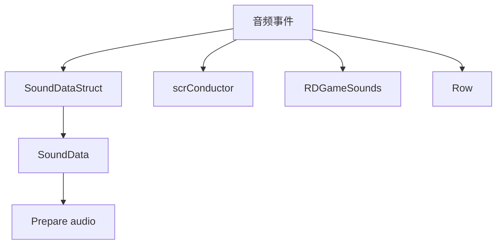

# 音频与声音事件

本页深写 `PlaySound`、`SetClapSounds`、`SetGameSound`、`SetBeatSound` 和 `SetCountingSound`。这些事件围绕 `SoundDataStruct`、`SoundData`、`scrConductor`、`RDGameSounds` 和 `Row` 的声音配置工作。

## 事件总览

| 事件 | 事件类 | 执行时机 | 主要职责 |
| --- | --- | --- | --- |
| `PlaySound` | `LevelEvent_PlaySound` | `OnPrebar`，排序偏移 `-9` | 在指定 beat 播放一个声音，也支持标签触发立即播放 |
| `SetClapSounds` | `LevelEvent_SetClapSounds` | `OnPrebar`，排序偏移 `-1` | 设置 Classic/Oneshot 行的 P1、P2、CPU 拍手命中音 |
| `SetGameSound` | `LevelEvent_SetGameSound` | 解码后按声音类型决定 | 替换游戏内错误、手部、爆心、跳拍、长按等系统音效 |
| `SetBeatSound` | `LevelEvent_SetBeatSound` | `OnPrebar`，排序偏移 `-1` | 设置指定行的 pulse sound |
| `SetCountingSound` | `LevelEvent_SetCountingSound` | `OnPrebar`，排序偏移 `-1` | 设置指定行的数拍声音或自定义数拍音 |

## 共享声音数据

### SoundDataStruct

| 字段 | 类型 | 默认值 | 作用 |
| --- | --- | --- | --- |
| `filename` | `string` | 必填 | 内置声音名或外部音频文件名 |
| `volume` | `int` | `100` | 音量百分比 |
| `pitch` | `int` | `100` | pitch 百分比 |
| `pan` | `int` | `0` | 左右声像百分比 |
| `offset` | `int` | `0` | 偏移毫秒 |
| `used` | `bool` | `true` | 分组音效中是否启用该项 |

`SoundDataStruct.ToSoundData()` 会创建 `SoundData`，并同步 volume、pitch、pan、offset、used。`Validated()` 会把 volume 限制到 0 到 300，pitch 限制到 0 到 300，pan 限制到 -100 到 100。

`MigrateLegacySound()` 用于把旧字段迁移到结构体字段。例如 `filename`、`volume`、`pitch`、`pan`、`offset` 会被组装进新的 `sound` 字典；带前缀时会读取 `p1Filename`、`p1Volume` 等字段。

### SoundData

| 字段 | 类型 | 作用 |
| --- | --- | --- |
| `filename` | `string` | 声音文件名或内置声音名 |
| `volume`、`pitch`、`pan`、`offset` | `int` | 编辑器保存的百分比或毫秒值 |
| `externalClip` | `bool` | 是否来自外部音频文件 |
| `loadSuccessful` | `bool` | 准备加载是否成功 |
| `groupSubtype` | `GameSoundType` | 分组系统音效的子类型 |
| `used` | `bool` | 是否启用 |
| `conductorFilename` | `string` | 外部音频会追加 `*external` |

`Prepare()` 会检查当前关卡的 `preparedAudioClips`，然后通过 `RDEditorUtils.FindClip(filename)` 判断内置或外部音频。外部音频会加载 AudioClip，加入 `preparedAudioClips`，并在 `scrConductor.instance.externalSoundData` 中记录 `SongOffset`。内置音频会在需要时把 `SongOffset` 以 internal 标记写入 `externalSoundData`。

## PlaySound

| 项目 | 内容 |
| --- | --- |
| 源码 | `RDFucked/Assets/Scripts/Assembly-CSharp/RDLevelEditor/LevelEvent_PlaySound.cs` |
| 执行时机 | `OnPrebar`，排序偏移 `-9` |
| 标签动作 | `hasTaggedSpecialMethod == true` |

| 名称 | 类型 | 默认值 | 作用 |
| --- | --- | --- | --- |
| `soundData` | `SoundData` | `Prepare()` 生成 | 实际播放用声音数据 |
| `sound` | `SoundDataStruct` | `Shaker` | 编辑器保存的声音配置 |
| `customSoundType` | `CustomSoundType` | `CueSound` | 决定 mixer group |
| `levelSpeed` | `float` | 计算属性 | `MusicSound` 使用 `RDTime.speed`，其他类型使用 1 |

`GetSounds()` 会合并 beat sounds、P1/P2/CPU clap sounds 和 play sounds，作为声音选择列表。

| 方法 | 行为 |
| --- | --- |
| `Decode()` | 调用 `SoundDataStruct.MigrateLegacySound(dict, "sound")` |
| `Prepare()` | `sound.ToSoundData()`，再执行 `soundData.Prepare()` |
| `Run()` | 在 `beat - 1` 对应时间调用 `conductor.PlayBeat()` |
| `TaggedActionVariant()` | 调用 `scrConductor.PlayImmediately()` 立即播放 |
| `PreviewSound()` | 把当前声音转为 `SoundData` 后立即播放 |

`GetMixerPath()` 映射如下：

| `customSoundType` | Mixer path |
| --- | --- |
| `MusicSound` | `CustomMusicSound` |
| `BeatSound` | `CustomBeatSound` |
| `HitSound` | `CustomHitSound` |
| `OtherSound` | `CustomOtherSound` |
| `CueSound` | `CustomCueSound` |

## SetClapSounds

| 项目 | 内容 |
| --- | --- |
| 源码 | `RDFucked/Assets/Scripts/Assembly-CSharp/RDLevelEditor/LevelEvent_SetClapSounds.cs` |
| 执行时机 | `OnPrebar`，排序偏移 `-1` |

| 名称 | 类型 | 默认值 | 作用 |
| --- | --- | --- | --- |
| `p1SoundData` | `SoundData` | `Prepare()` 生成 | P1 命中音 |
| `p2SoundData` | `SoundData` | `Prepare()` 生成 | P2 命中音 |
| `cpuSoundData` | `SoundData` | `Prepare()` 生成 | CPU 命中音 |
| `p1SoundDefault` | `SoundDataStruct` | `ClapHit` | P1 默认 |
| `p2SoundDefault` | `SoundDataStruct` | `ClapHitP2` | P2 默认 |
| `cpuSoundDefault` | `SoundDataStruct` | `ClapHitCPU` | CPU 默认 |
| `rowType` | `RowType` | 枚举默认值 | Classic 或 Oneshot |
| `p1Sound` | `SoundDataStruct?` | `ClapHit` | P1 配置；为空时不改 P1 |
| `p2Sound` | `SoundDataStruct?` | `ClapHitP2` | P2 配置；为空时不改 P2 |
| `cpuSound` | `SoundDataStruct?` | `ClapHitCPU` | CPU 配置；为空时不改 CPU |

`Decode()` 会迁移 `p1Sound`、`p2Sound`、`cpuSound` 的旧字段，删除显式 null 字段。版本号不高于 49 时，`cpuSound = p2Sound`。旧的 `p1Used`、`p2Used`、`cpuUsed` 为假时，对应 sound 设为空。

`Run()` 调用 `SetPlayerHitSounds()`：

| rowType | P1 | P2 | CPU |
| --- | --- | --- | --- |
| `Classic` | `ClapSoundP1Classic` | `ClapSoundP2Classic` | `ClapSoundCPUClassic` |
| 非 Classic | `ClapSoundP1Oneshot` | `ClapSoundP2Oneshot` | `ClapSoundCPUOneshot` |

每个非空声音都会写入 `RDGameSounds.Set(type, conductorFilename, volume, pitch, pan)`。

## SetGameSound

| 项目 | 内容 |
| --- | --- |
| 源码 | `RDFucked/Assets/Scripts/Assembly-CSharp/RDLevelEditor/LevelEvent_SetGameSound.cs` |
| 执行时机 | 解码后动态设置 |

| 名称 | 类型 | 默认值 | 作用 |
| --- | --- | --- | --- |
| `soundsData` | `SoundData[]` | `Init()` 创建 1 项 | 运行时声音数组 |
| `soundType` | `GameSoundType` | `SmallMistake` | 要替换的系统音效类型或分组主类型 |
| `sounds` | `SoundDataStruct[]` | 1 项空文件名 | 编辑器保存的声音数组 |
| `gameSoundGroups` | `Dictionary<GameSoundType, GameSoundType[]>` | `RDEditorConstants.gameSoundGroups` | 分组音效映射 |

`Decode()` 支持三种保存形态：存在 `soundSubtypes` 时用 `RDEditorUtils.DecodeSoundArray()`；旧单声音字段若属于分组，则生成分组长度的 `soundsData`；普通单声音则创建 1 个 `SoundData` 并解码。之后它把 `soundsData` 转回 `SoundDataStruct[] sounds`。

当 `soundType` 落在枚举数值 20 到 24 范围内时，执行时机设为 `OnBar` 且排序偏移 0；其他情况设为 `OnPrebar` 且排序偏移 -10。

`Prepare()` 把 `sounds` 转为 `SoundData[]`，并为分组音效设置 `groupSubtype`。`Run()` 遍历启用的声音，空文件名会回退到手部 pop sound 或 `RDGameSounds.defaultSounds[sType].filename`，最后按执行时机调用 `RDGameSounds.Set()`。

## SetBeatSound

| 项目 | 内容 |
| --- | --- |
| 源码 | `RDFucked/Assets/Scripts/Assembly-CSharp/RDLevelEditor/LevelEvent_SetBeatSound.cs` |
| 执行时机 | `OnPrebar`，排序偏移 `-1` |

| 名称 | 类型 | 默认值 | 作用 |
| --- | --- | --- | --- |
| `soundData` | `SoundData` | `Prepare()` 生成 | 行 pulse sound |
| `sound` | `SoundDataStruct` | `Shaker` | 编辑器声音字段 |
| `copyRowButton` | `bool` | `false` | UI 按钮属性，调用 `CopyRowBeatSound()` |

`CopyRowBeatSound()` 从 `editor.rowsData[row].pulseSound` 复制当前行的 MakeRow pulse sound。`Prepare()` 会加载声音；外部 clip 或非 `None` 文件名会把 `soundData.filename` 改成 `soundData.conductorFilename`。`Run()` 调用 `game.rows[row].SetPulseSounds(soundData)`。

## SetCountingSound

| 项目 | 内容 |
| --- | --- |
| 源码 | `RDFucked/Assets/Scripts/Assembly-CSharp/RDLevelEditor/LevelEvent_SetCountingSound.cs` |
| 执行时机 | `OnPrebar`，排序偏移 `-1` |

| 名称 | 类型 | 默认值 | 条件 | 作用 |
| --- | --- | --- | --- | --- |
| `soundsData` | `SoundData[]` | `Prepare()` 生成 | 不序列化 | 自定义数拍音数组 |
| `enabled` | `bool` | `true` | 始终显示 | 是否启用数拍声 |
| `voiceSource` | `CountingVoiceSource` | `JyiCount` | `enabled` | 内置或自定义数拍音源 |
| `volume` | `int` | `100` | `enabled` | 全局数拍声音量，范围 0 到 200 |
| `subdivOffset` | `float` | `0.5` | Oneshot 行 | 细分数拍偏移 |
| `sounds` | `SoundDataStruct[]` | 空数组 | `voiceSource == Custom` | 自定义数拍音 |

`Prepare()` 中，非自定义 voice source 直接完成。自定义模式会遍历 `sounds`，把每个声音按 `sound.volume * volume / 100` 重新计算音量，执行 `Validated()` 后转为 `SoundData` 并加载。

`Run()` 会写入目标 `Row`：

| 字段 | 写入 |
| --- | --- |
| `rowCountingVoiceEnabled` | `enabled` |
| `countingSounds` | 自定义模式写 `soundsData`，否则按行类型 resize 后调用 `SetCountingSounds()` |
| `rowCountingVoiceSubdivOffset` | `subdivOffset` |

`ValidateVoiceSource(bool isOneshot)` 会把 Oneshot 行上的 `JyiCount` 改成 `JyiCountEnglish`。

### InspectorPanel_SetCountingSound

| 行类型 | 选项来源 |
| --- | --- |
| Classic 行 | `countingVoiceSources` 加 `Custom` |
| Oneshot 行 | `subdivisionVoiceSources` 加 `Custom` |

更新 UI 时，`sounds` 属性控件会收到当前 `MakeRow` 数据；保存属性时，`subdivOffset` 滑条的 `snapInterval` 会设为 `1 / editor.denominator`。

## 调用关系

## 与其他页面的边界

| 页面 | 边界 |
| --- | --- |
| [PlaySong](/api/editor-events/PlaySong.md) | 歌曲主音轨、BPM 与播放入口在 PlaySong 独立页 |
| [歌曲时间线事件](/api/editor-events/SongTimingEvents.md) | BPM 和拍号变化在时间线事件页 |
| [行控制与自由节拍事件](/api/editor-events/RowControlEvents.md) | `MakeRow` 中的 pulse sound 创建在行页，本页说明后续声音替换事件 |

