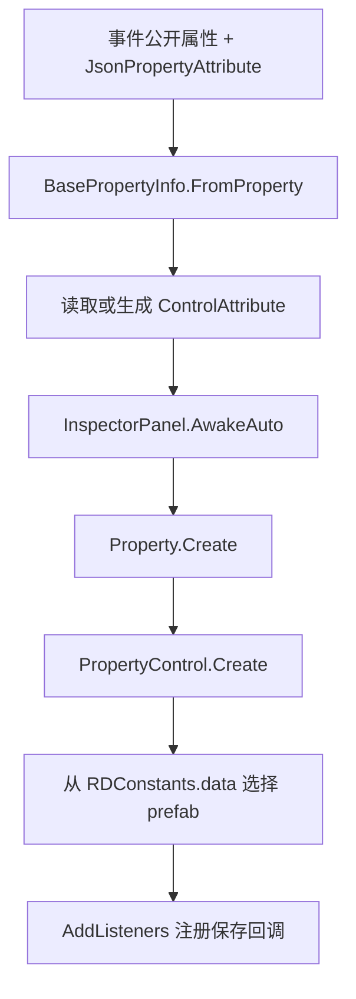

# BasePropertyInfo 与属性控件描述

## 基本信息

| 项目 | 内容 |
| --- | --- |
| 源码路径 | `RDFucked/Assets/Scripts/Assembly-CSharp/RDLevelEditor/BasePropertyInfo.cs` |
| 相关源码 | `ControlAttribute.cs`、`Property.cs`、`PropertyControl.cs` |
| 命名空间 | `RDLevelEditor` |
| 角色 | 把事件类上的公开属性转换为可编码、可复制、可生成 Inspector 控件的属性描述 |

`BasePropertyInfo` 是事件属性系统的核心记录类型。它从 `PropertyInfo` 和 `JsonPropertyAttribute` 中读取保存键、单位、占位符、启用条件、保存条件，再结合 `ControlAttribute` 决定 Inspector 控件类型。

## 字段与属性

| 名称 | 类型 | 作用 |
| --- | --- | --- |
| `propertyInfo` | `PropertyInfo` | 原始 C# 属性反射对象。 |
| `name` | `string` | 保存键名；`JsonPropertyAttribute.name` 为空时使用属性名。 |
| `unit` | `string` | 属性单位文本。 |
| `customLocalizationKey` | `string` | 自定义本地化键。 |
| `placeholder` | `string` | 输入控件占位文本。 |
| `required` | `bool` | 来自 `JsonPropertyAttribute.required`。 |
| `enabled` | `bool` | 来自 `JsonPropertyAttribute.enabled`。 |
| `onlyUI` | `bool` | `DescriptionAttribute` 或 `ButtonAttribute` 控件不参与保存。 |
| `enableIf` | `Func<LevelEvent_Base, bool>` | 控件显示条件，由 `enableIfMethod` 指向的无参 bool 方法生成。 |
| `saveIf` | `Func<LevelEvent_Base, bool>` | 保存条件，由 `saveIfMethod` 指向的无参 bool 方法生成。 |
| `controlAttribute` | `ControlAttribute` | 控件元数据。属性没有显式控件 Attribute 时使用默认控件。 |
| `NullableUnderlying` | `BasePropertyInfo` | 当前对象为 `NullablePropertyInfo` 时返回底层属性描述，否则返回自身。 |

## 抽象与公共方法

| 方法 | 行为 |
| --- | --- |
| `Decode(object value)` | 子类实现，把 JSON 值转成事件属性值。 |
| `Encode(string key, object value, bool isLastKey)` | 子类实现，把事件属性值转成 JSON 片段。 |
| `EncodeWithoutKey(object value)` | 调用 `Encode("", value, true)` 后去掉键名前缀。 |
| `MakeCopy(object source)` | 默认返回原对象；数组等可变类型由子类重写。 |
| `GetAction(string methodName, Type containingType, LevelEvent_Base currentLevelEvent)` | 查找无返回值方法并创建绑定到当前事件实例的 `Action`。 |
| `FromProperty(PropertyInfo property, Type typeOverride = null)` | 按属性类型创建具体 `BasePropertyInfo` 子类。 |
| `GetDefaultControlAttribute(PropertyInfo field)` | 按属性类型返回默认控件 Attribute。 |

## FromProperty 类型映射

| C# 类型 | PropertyInfo 子类 |
| --- | --- |
| `bool` | `BoolPropertyInfo` |
| `int` | `IntPropertyInfo` |
| `float` | `FloatPropertyInfo` |
| `string` | `StringPropertyInfo` |
| `Vector2` | `Vector2PropertyInfo` |
| `Float2` | `Float2PropertyInfo` |
| `FloatExpression` | `FloatExpressionPropertyInfo` |
| `FloatExpression2` | `FloatExpression2PropertyInfo` |
| `ColorOrPalette` | `ColorPropertyInfo` |
| `SoundDataStruct` | `SoundDataPropertyInfo` |
| 枚举 | `EnumPropertyInfo` |
| 数组 | `ArrayPropertyInfo<TElement>` |
| `Nullable<T>` | `NullablePropertyInfo` |

未列入映射的类型会抛出异常，表示当前属性系统没有对应的序列化实现。

## 默认控件映射

| C# 类型 | 默认 ControlAttribute |
| --- | --- |
| `bool` | `ToggleGroupAttribute` |
| `int` | `InputFieldAttribute` |
| `float` | `InputFieldAttribute` |
| `string` | `InputFieldAttribute` |
| `Vector2` | `InputFieldAttribute` |
| `Float2` | `PositionPickerAttribute` |
| `FloatExpression` | `InputFieldAttribute` |
| `FloatExpression2` | `ExpPositionPickerAttribute` |
| `ColorOrPalette` | `ColorAttribute` |
| `SoundDataStruct` | `SoundAttribute` |
| 枚举 | `DropdownAttribute` |
| 数组 | `DropdownAttribute` |

## ControlAttribute

| 名称 | 类型 | 作用 |
| --- | --- | --- |
| `multiline` | `bool` | 属性控件是否使用多行布局。 |
| `labelHeight` | `int` | 标签高度；默认 `14`。 |

`ControlAttribute` 的派生类型决定 `PropertyControl.Create` 实例化哪个控件 prefab。常见派生类型包括 `InputFieldAttribute`、`DropdownAttribute`、`ColorAttribute`、`SoundAttribute`、`ButtonAttribute`、`SliderAttribute`、`PositionPickerAttribute`、`ShowRoomsAttribute`。

## Property

| 成员 | 作用 |
| --- | --- |
| `label` | 属性左侧标签文本。 |
| `labelButton` | 可空属性用来开关该属性是否启用。 |
| `controlContainer` | 控件实例挂载位置。 |
| `offString` | 可空属性关闭时追加到标签的文本。 |
| `propertyInfo` | 当前属性描述。 |
| `control` | 当前属性控件实例。 |
| `Create(BasePropertyInfo propertyInfo, InspectorPanel inspectorPanel)` | 实例化属性 prefab，创建控件，注册保存监听，处理按钮和可空属性开关。 |
| `UpdateUI(LevelEvent_Base levelEvent)` | 更新可空状态、显示状态和控件值。 |
| `Save(LevelEvent_Base levelEvent)` | 保存控件值；可空属性关闭时写入 `null`。 |

可空属性由 `NullablePropertyInfo` 管理。关闭时，控件隐藏，标签变灰；点击标签按钮会在 `null` 和 `toggleOnValue` 之间切换。

## PropertyControl

| 成员 | 作用 |
| --- | --- |
| `inspectorPanel` | 所属 Inspector 面板。 |
| `propertyInfo` | 当前控件对应的属性描述。 |
| `controlObject` | 具体控件对象，由子类返回。 |
| `AddListeners(InspectorPanel.ChangeAction action)` | 子类注册输入变化事件。 |
| `Setup()` | 子类初始化控件。 |
| `UpdateUI(LevelEvent_Base levelEvent)` | 子类把事件属性值显示到控件。 |
| `Save(LevelEvent_Base levelEvent)` | 子类把控件值写回事件属性。 |
| `GetEventValue(LevelEvent_Base levelEvent)` | 通过反射读取事件属性。 |
| `SetEventValue(LevelEvent_Base levelEvent, object value)` | 通过反射写入事件属性。 |
| `SetPropertyControlHeight(float height, ...)` | 调整控件高度并刷新布局。 |
| `SetToggleOnValue(object val)` | 更新可空属性开启时写入的默认值。 |
| `Create(Property property)` | 根据 `ControlAttribute` 选择 `RDConstants.data` 中的控件 prefab。 |

## 控件创建流程

## 与保存系统的关系

`LevelEvent_Base.Encode` 遍历 `info.propertiesInfo`。当属性不是 `onlyUI`，并且 `enableIf`、`saveIf` 返回允许保存时，会读取属性值并调用 `BasePropertyInfo.Encode` 写入 JSON 片段。`InspectorPanel.SaveAuto` 则遍历 `Property` 列表，把 UI 控件值写回事件对象，再由事件对象保存数据。

