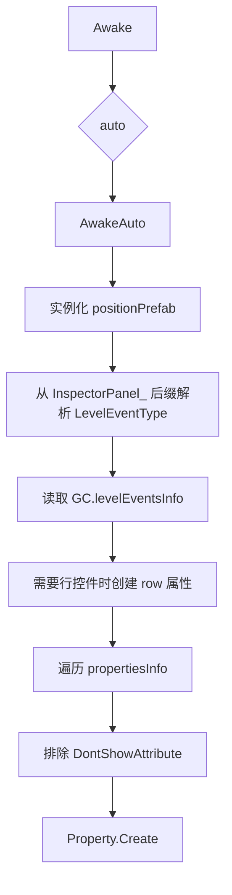
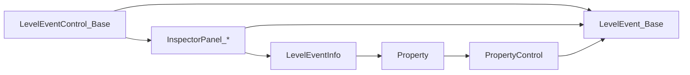

# InspectorPanel

## 基本信息

| 项目 | 内容 |
| --- | --- |
| 源码路径 | `RDFucked/Assets/Scripts/Assembly-CSharp/RDLevelEditor/InspectorPanel.cs` |
| 命名空间 | `RDLevelEditor` |
| 继承 | `RDEditorBase` |
| 角色 | 编辑器右侧事件属性面板基类，负责显示事件、生成自动属性控件、保存 UI 改动、执行本地化和布局刷新 |

每个 `InspectorPanel_*` 对应一个事件面板。手工面板直接放在 Unity 层级中；没有手工面板的类型由 `RDInspectorPanelManager` 创建空面板并挂上对应组件，`InspectorPanel.AwakeAuto` 再根据 `LevelEventInfo.propertiesInfo` 自动生成属性控件。

## 委托

| 名称 | 签名 | 作用 |
| --- | --- | --- |
| `ChangeAction` | `void(Action extraActions, string sound = null, string group = null)` | 控件发生编辑时调用，统一处理保存、音效和附加动作。 |

## 字段与属性

| 名称 | 类型 | 作用 |
| --- | --- | --- |
| `position` | `InspectorPanel_Position` | 面板顶部小节、节拍、房间等位置区域。 |
| `extraParent` | `Transform` | 手工面板的额外 UI 容器。 |
| `auto` | `bool` | 是否为自动生成面板。 |
| `levelEventInfo` | `LevelEventInfo` | 当前面板对应事件的元数据。 |
| `panelName` | `string` | 面板名，用于本地化键。 |
| `tab` | `Tab` | 当前事件所在编辑器标签页。 |
| `row` | `PropertyControl_Row` | 自动面板的行选择控件。 |
| `localize` | `bool` | 是否还需要执行本地化。 |
| `playSoundOnEdit` | `bool` | 编辑时是否播放音效。 |
| `colorHovers` | `List<RDColorHoverEventTrigger>` | 需要跟随标签页颜色变化的 hover 组件。 |
| `toggles` | `List<Toggle>` | 需要跟随标签页颜色变化的 Toggle。 |
| `scrollRect` | `ScrollRect` | Inspector 滚动区域。 |
| `currentEventControl` | `LevelEventControl_Base` | 当前正在编辑的时间线控件。 |
| `currentLevelEvent` | `LevelEvent_Base` | 当前正在编辑的事件数据。 |
| `isUpdatingUI` | `bool` | 防止 `UpdateUI` 期间触发保存监听。 |
| `defaultGroup` | `string` | 编辑音效默认 mixer group，来自 `RDUtils.GetMixerGroup("LevelEditorInspectorPanel")`。 |
| `propertiesContainer` | `RectTransform` | 自动属性控件挂载容器。 |
| `properties` | `ImmutableList<Property>` | 自动创建的属性控件列表。 |
| `theresRows` | `bool` | 当前编辑器是否存在行数据。 |
| `content` | `Transform` | 当前面板内容根节点。 |
| `propertiesParent` | `Transform` | 属性区域父节点。 |

## 初始化

| 方法 | 行为 |
| --- | --- |
| `Awake()` | 根据 `auto` 选择自动初始化或读取已有 `position`；设置 `position` 状态和 `defaultGroup`。 |
| `AwakeAuto()` | 实例化位置区域和属性区域，按面板类名解析事件类型，读取 `LevelEventInfo`，创建行控件和属性控件。 |
| `Start()` | 调用 `Localize()`。 |

自动初始化流程：

## 显示与保存

| 方法 | 行为 |
| --- | --- |
| `Show(LevelEventControl_Base levelEventControl)` | 显示当前事件面板，隐藏其他面板，更新标题、颜色、位置、条件面板和 UI 值。 |
| `ShowPanel(Transform panel, string title, Tab tab)` | 静态工具方法，显示指定面板并设置标题与标签页。 |
| `Save(LevelEvent_Base levelEvent, bool isNew)` | 保存当前面板内容到事件；新事件和已有事件走统一入口。 |
| `UpdateUI(LevelEvent_Base levelEvent)` | 设置 `isUpdatingUI`，更新位置区域、自动属性和具体面板 UI。 |
| `UpdateUIInternal(LevelEvent_Base levelEvent)` | 虚方法，具体面板重写后补充手工 UI 更新。 |
| `UpdateLevelEventHeight(float height, bool scrollToTop)` | 通过 `inspectorPanelManager` 刷新内容高度。 |

`Show` 会把 `currentLevelEvent` 和 `currentEventControl` 同步到面板对象。后续控件的保存监听通过这两个引用找到要写回的事件。

## 自动属性 UI

| 方法 | 行为 |
| --- | --- |
| `UpdateUIAuto(LevelEvent_Base levelEvent)` | 更新自动行控件和所有自动属性控件。 |
| `SaveAuto(LevelEvent_Base levelEvent)` | 保存自动行控件和所有自动属性控件。 |
| `UpdateUIProperties(LevelEvent_Base levelEvent)` | 遍历 `properties` 调用 `Property.UpdateUI`。 |
| `SaveProperties(LevelEvent_Base levelEvent)` | 遍历 `properties` 调用 `Property.Save`。 |
| `SetupPropertyControl(Transform property)` | 为控件内 Toggle 设置颜色跟踪。 |

行控件只在 `levelEventInfo.showsRowControl` 为真时显示。`defaultRow == -1` 的事件会在下拉列表中加入“所有行”选项，并用下拉值与 `row` 值做偏移换算。

## 编辑监听

| 方法 | 行为 |
| --- | --- |
| `AddOnEditListenersNoSave(Action extraActions, params object[] objects)` | 注册只执行附加动作、不保存的监听。 |
| `AddOnEditListenersSaveLast(Action extraActions, params object[] objects)` | 注册先执行附加动作、再保存的监听。 |
| `AddOnEditListeners(Action extraActions, params object[] objects)` | 注册标准保存监听。 |
| `AddOnEditListenersGeneric(ChangeAction action, Action extraActions, object[] objects)` | 根据对象类型注册具体 Unity UI 事件。 |
| `RegisterForChangeAction(Action extraActions, string sound = null, string group = null)` | 标准保存入口：播放音效、保存当前控件或事件、执行附加动作。 |
| `RegisterToggle(Toggle toggle, ChangeAction action, Action extraActions = null, string sound = null, string group = null)` | 为 Toggle 添加点击事件并转发到 `ChangeAction`。 |

`AddOnEditListenersGeneric` 支持的对象类型包括 `InputField`、`Toggle`、`Slider`、`Dropdown`、`RDEventTrigger`、`Button`、`CharacterPicker`。不支持的对象会打印调试信息。

## 本地化与颜色

| 方法 | 行为 |
| --- | --- |
| `Localize()` | 根据面板类型确定 `tab`，再本地化属性区域和额外区域。 |
| `Localize(Transform t)` | 遍历子节点，处理 `Text`、`ToggleGroup`、`Dropdown`。 |
| `LocalizeLabel(Text label, string propertyName, bool fromKey = false)` | 解析本地化文本，移除末尾冒号，绑定 hover 颜色。 |
| `LocalizeToggleGroup(Transform toggleGroupTransform, ToggleGroup toggleGroup)` | 本地化 Toggle 文本并记录需要染色的 Toggle。 |
| `LocalizeDropdown(Dropdown dropdown)` | 给下拉模板文本和标题文本挂 `RDStringToUIText`。 |
| `GetLocalizedString(string key)` | 先查 `editor.{panelName}.{key}`，再查 `editor.{key}`。 |

面板颜色来自 `gc.colorPalette[(int)tab]`。这属于游戏编辑器内部调色板，不影响文档站黑白样式约束。

## RDInspectorPanelManager

| 项目 | 内容 |
| --- | --- |
| 源码路径 | `RDFucked/Assets/Scripts/Assembly-CSharp/RDLevelEditor/RDInspectorPanelManager.cs` |
| 角色 | 管理所有 Inspector 面板实例，负责创建缺失自动面板、隐藏面板、显示空白面板和批量选择面板。 |

关键方法：

| 方法 | 行为 |
| --- | --- |
| `Setup()` | 收集已有子面板，再为程序集里没有手工实例的 `InspectorPanel` 子类调用 `CreatePanel`。 |
| `Get(Type type)` | 按类型取 Inspector 面板。 |
| `Get<T>()` | 泛型取 Inspector 面板。 |
| `GetCurrent()` | 返回当前层级中激活的面板。 |
| `HideAll()` | 隐藏所有事件面板、事件列表面板、空白面板、批量面板和条件面板。 |
| `ShowBlankPanel(string text = "")` | 显示空白 Inspector，并附加当前错误数和 RDCode 变量。 |
| `ShowBulkPanel()` | 显示批量选择面板。 |
| `GetMistakesString()` | 从 `game.mistakesManager` 读取错误数。 |
| `GetRDCodeVariables()` | 从 `game.currentLevel` 读取非默认的 `b0` 到 `b9`、`i0` 到 `i9`、`f0` 到 `f9`。 |

`RDInspectorPanelManager.Setup` 的自动面板创建规则是扫描 `InspectorPanel` 所在程序集里所有子类；已有手工面板不重复创建，缺失的子类会挂到 `emptyInspectorPanel` 克隆对象上，并设置 `auto = true`。

## 与事件系统的关系

