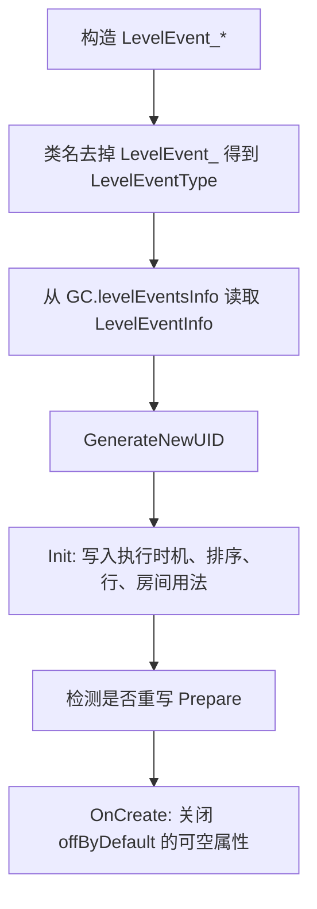
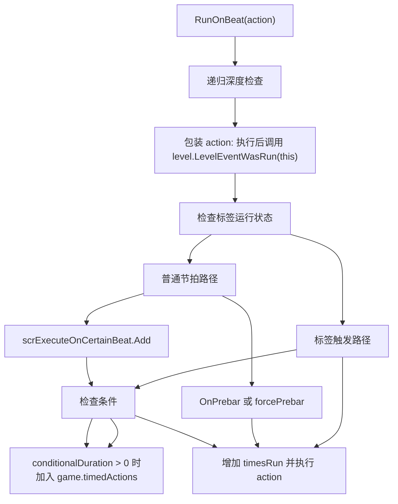

# LevelEvent_Base

## 基本信息

| 项目 | 内容 |
| --- | --- |
| 源码路径 | `RDFucked/Assets/Scripts/Assembly-CSharp/RDLevelEditor/LevelEvent_Base.cs` |
| 命名空间 | `RDLevelEditor` |
| 继承 | `RDClass` |
| 角色 | 所有关卡编辑器事件的数据基类，负责事件公共字段、保存编码、读取解码、条件判断、标签运行、节拍调度和复制克隆 |

`LevelEvent_Base` 是 `LevelEvent_*` 系列的共同父类。每个具体事件在构造时用类名推导 `LevelEventType`，再从 `GC.levelEventsInfo` 取得对应的 `LevelEventInfo`。事件的公共 JSON 键、行号、房间、条件、标签、执行时机、Inspector 面板、运行调度都在这里统一处理。

## 常量

| 名称 | 值 | 作用 |
| --- | --- | --- |
| `InvalidRow` | `-10` | 表示事件不绑定普通行。 |
| `AllRows` | `-1` | 表示事件作用于所有行。 |
| `uidKey` | `"uid"` | 保存状态中的唯一 ID 键。 |
| `barKey` | `"bar"` | 小节键。 |
| `beatKey` | `"beat"` | 节拍键。 |
| `typeKey` | `"type"` | 事件类型键。 |
| `conditionalKey` | `"if"` | 条件表达式键。 |
| `tagKey` | `"tag"` | 标签键。 |
| `tagRunKey` | `"runTag"` | 带标签事件是否照常运行的键。 |
| `rowKey` | `"row"` | 行号键。 |
| `yKey` | `"y"` | 编辑器纵向位置键。 |
| `roomsKey` | `"rooms"` | 房间列表键。 |
| `activeKey` | `"active"` | 事件启用状态键。 |
| `targetKey` | `"target"` | 目标对象 ID 键。 |
| `tabKey` | `"tab"` | 编辑器标签页键。 |
| `RunOnBeatMaxDepth` | `100` | `RunOnBeat` 的递归深度上限。 |

## 字段

| 名称 | 类型 | 默认值 | 作用 |
| --- | --- | --- | --- |
| `conditionals` | `List<int>` | 空列表 | 当前事件绑定的本地条件 ID。负数编码用于取反：`-id - 1`。 |
| `globalConditionals` | `List<string>` | 空列表 | 当前事件绑定的全局条件 ID。前缀 `~` 表示取反。 |
| `tag` | `string` | `null` | 事件标签，用于被 `TagAction` 等机制触发。 |
| `tagRunNormally` | `bool` | `false` | 带标签事件是否仍按正常节拍运行。 |
| `conditionalDuration` | `float` | `0` | 条件持续时间，编码在 `if` 字符串的 `d` 后。 |
| `executionTime` | `LevelEventExecutionTime` | `OnBar` | 事件执行时机，初始化时来自 `LevelEventInfoAttribute.executionTime`。 |
| `barAndBeat` | `BarAndBeat` | 默认结构值 | 事件所在小节和节拍。 |
| `type` | `LevelEventType` | 构造推导 | 事件类型，只读。 |
| `info` | `LevelEventInfo` | 构造读取 | 当前事件类型的元数据和属性描述。 |
| `roomsUsage` | `RoomsUsage` | 初始化读取 | 当前事件对房间数组的使用方式。 |
| `uid` | `int` | `GenerateNewUID()` | 保存状态使用的随机 ID。 |
| `rooms` | `int[]` | 长度为 1 | 事件作用的房间索引列表。 |
| `active` | `bool` | `true` | 事件是否启用。 |
| `tagActive` | `bool` | `true` | 标签运行相关启用状态。 |
| `row` | `int` | `InvalidRow` | 事件绑定的行号。 |
| `y` | `int` | `0` | 编辑器中事件控件的纵向位置。 |
| `usesY` | `bool` | `true` | 事件是否使用 `y`。目标 ID 事件初始化为 `false`。 |
| `sortOrderOffset` | `int` | `0` | 排序偏移，初始化时来自 `LevelEventInfoAttribute.sortOffset`。 |
| `usesPrepare` | `bool` | 构造检测 | 具体事件是否重写了 `Prepare`。 |
| `prepared` | `bool` | `false` | `Prepare` 是否已执行。 |
| `isDragging` | `bool` | `false` | 编辑器拖动状态，会影响不使用节拍的事件如何返回 `beat`。 |
| `target` | `string` | `null` | 目标 ID，主要用于精灵和窗口类事件。 |
| `tab` | `Tab` | `None` | 事件所在编辑器标签页。 |
| `timesRun` | `int` | `0` | 运行次数计数。 |
| `debugStatsCustom` | `string` | 空字符串 | `ToString` 输出中的调试前缀。 |

## 属性

| 名称 | 类型 | 读写 | 作用 |
| --- | --- | --- | --- |
| `usesBeat` | `bool` | 只读 | 读取 `info.attribute.usesBeat`；`info` 为空时返回 `true`。 |
| `hasTaggedSpecialMethod` | `bool` | 只读虚属性 | 具体事件重写后，标签运行可调用 `TaggedActionVariant`。基类返回 `false`。 |
| `vfx` | `scrVfxControl` | 只读 | 返回 `scrVfxControl.instance`。 |
| `level` | `LevelBase` | 静态只读 | 返回 `scnGame.instance.currentLevel`。 |
| `name` | `string` | 只读 | 返回 `type.ToString()`。 |
| `sortOrder` | `int` | 只读 | 使用 `bar * 10000 + beat * 100 + sortOrderOffset` 排序。 |
| `isOneshotRowEvent` | `bool` | 只读 | `AddOneshotBeat` 和 `SetOneshotWave` 返回 `true`。 |
| `isBaseEvent` | `bool` | 只读 | 当前运行时类型等于 `LevelEvent_Base` 时返回 `true`。 |
| `defaultTab` | `Tab` | 只读 | 从 `RDEditorConstants.levelEventTabs` 查找事件默认标签页，并尊重已保存的合法 `tab`。 |
| `isClassicRowEvent` | `bool` | 只读 | `AddClassicBeat`、`SetRowXs`、`AddFreeTimeBeat`、`PulseFreeTimeBeat` 返回 `true`。 |
| `isSpriteTabEvent` | `bool` | 只读 | 当前事件类型存在于 `Tab.Sprites` 的事件列表中。 |
| `beat` | `float` | 读写 | 读写 `barAndBeat.beat`；事件不使用节拍且不在拖动时固定为 `1`。 |
| `bar` | `int` | 读写 | 读写 `barAndBeat.bar`。 |
| `bar1000timesbeat` | `float` | 只读 | 返回 `bar * 1000 + beat`。 |
| `room` | `int` | 读写 | 读写 `rooms[0]`，写入时把 `rooms` 重置为单元素数组。 |
| `inspectorPanel` | `InspectorPanel` | 只读 | 通过类型名 `RDLevelEditor.InspectorPanel_` 加事件名，从 `editor.inspectorPanelManager` 获取面板。 |
| `usesWindowDance` | `bool` | 只读 | `NewWindowDance`、`WindowResize`、`SetWindowContent`、`SetMainWindow`、`RenameWindow`、`HideWindow` 返回 `true`。 |

## 生命周期

`OnCreate` 不在构造函数中直接调用，而是在事件创建流程中调用。它会遍历 `info.propertiesInfo` 中 `offByDefault` 的 `NullablePropertyInfo`，把对应事件属性置为 `null`。

## 编码与解码

| 方法 | 行为 |
| --- | --- |
| `DecodeBaseProperties(Dictionary<string, object> dict)` | 读取 `uid`、`bar`、`beat`、`y`、`active`、`if`、`tag`、`runTag`、`tab`、`rooms` 等公共字段。 |
| `Decode(Dictionary<string, object> dict)` | 先调用 `DecodeBaseProperties`，再按 `info.usesRow`、`usesTargetId` 和 `info.propertiesInfo` 读取事件专属属性。 |
| `Encode()` | 写入公共字段、行、目标 ID，并遍历 `info.propertiesInfo` 编码事件专属属性；`onlyUI` 属性不保存。 |
| `EncodeBaseProperties(bool lastValue = false)` | 编码公共字段，包含条件、标签、启用状态、房间、标签页、目标 ID。 |
| `EncodeRow()` | 编码 `row`。 |
| `EncodeRoom()` | 编码 `rooms`。 |
| `EncodeTargetId()` | 编码 `target`。 |
| `DecodeTargetId(Dictionary<string, object> dict)` | 读取 `target`，在 `RDLevelData.current.sprites` 中查找对应 `spriteId`，同步 `row`，并为 `LevelEvent_Move` 填充 `makeSprite`。 |

`Decode` 对事件专属属性只读取带 `JsonPropertyAttribute` 的属性描述；读不到可空属性时会把对应属性设为 `null`。

## 运行与调度

| 方法 | 行为 |
| --- | --- |
| `Run()` | 基类调用 `RDEditorUtils.NotImplemented()`，具体事件负责重写。 |
| `RunPrebar()` | 基类空实现，预小节执行事件重写。 |
| `Prepare()` | 基类把 `prepared` 设为 `true` 并结束协程。 |
| `TaggedActionVariant()` | 基类空实现，带标签特殊逻辑由子类重写。 |
| `RunOnBeat(Action action, ...)` | 按 `executionTime`、标签状态、条件状态、`conditionalDuration` 和节拍位置调度事件动作。 |

`RunOnBeat` 的核心路径：

调度过程中会处理这些状态：

| 状态 | 处理方式 |
| --- | --- |
| `level.runningFromTag` | 进入标签触发路径。 |
| `tagRunNormally` | 带标签事件仍可走普通节拍路径。 |
| `conditionalDuration > 0` | 创建 `TimedAction` 并加入 `game.timedActions`。 |
| `executionTime == OnPrebar` | 常量条件满足时可在预小节阶段直接运行。 |
| `forceMinusLatency` | 传给 `scrExecuteOnCertainBeat.Add` 的提前判断参数。 |
| `forceNoIncrementTimesRun` | 跳过 `timesRun++`。 |

## 条件系统

| 方法 | 行为 |
| --- | --- |
| `HasConditional(int conditionalId)` | 返回本地条件的三态结果：存在正向、存在取反、未绑定。 |
| `HasGlobalConditional(string conditionalGId)` | 返回全局条件的三态结果。 |
| `GetAllConditionals()` | 把本地和全局条件合并为 `ConditionalID` 列表。 |
| `HasAnyConditionals()` | 判断是否有任意条件。 |
| `HasPositiveConditionals()` | 判断是否有正向条件。 |
| `HasNegativeConditionals()` | 判断是否有取反条件。 |
| `SetConditional(int conditionalId, string gid, bool? state)` | 设置本地或全局条件；`null` 表示移除。 |
| `CheckConditionals(bool checkConstantOnly = false)` | 遍历绑定条件并调用 `Conditional.Check`。 |

本地条件使用整数列表保存，取反条件编码为 `-id - 1`。全局条件使用字符串列表保存，取反条件加 `~` 前缀。

## 复制与克隆

| 方法 | 行为 |
| --- | --- |
| `CopyFrom(LevelEvent_Base levelEvent, bool copyBarAndBeat)` | 复制公共字段和事件专属属性。 |
| `CopyBasePropertiesFrom(LevelEvent_Base levelEvent, bool copyBarAndBeat, bool copyRow)` | 复制时间、启用、房间、标签、条件、目标和标签页等公共字段。 |
| `CopyFromInternal(LevelEvent_Base levelEvent)` | 遍历 `info.propertiesInfo`，对有 setter 的事件专属属性调用 `MakeCopy` 后写入。 |
| `Clone()` | 用当前类型创建新实例，再调用 `CopyFrom(this, true)`。 |

## 房间与颜色

| 方法 | 行为 |
| --- | --- |
| `SanitizeRoomsData()` | 根据 `roomsUsage` 修整 `rooms` 数组长度和内容。 |
| `GetPaletteColorsUsed(bool[] paletteIndicesUsed = null)` | 扫描事件声明属性中的 `ColorOrPalette`、`ColorOrPalette?` 和名称包含 `Color` 的字符串，收集使用到的调色板颜色。 |

`SanitizeRoomsData` 对 `RoomsUsage` 的处理：

| `RoomsUsage` | 行为 |
| --- | --- |
| `NotUsed` | 保持空数组。 |
| `OneRoom` | 保证数组长度为 1。 |
| `ManyRooms` | 保证至少一个房间；包含 `4` 时重置为单房间数组。 |
| `ManyRoomsAndOnTop` | 不改动数组。 |

## 时间换算

| 方法 | 行为 |
| --- | --- |
| `BarAndBeatToAbsoluteBeat(BarAndBeat barAndBeat)` | 根据 `level.crotchetsInEachBar` 把小节节拍换算为从 0 开始的绝对 beat。 |
| `BarAndBeatToAbsoluteTime(BarAndBeat barAndBeat)` | 使用 `level.bpmChanges` 把小节节拍换算为秒。没有 BPM 变更时按 100 BPM 计算。 |

## 相关类型

| 类型 | 关系 |
| --- | --- |
| `LevelEventInfo` | 为当前事件提供属性列表和事件元数据。 |
| `LevelEventInfoAttribute` | 具体事件类上的元数据来源。 |
| `BasePropertyInfo` | 事件专属属性的读写、编码、控件生成描述。 |
| `InspectorPanel` | 当前事件右侧属性面板。 |
| `LevelBase` | 运行事件并记录事件运行状态。 |
| `scrExecuteOnCertainBeat` | 普通节拍路径使用的调度器。 |
| `TimedAction` | 条件持续时间路径创建的运行时动作。 |

