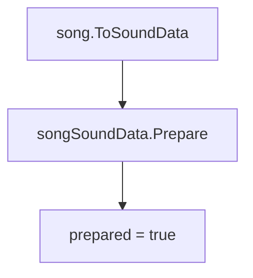

# PlaySong

`LevelEvent_PlaySong` 是歌曲播放事件。它负责准备歌曲音频、兼容旧版本音量数据、设置当前 BPM，并通过 `scrConductor.PlaySong` 切换运行时当前歌曲。

## 基本信息

| 项目 | 内容 |
| --- | --- |
| 事件类型 | `LevelEventType.PlaySong` |
| 事件类 | `LevelEvent_PlaySong` |
| 面板类 | `InspectorPanel_PlaySong` |
| 时间线控件 | `LevelEventControl_Song` |
| 源码 | `RDFucked/Assets/Scripts/Assembly-CSharp/RDLevelEditor/LevelEvent_PlaySong.cs` |
| 面板源码 | `RDFucked/Assets/Scripts/Assembly-CSharp/RDLevelEditor/InspectorPanel_PlaySong.cs` |
| 控件源码 | `RDFucked/Assets/Scripts/Assembly-CSharp/RDLevelEditor/LevelEventControl_Song.cs` |
| 继承 | `LevelEvent_Base` |
| 执行时机 | `LevelEventExecutionTime.OnPrebar` |
| 排序偏移 | `-9` |
| Y 排序 | `-10` |
| 房间使用 | `RoomsUsage.NotUsed` |

## 字段

| 字段 | 类型 | 作用 |
| --- | --- | --- |
| `songSoundData` | `SoundData` | 由 `song` 转换出的运行时音频数据 |

## 属性

| 属性 | 类型 | 默认值 | 序列化 | 作用 |
| --- | --- | --- | --- | --- |
| `song` | `SoundDataStruct` | `sndOrientalTechno` | 是 | 歌曲声音数据，包含文件名、音量、音高、声像和外部音频信息 |
| `beatsPerMinute` | `float` | `100f` | 是，编码名为 `bpm` | 播放歌曲时写入 conductor 的 BPM |
| `loop` | `bool` | `false` | 是 | 是否循环播放歌曲；属性带 `DontShow`，不在普通面板里显示 |

## Prepare

`Prepare()` 把 `SoundDataStruct` 转换为 `SoundData`，并等待音频准备完成。

## Decode

`Decode(Dictionary<string, object> dict)` 做旧数据迁移和旧版本音量修正。

| 条件 | 行为 |
| --- | --- |
| 解码开始 | 调用 `SoundDataStruct.MigrateLegacySound(dict, "song")` |
| 关卡版本小于 5 | `song.volume` 增加 30 |
| 关卡版本小于 13 | `song.volume` 再增加 10 |
| 关卡版本小于 42 且歌曲是外部音频 | 用 `(volume - 40) / 0.88` 重新计算外部文件音量 |
| 解码末尾 | 使用 `song.WithNewVolume(num)` 写回修正后的音量 |

## Run

`Run()` 使用 `RunOnBeat` 在目标拍切换歌曲。

| 步骤 | 行为 |
| --- | --- |
| 外部音频检查 | 如果外部音频 key 存在但准备出的 AudioClip 为 null，写入 warning |
| 设置 BPM | 调用 `conductor.SetBPM(beatsPerMinute)` |
| 保存旧歌曲 | `conductor.previousSong = conductor.currentSong` |
| 播放新歌曲 | 调用 `conductor.PlaySong(...)`，并写入 `conductor.currentSong` |

`PlaySong` 使用 `LevelMusic` 混音组，并把 `songSoundData` 中的 `conductorFilename`、`pitchPercentage`、`panPercentage`、`volumePercentage` 和 `loop` 传给 conductor。

## Tooltip

`GetTooltipText()` 返回三段信息：

| 内容 | 来源 |
| --- | --- |
| 歌曲文件名 | `song.filename` |
| BPM | `beatsPerMinute` |
| 声音参数 | `song.GetTooltip()` |

## Inspector 面板

`InspectorPanel_PlaySong` 没有额外字段和重写逻辑，使用 `InspectorPanel` 的自动面板路径。字段来自 `song`、`beatsPerMinute`、`loop` 的属性声明，其中 `loop` 由于 `DontShow` 不显示。

## 时间线控件

`LevelEventControl_Song` 同时服务歌曲、拍号、RDGS 等歌曲标签事件。对于 `PlaySong`：

| 行为 | 说明 |
| --- | --- |
| `Start()` | 当 `levelEvent is LevelEvent_PlaySong` 时，实例化 `timeline.wavePrefab` 并挂到 `timeline.wavesContainer` |
| `UpdateUIInternal()` | 使用事件图标，控件宽度设为 `cellWidth * 2` |
| 位置 | X 坐标来自 `timeline.GetPosXFromBarAndBeat(bar, beat)`，Y 坐标来自 `timeline.GetPosYFromRowIndex(levelEvent.y)` |

## 与其他事件的关系

| 类型 | 关系 |
| --- | --- |
| `SetBeatsPerMinute` | 也会影响 conductor BPM；`PlaySong` 在播放歌曲时直接设置 BPM |
| `SetCrotchetsPerBar` | 与歌曲时间线和小节显示共同影响编辑器时间换算 |
| `LevelEventControl_Song` | 共用歌曲标签时间线控件 |
| `scrConductor` | 负责实际播放歌曲、维护当前歌曲和 BPM |

## 相关页面

| 页面 | 关系 |
| --- | --- |
| [歌曲与音频事件](/api/editor-events/song-audio-events.md) | 所属事件分组 |
| [scrConductor](/api/core/scrConductor.md) | 歌曲播放、BPM、音频时间线 |
| [事件运行路径](/api/editor-events/runtime-flow.md) | `RunOnBeat` 和按拍调度机制 |
| [Inspector 面板读写链路](/api/editor-events/inspector-flow.md) | 自动面板读写路径 |

