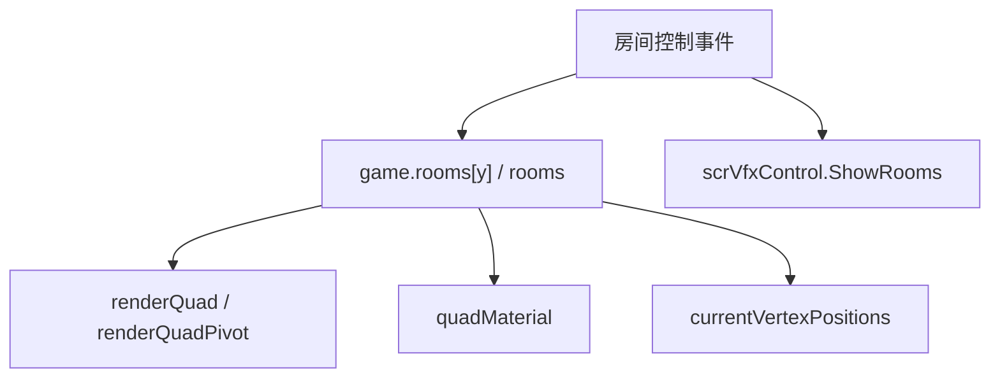

# 房间控制事件

本页深写 `ShowRooms`、`MoveRoom`、`ReorderRooms`、`SetRoomContentMode`、`MaskRoom`、`FadeRoom` 和 `SetRoomPerspective`。这组事件负责房间显示比例、房间 transform、渲染顺序、遮罩、透明度和透视顶点。

## 事件总览

| 事件 | 事件类 | Inspector 面板 | 主要职责 |
| --- | --- | --- | --- |
| `ShowRooms` | `LevelEvent_ShowRooms` | `InspectorPanel_ShowRooms` | 控制哪些房间显示，以及显示房间高度比例 |
| `MoveRoom` | `LevelEvent_MoveRoom` | `InspectorPanel_MoveRoom` | 移动、缩放、旋转房间 render quad 和 pivot |
| `ReorderRooms` | `LevelEvent_ReorderRooms` | `InspectorPanel_ReorderRooms` | 调整房间 render quad 的 `sortingOrder` |
| `SetRoomContentMode` | `LevelEvent_SetRoomContentMode` | `InspectorPanel_SetRoomContentMode` | 设置房间内容模式 |
| `MaskRoom` | `LevelEvent_MaskRoom` | `InspectorPanel_MaskRoom` | 使用图片、房间或颜色作为遮罩 |
| `FadeRoom` | `LevelEvent_FadeRoom` | `InspectorPanel_FadeRoom` | 调整房间透明度 |
| `SetRoomPerspective` | `LevelEvent_SetRoomPerspective` | `InspectorPanel_SetRoomPerspective` | 调整房间四角顶点形成透视变形 |

## ShowRooms

| 项目 | 内容 |
| --- | --- |
| 源码 | `RDFucked/Assets/Scripts/Assembly-CSharp/RDLevelEditor/LevelEvent_ShowRooms.cs` |
| 继承 | `LevelEvent_Base` |
| 接口 | `IDurationHaver` |
| 执行时机 | `OnBar` |
| 房间用法 | `RoomsUsage.ManyRooms` |

### 字段与属性

| 名称 | 类型 | 默认值 | 作用 |
| --- | --- | --- | --- |
| `parameters` | `string` | `Prepare()` 中生成 | 传给 `vfx.ShowRooms()` 的房间显示字符串，隐藏房间附加 `d` |
| `indexesArray` | `int[]` | `Prepare()` 中生成 | 当前要显示的房间索引 |
| `newHeights` | `List<float>` | `Prepare()` 中生成 | 房间高度百分比临时列表 |
| `heights` | `int[]` | 4 个 0 | 每个房间的目标高度百分比 |
| `duration` | `float` | `1` | 过渡拍数，序列化名为 `transitionTime` |
| `ease` | `Ease` | `InOutSine` | 显示过渡缓动 |

### Prepare

`Prepare()` 会遍历 0 到 3 号房间，按照 `rooms` 字段生成 `parameters`。未被选中的房间追加 `d`，并把被选中的房间收集到 `indexesArray`。

| 输入 | 处理 |
| --- | --- |
| `rooms` | 决定哪些房间显示 |
| `heights` | 复制到 `newHeights`，后续由 `ProcessHeights()` 归一化 |
| 无显示房间 | 写 warning：`Show Rooms event has no rooms to be shown.` |

### ProcessHeights

`ProcessHeights(int[] rooms, List<float> values)` 会把未显示房间高度设为 0，并把显示房间高度归一化到总和 100%。

| 情况 | 处理 |
| --- | --- |
| 有显示房间高度为 0 且已有总和不超过 100 | 把剩余高度平均分给高度为 0 的显示房间 |
| 有显示房间高度为 0 且已有总和超过 100 | 按已有非 0 高度比例缩放 |
| 显示房间高度都非 0 | 按总和比例缩放到 100 |
| 总高度低于 100 | 把剩余高度加到第一个显示房间 |

返回值是 0 到 1 的比例数组，供 `vfx.ShowRooms()` 使用。

### Run

`Run()` 在 `RunOnBeat()` 中执行。存在显示房间时：

| 步骤 | 调用 |
| --- | --- |
| 计算动画秒数 | `vfx.roomsAnimationDuration = conductor.DurationBeatsToTime(beat - 1, duration)` |
| 显示房间 | `vfx.ShowRooms(parameters, ProcessHeights(indexesArray, newHeights), ease)` |
| 重排行与 strip | `game.RepositionRowsAndStrips()` |

`InspectorPanel_ShowRooms.Awake()` 会把 `position.forceRoomsHidden` 设为 `true`，让房间位置选择器在该面板中隐藏房间选择。

## MoveRoom

| 项目 | 内容 |
| --- | --- |
| 源码 | `RDFucked/Assets/Scripts/Assembly-CSharp/RDLevelEditor/LevelEvent_MoveRoom.cs` |
| 继承 | `LevelEvent_Base` |
| 接口 | `IDurationHaver` |
| 执行时机 | `OnBar` |
| 房间用法 | `RoomsUsage.NotUsed`，通过 `y` 指向目标房间 |

### 属性

| 名称 | 类型 | 默认值 | 作用 |
| --- | --- | --- | --- |
| `roomPosition` | `Float2?` | `(50, 50)` | 房间 render quad pivot 的目标位置 |
| `scale` | `Float2?` | `(100, 100)` | 房间缩放百分比 |
| `angle` | `float?` | `0` | 房间旋转角度 |
| `pivot` | `Float2?` | `(50, 50)` | 房间 pivot 偏移 |
| `duration` | `float` | `1` | 过渡拍数 |
| `ease` | `Ease` | `Linear` | DOTween 缓动 |

`Validate()` 会把 `roomPosition` 限制到 -10000 到 10000，把 `angle` 限制到 -9999 到 9999。

### Run

`Run()` 会取 `game.rooms[y]`，并对 `renderQuadPivot` 或 `renderQuad.transform` 执行 tween。

| 属性 | 目标 | 换算 |
| --- | --- | --- |
| `roomPosition.x` | `renderQuadPivot.localPosition.x` | `RDWidth * x / 100 - RDWidth / 2` |
| `roomPosition.y` | `renderQuadPivot.localPosition.y` | `RDHeight * y / 100 - RDHeight / 2` |
| `scale.x` | `renderQuadPivot.localScale.x` | `x / 100` |
| `scale.y` | `renderQuadPivot.localScale.y` | `y / 100` |
| `angle` | `RDRoom.Rotate()` | 原角度值 |
| `pivot.x` | `renderQuad.localPosition.x` | `(0.5 - x / 100) * RDWidth` |
| `pivot.y` | `renderQuad.localPosition.y` | `(0.5 - y / 100) * RDHeight` |

版本号大于等于 64 时，pivot 的 X/Y tween 分开保存到 `pivotTweenX`、`pivotTweenY`。旧版本则对 `renderQuad.transform` 执行整体 `DOLocalMove()`。

执行过位置、缩放、角度或 pivot 后，`RDRoom.customTransform` 会被设为真，并把 `roomMovedByLevelEvent` 设为真。

## ReorderRooms

| 项目 | 内容 |
| --- | --- |
| 源码 | `RDFucked/Assets/Scripts/Assembly-CSharp/RDLevelEditor/LevelEvent_ReorderRooms.cs` |
| 继承 | `LevelEvent_Base` |
| 执行时机 | `OnBar` |

| 名称 | 类型 | 默认值 | 作用 |
| --- | --- | --- | --- |
| `order` | `int[]` | `{ 0, 1, 2, 3 }` | 房间从前到后的排序列表 |

`Run()` 会遍历 `order`，把列表第 `i` 项对应房间的 `renderQuad.GetComponent<Renderer>().sortingOrder` 设置为 `4 - i`。

## SetRoomContentMode

| 项目 | 内容 |
| --- | --- |
| 源码 | `RDFucked/Assets/Scripts/Assembly-CSharp/RDLevelEditor/LevelEvent_SetRoomContentMode.cs` |
| 继承 | `LevelEvent_Base` |
| 执行时机 | `OnBar` |

| 名称 | 类型 | 控件 | 作用 |
| --- | --- | --- | --- |
| `mode` | `ContentMode` | `ToggleGroup`，选项 `Center`、`AspectFill`、`Real` | 写入 `game.rooms[y].contentMode` |

`GetTooltipText()` 返回 `RDString.GetEnumValue(mode)`。

## MaskRoom

| 项目 | 内容 |
| --- | --- |
| 源码 | `RDFucked/Assets/Scripts/Assembly-CSharp/RDLevelEditor/LevelEvent_MaskRoom.cs` |
| 继承 | `LevelEvent_Base` |
| 执行时机 | `OnBar` |

### 字段与属性

| 名称 | 类型 | 默认值 | 条件 | 作用 |
| --- | --- | --- | --- | --- |
| `textures` | `Texture2D[]` | `null` | 不直接序列化 | `Prepare()` 加载的 Alpha8 图片纹理 |
| `maskType` | `MaskType` | 枚举默认值 | 始终显示 | 遮罩模式 |
| `images` | `string[]` | 空数组 | `maskType == Image` | 图片遮罩文件列表，序列化名为 `image` |
| `fps` | `float` | `30` | 图片模式且图片数量大于 1 | 多图遮罩播放帧率 |
| `sourceRoom` | `int` | `0` | `maskType == Room` | 作为遮罩来源的房间 |
| `keyColor` | `ColorOrPalette` | `Color.white` | `maskType == Color` | 色键颜色 |
| `colorCutoff` | `int` | `0` | `maskType == Color` | 色键截断百分比 |
| `colorFeathering` | `int` | `0` | `maskType == Color` | 色键羽化百分比 |
| `alphaMode` | `AlphaMode` | 枚举默认值 | `maskType != None` | 普通或反转 alpha |

### Decode 与 Prepare

旧数据里 `image` 可以是单个字符串。`Decode()` 会把它转换为列表；空字符串转换为空列表。若字典中包含 `rooms`，事件会把 `roomsUsage` 设为 `ManyRooms`。

`Prepare()` 会按 `images` 加载纹理：

```csharp
RDEditorUtils.LoadLevelTexture(scnGame.levelToLoadSource, image, "", fromCustomCharactersFolder: false, isAlpha8: true)
```

### Run

`Run()` 会根据 `roomsUsage` 决定目标房间：`ManyRooms` 用 `rooms`，否则只用 `y`。

| `maskType` | 行为 |
| --- | --- |
| `Image` | 清空 `roomMask`，调用 `ShowMasks(textures, FilterMode.Point, fps)`，开启 mask，关闭 chromakey |
| `Room` | 调用 `SetRoomMask(sourceRoom)`，开启 mask，关闭 chromakey |
| `Color` | 调用 `SetColorMask(keyColor.ToColor(), colorCutoff * 0.01, colorFeathering * 0.01)`，关闭 mask，开启 chromakey |
| `None` | 关闭 mask 和 chromakey |

最后会调用 `SetMaskAlphaMode(maskType != None && alphaMode == AlphaMode.Inverted)`。

`InspectorPanel_MaskRoom` 会在 `Awake()` 中生成 4 个房间名，并在 `UpdateUIProperties()` 中给 `sourceRoom` 下拉框设置这些选项。

## FadeRoom

| 项目 | 内容 |
| --- | --- |
| 源码 | `RDFucked/Assets/Scripts/Assembly-CSharp/RDLevelEditor/LevelEvent_FadeRoom.cs` |
| 继承 | `LevelEvent_Base` |
| 接口 | `IDurationHaver` |

| 名称 | 类型 | 默认值 | 作用 |
| --- | --- | --- | --- |
| `opacity` | `int` | `100` | 房间透明度百分比，范围 0 到 100 |
| `duration` | `float` | `0` | 过渡拍数 |
| `ease` | `Ease` | `Linear` | DOTween 缓动 |

`Run()` 会把 `duration` 换算为秒，kill 当前房间的 `opacityTween`，再对 `game.rooms[y].quadMaterial` 的 `_Opacity` 执行 `DOFloat(opacity / 100f, "_Opacity", seconds)`。

## SetRoomPerspective

| 项目 | 内容 |
| --- | --- |
| 源码 | `RDFucked/Assets/Scripts/Assembly-CSharp/RDLevelEditor/LevelEvent_SetRoomPerspective.cs` |
| 继承 | `LevelEvent_Base` |
| 接口 | `IDurationHaver` |

### 属性

| 名称 | 类型 | 默认值 | 作用 |
| --- | --- | --- | --- |
| `cornerPositionsUsed` | `bool[]` | 4 个 `true` | Inspector 记录四个角是否启用 |
| `cornerPositions` | `Float2[]` | 左下、右下、左上、右上四角 | 四个顶点位置百分比 |
| `duration` | `float` | `1` | 过渡拍数 |
| `ease` | `Ease` | `Linear` | DOTween 缓动 |

### Run

`Run()` 会把 `duration` 换算为秒，然后遍历 4 个角。启用的角会按轴处理：

| 轴 | 目标 | 换算 |
| --- | --- | --- |
| X | `room.currentVertexPositions[i].x` | `x / 100f - 0.5f` |
| Y | `room.currentVertexPositions[i].y` | `y / 100f - 0.5f` |

每条轴都会 kill 对应的 `vertexTweensX/Y[i]`，然后通过 `DOTween.To()` 修改当前顶点位置。只要任意角发生变化，就调用 `room.UpdateVertices()` 并设置 `room.customTransform = true`。

`InspectorPanel_SetRoomPerspective` 会在显示和保存属性时，把 `PropertyControl_SetRoomPerspective.positionPickersUsed` 同步到事件的 `cornerPositionsUsed`。

## 调用关系



## 使用边界

| 需求 | 事件 |
| --- | --- |
| 改变可见房间和高度比例 | `ShowRooms` |
| 移动、缩放、旋转整个房间 | `MoveRoom` |
| 改变房间前后层级 | `ReorderRooms` |
| 调整内容填充方式 | `SetRoomContentMode` |
| 用图片、房间或颜色裁剪房间 | `MaskRoom` |
| 改变房间透明度 | `FadeRoom` |
| 改变房间四角顶点 | `SetRoomPerspective` |


