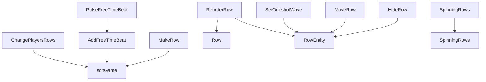

# 行控制与自由节拍事件

本页深写 `MakeRow`、`AddFreeTimeBeat`、`PulseFreeTimeBeat`、`HideRow`、`MoveRow`、`ChangePlayersRows`、`SetOneshotWave`、`ReorderRow` 和 `SpinningRows`。这些事件负责行实体创建、自由节拍脉冲链、行显示状态、行变换、玩家归属、Oneshot 波形、行排序和多行旋转控制。

## 事件总览

| 事件 | 事件类 | 执行时机 | 主要职责 |
| --- | --- | --- | --- |
| `MakeRow` | `LevelEvent_MakeRow` | `OnPrebar` | 创建行、设置角色、玩家、房间、pulse sound 和行长度 |
| `AddFreeTimeBeat` | `LevelEvent_AddFreeTimeBeat` | `OnPrebar` | 创建自由节拍起点，并收集后续 pulse 节点 |
| `PulseFreeTimeBeat` | `LevelEvent_PulseFreeTimeBeat` | `OnPrebar` | 作为自由节拍后续节点，改变 pulse 或移除链 |
| `HideRow` | `LevelEvent_HideRow` | `OnBar` | 显示、隐藏或部分显示行 |
| `MoveRow` | `LevelEvent_MoveRow` | `OnBar` | 移动、缩放、旋转整行、角色或心脏 |
| `ChangePlayersRows` | `LevelEvent_ChangePlayersRows` | `OnPrebar` | 批量改变行玩家归属和 CPU 标记 |
| `SetOneshotWave` | `LevelEvent_SetOneshotWave` | `OnBar` | 设置 Oneshot 波形类型、高度和宽度 |
| `ReorderRow` | `LevelEvent_ReorderRow` | `OnBar` | 移动行到房间、调整顺序、排序层和深度 |
| `SpinningRows` | `LevelEvent_SpinningRows` | `OnBar` | 连接、拆分、合并或旋转 Spinning Rows |

## MakeRow

| 项目 | 内容 |
| --- | --- |
| 源码 | `RDFucked/Assets/Scripts/Assembly-CSharp/RDLevelEditor/LevelEvent_MakeRow.cs` |
| 执行时机 | `OnPrebar`，排序偏移 `-10` |
| 房间用法 | `RoomsUsage.OneRoom` |
| 控件名 | 默认事件控件 |

### 字段与属性

| 名称 | 类型 | 默认值 | 作用 |
| --- | --- | --- | --- |
| `pulseSound` | `SoundData` | `Shaker` | 行 pulse sound 数据 |
| `mimicsRow` | `bool` | 解码时设置 | 是否模仿另一行 |
| `customCharacterName` | `string` | 空值 | 自定义角色名 |
| `failedLoadingCustomCharacter` | `bool` | `false` | 自定义角色加载失败标记 |
| `rowType` | `RowType` | 枚举默认值 | 行类型 |
| `player` | `RDPlayer` | 枚举默认值 | 行所属玩家 |
| `character` | `Character` | 枚举默认值 | 行角色 |
| `cpuMarker` | `Character` | `Otto` | CPU 标记角色 |
| `hideAtStart` | `bool` | `false` | 创建后是否隐藏 |
| `rowToMimic` | `int` | `0` | 被模仿行索引 |
| `muteBeats` | `bool` | `false` | 是否静音该行节拍 |
| `muteIn1P` | `bool` | `false` | 单人模式下静音 |
| `length` | `int?` | `7` | 行长度，范围 1 到 7 |
| `muted` | `bool` | 计算属性 | `muteBeats` 为真，或 `muteIn1P` 且非双人模式时为真 |

### 准备与创建

`Prepare()` 的顺序：

| 步骤 | 行为 |
| --- | --- |
| 自定义角色 | `character == Custom` 时加载自定义角色贴图、JSON 和相关音频 |
| pulseSound | 缺失时创建默认 `SoundData("Shaker", ...)` |
| 声音准备 | `yield return pulseSound.Prepare()` |
| 创建行 | 设置 `prepared = true` 后调用 `CreateRow()` |

`CreateRow()` 会根据玩家模式计算单人和双人玩家归属，设置 `rows[row].cpuCharacter`，然后调用 `game.MakeRow()`。随后它设置特殊 Boy 角色动画、pulse sound 文件、pitch 和行长度。

### 编码与解码

| 方法 | 行为 |
| --- | --- |
| `Encode()` | 编码主字段；自定义角色写为 `custom:{customCharacterName}`；最后追加 `pulseSound.Encode()` |
| `Decode()` | 识别 `custom:` 字符串，恢复 `Character.Custom` 和角色名；解码 `pulseSound`；由 `rowToMimic` 是否存在设置 `mimicsRow` |
| `UpdateCustomCharacter()` | 加载 `{name}.png`、`{name}.json`、可选 outline/glow/freeze 贴图，并写入自定义角色数据 |
| `PrepareCustomCharacter()` | 查找自定义角色主音频和各动画 clip 音频，加载 wav 或 ogg |

`Run()` 会让 `rows[row].ent.Present(animate)`，`hideAtStart` 为真时立刻隐藏行实体。

## AddFreeTimeBeat 与 PulseFreeTimeBeat

### AddFreeTimeBeat

| 项目 | 内容 |
| --- | --- |
| 源码 | `RDFucked/Assets/Scripts/Assembly-CSharp/RDLevelEditor/LevelEvent_AddFreeTimeBeat.cs` |
| 执行时机 | `OnPrebar` |
| 控件名 | `FreeTimeBeat` |

| 名称 | 类型 | 默认值 | 作用 |
| --- | --- | --- | --- |
| `LastPulse` | `const int` | `6` | 最大 pulse 索引 |
| `DestroyPulse` | `const int` | `-99` | 移除链标记 |
| `pulseBeats` | `float[]` | `Prepare()` 生成 | 每个 pulse 的相对 beat |
| `pulseReleaseBeats` | `float[]` | `Prepare()` 生成 | 每个 pulse 的释放 beat |
| `pulseIndexes` | `int[]` | `Prepare()` 生成 | 传给 `AddBeatFreeFlex` 的 pulse 序列 |
| `pulse` | `int` | `0` | 起始 pulse |
| `hold` | `float` | `0` | 起始 pulse 持续 beat |

`Prepare()` 会从当前事件之后扫描同一行、排序更靠后的 `PulseFreeTimeBeat`。扫描中会根据 action 增加、减少、自定义或移除 pulse，并在 pulse 达到 6 或移除标记时停止。之后它读取此前最近的拍号事件，计算每个 pulse 相对当前事件的 beat 和释放 beat。

`Run()` 会把 `pulseBeats` 和 `pulseReleaseBeats` 转为 conductor 时间，再对目标行以及目标行的 shadow 行调用 `game.AddBeatFreeFlex()`。返回的 `BeatClassic.freeTimeEvent` 会指回当前 `AddFreeTimeBeat`。

### PulseFreeTimeBeat

| 名称 | 类型 | 默认值 | 条件 | 作用 |
| --- | --- | --- | --- | --- |
| `action` | `PulseAction` | 枚举默认值 | 始终显示 | Increment、Decrement、Custom 或 Remove |
| `hold` | `float` | `0` | 始终显示 | 该 pulse 的持续 beat |
| `customPulse` | `int` | `0` | `action == Custom` | 自定义 pulse 值 |

`PulseFreeTimeBeat.Run()` 是空实现。它不独立生成节拍，而是在 `AddFreeTimeBeat.Prepare()` 中被扫描并合并进自由节拍链。

## HideRow

| 项目 | 内容 |
| --- | --- |
| 源码 | `RDFucked/Assets/Scripts/Assembly-CSharp/RDLevelEditor/LevelEvent_HideRow.cs` |
| 执行时机 | `OnBar` |

| 名称 | 类型 | 默认值 | 作用 |
| --- | --- | --- | --- |
| `show` | `RowVisibilityMode` | `Hidden` | 可见、隐藏、只显示行或只显示角色 |
| `transitionType` | `TransitionType` | 枚举默认值 | Instant、Full 或普通过渡 |

版本号小于 17 时，`Decode()` 会把旧布尔 `show` 转成 `RowVisibilityMode.Visible` 或 `Hidden`。

`Run()` 先限制行索引，再根据 `show` 调用 `RowEntity.Show()` 或 `Hide()`：

| `show` | 行为 |
| --- | --- |
| `Visible` | `Full` 使用完整动画，`Instant` 不带效果，其他使用 instant with effects |
| `OnlyRow` | 显示行并隐藏角色 |
| `OnlyCharacter` | 隐藏行但保持角色可见 |
| `Hidden` | 完整隐藏行和角色 |

可见状态变更后会调用 `game.RepositionRowsAndStrips()`。如果当前关卡开启 row reflections jumping，还会更新 reflection 原点。

## MoveRow

| 项目 | 内容 |
| --- | --- |
| 源码 | `RDFucked/Assets/Scripts/Assembly-CSharp/RDLevelEditor/LevelEvent_MoveRow.cs` |
| 接口 | `IDurationHaver` |
| 执行时机 | `OnBar` |

### 属性

| 名称 | 类型 | 默认值 | 条件 | 作用 |
| --- | --- | --- | --- | --- |
| `rowTarget` | `MoveRowTarget` | 枚举默认值 | 始终显示 | WholeRow、Character 或 Heart |
| `customPosition` | `bool` | `true` | WholeRow | 整行是否启用自定义位置 |
| `offDescription` | `bool` | `false` | 自定义位置关闭 | UI 说明文本 |
| `rowPosition` | `FloatExpression2?` | `(50, 50)` | 自定义位置启用 | 目标位置表达式 |
| `scale` | `FloatExpression2?` | `(1, 1)` | 自定义位置启用 | 缩放表达式 |
| `angle` | `FloatExpression?` | `0` | 自定义位置启用 | 旋转角度表达式 |
| `pivot` | `float?` | `0` | WholeRow | 整行 pivot |
| `duration` | `float` | `1` | 自定义位置启用 | 过渡拍数 |
| `ease` | `Ease` | `Linear` | 未启用加速度 | DOTween ease |
| `accelerationDuration` | `float?` | `0` | 自定义位置启用 | 加速拍数 |
| `decelerationDuration` | `float?` | `0` | 启用加速度 | 减速拍数 |

### 运行目标

| `rowTarget` | Transform | Tween 字段 |
| --- | --- | --- |
| `WholeRow` | `ent.transform` | `positionTweenX/Y`、`scaleTweenX/Y` |
| `Character` | `ent.characterContainer`，缩放时用 `ent.character.transform` | `charPositionTweenX/Y`、`charScaleTweenX/Y` |
| `Heart` | `ent.heartContainer` | `heartPositionTweenX/Y`、`heartScaleTweenX/Y` |

`SetMovingTweens()` 会对位置、角度、缩放和 pivot 分别创建 tween。`rowPosition` 和 `scale` 是表达式字段，运行时通过 `Unbox(level)` 求值。启用 `accelerationDuration` 时使用 `VelocityBasedEase()` 生成速度型 ease 函数。

WholeRow 模式下，如果 `customPosition` 从假变真，会先 kill 原有位置 tween，再设置 `ent.customPosition` 并调用 `rooms[room].RepositionRowsAndStrips(false)`。

## ChangePlayersRows

| 项目 | 内容 |
| --- | --- |
| 源码 | `RDFucked/Assets/Scripts/Assembly-CSharp/RDLevelEditor/LevelEvent_ChangePlayersRows.cs` |
| 执行时机 | `OnPrebar` |

| 名称 | 类型 | 默认值 | 作用 |
| --- | --- | --- | --- |
| `playerMode` | `PlayerMode` | `OneOrTwoPlayers` | 决定单人或双人换行逻辑 |
| `players` | `RDPlayer[]` | 16 个 `NoChange` | 每行目标玩家 |
| `cpuMarkers` | `Character[]` | 16 个 `Otto` | 每行 CPU 标记 |
| `flashingOnBeat` | `bool` | `true` | 是否在 beat 上闪烁提示 |

`Decode()` 中，没有 `flashingOnBeat` 时根据版本号是否大于等于 25 填值；没有 `cpuMarkers` 时填入 `Character.None`。

`Run()` 通过 `RunOnBeat()` 调用 `game.ChangeRowPlayers()`。`TaggedActionVariant()` 调用 `game.ChangeRowPlayersImmediately()`，再走基类标签动作。

## SetOneshotWave

| 项目 | 内容 |
| --- | --- |
| 源码 | `RDFucked/Assets/Scripts/Assembly-CSharp/RDLevelEditor/LevelEvent_SetOneshotWave.cs` |
| 执行时机 | `OnBar`，排序偏移 `-1` |
| 控件名 | `RowAction` |

| 名称 | 类型 | 默认值 | 作用 |
| --- | --- | --- | --- |
| `waveType` | `WaveType` | 枚举默认值 | Oneshot 波形类型 |
| `height` | `int` | `100` | 波形高度百分比 |
| `width` | `int` | `100` | 波形宽度百分比 |

`Run()` 会读取 `level.rows[row].ent.oneshotRowController`，写入 `waveManager.waveType`、`waveHeightMultiplier` 和 `waveWidthMultiplier`。

## ReorderRow

| 项目 | 内容 |
| --- | --- |
| 源码 | `RDFucked/Assets/Scripts/Assembly-CSharp/RDLevelEditor/LevelEvent_ReorderRow.cs` |
| 执行时机 | `OnBar` |

| 名称 | 类型 | 默认值 | 条件 | 作用 |
| --- | --- | --- | --- | --- |
| `newRoom` | `RoomSelectType?` | `Room1` | 始终显示 | 把行移动到目标房间 rowContainer |
| `order` | `int?` | `1` | 可关闭 | 目标 sibling index，范围 1 到 16 |
| `transition` | `CharacterReorderType` | 枚举默认值 | 始终显示 | 重排行时的过渡方式 |
| `sortingLayerName` | `RDSortingLayer?` | `Default` | 开发模式 | Sorting Layer |
| `sortingOrder` | `int?` | `0` | 开发模式 | 精确排序深度 |

`Run()` 会先处理房间迁移，再处理 sorting order 和 sorting layer。`order` 存在且未启用精确 `sortingOrder` 时，它会调整 transform sibling index，并同步 `game.rowSortOrder`，再逐行重设 sort order。

房间或顺序发生变化且 `transition != None` 时，会对原房间和目标房间调用 `RepositionRowsAndStrips()`。

## SpinningRows

| 项目 | 内容 |
| --- | --- |
| 源码 | `RDFucked/Assets/Scripts/Assembly-CSharp/RDLevelEditor/LevelEvent_SpinningRows.cs` |
| 接口 | `IDurationHaver` |
| 执行时机 | `OnBar` |

### 属性

| 名称 | 类型 | 默认值 | 条件 | 作用 |
| --- | --- | --- | --- | --- |
| `action` | `SpinningRowsAction` | 枚举默认值 | 始终显示 | Connect、Disconnect、Rotate、Merge、Split、ConstantRotation、WavyRotation |
| `toRow` | `int` | `0` | `action == Connect` | 要连接到的目标行 |
| `angle` | `float` | `0` | Rotate、ConstantRotation、Split、Merge | 旋转角度 |
| `amplitude` | `float?` | `0` | WavyRotation | 波动振幅 |
| `frequency` | `float?` | `0` | WavyRotation | 波动频率 |
| `doEffects` | `bool` | `false` | Merge | 合并时是否播放效果 |
| `duration` | `float` | `0` | 有角度或波动参数 | 过渡拍数 |
| `ease` | `Ease` | `Linear` | 有角度或波动参数 | 缓动 |
| `description` | `bool` | `false` | 始终显示 | Inspector 警告说明 |

### 运行逻辑

`Run()` 会读取当前行 `rowEnt`、目标行 `toRow` 的 `RowEntity`，并通过 `rowEnt.targetCharacterRowEnt.spinningRowsController` 找到控制器。

| `action` | 行为 |
| --- | --- |
| `Connect` | 若目标行没有控制器，则创建 `Spinning Rows Controller`，再调用 `Connect(rowEnt)` |
| `Disconnect` | 调用 `spinningRowsController.Disconnect(rowEnt)` |
| `Rotate` | 对当前 `spinningRowData` 调用 `Rotate(angle, delay, ease)` |
| `Merge` | 当前行和主行都旋转到角度，清掉 wavy amplitude，延迟后调用 `Merge(rowEnt, doEffects)` |
| `Split` | 当前行旋转后调用 `Split(rowEnt)` |
| `ConstantRotation` | 设置常量旋转速度 `angle / conductor.crotchet` |
| `WavyRotation` | 设置 wavy amplitude 和 frequency |

`frequency` 会通过 `1f / conductor.DurationBeatsToTime(1f / frequency)` 换算为运行时频率。

## 调用关系

## 与已拆节拍页的边界

| 已有专页 | 本页边界 |
| --- | --- |
| [AddClassicBeat](/api/editor-events/AddClassicBeat.md) | Classic 普通节拍和长按细节在独立页，本页只处理自由节拍链 |
| [AddOneshotBeat](/api/editor-events/AddOneshotBeat.md) | Oneshot 节拍创建细节在独立页，本页补充 Oneshot 波形控制 |
| [SetRowXs](/api/editor-events/SetRowXs.md) | X pattern 和修饰音细节在独立页，本页不重复展开 |

