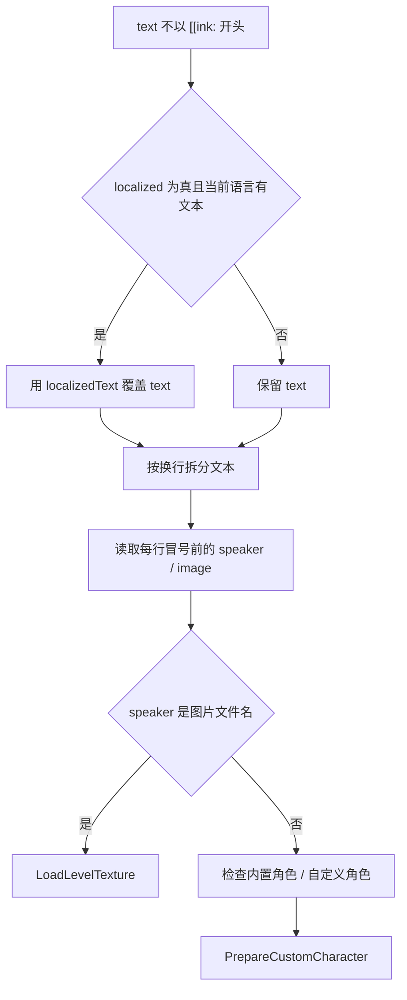

# ShowDialogue

`LevelEvent_ShowDialogue` 用来显示普通对话、运行 Ink 对话、运行内联 Ink，并控制对话面板房间、面板位置、头像位置和文字声音。

## 基本信息

| 项目 | 内容 |
| --- | --- |
| 事件类型 | `LevelEventType.ShowDialogue` |
| 事件类 | `LevelEvent_ShowDialogue` |
| 面板类 | `InspectorPanel_ShowDialogue` |
| 源码 | `RDFucked/Assets/Scripts/Assembly-CSharp/RDLevelEditor/LevelEvent_ShowDialogue.cs` |
| 面板源码 | `RDFucked/Assets/Scripts/Assembly-CSharp/RDLevelEditor/InspectorPanel_ShowDialogue.cs` |
| 继承 | `LevelEvent_Base` |
| 执行时机 | `LevelEventExecutionTime.OnBar` |
| 房间使用 | `RoomsUsage.OneRoomOrOnTop` |
| Y 排序 | `-10` |

## 常量

| 常量 | 值 | 作用 |
| --- | --- | --- |
| `inkStart` | `[[ink:` | 判断 Ink 指令开头 |
| `inkEnd` | `]]` | 判断 Ink 指令结尾 |

## 属性

| 属性 | 类型 | 默认值 | 序列化 | 作用 |
| --- | --- | --- | --- | --- |
| `text` | `string` | 初始化时取 `editor.ShowDialogue.sampleText` | 是 | 对话文本、文本本地化键或 Ink 指令 |
| `speed` | `float` | `1f` | 是 | 旧字段，带 `DontShow` |
| `localized` | `bool` | `false` | 是 | 是否启用多语言文本 |
| `localizedText` | `Dictionary<string, string>` | 空字典 | 通过自定义编码保存 | 多语言文本表 |
| `panelSide` | `RDInk.PanelSide` | 枚举默认值 | 是 | 对话面板位置 |
| `portraitSide` | `RDInk.PortraitSide` | 枚举默认值 | 是 | 头像位置 |
| `playTextSounds` | `bool` | `true` | 是 | 是否播放文字声音 |

## Init 与 OnCreate

| 方法 | 行为 |
| --- | --- |
| `Init()` | 调用基类初始化后，把 `text` 设为 `RDString.Get("editor.ShowDialogue.sampleText")` |
| `OnCreate()` | 调用基类创建逻辑后，把 `room` 设为 4 |

## Prepare

`Prepare()` 只处理非 Ink 指令文本。

它会读取每一行冒号前的部分：如果是图片文件名，预加载关卡外部贴图；如果是自定义角色名，会通过 `LevelEvent_MakeRow` 准备自定义角色资源。

## Encode

`Encode()` 先调用基类编码。若 `localized == true`，会遍历 `localizedText`，把非空文本用 `text{SystemLanguage}` 形式编码，例如 `textEnglish`。

## Decode

| 条件 | 行为 |
| --- | --- |
| 数据没有 `rooms` | 基类解码后把 `room` 设为 4 |
| `localized == true` | 遍历 `SystemLanguage`，读取 `text{language}` 字段写入 `localizedText` |
| 关卡版本小于 44 | 把 `playTextSounds` 设为 false |

## Run：Ink 指令

当 `text` 以 `[[ink:` 开头时，事件按 Ink 指令运行。

| 步骤 | 行为 |
| --- | --- |
| 解析指令 | 读取 `[[ink:...]]` 中的内容 |
| 变量替换 | 使用 `currentLevel.EvaluateCurlyBracketsInString` 处理花括号表达式 |
| 参数拆分 | 用逗号拆分 Ink 参数 |
| 房间 | 调用 `rDInk.SetPanelRoom(room)` |
| 面板位置 | 调用 `rDInk.SetPanelSide(panelSide)` |
| 文字声音 | 按 `playTextSounds` 开关 `speechSource` |
| 文件和 knot | 两个参数时调用 `rDInk.Run(file, knot)` |
| 内联 Ink | `this` 或缺少文件/knot 时调用 `rDInk.RunInlineInk` |
| PlayStyle | 按 Ink 类型和额外参数调用 `rDInk.Freeze` |

### Ink 参数形式

| 形式 | 行为 |
| --- | --- |
| `[[ink:this]]...` | 运行 `]]` 后面的内联 Ink 文本 |
| `[[ink:knot]]` | 使用默认文件 `diaCutscenes`，knot 为参数文本 |
| `[[ink:file,knot]]` | 调用指定文件和 knot |
| `[[ink:file,knot,after]]` | 指定对话结束后的 `PlayStyleChange` |
| `[[ink:file,knot,start,after]]` | 指定开始和结束两个 `PlayStyleChange` |

源码会把参数中的 `Immediate` 修正为 `Immediately` 后再解析。

## Run：普通文本

普通文本路径会先处理 `[[key]]` 形式的本地化键。

| 步骤 | 行为 |
| --- | --- |
| `[[key]]` | 先尝试花括号表达式，再用 `RDString.Get(key)` 替换文本 |
| Ink 类型 | 调用 `ink.SetType(RDInkType.Passive)` |
| 文字声音 | 按 `playTextSounds` 开关 `speechSource` |
| 按拍运行 | 调用 `RunOnBeat` |
| 显示文本 | 调用 `ink.RunFromText(text, panelSide, portraitSide)` |
| 头像位置 | 调用 `ink.SetPortraitSide(portraitSide)` |
| 主动对话冻结 | 根据 `activeDialogues` 和 `activeDialoguesImmediately` 调用 `ink.Freeze` |
| 房间 | 调用 `ink.SetPanelRoom(room)` |

## Inspector 面板

`InspectorPanel_ShowDialogue` 没有额外重写逻辑，使用自动面板。`text` 使用 `ShowDialogueAttribute` 对应控件，`panelSide`、`portraitSide`、`playTextSounds` 使用 ToggleGroup，`speed` 和 `localized` 带 `DontShow` 或条件显示。

## RDInk 关系

| RDInk 方法 | ShowDialogue 调用场景 |
| --- | --- |
| `SetPanelRoom` | Ink 指令和普通文本都会设置房间 |
| `SetPanelSide` | Ink 指令设置面板位置 |
| `Run(file, knot)` | 指定 Ink 文件和 knot |
| `RunInlineInk` | `[[ink:this]]` 或内联 Ink 文本 |
| `RunFromText` | 普通文本 |
| `SetPortraitSide` | 普通文本设置头像位置 |
| `Freeze` | 主动对话或带 PlayStyle 参数的 Ink 指令 |

## 相关页面

| 页面 | 关系 |
| --- | --- |
| [文本与脚本控制事件](/api/editor-events/text-control-events.md) | 所属事件分组 |
| [事件运行路径](/api/editor-events/runtime-flow.md) | `RunOnBeat` 调度机制 |
| [Inspector 面板读写链路](/api/editor-events/inspector-flow.md) | 自动面板读写路径 |
| [自定义方法事件](/api/editor-events/custom-methods.md) | Ink 中也能通过外部函数调用关卡方法 |

